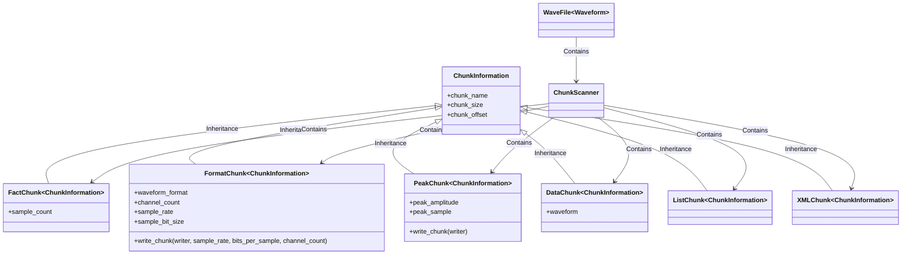

```mermaid
    classDiagram
        class ChunkScanner{
            
        }
        
        class ChunkInformation{
            +chunk_name
            +chunk_size
            +chunk_offset
        }
        
        class FactChunk~ChunkInformation~{
            +sample_count
        }
        
        class FormatChunk~ChunkInformation~{
            +waveform_format
            +channel_count
            +sample_rate
            +sample_bit_size
            +write_chunk(writer, sample_rate, bits_per_sample, channel_count)
        }
        
        class PeakChunk~ChunkInformation~{
            +peak_amplitude
            +peak_sample
            +write_chunk(writer)
        }
        
        class DataChunk~ChunkInformation~{
            +waveform
        }
        
        class ListChunk~ChunkInformation~{
            
        }
        
        class XMLChunk~ChunkInformation~{
            
        }
        
        class WaveFile~Waveform~{
            
        }
        
        ChunkInformation <|-- FactChunk : Inheritance
        ChunkInformation <|-- FormatChunk : Inheritance
        ChunkInformation <|-- PeakChunk : Inheritance
        ChunkInformation <|-- DataChunk : Inheritance
        ChunkInformation <|-- ListChunk : Inheritance
        ChunkInformation <|-- XMLChunk : Inheritance
        ChunkScanner --> FactChunk : Contains
        ChunkScanner --> FormatChunk : Contains
        ChunkScanner --> PeakChunk : Contains
        ChunkScanner --> DataChunk : Contains
        ChunkScanner --> ListChunk : Contains
        ChunkScanner --> XMLChunk : Contains
        WaveFile --> ChunkScanner : Contains

```