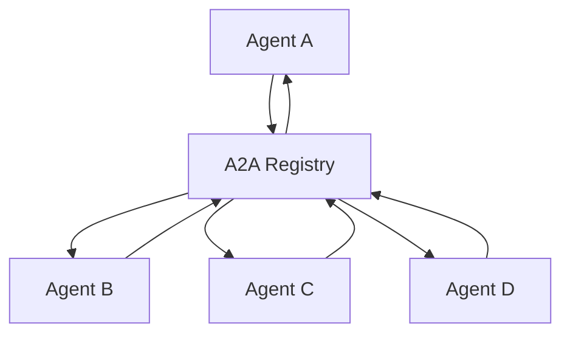

# Agent Discovery

Agent discovery is the core functionality of A2A Registry, enabling agents to find and connect with each other in distributed systems.

## Overview

The A2A Registry implements a centralized discovery pattern where:

1. **Agents register** their capabilities and metadata
2. **Other agents search** for services they need
3. **Direct connections** are established between agents
4. **Registry maintains** an up-to-date directory

## Discovery Mechanisms

### 1. Name-Based Discovery

Find agents by their exact name:

```bash
curl http://localhost:8000/agents/weather-service
```

### 2. Capability-Based Discovery

Search for agents with specific skills:

```bash
curl -X POST http://localhost:8000/agents/search \
  -H "Content-Type: application/json" \
  -d '{
    "skills": ["weather_forecast", "location_lookup"]
  }'
```

### 3. Metadata Search

Find agents using description or other metadata:

```bash
curl -X POST http://localhost:8000/agents/search \
  -H "Content-Type: application/json" \
  -d '{
    "query": "machine learning model"
  }'
```

### 4. Full Listing

Retrieve all registered agents:

```bash
curl http://localhost:8000/agents
```

## Discovery Patterns

### Service Discovery Pattern

Agents discover services they depend on:

```python
# Agent looking for translation services
translation_agents = registry.search_agents(skills=['translate'])
for agent in translation_agents:
    if 'spanish' in agent['description'].lower():
        # Connect to Spanish translation service
        translator = connect_to_agent(agent['url'])
```

### Capability Advertisement

Agents advertise their capabilities for discovery:

```python
# Agent registering translation capabilities
agent_card = {
    "name": "spanish-translator",
    "description": "Real-time Spanish translation service",
    "skills": [
        {"id": "translate", "description": "Translate text to/from Spanish"},
        {"id": "detect_language", "description": "Detect source language"}
    ]
}
```

### Dynamic Discovery

Agents can discover services at runtime:

```python
async def find_weather_service():
    agents = await registry.search_agents(skills=['weather'])
    # Select best agent based on criteria
    return select_best_agent(agents)

# Use discovered service
weather_agent = await find_weather_service()
forecast = await weather_agent.get_forecast("New York")
```

## Discovery Filters

### Skill-Based Filtering

```json
{
  "skills": ["text_analysis", "sentiment_detection"],
  "match_all_skills": true
}
```

### Version Filtering

```json
{
  "version_constraint": ">=2.0.0"
}
```

### Protocol Filtering

```json
{
  "preferred_transport": "grpc"
}
```

## Discovery Best Practices

### 1. Descriptive Naming

Use clear, descriptive names for agents:

- ✅ `weather-forecast-service`
- ✅ `nlp-sentiment-analyzer`
- ❌ `agent1`, `service-x`

### 2. Rich Skill Descriptions

Provide detailed skill information:

```json
{
  "id": "analyze_sentiment",
  "description": "Analyzes sentiment of text using BERT model",
  "parameters": {
    "text": "string",
    "language": "optional string, default: en"
  },
  "returns": {
    "sentiment": "positive|negative|neutral",
    "confidence": "float 0-1"
  }
}
```

### 3. Regular Health Updates

Keep agent registrations current:

```python
# Periodic health check and re-registration
async def maintain_registration():
    while True:
        await registry.update_agent_health(agent_id)
        await asyncio.sleep(30)  # Every 30 seconds
```

### 4. Graceful Deregistration

Properly deregister when shutting down:

```python
import atexit

def cleanup():
    registry.unregister_agent(agent_id)

atexit.register(cleanup)
```

## Discovery Architecture

### Registry-Centric Model



### Discovery Flow

1. **Registration Phase**
   - Agents register capabilities
   - Registry stores metadata
   - Health monitoring begins

2. **Discovery Phase**
   - Agents query registry
   - Registry returns matches
   - Agents evaluate options

3. **Connection Phase**
   - Direct agent-to-agent connection
   - Registry not involved in communication
   - Health status updates continue

## Performance Considerations

### Caching Strategies

- Cache frequently accessed agent information
- Implement TTL for cached entries
- Use registry notifications for cache invalidation

### Load Balancing

When multiple agents provide the same service:

```python
def select_best_agent(agents):
    # Load balancing strategies:
    # 1. Round robin
    # 2. Random selection
    # 3. Health-based selection
    # 4. Geographic proximity
    return min(agents, key=lambda a: a.get('load', 0))
```

### Fault Tolerance

- Implement retry logic for discovery requests
- Handle registry unavailability gracefully
- Cache last-known agent locations

## Integration Examples

### FastA2A Integration

```python
from fasta2a import FastA2A
from a2a_registry import A2ARegistryClient

# Create FastA2A agent with registry integration
app = FastA2A()
registry = A2ARegistryClient("http://localhost:8000")

@app.on_startup
async def register_with_registry():
    await registry.register_agent(app.agent_card)

@app.skill("find_service")
async def find_service(service_type: str):
    agents = await registry.search_agents(skills=[service_type])
    return {"available_services": agents}
```

### gRPC Service Discovery

```python
import grpc
from a2a_registry import A2ARegistryClient

async def discover_grpc_service(service_name):
    registry = A2ARegistryClient("http://localhost:8000")
    agents = await registry.search_agents(
        query=service_name,
        preferred_transport="grpc"
    )
    
    if agents:
        agent = agents[0]
        channel = grpc.aio.insecure_channel(agent['url'])
        return MyServiceStub(channel)
    
    raise ServiceNotFoundError(f"No gRPC service found for {service_name}")
```

## Next Steps

- Explore [Registry Architecture](architecture.md)
- Learn about [Protocol Support](protocols.md)
- Review [API Reference](../api/overview.md)
- Check out [Discovery Examples](../examples/agent-discovery.md)