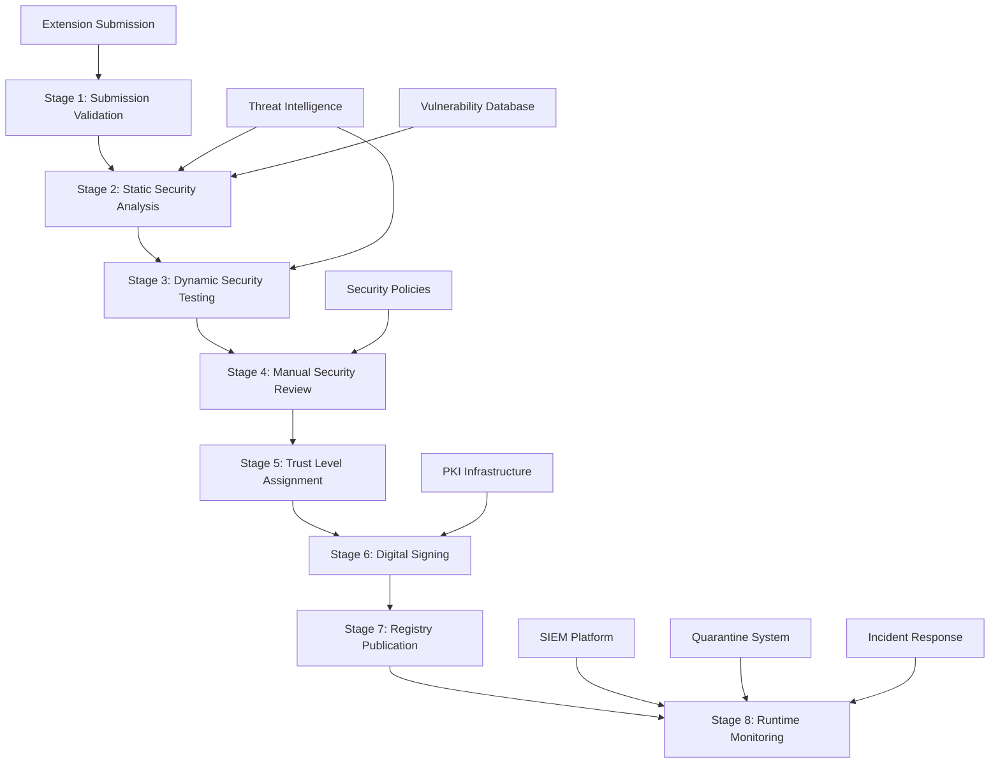

# AgentExtension Validation Framework Design

**Version**: 1.0  
**Date**: August 3, 2025  
**Classification**: Internal Use  

## Overview

The Extension Validation Framework provides a comprehensive, multi-stage security validation process for AgentExtensions in the A2A Registry. This framework implements defense-in-depth principles to identify and mitigate security risks before extensions are deployed to production agents.

## Architecture Overview



## Stage 1: Submission Validation

### Purpose
Initial validation of extension submissions to ensure basic security and format requirements are met.

### Security Controls

#### Publisher Authentication
```python
class PublisherAuthenticator:
    def validate_publisher(self, publisher_id: str, token: str) -> AuthResult:
        """
        Validate publisher identity and authorization
        """
        # Multi-factor authentication required for publishers
        if not self.verify_mfa_token(publisher_id, token):
            return AuthResult.FAILED_MFA
        
        # Check publisher reputation and trust score
        publisher = self.get_publisher(publisher_id)
        if publisher.trust_score < MINIMUM_TRUST_SCORE:
            return AuthResult.INSUFFICIENT_TRUST
            
        # Verify publisher is not on blocklist
        if self.is_blocked_publisher(publisher_id):
            return AuthResult.BLOCKED_PUBLISHER
            
        return AuthResult.SUCCESS
```

#### Rate Limiting and DDoS Protection
```python
class SubmissionRateLimiter:
    def __init__(self):
        self.publisher_limits = {
            "community": 10,     # per day
            "verified": 50,      # per day
            "official": 100      # per day
        }
        
    def check_rate_limit(self, publisher_id: str) -> bool:
        """
        Enforce rate limits based on publisher trust level
        """
        publisher_level = self.get_publisher_level(publisher_id)
        daily_limit = self.publisher_limits[publisher_level]
        
        submissions_today = self.get_daily_submissions(publisher_id)
        return submissions_today < daily_limit
```

#### File Format and Size Validation
```python
class SubmissionValidator:
    MAX_EXTENSION_SIZE = 100 * 1024 * 1024  # 100MB
    ALLOWED_FILE_TYPES = ['.zip', '.tar.gz', '.json', '.yaml']
    
    def validate_submission(self, extension_file: bytes) -> ValidationResult:
        """
        Validate basic file format and size requirements
        """
        # Check file size
        if len(extension_file) > self.MAX_EXTENSION_SIZE:
            return ValidationResult.error("Extension exceeds maximum size limit")
        
        # Validate file format
        file_type = self.detect_file_type(extension_file)
        if file_type not in self.ALLOWED_FILE_TYPES:
            return ValidationResult.error(f"Unsupported file type: {file_type}")
        
        # Basic malware scan
        scan_result = self.antivirus_scan(extension_file)
        if scan_result.is_malicious:
            return ValidationResult.error("Malware detected in submission")
            
        return ValidationResult.success()
```

### Validation Criteria
- ✅ Publisher authentication successful
- ✅ Rate limits not exceeded
- ✅ File format is supported
- ✅ File size within limits
- ✅ Initial malware scan passes
- ✅ Metadata format is valid

## Stage 2: Static Security Analysis

### Purpose
Comprehensive static analysis of extension code and configuration to identify security vulnerabilities without execution.

### Security Tools Integration

#### Static Application Security Testing (SAST)
```python
class SASTAnalyzer:
    def __init__(self):
        self.tools = [
            SonarQubeSecurityAnalyzer(),
            CheckmarxAnalyzer(),
            BanditAnalyzer(),  # Python
            ESLintSecurityAnalyzer(),  # JavaScript
            GosecAnalyzer(),  # Go
        ]
    
    def analyze_extension(self, extension_path: str) -> SASTResult:
        """
        Run static security analysis on extension code
        """
        results = []
        for tool in self.tools:
            if tool.supports_language(self.detect_language(extension_path)):
                result = tool.analyze(extension_path)
                results.append(result)
        
        return self.consolidate_results(results)
```

#### Dependency Vulnerability Scanning
```python
class DependencyScanner:
    def __init__(self):
        self.vulnerability_db = NVDDatabase()
        self.blocklist = DependencyBlocklist()
    
    def scan_dependencies(self, manifest_file: str) -> DependencyResult:
        """
        Scan extension dependencies for known vulnerabilities
        """
        dependencies = self.parse_dependencies(manifest_file)
        vulnerabilities = []
        
        for dep in dependencies:
            # Check against vulnerability database
            vulns = self.vulnerability_db.check_package(dep.name, dep.version)
            vulnerabilities.extend(vulns)
            
            # Check against blocklist
            if self.blocklist.is_blocked(dep.name):
                vulnerabilities.append(SecurityFinding(
                    severity="HIGH",
                    type="BLOCKED_DEPENDENCY",
                    description=f"Dependency {dep.name} is on security blocklist"
                ))
        
        return DependencyResult(dependencies, vulnerabilities)
```

#### Sensitive Data Detection
```python
class SensitiveDataScanner:
    PATTERNS = {
        'api_key': r'api[_-]?key[\'"\s]*[:=][\'"\s]*[a-zA-Z0-9]{20,}',
        'password': r'password[\'"\s]*[:=][\'"\s]*[^\s\'"]{8,}',
        'private_key': r'-----BEGIN [A-Z]+ PRIVATE KEY-----',
        'jwt_token': r'eyJ[A-Za-z0-9-_=]+\.[A-Za-z0-9-_=]+\.?[A-Za-z0-9-_.+/=]*',
        'credit_card': r'\b(?:\d{4}[-\s]?){3}\d{4}\b',
        'ssn': r'\b\d{3}-?\d{2}-?\d{4}\b'
    }
    
    def scan_for_secrets(self, file_content: str) -> List[SecurityFinding]:
        """
        Scan extension content for sensitive data patterns
        """
        findings = []
        for secret_type, pattern in self.PATTERNS.items():
            matches = re.finditer(pattern, file_content, re.IGNORECASE)
            for match in matches:
                findings.append(SecurityFinding(
                    severity="HIGH",
                    type="SENSITIVE_DATA_EXPOSURE",
                    description=f"Potential {secret_type} found in extension content",
                    location=match.span()
                ))
        return findings
```

### Validation Criteria
- ✅ No critical security vulnerabilities found
- ✅ All dependencies are vulnerability-free
- ✅ No sensitive data exposed in code
- ✅ Code follows secure coding practices
- ✅ Configuration security review passes

## Stage 3: Dynamic Security Testing

### Purpose
Execute extensions in a secure sandbox environment to observe runtime behavior and detect malicious activities.

### Sandbox Architecture

#### Container-Based Isolation
```yaml
# Sandbox container configuration
apiVersion: v1
kind: Pod
metadata:
  name: extension-sandbox
  annotations:
    container.apparmor.security.beta.kubernetes.io/sandbox: runtime/default
spec:
  securityContext:
    runAsNonRoot: true
    runAsUser: 65534
    fsGroup: 65534
    seccompProfile:
      type: RuntimeDefault
  containers:
  - name: sandbox
    image: extension-sandbox:latest
    securityContext:
      allowPrivilegeEscalation: false
      readOnlyRootFilesystem: true
      capabilities:
        drop:
        - ALL
    resources:
      limits:
        cpu: "1"
        memory: "512Mi"
        ephemeral-storage: "100Mi"
      requests:
        cpu: "100m"
        memory: "128Mi"
    volumeMounts:
    - name: extension-volume
      mountPath: /extension
      readOnly: true
    - name: tmp-volume
      mountPath: /tmp
  volumes:
  - name: extension-volume
    configMap:
      name: extension-content
  - name: tmp-volume
    emptyDir:
      sizeLimit: "10Mi"
```

#### Runtime Behavior Monitoring
```python
class SandboxMonitor:
    def __init__(self):
        self.file_monitor = FileSystemMonitor()
        self.network_monitor = NetworkMonitor()
        self.process_monitor = ProcessMonitor()
        
    def monitor_extension_execution(self, extension_id: str) -> ExecutionReport:
        """
        Monitor extension behavior during sandbox execution
        """
        # Start monitoring
        self.file_monitor.start_monitoring()
        self.network_monitor.start_monitoring()
        self.process_monitor.start_monitoring()
        
        # Execute extension in sandbox
        execution_result = self.execute_extension(extension_id)
        
        # Collect monitoring data
        file_activities = self.file_monitor.get_activities()
        network_activities = self.network_monitor.get_activities()
        process_activities = self.process_monitor.get_activities()
        
        # Analyze behaviors
        suspicious_behaviors = self.analyze_behaviors(
            file_activities, network_activities, process_activities
        )
        
        return ExecutionReport(
            execution_result=execution_result,
            file_activities=file_activities,
            network_activities=network_activities,
            process_activities=process_activities,
            suspicious_behaviors=suspicious_behaviors
        )
```

#### Security Behavior Analysis
```python
class BehaviorAnalyzer:
    SUSPICIOUS_PATTERNS = {
        'file_access': [
            '/etc/passwd', '/etc/shadow', '/root/',
            '~/.ssh/', '~/.aws/', '~/.gcp/'
        ],
        'network_access': [
            'known_malware_domains', 'tor_exit_nodes',
            'cryptocurrency_pools', 'suspicious_ips'
        ],
        'process_execution': [
            'curl', 'wget', 'nc', 'ncat', 'telnet',
            'ssh', 'scp', 'rsync'
        ]
    }
    
    def analyze_behaviors(self, activities: Dict) -> List[SecurityFinding]:
        """
        Analyze extension runtime behaviors for suspicious activities
        """
        findings = []
        
        # Check file access patterns
        for file_access in activities['file_activities']:
            if any(pattern in file_access.path for pattern in self.SUSPICIOUS_PATTERNS['file_access']):
                findings.append(SecurityFinding(
                    severity="HIGH",
                    type="SUSPICIOUS_FILE_ACCESS",
                    description=f"Extension accessed sensitive file: {file_access.path}"
                ))
        
        # Check network access patterns
        for network_access in activities['network_activities']:
            if self.is_suspicious_domain(network_access.destination):
                findings.append(SecurityFinding(
                    severity="CRITICAL",
                    type="MALICIOUS_NETWORK_ACCESS",
                    description=f"Extension contacted suspicious domain: {network_access.destination}"
                ))
        
        return findings
```

### Validation Criteria
- ✅ No malicious network communications
- ✅ No unauthorized file system access
- ✅ No suspicious process executions
- ✅ Resource usage within limits
- ✅ No runtime errors or crashes

## Stage 4: Manual Security Review

### Purpose
Human expert review of extensions targeting higher trust levels (verified, official) to assess security architecture and design.

### Review Process

#### Security Architecture Review
```python
class SecurityArchitectureReviewer:
    def review_extension_architecture(self, extension: Extension) -> ReviewResult:
        """
        Conduct comprehensive security architecture review
        """
        review_checklist = [
            self.review_authentication_design(extension),
            self.review_authorization_model(extension),
            self.review_data_flow_security(extension),
            self.review_error_handling(extension),
            self.review_logging_security(extension),
            self.review_input_validation(extension),
            self.review_output_encoding(extension),
            self.review_cryptographic_usage(extension)
        ]
        
        return self.consolidate_review_results(review_checklist)
```

#### Manual Code Review Guidelines
```markdown
## Security Code Review Checklist

### Authentication and Authorization
- [ ] Multi-factor authentication is properly implemented
- [ ] Session management follows security best practices
- [ ] Authorization checks are present at all decision points
- [ ] Privilege escalation paths are blocked

### Input Validation and Sanitization
- [ ] All user inputs are validated and sanitized
- [ ] SQL injection prevention measures are in place
- [ ] XSS prevention is implemented
- [ ] Path traversal attacks are prevented

### Cryptography and Data Protection
- [ ] Strong cryptographic algorithms are used
- [ ] Key management follows best practices
- [ ] Sensitive data is properly encrypted
- [ ] Secure random number generation is used

### Error Handling and Logging
- [ ] Error messages don't leak sensitive information
- [ ] Security events are properly logged
- [ ] Log injection attacks are prevented
- [ ] Audit trails are complete and tamper-evident

### Secure Communication
- [ ] All communications use encryption (TLS/SSL)
- [ ] Certificate validation is properly implemented
- [ ] Man-in-the-middle attacks are prevented
- [ ] API security best practices are followed
```

### Review Team Structure
- **Lead Security Architect**: Overall security design review
- **Application Security Engineer**: Code-level security analysis
- **Cryptography Expert**: Cryptographic implementation review
- **Compliance Specialist**: Regulatory and standard compliance

### Validation Criteria
- ✅ Security architecture is sound
- ✅ Code follows secure development practices
- ✅ Cryptographic implementation is correct
- ✅ Compliance requirements are met
- ✅ Risk assessment is acceptable

## Stage 5: Trust Level Assignment

### Purpose
Assign appropriate trust level based on validation results and publisher reputation.

### Trust Level Matrix

| Trust Level | Requirements | Validation Stages | Publisher Requirements |
|-------------|--------------|-------------------|----------------------|
| **Community** | Basic validation only | Stages 1-3 | Email verification |
| **Verified** | Enhanced validation | Stages 1-4 | Identity verification, reputation |
| **Official** | Full validation + audit | All stages + audit | Organizational verification |
| **Deprecated** | Legacy support only | Minimal validation | N/A |

### Trust Score Calculation
```python
class TrustScoreCalculator:
    def calculate_trust_score(self, extension: Extension, validation_results: ValidationResults) -> TrustScore:
        """
        Calculate trust score based on multiple factors
        """
        factors = {
            'publisher_reputation': 0.3,
            'security_scan_results': 0.4,
            'code_quality': 0.2,
            'community_feedback': 0.1
        }
        
        publisher_score = self.get_publisher_reputation_score(extension.publisher_id)
        security_score = self.calculate_security_score(validation_results.security_findings)
        quality_score = self.calculate_code_quality_score(validation_results.code_analysis)
        feedback_score = self.get_community_feedback_score(extension.id)
        
        weighted_score = (
            publisher_score * factors['publisher_reputation'] +
            security_score * factors['security_scan_results'] +
            quality_score * factors['code_quality'] +
            feedback_score * factors['community_feedback']
        )
        
        return TrustScore(
            overall_score=weighted_score,
            factors={
                'publisher': publisher_score,
                'security': security_score,
                'quality': quality_score,
                'feedback': feedback_score
            }
        )
```

## Stage 6: Digital Signing

### Purpose
Cryptographically sign approved extensions to ensure integrity and authenticity.

### PKI Infrastructure

#### Certificate Hierarchy
```
A2A Registry Root CA
├── Extension Signing Intermediate CA
│   ├── Community Extension Signing Certificates
│   ├── Verified Extension Signing Certificates
│   └── Official Extension Signing Certificates
└── Code Signing Intermediate CA
    ├── Publisher Code Signing Certificates
    └── Registry Code Signing Certificates
```

#### Extension Signing Process
```python
class ExtensionSigner:
    def __init__(self, hsm_client: HSMClient):
        self.hsm = hsm_client
        self.cert_manager = CertificateManager()
    
    def sign_extension(self, extension: Extension, trust_level: str) -> SignedExtension:
        """
        Cryptographically sign extension with appropriate certificate
        """
        # Get signing certificate based on trust level
        signing_cert = self.cert_manager.get_signing_certificate(trust_level)
        
        # Create extension manifest
        manifest = self.create_extension_manifest(extension)
        
        # Sign manifest with HSM-protected private key
        signature = self.hsm.sign(
            data=manifest.to_bytes(),
            key_id=signing_cert.private_key_id,
            algorithm='RSA-PSS-SHA256'
        )
        
        # Create signed extension package
        signed_extension = SignedExtension(
            extension=extension,
            manifest=manifest,
            signature=signature,
            certificate=signing_cert.public_certificate
        )
        
        return signed_extension
```

#### Signature Verification
```python
class SignatureVerifier:
    def verify_extension_signature(self, signed_extension: SignedExtension) -> VerificationResult:
        """
        Verify extension signature and certificate chain
        """
        # Verify certificate chain
        cert_verification = self.verify_certificate_chain(signed_extension.certificate)
        if not cert_verification.is_valid:
            return VerificationResult.invalid("Certificate chain verification failed")
        
        # Verify signature
        signature_verification = self.verify_signature(
            data=signed_extension.manifest.to_bytes(),
            signature=signed_extension.signature,
            public_key=signed_extension.certificate.public_key
        )
        
        if not signature_verification.is_valid:
            return VerificationResult.invalid("Signature verification failed")
        
        # Check certificate revocation status
        revocation_status = self.check_revocation_status(signed_extension.certificate)
        if revocation_status.is_revoked:
            return VerificationResult.invalid("Certificate has been revoked")
        
        return VerificationResult.valid()
```

## Stage 7: Registry Publication

### Purpose
Publish validated extensions to the registry with appropriate metadata and access controls.

### Publication Security Controls
```python
class ExtensionPublisher:
    def publish_extension(self, signed_extension: SignedExtension) -> PublicationResult:
        """
        Publish validated extension to registry
        """
        # Create publication record
        publication_record = PublicationRecord(
            extension_id=signed_extension.extension.id,
            trust_level=signed_extension.trust_level,
            validation_timestamp=datetime.utcnow(),
            signature_fingerprint=self.calculate_fingerprint(signed_extension.signature),
            publisher_id=signed_extension.extension.publisher_id
        )
        
        # Store in registry database
        registry_result = self.registry_db.store_extension(signed_extension, publication_record)
        
        # Update search index
        self.search_index.index_extension(signed_extension.extension)
        
        # Notify monitoring systems
        self.monitoring_system.notify_publication(publication_record)
        
        return PublicationResult(success=True, publication_record=publication_record)
```

## Stage 8: Runtime Monitoring

### Purpose
Continuously monitor extension behavior in production to detect security incidents and policy violations.

### Monitoring Architecture
```python
class RuntimeMonitor:
    def __init__(self):
        self.behavior_analyzer = BehaviorAnalyzer()
        self.anomaly_detector = AnomalyDetector()
        self.incident_handler = IncidentHandler()
    
    def monitor_extension_runtime(self, extension_id: str, agent_id: str):
        """
        Monitor extension behavior during runtime execution
        """
        # Collect runtime telemetry
        telemetry = self.collect_telemetry(extension_id, agent_id)
        
        # Analyze behavior patterns
        behavior_analysis = self.behavior_analyzer.analyze(telemetry)
        
        # Detect anomalies
        anomalies = self.anomaly_detector.detect_anomalies(telemetry)
        
        # Check for security policy violations
        policy_violations = self.check_policy_violations(telemetry)
        
        # Handle security incidents
        if anomalies or policy_violations:
            incident = SecurityIncident(
                extension_id=extension_id,
                agent_id=agent_id,
                anomalies=anomalies,
                policy_violations=policy_violations,
                timestamp=datetime.utcnow()
            )
            self.incident_handler.handle_incident(incident)
```

### Security Incident Response
```python
class IncidentHandler:
    def handle_incident(self, incident: SecurityIncident):
        """
        Handle security incidents with automated response
        """
        severity = self.calculate_incident_severity(incident)
        
        if severity >= IncidentSeverity.HIGH:
            # Automatic quarantine for high-severity incidents
            self.quarantine_extension(incident.extension_id)
            
            # Notify security team immediately
            self.notify_security_team(incident)
            
            # Create incident ticket
            self.create_incident_ticket(incident)
        
        elif severity >= IncidentSeverity.MEDIUM:
            # Create security alert
            self.create_security_alert(incident)
            
            # Increase monitoring for extension
            self.increase_monitoring_level(incident.extension_id)
        
        # Log all incidents for analysis
        self.log_security_incident(incident)
```

## Implementation Timeline

### Phase 1: Foundation (Weeks 1-4)
- Implement stages 1-2 (Submission validation and static analysis)
- Deploy basic sandbox infrastructure
- Create initial monitoring framework

### Phase 2: Enhanced Validation (Weeks 5-8)
- Complete dynamic security testing (Stage 3)
- Implement manual review process (Stage 4)
- Deploy trust level assignment system (Stage 5)

### Phase 3: Production Readiness (Weeks 9-12)
- Implement extension signing infrastructure (Stage 6)
- Deploy registry publication system (Stage 7)
- Complete runtime monitoring framework (Stage 8)

### Phase 4: Optimization (Weeks 13-16)
- Performance optimization and tuning
- Enhanced security analytics
- Incident response automation
- Compliance validation

## Success Metrics

### Security Effectiveness Metrics
- **Malware Detection Rate**: 99.5% of malicious extensions detected
- **False Positive Rate**: <5% of benign extensions flagged
- **Time to Detection**: <15 minutes for security incidents
- **Time to Response**: <60 seconds for critical incidents

### Operational Metrics
- **Validation Throughput**: 100 extensions per day
- **Processing Time**: <2 hours for community extensions
- **Availability**: 99.9% uptime for validation services
- **Scalability**: Support for 10,000 concurrent validations

## Conclusion

The Extension Validation Framework provides comprehensive security validation for AgentExtensions through multiple stages of automated and manual security testing. This defense-in-depth approach ensures that only secure, trusted extensions are deployed to production agents while maintaining the flexibility and innovation potential of the extensibility system.

Regular updates and improvements to the validation framework will ensure it remains effective against evolving security threats and attack techniques.

---

**Document Classification**: Internal Use  
**Owner**: Security Engineering Team  
**Next Review**: September 3, 2025