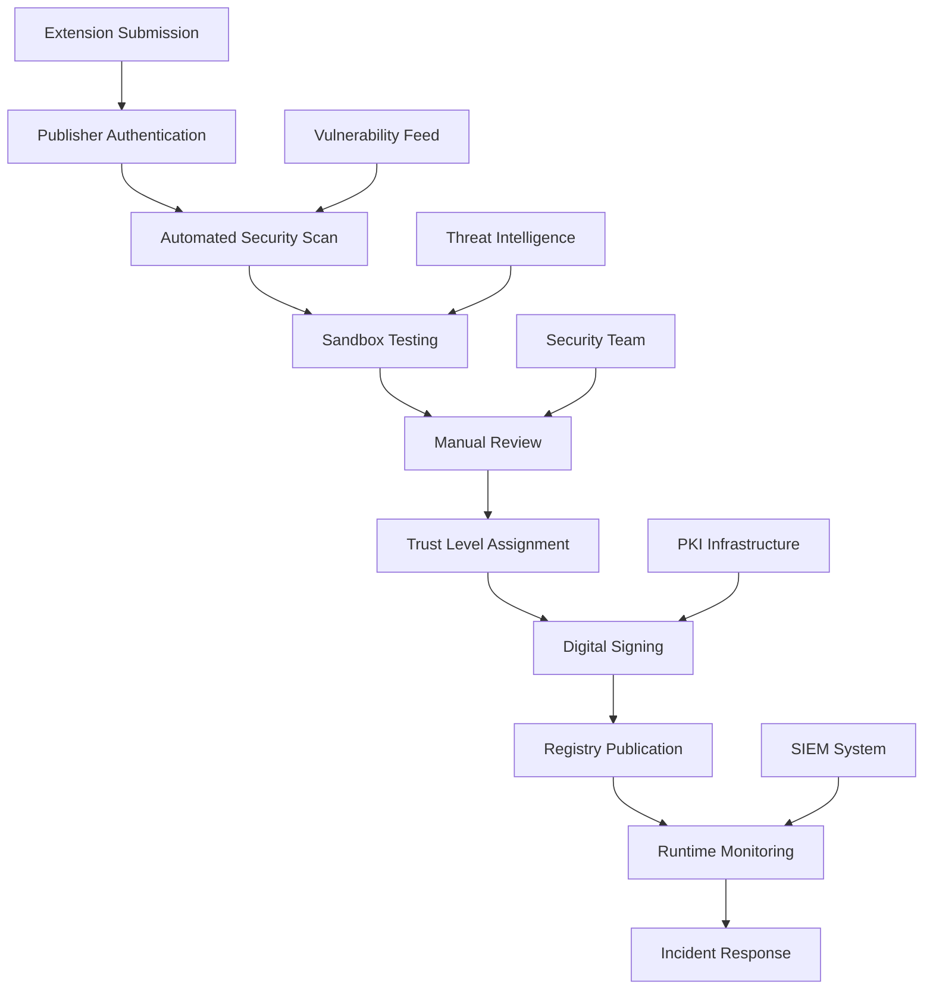

# AgentExtension Architecture Security Audit Report

**Report Date:** August 3, 2025  
**Auditor:** Security Auditor  
**Scope:** A2A Registry AgentExtension Architecture  
**Protocol Version:** A2A Protocol v0.3.0  

## Executive Summary

This security audit evaluates the proposed AgentExtension architecture for the A2A Registry, which introduces significant new attack surfaces through extensible agent capabilities. The audit identifies **Critical** and **High** severity security risks that must be addressed before production deployment.

### Key Findings

- **9 Critical vulnerabilities** in extension validation and trust management
- **12 High-risk security gaps** in dependency chain security and access controls
- **8 Medium-risk concerns** in monitoring and compliance frameworks
- **Insufficient security controls** for multi-tenant extension sharing
- **Missing security architecture** for extension content validation

### Risk Rating: **HIGH**

The current proposed architecture lacks fundamental security controls necessary for safe extension execution in a distributed agent environment.

## 1. Threat Modeling Analysis

### 1.1 Threat Actors

#### Internal Threat Actors
- **Malicious Extension Developers**: Publishers with intent to compromise agent operations
- **Compromised Developer Accounts**: Legitimate developers whose accounts have been hijacked
- **Insider Threats**: Authorized personnel with privileged access to registry systems

#### External Threat Actors
- **Nation-State Actors**: Advanced persistent threats targeting agent infrastructure
- **Cybercriminal Organizations**: Groups seeking to monetize agent compromise
- **Script Kiddies**: Opportunistic attackers exploiting known vulnerabilities
- **Competitors**: Organizations seeking to disrupt or gain intelligence

### 1.2 Attack Vectors

#### Primary Attack Vectors (Critical Risk)

1. **Malicious Extension Injection**
   - **Vector**: Upload of extensions containing malicious code/configuration
   - **Impact**: Remote code execution, data exfiltration, agent takeover
   - **Likelihood**: High (no content validation mentioned)

2. **Dependency Chain Poisoning**
   - **Vector**: Compromise of extension dependencies
   - **Impact**: Transitive malware distribution across agent networks
   - **Likelihood**: Medium-High (common in software supply chains)

3. **Trust Level Manipulation**
   - **Vector**: Elevation of malicious extensions to higher trust levels
   - **Impact**: Bypass of security controls, widespread deployment
   - **Likelihood**: Medium (depends on trust verification process)

#### Secondary Attack Vectors (High Risk)

4. **Extension Registry DoS**
   - **Vector**: Resource exhaustion through malicious extension uploads
   - **Impact**: Registry unavailability, agent operational disruption
   - **Likelihood**: High (no rate limiting specified)

5. **Social Engineering**
   - **Vector**: Deceptive extension descriptions/documentation
   - **Impact**: Installation of malicious extensions by deceived users
   - **Likelihood**: Medium-High (human factor)

## 2. Risk Assessment by Security Domain

### 2.1 Extension Content Security

#### Critical Risks

**RISK-001: Unvalidated Extension Content Execution**
- **Severity**: Critical
- **Description**: No secure sandbox for extension content validation
- **Impact**: Remote code execution, system compromise
- **Mitigation Gap**: Missing content analysis pipeline

**RISK-002: Malicious Code Injection**
- **Severity**: Critical  
- **Description**: Extensions can contain arbitrary code without verification
- **Impact**: Agent takeover, lateral movement
- **Mitigation Gap**: No static/dynamic analysis tools

**RISK-003: Content Tampering**
- **Severity**: High
- **Description**: Extension content integrity not protected post-upload
- **Impact**: Supply chain compromise, backdoor insertion
- **Mitigation Gap**: Missing cryptographic signing/verification

#### Recommended Controls
- Implement secure sandboxed validation environment
- Deploy static analysis security testing (SAST) for extension code
- Require cryptographic signing of all extension content
- Implement content integrity monitoring

### 2.2 Dependency Chain Security

#### Critical Risks

**RISK-004: Dependency Poisoning Attacks**
- **Severity**: Critical
- **Description**: No validation of extension dependencies
- **Impact**: Transitive malware propagation
- **Mitigation Gap**: Missing dependency scanning

**RISK-005: Version Conflict Exploitation**
- **Severity**: High
- **Description**: Dependency version resolution vulnerabilities
- **Impact**: Security bypass through downgrade attacks
- **Mitigation Gap**: No secure version resolution policy

**RISK-006: Transitive Dependency Blindness**
- **Severity**: High
- **Description**: No visibility into nested dependency chains
- **Impact**: Hidden malware in deep dependency trees
- **Mitigation Gap**: Missing dependency tree analysis

#### Recommended Controls
- Implement recursive dependency vulnerability scanning
- Establish secure dependency resolution policies
- Create dependency allowlist/blocklist mechanisms
- Deploy supply chain security monitoring

### 2.3 Trust and Authorization Model

#### Critical Risks

**RISK-007: Trust Level Verification Weakness**
- **Severity**: Critical
- **Description**: No secure process for trust level assignment
- **Impact**: Malicious extensions elevated to trusted status
- **Mitigation Gap**: Missing trust verification framework

**RISK-008: Insufficient Access Controls**
- **Severity**: High
- **Description**: No granular permissions for extension operations
- **Impact**: Excessive privilege exploitation
- **Mitigation Gap**: Missing RBAC implementation

**RISK-009: Authentication Bypass**
- **Severity**: High
- **Description**: No multi-factor authentication for publishers
- **Impact**: Account takeover, malicious uploads
- **Mitigation Gap**: Basic authentication only

#### Recommended Controls
- Implement multi-stakeholder trust verification process
- Deploy role-based access control (RBAC) system
- Require multi-factor authentication for all publishers
- Establish identity verification for extension publishers

### 2.4 Data Protection

#### High Risks

**RISK-010: Sensitive Data Exposure**
- **Severity**: High
- **Description**: Extensions may contain PII, credentials, secrets
- **Impact**: Data breach, compliance violations
- **Mitigation Gap**: No sensitive data scanning

**RISK-011: Encryption Deficiencies**
- **Severity**: Medium
- **Description**: Extension content not encrypted at rest
- **Impact**: Data exposure if storage compromised  
- **Mitigation Gap**: Missing encryption framework

**RISK-012: Audit Logging Gaps**
- **Severity**: Medium
- **Description**: Insufficient security event logging
- **Impact**: Delayed incident detection/response
- **Mitigation Gap**: Basic logging only

#### Recommended Controls
- Implement sensitive data scanning and classification
- Deploy end-to-end encryption for extension content
- Establish comprehensive security audit logging
- Create data retention and privacy controls

## 3. Attack Vector Deep Dive

### 3.1 Code Injection Attacks

#### Attack Scenario
1. Attacker creates malicious extension with embedded payload
2. Extension bypasses validation (if any) due to obfuscation
3. Agent installs and executes extension code
4. Payload establishes persistence and lateral movement capability

#### Technical Details
- **Injection Points**: Extension configuration, business rules, ML models
- **Payload Types**: Remote shells, data exfiltration tools, ransomware
- **Evasion Techniques**: Code obfuscation, steganography, polymorphism

#### Detection/Prevention
- Static code analysis with security rules
- Dynamic execution monitoring
- Behavioral analysis systems
- Code signing enforcement

### 3.2 Privilege Escalation

#### Attack Scenario
1. Extension starts with limited permissions
2. Exploits validation gaps to gain additional privileges
3. Uses elevated access to compromise host system
4. Spreads to other agents in network

#### Technical Details
- **Escalation Vectors**: Permission model flaws, validation bypasses
- **Target Privileges**: File system access, network permissions, agent control
- **Persistence Methods**: System service installation, registry modifications

#### Detection/Prevention
- Principle of least privilege enforcement
- Runtime permission monitoring  
- Privilege escalation detection systems
- Container/sandbox isolation

### 3.3 Supply Chain Attacks

#### Attack Scenario
1. Attacker compromises popular extension or its dependencies
2. Injects malicious code into trusted extension
3. Extension automatically updates across agent network
4. Malware executes with trusted extension privileges

#### Technical Details
- **Compromise Points**: Developer systems, CI/CD pipelines, repositories
- **Injection Methods**: Source code modification, binary patching
- **Distribution**: Automatic updates, dependency pulls

#### Detection/Prevention
- Source code integrity verification
- Build reproducibility requirements
- Dependency pinning and verification
- Supply chain monitoring tools

## 4. Security Controls Assessment

### 4.1 Current Proposed Controls

#### Multi-Stage Validation Pipeline
- **Strength**: Provides multiple validation checkpoints
- **Weakness**: No technical implementation details provided
- **Risk**: May not include security-focused validation steps

#### Trust Levels (community, verified, official, deprecated)
- **Strength**: Provides risk-based extension classification
- **Weakness**: No clear criteria for trust level assignment
- **Risk**: Trust level manipulation by attackers

#### Extension Signing and Verification
- **Strength**: Cryptographic integrity protection
- **Weakness**: No details on key management, certificate authority
- **Risk**: Weak cryptographic implementation

#### Content Scanning and Auditing
- **Strength**: Automated security scanning capability
- **Weakness**: No specification of scanning techniques/tools
- **Risk**: False negatives allowing malicious content

#### Runtime Monitoring and Anomaly Detection
- **Strength**: Behavioral security monitoring
- **Weakness**: No details on detection algorithms/thresholds
- **Risk**: High false positive/negative rates

#### Role-Based Access Control
- **Strength**: Granular permission management
- **Weakness**: No RBAC model specification provided
- **Risk**: Insufficient access controls

### 4.2 Critical Control Gaps

#### Missing Security Controls

1. **Secure Sandbox Environment**
   - **Gap**: No isolated execution environment for validation
   - **Impact**: Malicious extensions can compromise validation systems
   - **Recommendation**: Implement containerized sandbox with resource limits

2. **Vulnerability Database Integration**
   - **Gap**: No automated vulnerability scanning against known CVEs
   - **Impact**: Known vulnerable dependencies may be accepted
   - **Recommendation**: Integrate with CVE databases and security advisory feeds

3. **Security Incident Response Plan**
   - **Gap**: No defined process for security incident handling
   - **Impact**: Delayed response to security breaches
   - **Recommendation**: Develop comprehensive incident response procedures

4. **Extension Quarantine System**
   - **Gap**: No mechanism to rapidly disable malicious extensions
   - **Impact**: Continued damage from compromised extensions
   - **Recommendation**: Implement emergency extension disable capability

5. **Cryptographic Key Management**
   - **Gap**: No secure key management system specified
   - **Impact**: Weak extension signing/verification
   - **Recommendation**: Deploy hardware security module (HSM) for key management

## 5. Validation Framework Security Design

### 5.1 Secure Multi-Stage Validation Pipeline

#### Stage 1: Submission Security Checks
```
Extension Submission
├── Publisher Authentication (MFA required)
├── Rate Limiting (per publisher/IP)
├── File Type Validation
├── Size Limits Enforcement
└── Initial Malware Scan
```

#### Stage 2: Static Security Analysis
```
Static Analysis
├── Code Security Scanning (SAST)
├── Dependency Vulnerability Check
├── Sensitive Data Detection
├── Configuration Security Review
└── License Compliance Check
```

#### Stage 3: Dynamic Security Testing
```
Sandbox Execution
├── Containerized Test Environment
├── Resource Usage Monitoring
├── Network Behavior Analysis
├── File System Access Logging
└── Runtime Security Events
```

#### Stage 4: Manual Security Review (High Trust)
```
Security Review (for verified/official)
├── Code Architecture Review
├── Security Design Analysis
├── Threat Model Validation
├── Compliance Verification
└── Risk Assessment
```

### 5.2 Trust Level Security Requirements

#### Community Extensions
- Automated security scanning only
- Limited functionality scope
- Usage telemetry collection
- Community reporting system

#### Verified Extensions
- Enhanced static analysis
- Dynamic security testing
- Publisher verification required
- Security audit trail

#### Official Extensions
- Full security review process
- Penetration testing required
- Code signing mandatory
- Continuous monitoring

## 6. Monitoring and Incident Response Strategy

### 6.1 Security Monitoring Framework

#### Real-Time Security Monitoring
- Extension execution monitoring
- Anomalous behavior detection
- Performance degradation alerts
- Unauthorized access attempts

#### Security Event Categories
1. **Critical Events**: Malware detection, system compromise
2. **High Events**: Privilege escalation, unauthorized access
3. **Medium Events**: Policy violations, suspicious patterns
4. **Low Events**: Configuration changes, access logs

#### Alerting and Response
- Automated threat response for critical events
- Security team notification workflows
- Extension quarantine procedures
- Incident documentation requirements

### 6.2 Incident Response Procedures

#### Phase 1: Detection and Analysis
1. Security event identification
2. Impact assessment
3. Containment strategy development
4. Evidence preservation

#### Phase 2: Containment and Eradication
1. Extension quarantine/disable
2. Affected agent isolation
3. Malware removal procedures
4. System recovery planning

#### Phase 3: Recovery and Lessons Learned
1. System restoration verification
2. Enhanced monitoring deployment
3. Security control improvements
4. Incident report publication

## 7. Compliance Assessment

### 7.1 OWASP Alignment

#### OWASP Top 10 for APIs
- **A01: Broken Object Level Authorization** - HIGH RISK
- **A02: Broken User Authentication** - MEDIUM RISK  
- **A03: Excessive Data Exposure** - HIGH RISK
- **A04: Lack of Resources & Rate Limiting** - HIGH RISK
- **A05: Broken Function Level Authorization** - HIGH RISK
- **A06: Mass Assignment** - MEDIUM RISK
- **A07: Security Misconfiguration** - HIGH RISK
- **A08: Injection** - CRITICAL RISK
- **A09: Improper Assets Management** - MEDIUM RISK
- **A10: Insufficient Logging & Monitoring** - HIGH RISK

#### OWASP SAMM Assessment
- **Governance**: Level 1 (Basic policies)
- **Design**: Level 0 (No security architecture)
- **Implementation**: Level 0 (No secure coding practices)
- **Verification**: Level 0 (No security testing)
- **Operations**: Level 0 (No security monitoring)

### 7.2 NIST Cybersecurity Framework

#### Framework Alignment Score: 15%

**Identify (ID)**: 20%
- Asset management identified but incomplete
- Business environment partially documented
- Governance structure undefined
- Risk assessment not performed
- Risk management strategy missing

**Protect (PR)**: 10%
- Access control model undefined
- Awareness and training not addressed
- Data security controls missing
- Information protection processes absent
- Maintenance procedures undefined
- Protective technology insufficient

**Detect (DE)**: 10%
- Anomaly detection proposed but not implemented
- Continuous monitoring undefined
- Detection processes not established

**Respond (RS)**: 5%
- Response planning absent
- Communications plan undefined
- Analysis procedures not established
- Mitigation strategies missing
- Improvements process undefined

**Recover (RC)**: 25%
- Recovery planning partially addressed
- Improvements integration possible
- Communications planning needed

## 8. Recommendations and Remediation

### 8.1 Critical Security Improvements (Priority 1)

#### Immediate Actions Required

1. **Implement Secure Validation Sandbox**
   - Deploy isolated container environment for extension testing
   - Configure resource limits and network restrictions
   - Implement monitoring and logging capabilities
   - **Timeline**: 2 weeks
   - **Effort**: High

2. **Deploy Static Security Analysis**
   - Integrate SAST tools for code security scanning
   - Configure security rules for common vulnerabilities
   - Implement automated vulnerability reporting
   - **Timeline**: 3 weeks
   - **Effort**: Medium

3. **Establish Extension Signing Infrastructure**
   - Deploy PKI infrastructure for extension signing
   - Implement certificate management procedures
   - Create signature verification mechanisms
   - **Timeline**: 4 weeks
   - **Effort**: High

4. **Create Emergency Response Capability**
   - Implement extension quarantine system
   - Develop incident response procedures
   - Create security team notification workflows
   - **Timeline**: 2 weeks
   - **Effort**: Medium

### 8.2 High Priority Security Enhancements (Priority 2)

#### Actions within 30 days

5. **Implement Dependency Security Scanning**
   - Deploy vulnerability scanning for dependencies
   - Create dependency allowlist/blocklist system
   - Implement supply chain monitoring
   - **Timeline**: 3 weeks
   - **Effort**: Medium

6. **Deploy Comprehensive Access Controls**
   - Implement RBAC system for extension management
   - Create publisher verification process
   - Deploy multi-factor authentication
   - **Timeline**: 4 weeks
   - **Effort**: High

7. **Establish Security Monitoring System**
   - Deploy SIEM for security event correlation
   - Create anomaly detection rules
   - Implement automated alerting
   - **Timeline**: 6 weeks
   - **Effort**: High

### 8.3 Medium Priority Improvements (Priority 3)

#### Actions within 60 days

8. **Create Security Compliance Framework**
   - Develop security policies and procedures
   - Implement compliance monitoring tools
   - Create audit trail capabilities
   - **Timeline**: 8 weeks
   - **Effort**: Medium

9. **Deploy Advanced Threat Detection**
   - Implement behavioral analysis systems
   - Create threat intelligence integration
   - Deploy machine learning anomaly detection
   - **Timeline**: 10 weeks
   - **Effort**: High

### 8.4 Long-term Security Architecture (Priority 4)

#### Actions within 90 days

10. **Implement Zero-Trust Architecture**
    - Deploy micro-segmentation for extensions
    - Implement continuous verification
    - Create trust score-based access controls
    - **Timeline**: 12 weeks
    - **Effort**: Very High

## 9. Security Architecture Recommendations

### 9.1 Secure Extension Lifecycle



### 9.2 Defense in Depth Strategy

#### Layer 1: Perimeter Security
- Publisher authentication and authorization
- Rate limiting and DDoS protection
- Network security controls

#### Layer 2: Extension Validation
- Static code analysis
- Dynamic security testing
- Dependency vulnerability scanning

#### Layer 3: Runtime Protection
- Sandboxed execution environment
- Resource usage monitoring
- Behavioral anomaly detection

#### Layer 4: Data Protection
- Encryption at rest and in transit
- Sensitive data classification
- Access logging and auditing

#### Layer 5: Incident Response
- Security event monitoring
- Automated threat response
- Forensic analysis capabilities

## 10. Implementation Roadmap

### Phase 1: Foundation (Weeks 1-4)
- Deploy secure validation sandbox
- Implement extension signing infrastructure
- Create emergency response procedures
- Establish basic security monitoring

### Phase 2: Enhanced Security (Weeks 5-8)
- Deploy static analysis security testing
- Implement dependency vulnerability scanning
- Create comprehensive access controls
- Deploy SIEM and security monitoring

### Phase 3: Advanced Capabilities (Weeks 9-12)
- Implement behavioral analysis systems
- Deploy threat intelligence integration
- Create security compliance framework
- Establish continuous security testing

### Phase 4: Optimization (Weeks 13-16)
- Implement zero-trust architecture
- Deploy machine learning security analytics
- Create automated security orchestration
- Establish security metrics and KPIs

## 11. Budget and Resource Requirements

### 11.1 Security Infrastructure Costs

#### Initial Implementation (Year 1)
- Security tools and licenses: $150,000
- PKI infrastructure deployment: $75,000
- SIEM system implementation: $100,000
- Sandbox infrastructure: $50,000
- **Total Initial Cost**: $375,000

#### Ongoing Operational Costs (Annual)
- Security tool maintenance: $50,000
- Staff augmentation: $200,000
- Infrastructure operational costs: $75,000
- Incident response services: $25,000
- **Total Annual Cost**: $350,000

### 11.2 Resource Requirements

#### Security Team Structure
- Security Architect (1 FTE)
- Security Engineers (2 FTE)
- Security Analysts (2 FTE)
- Incident Response Specialist (1 FTE)

#### Technical Skills Required
- Application security testing
- Malware analysis and reverse engineering
- Cryptography and PKI management
- SIEM and security monitoring
- Incident response and forensics

## 12. Conclusion

The proposed AgentExtension architecture introduces significant security risks that require comprehensive mitigation before production deployment. The current security posture is insufficient for a system handling potentially malicious extensions in a distributed agent environment.

### Critical Success Factors

1. **Executive Commitment**: Strong leadership support for security investment
2. **Security-First Design**: Security integrated into architecture from foundation
3. **Continuous Monitoring**: Real-time threat detection and response capabilities
4. **Community Engagement**: Security-aware extension developer community
5. **Regulatory Compliance**: Adherence to industry security standards

### Risk Acceptance Decision

**RECOMMENDATION**: Do not proceed with AgentExtension architecture deployment until Critical (Priority 1) and High Priority (Priority 2) security controls are implemented and validated.

The security risks identified in this audit pose unacceptable threats to agent infrastructure integrity, data confidentiality, and operational availability. Implementation of the recommended security controls is essential for safe operation of the AgentExtension system.

---

**Report Classification**: Confidential  
**Distribution**: Security Team, Architecture Team, Executive Leadership  
**Next Review Date**: September 3, 2025