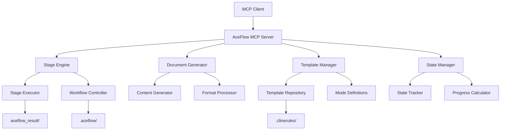

# AceFlow MCP Server 增强设计文档

**项目**: AceFlow MCP Server 完善计划  
**版本**: v2.0  
**创建时间**: 2025-08-04  
**目标**: 修复发现的问题，完善 MCP Tools 功能

## 问题分析

### 发现的核心问题

1. **阶段文档生成缺失**: 当前 MCP Tools 只提供决策支持，缺乏自动生成各阶段产物的能力
2. **模式定义不准确**: 不同模式的阶段定义混乱，没有严格按照 AceFlow 标准执行
3. **.clinerules 结构错误**: 应该是目录结构而不是文件
4. **状态管理不完善**: 阶段推进时状态文件更新不及时
5. **工作流程不连贯**: 缺乏自动化的阶段间衔接机制

### 根本原因

- **设计理念偏差**: 将 MCP Tools 定位为"辅助决策"而非"自动化执行"
- **标准规范缺失**: 没有严格的 AceFlow 规范文档指导实现
- **核心引擎缺失**: 缺乏阶段执行引擎和文档生成引擎

## 设计目标

### 核心原则

1. **严格遵循 AceFlow 标准**: 所有阶段产物必须符合 AceFlow 定义
2. **自动化执行**: MCP Tools 应能自动生成各阶段文档
3. **模式准确性**: 不同模式的阶段定义必须准确无误
4. **状态一致性**: 项目状态与实际进度保持同步
5. **可扩展性**: 支持未来新模式和阶段的添加

### 功能目标

1. **完整的阶段执行引擎**: 自动执行各阶段任务并生成产物
2. **智能文档生成器**: 基于输入和模板自动生成高质量文档
3. **精确的状态管理**: 实时跟踪和更新项目状态
4. **标准化模板系统**: 为每个模式和阶段提供标准模板
5. **质量保证机制**: 确保生成的文档符合质量标准

## 架构设计

### 整体架构



### 核心组件设计

#### 1. Stage Engine (阶段执行引擎)

**职责**: 管理和执行工作流阶段

**核心类**:
```python
class StageEngine:
    def execute_stage(self, stage_name: str, inputs: Dict) -> StageResult
    def validate_stage_inputs(self, stage_name: str, inputs: Dict) -> bool
    def get_stage_requirements(self, stage_name: str) -> List[str]
    def advance_to_next_stage(self) -> StageTransition
```

**功能**:
- 验证阶段输入条件
- 执行阶段任务
- 生成阶段产物
- 管理阶段间转换

#### 2. Document Generator (文档生成器)

**职责**: 基于模板和输入生成标准化文档

**核心类**:
```python
class DocumentGenerator:
    def generate_document(self, template: str, inputs: Dict) -> Document
    def validate_document_quality(self, document: Document) -> QualityReport
    def apply_formatting(self, content: str, format_type: str) -> str
```

**功能**:
- 基于模板生成文档内容
- 应用标准格式化
- 验证文档质量
- 支持多种输出格式

#### 3. Template Manager (模板管理器)

**职责**: 管理各模式和阶段的标准模板

**核心类**:
```python
class TemplateManager:
    def get_stage_template(self, mode: str, stage: str) -> Template
    def validate_template(self, template: Template) -> bool
    def load_mode_definition(self, mode: str) -> ModeDefinition
```

**功能**:
- 提供标准化模板
- 管理模式定义
- 支持模板自定义
- 模板版本控制

#### 4. State Manager (状态管理器)

**职责**: 管理项目状态和进度跟踪

**核心类**:
```python
class StateManager:
    def update_stage_status(self, stage: str, status: StageStatus) -> None
    def get_current_state(self) -> ProjectState
    def calculate_progress(self) -> float
    def validate_state_consistency(self) -> bool
```

**功能**:
- 实时状态更新
- 进度计算
- 状态一致性检查
- 历史记录管理

## 详细设计

### 1. 模式定义标准化

#### Complete 模式标准定义
```yaml
name: "Complete Workflow"
version: "3.0"
description: "完整企业级开发工作流"
total_stages: 12

stages:
  S1_requirement_analysis:
    name: "需求分析"
    inputs: ["PRD文档", "业务需求"]
    outputs: ["需求分析文档", "功能清单"]
    template: "requirement_analysis.md.j2"
    
  S2_architecture_design:
    name: "架构设计"
    inputs: ["需求分析文档"]
    outputs: ["架构设计文档", "技术选型"]
    template: "architecture_design.md.j2"
    
  S3_user_stories:
    name: "用户故事分析"
    inputs: ["需求分析文档", "架构设计文档"]
    outputs: ["用户故事文档"]
    template: "user_stories.md.j2"
    
  # ... 其他阶段
```

#### Standard 模式标准定义
```yaml
name: "Standard Workflow"
version: "3.0"
description: "标准软件开发工作流"
total_stages: 8

stages:
  S1_user_stories:
    name: "用户故事分析"
    inputs: ["PRD文档"]
    outputs: ["用户故事文档"]
    template: "user_stories.md.j2"
    
  S2_task_breakdown:
    name: "任务分解"
    inputs: ["用户故事文档"]
    outputs: ["任务分解文档"]
    template: "task_breakdown.md.j2"
    
  # ... 其他阶段
```

### 2. 文档模板系统

#### 模板结构
```
.clinerules/
├── templates/
│   ├── complete/
│   │   ├── S1_requirement_analysis.md.j2
│   │   ├── S2_architecture_design.md.j2
│   │   ├── S3_user_stories.md.j2
│   │   └── ...
│   ├── standard/
│   │   ├── S1_user_stories.md.j2
│   │   ├── S2_task_breakdown.md.j2
│   │   └── ...
│   └── minimal/
│       └── ...
├── schemas/
│   ├── document_schemas.json
│   └── validation_rules.json
└── config/
    ├── mode_definitions.yaml
    └── quality_standards.yaml
```

#### 示例模板 (S3_user_stories.md.j2)
```jinja2
# 用户故事文档

**项目**: {{ project.name }}
**阶段**: S3 - 用户故事分析
**基于**: {{ inputs.requirement_analysis }}, {{ inputs.architecture_design }}
**创建时间**: {{ current_date }}

## 概述

基于需求分析和架构设计，将系统功能分解为具体的用户故事。


## {{ module.name }}模块


### {{ story.id }} {{ story.title }}

**作为** {{ story.role }}
**我希望** {{ story.feature }}
**以便** {{ story.benefit }}

**验收标准**:

- {{ criteria }}





## 下一步工作

基于这些用户故事，下一阶段将进行任务分解...
```

### 3. 阶段执行流程

#### 阶段执行算法
```python
def execute_stage(self, stage_name: str) -> StageResult:
    # 1. 验证输入条件
    inputs = self.validate_stage_inputs(stage_name)
    if not inputs.valid:
        return StageResult.failed(inputs.errors)
    
    # 2. 加载阶段模板
    template = self.template_manager.get_stage_template(
        self.current_mode, stage_name
    )
    
    # 3. 收集输入数据
    input_data = self.collect_input_data(inputs.requirements)
    
    # 4. 生成文档内容
    document = self.document_generator.generate_document(
        template, input_data
    )
    
    # 5. 质量验证
    quality_report = self.validate_document_quality(document)
    if not quality_report.passed:
        return StageResult.failed(quality_report.issues)
    
    # 6. 保存产物
    output_path = self.save_stage_output(stage_name, document)
    
    # 7. 更新状态
    self.state_manager.complete_stage(stage_name, output_path)
    
    return StageResult.success(output_path, quality_report)
```

### 4. 质量保证机制

#### 文档质量标准
```yaml
quality_standards:
  structure:
    - required_sections: ["概述", "详细内容", "下一步工作"]
    - max_section_depth: 4
    - min_content_length: 500
    
  content:
    - no_placeholder_text: true
    - proper_markdown_format: true
    - consistent_terminology: true
    
  references:
    - valid_input_references: true
    - proper_file_links: true
    - accurate_metadata: true
```

#### 验证规则
```python
class DocumentValidator:
    def validate_structure(self, document: Document) -> ValidationResult
    def validate_content_quality(self, document: Document) -> ValidationResult
    def validate_references(self, document: Document) -> ValidationResult
    def validate_completeness(self, document: Document) -> ValidationResult
```

## 实现计划

### 阶段 1: 核心引擎开发 (3-4 天)

#### 1.1 Stage Engine 实现
- 创建 `StageEngine` 核心类
- 实现阶段执行逻辑
- 添加输入验证机制
- 实现阶段间转换控制

#### 1.2 Document Generator 实现
- 创建 `DocumentGenerator` 类
- 集成 Jinja2 模板引擎
- 实现内容生成逻辑
- 添加格式化处理

#### 1.3 State Manager 增强
- 完善状态跟踪机制
- 实现实时状态更新
- 添加进度计算功能
- 实现状态一致性检查

### 阶段 2: 模板系统开发 (2-3 天)

#### 2.1 模板结构创建
- 设计 `.clinerules/` 目录结构
- 创建各模式的标准模板
- 实现模板加载机制
- 添加模板验证功能

#### 2.2 模式定义标准化
- 创建标准的模式定义文件
- 实现模式配置加载
- 添加模式切换功能
- 完善模式验证机制

### 阶段 3: MCP Tools 增强 (2 天)

#### 3.1 aceflow_stage 工具增强
- 添加自动阶段执行功能
- 实现 `execute` 动作
- 完善状态管理
- 添加质量检查

#### 3.2 aceflow_init 工具修复
- 修复 `.clinerules` 目录结构
- 完善初始化逻辑
- 添加模式验证
- 改进错误处理

#### 3.3 新增 aceflow_execute 工具
- 实现阶段执行功能
- 支持批量执行
- 添加执行监控
- 实现回滚机制

### 阶段 4: 质量保证系统 (1-2 天)

#### 4.1 文档验证器
- 实现结构验证
- 添加内容质量检查
- 实现引用验证
- 添加完整性检查

#### 4.2 测试覆盖
- 编写单元测试
- 添加集成测试
- 实现端到端测试
- 添加性能测试

### 阶段 5: 集成测试和优化 (1 天)

#### 5.1 完整流程测试
- 测试各模式的完整流程
- 验证文档生成质量
- 检查状态管理准确性
- 测试错误处理机制

#### 5.2 性能优化
- 优化文档生成速度
- 改进内存使用
- 优化模板加载
- 提升响应时间

## 技术实现细节

### 1. 核心数据结构

```python
@dataclass
class StageDefinition:
    name: str
    description: str
    inputs: List[str]
    outputs: List[str]
    template: str
    quality_gates: List[str]

@dataclass
class ProjectState:
    current_stage: str
    completed_stages: List[str]
    stage_outputs: Dict[str, str]
    progress_percentage: float
    last_updated: datetime

@dataclass
class StageResult:
    success: bool
    output_path: Optional[str]
    quality_report: QualityReport
    errors: List[str]
```

### 2. 配置文件结构

#### mode_definitions.yaml
```yaml
modes:
  complete:
    name: "Complete Workflow"
    description: "完整企业级开发工作流"
    total_stages: 12
    stages:
      - id: "S1_requirement_analysis"
        name: "需求分析"
        # ... 详细定义
  
  standard:
    name: "Standard Workflow"
    # ... 详细定义
```

### 3. API 接口设计

```python
# 新增的 MCP 工具接口
@mcp.tool
def aceflow_execute(
    stage: Optional[str] = None,
    auto_advance: bool = False
) -> Dict[str, Any]:
    """执行指定阶段或当前阶段"""
    
@mcp.tool  
def aceflow_generate(
    template: str,
    inputs: Dict[str, Any]
) -> Dict[str, Any]:
    """基于模板生成文档"""
```

## 验收标准

### 功能验收标准

1. **阶段执行**: 能够自动执行各阶段并生成标准文档
2. **模式准确性**: 不同模式的阶段定义完全准确
3. **状态同步**: 项目状态与实际进度实时同步
4. **质量保证**: 生成的文档符合质量标准
5. **错误处理**: 完善的错误处理和恢复机制

### 质量验收标准

1. **测试覆盖率**: 核心功能测试覆盖率 ≥ 90%
2. **文档质量**: 生成的文档结构完整、内容准确
3. **性能要求**: 单个阶段执行时间 ≤ 30 秒
4. **稳定性**: 连续执行 100 次无错误
5. **兼容性**: 支持所有定义的模式和阶段

### 用户体验标准

1. **易用性**: 用户只需一个命令即可执行阶段
2. **可视化**: 清晰的进度显示和状态反馈
3. **错误提示**: 明确的错误信息和修复建议
4. **文档可读性**: 生成的文档易于理解和使用

## 风险评估

### 技术风险

1. **模板复杂性**: 复杂的模板可能影响生成质量
   - **缓解措施**: 分阶段实现，先简单后复杂

2. **性能问题**: 大量文档生成可能影响性能
   - **缓解措施**: 异步处理，缓存机制

3. **状态一致性**: 并发操作可能导致状态不一致
   - **缓解措施**: 状态锁机制，事务处理

### 项目风险

1. **开发时间**: 功能复杂可能超出预期时间
   - **缓解措施**: 分阶段交付，核心功能优先

2. **质量控制**: 自动生成的文档质量难以保证
   - **缓解措施**: 多层验证，人工审核机制

## 成功指标

### 短期指标 (1 周内)

- ✅ 核心引擎开发完成
- ✅ 基础模板系统可用
- ✅ Complete 模式完整流程可执行
- ✅ 基础质量验证可用

### 中期指标 (2 周内)

- ✅ 所有模式完整支持
- ✅ 文档质量达到标准
- ✅ 完整的测试覆盖
- ✅ 性能满足要求

### 长期指标 (1 个月内)

- ✅ 用户反馈积极
- ✅ 系统稳定运行
- ✅ 扩展性得到验证
- ✅ 成为标准工作流工具

## 总结

这个增强设计旨在将 AceFlow MCP Server 从"辅助决策工具"升级为"自动化执行引擎"，确保：

1. **严格遵循标准**: 所有产物都符合 AceFlow 定义
2. **自动化执行**: 减少人工干预，提高效率
3. **质量保证**: 确保生成文档的高质量
4. **可扩展性**: 支持未来功能扩展

通过这个设计，AceFlow MCP Tools 将真正成为 AI 驱动软件开发的强大工具。