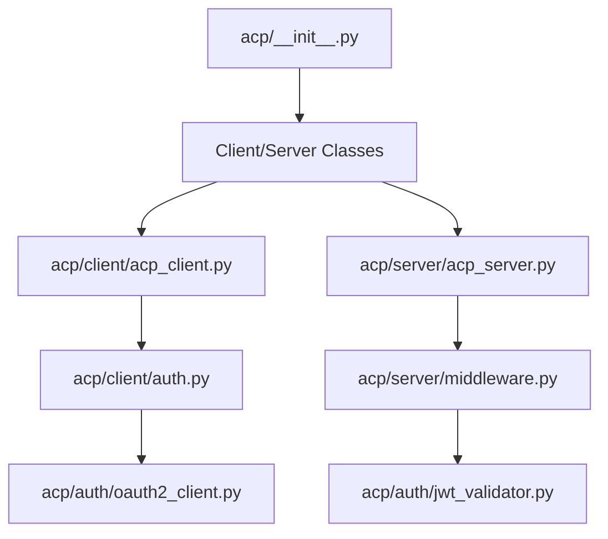
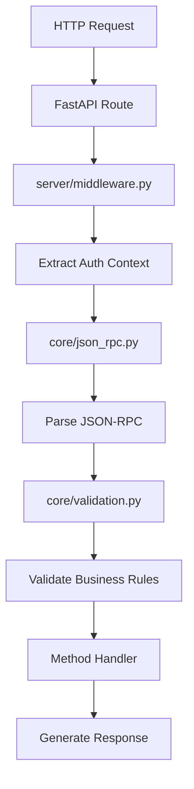

# ACP SDK Python - Architecture Documentation

## 📁 Complete Codebase Structure & Scripts

### Core Directory Structure

| **File Path** | **Size** | **Purpose** | **Layer** |
|---------------|----------|-------------|-----------|
| `acp/__init__.py` | 4.2KB | Main SDK exports and public API | **API Layer** |
| `acp/exceptions.py` | 12KB | Exception definitions and error handling | **Core Layer** |

### 👤 Client Components

| **File Path** | **Size** | **Purpose** | **Layer** |
|---------------|----------|-------------|-----------|
| `acp/client/__init__.py` | 337B | Client module exports | **API Layer** |
| `acp/client/acp_client.py` | 8.2KB | Main ACP client implementation | **Client Layer** |
| `acp/client/auth.py` | 898B | OAuth2 configuration and handler | **Auth Layer** |
| `acp/client/exceptions.py` | 252B | Client-specific exceptions | **Client Layer** |

### 🖥️ Server Components

| **File Path** | **Size** | **Purpose** | **Layer** |
|---------------|----------|-------------|-----------|
| `acp/server/__init__.py` | 84B | Server module exports | **API Layer** |
| `acp/server/acp_server.py` | 9.6KB | Main ACP server implementation | **Server Layer** |
| `acp/server/middleware.py` | 15KB | Authentication and request middleware | **Middleware Layer** |
| `acp/server/decorators.py` | 16KB | Method decorators for auth, validation, etc. | **Decorator Layer** |

### 🔐 Authentication Components

| **File Path** | **Size** | **Purpose** | **Layer** |
|---------------|----------|-------------|-----------|
| `acp/auth/__init__.py` | 580B | Authentication module exports | **API Layer** |
| `acp/auth/oauth2_client.py` | 9.8KB | OAuth2 client credentials flow implementation | **Auth Layer** |
| `acp/auth/jwt_validator.py` | 11KB | JWT token validation with JWKS support | **Auth Layer** |

### 🛠️ Core Processing Engine

| **File Path** | **Size** | **Purpose** | **Layer** |
|---------------|----------|-------------|-----------|
| `acp/core/__init__.py` | 1.1KB | Core module exports | **API Layer** |
| `acp/core/json_rpc.py` | 9.9KB | JSON-RPC 2.0 processor and context | **Protocol Layer** |
| `acp/core/validation.py` | 14KB | Request/response validation and business rules | **Validation Layer** |
| `acp/core/webhooks.py` | 25KB | Webhook registration and delivery system | **Communication Layer** |
| `acp/core/streaming.py` | 21KB | WebSocket streaming and real-time communication | **Communication Layer** |

### 📄 Data Models & Schemas

| **File Path** | **Size** | **Purpose** | **Layer** |
|---------------|----------|-------------|-----------|
| `acp/models/__init__.py` | 1.7KB | Models module exports | **API Layer** |
| `acp/models/generated.py` | 10KB | Generated Pydantic models from OpenAPI spec | **Data Layer** |
| `acp/schemas/acp-schema.yaml` | 17KB | OpenAPI 3.0 specification for ACP protocol | **Schema Layer** |
| `acp/schemas/agent-card.schema.json` | 5.7KB | JSON Schema for agent discovery cards | **Schema Layer** |

### 🧰 Utilities & Support

| **File Path** | **Size** | **Purpose** | **Layer** |
|---------------|----------|-------------|-----------|
| `acp/utils/__init__.py` | 889B | Utils module exports | **API Layer** |
| `acp/utils/testing.py` | 14KB | Testing utilities and mock clients | **Testing Layer** |
| `acp/utils/logging.py` | 18KB | Structured logging and monitoring | **Infrastructure Layer** |
| `acp/utils/schema.py` | 8.8KB | Schema validation and introspection | **Schema Layer** |
| `acp/utils/agent_card.py` | 16KB | Agent discovery card management | **Discovery Layer** |
| `acp/utils/config.py` | 225B | Configuration utilities | **Infrastructure Layer** |

### 🧪 Examples

| **File Path** | **Size** | **Purpose** | **Layer** |
|---------------|----------|-------------|-----------|
| `examples/README.md` | 6.2KB | Documentation and setup guide | **Documentation** |
| `examples/client/basic_client.py` | 5.5KB | Example ACP client implementation | **Example Layer** |
| `examples/server/basic_server.py` | 6.1KB | Example ACP server implementation | **Example Layer** |
| `examples/agent-cards/*.json` | Various | Example agent discovery cards | **Example Layer** |

---

## 🏗️ Folder Structure Rationale

### **Why This Structure?**

#### **1. 🎯 Separation of Concerns**
- **`/client`** - Everything needed to **consume** ACP services
- **`/server`** - Everything needed to **provide** ACP services  
- **`/auth`** - Isolated authentication logic for both client and server
- **`/core`** - Protocol implementation independent of client/server
- **`/models`** - Data structures shared across all components
- **`/utils`** - Supporting utilities that don't fit core business logic

#### **2. 🔄 Dependency Flow**
```
┌─────────────────┐    ┌─────────────────┐
│     Client      │    │     Server      │
│   Components    │    │   Components    │
└─────────┬───────┘    └─────────┬───────┘
          │                      │
          └──────────┬───────────┘
                     │
         ┌───────────▼───────────┐
         │   Auth Components     │
         └───────────┬───────────┘
                     │
         ┌───────────▼───────────┐
         │   Core Components     │
         └───────────┬───────────┘
                     │
         ┌───────────▼───────────┐
         │  Models & Schemas     │
         └───────────┬───────────┘
                     │
         ┌───────────▼───────────┐
         │      Utilities        │
         └───────────────────────┘
```

#### **3. 📦 Modularity**
- Each folder can be **independently tested**
- Components have **clear interfaces**
- **Easy to extend** without affecting other parts
- **Deployment flexibility** (client-only, server-only, or full SDK)

---

## 🔗 How Scripts Connect to Each Other

### **1. 🚀 Initialization Chain**



### **2. 🔐 Authentication Flow**


### **3. 📨 Request Processing Chain**



### **4. 🎯 Component Dependencies**

#### **High-Level Dependencies:**
```python
# Client Side
ACPClient → OAuth2Handler → OAuth2ClientCredentials → JWT Validation

# Server Side  
ACPServer → Middleware → JWT Validator → JSON-RPC Processor → Validation

# Shared
Both → Models → Schemas → Utilities
```

#### **Detailed Import Chain:**
```python
# 1. Main SDK Entry Point
from acp import Client, Server  # from acp/__init__.py

# 2. Client instantiation triggers:
Client → acp/client/acp_client.py 
       → acp/client/auth.py
       → acp/auth/oauth2_client.py
       → acp/models/generated.py

# 3. Server instantiation triggers:
Server → acp/server/acp_server.py
       → acp/server/middleware.py  
       → acp/auth/jwt_validator.py
       → acp/core/json_rpc.py
       → acp/core/validation.py

# 4. All components use:
       → acp/exceptions.py (error handling)
       → acp/utils/* (logging, config, etc.)
```

---

## 🔄 Complete Flow Example

### **Scenario: Client Creates a Task on Remote Agent**

#### **1. 🏁 Client Setup**
```python
# examples/client/basic_client.py
from acp import Client
from acp.auth.oauth2_client import OAuth2ClientCredentials

# 1.1 OAuth2 Token Acquisition
oauth_client = OAuth2ClientCredentials(
    token_url="https://auth0.com/oauth/token",
    client_id="your-client-id", 
    client_secret="your-secret",
    scope="acp:agent:identify acp:tasks:write"
)
token = await oauth_client.get_token()  # → acp/auth/oauth2_client.py

# 1.2 ACP Client Creation  
client = Client(
    base_url="https://remote-agent.com",
    oauth_token=token.access_token  # → acp/client/acp_client.py
)
```

#### **2. 📤 Client Request Flow**
```python
# 2.1 Create Task Request
from acp.models.generated import TasksCreateParams, Message, Part

params = TasksCreateParams(
    initialMessage=Message(
        role="user",
        parts=[Part(type="text", content="Search for documents")]
    )
)

# 2.2 Send Request (internally triggers full chain)
response = await client.tasks.create(params)
```

#### **3. 🔍 Internal Client Processing**
```python
# Inside acp/client/acp_client.py
async def create_task(self, params: TasksCreateParams):
    # 3.1 Prepare JSON-RPC request
    request = {
        "jsonrpc": "2.0", 
        "method": "tasks.create",
        "params": params.model_dump(),
        "id": str(uuid.uuid4())
    }
    
    # 3.2 Add OAuth2 header  
    headers = {"Authorization": f"Bearer {self.oauth_token}"}
    
    # 3.3 Send HTTP request
    response = await self.http_client.post("/jsonrpc", 
                                         json=request, 
                                         headers=headers)
```

#### **4. 🖥️ Server Receiving Request**
```python
# examples/server/basic_server.py → acp/server/acp_server.py
server = Server(agent_name="Document Agent")

@server.route("/jsonrpc")  
async def handle_jsonrpc(request: Request):
    # 4.1 Extract authentication context
    context = await extract_auth_context(request)  # → acp/server/middleware.py
```

#### **5. 🔐 Authentication Processing**
```python
# Inside acp/server/middleware.py
async def extract_auth_context(request: Request):
    # 5.1 Extract Bearer token
    auth_header = request.headers.get("authorization")
    token = auth_header[7:]  # Remove "Bearer "
    
    # 5.2 Validate JWT token
    user_info = await validate_oauth_token(token)  # → acp/auth/jwt_validator.py
    
    # 5.3 Create context
    return JsonRpcContext(
        user_id=user_info["sub"],
        scopes=user_info["scope"].split()
    )
```

#### **6. 🔍 JWT Validation**
```python
# Inside acp/auth/jwt_validator.py  
async def validate_token(self, token: str):
    # 6.1 Fetch JWKS from OAuth provider
    jwks = await self.fetch_jwks()
    
    # 6.2 Validate signature and claims
    payload = jwt.decode(token, jwks, algorithms=["RS256"])
    
    # 6.3 Return normalized claims
    return {
        "sub": payload["sub"],
        "scope": payload.get("scope", ""),
        "exp": payload["exp"]
    }
```

#### **7. 📋 Request Processing**
```python
# Inside acp/core/json_rpc.py
async def process_request(self, request_data, context):
    # 7.1 Parse JSON-RPC request
    request = JsonRpcRequest.model_validate(request_data)
    
    # 7.2 Apply middleware (validation)
    await self.validator(request, context)  # → acp/core/validation.py
    
    # 7.3 Route to handler
    handler = self.handlers[request.method.value]
    result = await handler(request.params, context)
```

#### **8. ✅ Validation & Authorization**
```python
# Inside acp/core/validation.py
async def _validate_business_rules(self, request, context):
    method = request.method.value
    
    # 8.1 Check authentication
    if not context.is_authenticated:
        raise JsonRpcError(AUTHENTICATION_FAILED, "Auth required")
    
    # 8.2 Check basic scope
    if not context.has_scope('acp:agent:identify'):
        raise JsonRpcError(INSUFFICIENT_SCOPE, "Missing acp:agent:identify")
    
    # 8.3 Check method-specific scope
    if method == 'tasks.create':
        if not context.has_scope('acp:tasks:write'):
            raise JsonRpcError(INSUFFICIENT_SCOPE, "Missing acp:tasks:write")
```

#### **9. 🎯 Method Execution**
```python
# Inside examples/server/basic_server.py
@server.method_handler("tasks.create")
async def handle_task_create(params: TasksCreateParams, context):
    # 9.1 Process the task
    task_id = str(uuid.uuid4())
    
    # 9.2 Generate AI response
    ai_response = generate_mock_response(params.initialMessage.parts[0].content)
    
    # 9.3 Return result
    return {
        "task": {
            "taskId": task_id,
            "status": "COMPLETED",
            "result": ai_response
        }
    }
```

#### **10. 📤 Response Chain**
```python
# Response flows back through the chain:
Method Handler → JSON-RPC Processor → FastAPI → HTTP Response
               ↓
Client receives response → Parse JSON-RPC → Return to user code
```

### **🔄 Complete Data Flow Summary**

```
📱 Client App
    ↓ (OAuth2 token + JSON-RPC request)
🌐 HTTP Request  
    ↓
🖥️  Server FastAPI
    ↓ (extract auth context)
🔐 Middleware (OAuth2 validation)
    ↓ (JWT verification)
🔍 JWT Validator
    ↓ (validated context)
📋 Request Validator (scope checking)
    ↓ (authorized request)
⚙️  JSON-RPC Processor
    ↓ (parsed method call)
🎯 Method Handler (business logic)
    ↓ (result)
📤 Response (JSON-RPC response)
    ↓
🌐 HTTP Response
    ↓
📱 Client App (parsed result)
```

---

## 🎯 Key Integration Points

### **1. 🔗 Critical Connections**
- **`acp/__init__.py`** → Central API that imports everything users need
- **`middleware.py`** → Bridge between HTTP and JSON-RPC layers  
- **`json_rpc.py`** → Protocol engine that orchestrates request processing
- **`validation.py`** → Security gatekeeper for all operations
- **`oauth2_client.py` + `jwt_validator.py`** → Complete OAuth2 implementation

### **2. 🎪 Extension Points**
- **`decorators.py`** → Add custom method decorators
- **`webhooks.py`** → Enable push notifications 
- **`streaming.py`** → Add real-time communication
- **`agent_card.py`** → Implement agent discovery

### **3. 🛡️ Security Layers**
```
Request → Middleware → JWT Validation → Scope Validation → Method Handler
         ↑           ↑                 ↑                  ↑
    HTTP Auth    Token Verify     Business Rules    Method Logic
```

This architecture ensures **secure**, **scalable**, and **maintainable** agent-to-agent communication with proper separation of concerns and clear data flow.