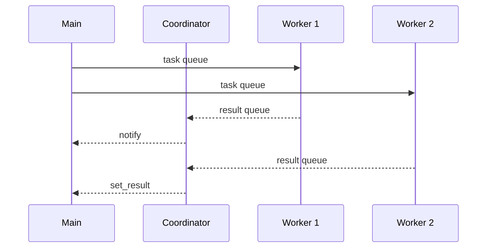

# aiointerpreters
Run CPU bound code in [subinterpreters](https://docs.python.org/3.14/library/concurrent.interpreters.html) using asyncio.

## Installation
Pick the tool of your choosing

```bash
uv add aiointerpreters
uv pip install aiointerpreters
pip install aiointerpreters
poetry add aiointerpreters
pdm add aiointerpreters
pipenv install aiointerpreters
```


## Motivation
The [`concurrent.interpreters`](https://docs.python.org/el/3.15/library/concurrent.interpreters.html) api will be added in Python 3.14.


There are several high level mechanisms to access subinterpreters, such as [`Interpreter.call_in_thread`](https://docs.python.org/3.14/library/concurrent.interpreters.html#concurrent.interpreters.Interpreter.call_in_thread) and  [`InterpreterPoolExecutor`](https://docs.python.org/3.14/library/concurrent.futures.html#interpreterpoolexecutor). But they both come with drawbacks:

- `call_in_thread`: only works for top level functions with no arguments.
- `InterpreterPoolExecutor`: uses pickles to pass data between interpreters similar to `ProcessPoolExecutor`.

There are no simple options to take advantage of the [fast shared memeory](https://docs.python.org/3.14/library/concurrent.interpreters.html#sharing-objects).

## Architecture
We must run the interpreters in threads to achieve parallelism. In order to notify futures in the background we must also have a coordniator thread to handle the results.


