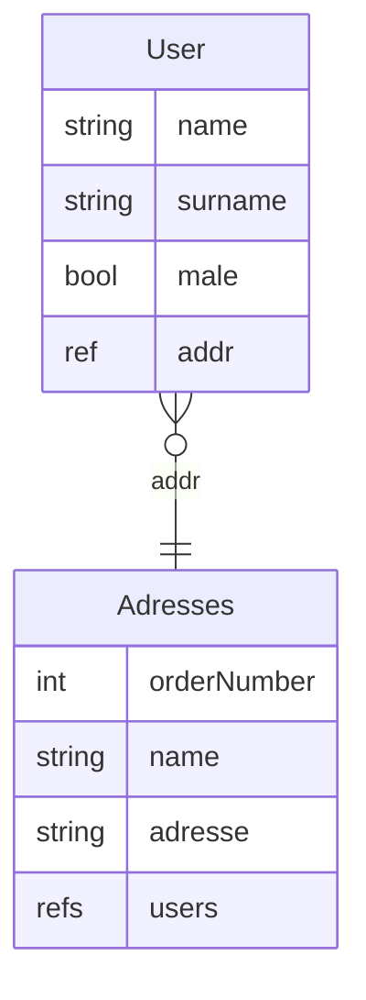
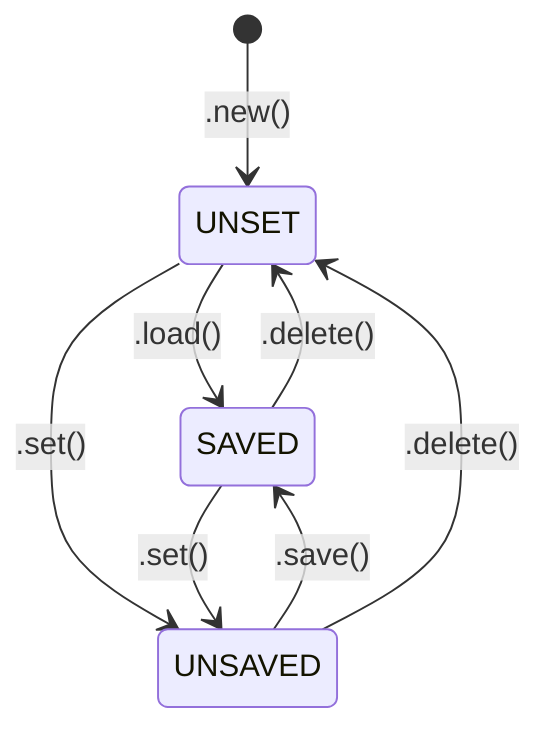

# Back Office Low Code (backo)


 

Backo

The way to use is very simple, see [Quickstart](#quickstart) for a basic setup.

## What is backo


## Installation

```bash
pip install backo # (soon)
```

## Quickstart

Here is a sample with a DB (storage full in yaml file) with users and adresses reference



Becomes in python with backo

```python
from flask import Flask
from backo import Item, DBYmlConnector, Backoffice
from backo import Ref, RefsList, DeleteStrategy

# --- Storage for user
yml_users = DBYmlConnector(path="/tmp")
# --- Storage for addresses
yml_addr = DBYmlConnector(path="/tmp")

# -- Description of the backoffice
my_backoffice = Backoffice("myApp")

# -- Add the collection "users" into this backoffice (with a reference to the futur "addrs" collection)
my_backoffice.add_collection(
    "users",
    Item(
        {
            "name": String(),
            "surname": String(),
            "addr": Ref(coll="addrs", field="$.users", required=True),
            "male": Bool(default=True),
        },
        yml_users,
    ),
)
# -- Add the collection "addrs" into this backoffice (with reference to the "usres" collection)
my_backoffice.add_collection(
    "addrs",
    Item(
        {
            "name": String(),
            "address": String(),
            "users": RefsList(
                coll="users", field="$.addr", ods=DeleteStrategy.MUST_BE_EMPTY
            ),
        },
        yml_addr,
    ),
)


# Your flask application
flask = Flask(__name__)

# -- Add CRUD routes for this application
my_backoffice.add_routes(flask)

```

## Syntax


[backo](https://github.com/bwallrich/backo) use [stricto](https://github.com/bwallrich/stricto) for structured description language.

### Item

```Item```is the main object in backo. It describe an object in the DB with all methodes for CRUD (CReate, Update, Delete). 

A generic object is a [stricto](https://github.com/bwallrich/stricto) ```Dict()``` object.

```Item( description object , db connector )```

example :

```python
# Describe what is a 'cat'
cat = Item(
        {
            "name": String( required=True, default='Felix'),
            "address": String(),
            "age" : Int()
        },
        db_connector_for_cat)

# Add the cat object into the backoffice object
backoffice.add_collection( "cats", cat )
# similar : backoffice.register_collection( "cats", cat )
```

> [!IMPORTANT]  
> At this point, you don't care about [_id](#_id).

| Method | Description |
| - | - |
| ```.create( data :dict )``` | Create an Item into the DB with data in parameters. |
| ```.save()``` | save the Item into the DB |
| ```.load( _id :str )``` | get the Item with the _id from the DB |
| ```.reload()``` | reload the Item from the DB |
| ```.delete()``` | delete the Item in the DB|
| ```.new()``` | create an empty Item (mist be fill with .set() and then .save() |
| ```.select()``` | do a selection of Items from the DB retirn a list of Item |

each function raise errors in something goes wrong

### Ref and RefsList

A ```Ref()``` is a specific type for relation between collections ( aka *tables*).

#### Ref one to many

this is an example with *books* and *authors*

```python
# Authors write books
author = Item({
    'name' : String(),
    'books' : RefsList( coll='book', field="$.autor" )
}, db_connector)

# A book is written by on author
book = Item({
    ... # Some attibutes
    # one or zero to many
    author = Ref( coll='author', field="$.books" )
    # or one to many
    author = Ref( coll='author', field="$.books", required=True )
}, db_connector )
```

| Option for Ref | Default | Description |
| - | - | - |
| ```coll=``` | None | the collection to make the ref |
| ```table=``` | None | similar to ```coll``` |
| ```field=``` | None | The reverse field in the targeted collection (use [selector](https://github.com/bwallrich/stricto?tab=readme-ov-file#selectors) to target it) |
| ```rev=``` | None | similar to ```field``` |
| ```ods=``` | None | *On Delete Strategy* see [ods](#on-delete-strategy-ods)|

And all options availables in [stricto String()](https://github.com/bwallrich/stricto?tab=readme-ov-file#string) fields.


#### On Delete Strategy (ods)

ods define the behaviour of the database when a delete occure and the object contain some ```RefList```. For each  ```RefList```, you can define the strategy :

* ```DeleteStrategy.MUST_BE_EMPTY``` (by default)
This strategy oblige this RefList to be empty first. Otherwise, the delete wil be refused and an Error will be raised.

* ```DeleteStrategy.DELETE_REVERSES_TOO```
This strategy delete all reverse object too. can be dangerous.

* ```DeleteStrategy.CLEAN_REVERSES```
This strategy is often used in *many-to-many* links. This strategy erase this reference on the reverse object

## Routes

Automatic creation route provide the following routes.


### GET /coll/\<collection name\>/\<_id\> \?_view=\<view name\>

```_view``` are defined in [stricto views](https://github.com/bwallrich/stricto?tab=readme-ov-file#views)

Return the object of this collection *by _id*.

```bash
curl -X GET 'http://localhost/myApp/coll/users/123'

# Equivalent (by default _view=client)
curl -X GET 'http://localhost/myApp/coll/users/123?_view=client'

# Another view
curl -X GET 'http://localhost/myApp/coll/users/123?_view=otherviewname'

```
Answers can be :

| code | data | Description |
| - | - | - |
| 200 | json structure of the object | the object |
| 401 | None | you don t have the righe to see this element |
| 404 | None | Element does not exist |
| 500 | None | Crash from the server |

### GET /coll/\<collection name\>?\<query_string\>

Get a list of objects matching the query string. The query string can be with this format

| key | value | description |
| - | - | - |
| \<field\> | \<value\> | example ```surname=donald``` mean i want to select all donald's |
| \<field\>.\<operator\> | \<value\> | example ```age.$lt=12``` mean the *age* field must be less than 12 |
| \<field\>.\<subfield\> | \<value\> | example ```address.number=1``` mean *address* is a nested Dict with *number* attribut |

[list of available operators](https://github.com/bwallrich/stricto?tab=readme-ov-file#filtering-and-matching)

| key | value | description |
| - | - | - |
| \_view | string ( by default "client" ) | example ```_view=short``` is the selection of view. [stricto views](https://github.com/bwallrich/stricto?tab=readme-ov-file#views)  |
| \_page | int | example ```_page=50``` mean the number of element to get |
| \_skip | int | example ```_skip=100``` mean to start at the element 100 of the list. it is for pagination.  |


The result (if no error) is a http 200 with this json object :

```python
{
    "result": # list of dict containing objects matched
    "total": # (int) total number of object matched
    "_view": # the _view given in the request
    "_skip": # the _skip given in the request
    "_page": # the _page given in the request
}

```

examples 
```bash
curl -X GET 'http://localhost/myApp/coll/users/?name.$re=do&_page=10'  # All users name matching "do" 10 per page.

```


### POST /coll/\<collection name\>


Create a new object.

```bash
curl -X POST 'http://localhost/myApp/coll/users/' -d '{"name":"John","surname":"Rambo"}'

```
return the created *user* object with this _id and some _metadatas, or an error


### PUT /coll/\<collection name\>/\<_id\>


Modify an existing object.

```bash
curl -X PUT 'http://localhost/myApp/coll/users/1234' -d '{"name":"Johnny"}'

```
Modify the users with _id *1234* and return the modified object.


### DELETE /coll/\<collection name\>/\<_id\>


Delete an existing object.

```bash
curl -X DELETE 'http://localhost/myApp/coll/users/1234'

```
Delete the users with _id *1234*.


### PATCH /coll/\<collection name\>/\<_id\>


Modify an existing object with [patch method](https://github.com/bwallrich/stricto?tab=readme-ov-file#patch).

```bash
curl -X PATCH  'http://localhost/myApp/coll/users/1234' -d '{"op": "replace", "path" : "$.name", "value": "Gilda"}'

```
Modifythe users with _id *1234* with the patch.

Patch content can be a list of patch operations


## Internal usage

Then usage :

```python
# Create an adress, save it in the DB and provide the object an uniq id.
moon_address = backoffice.addrs.create({"name": "moon", "address": "far"})

# Create a user with this address
astro = backoffice.users.create({"name": "neil", "surname": "amstrong", "addr": moon_address._id})

moon_address.users # -> return []
moon_address.reload() # reload datas from the DB.
moon_address.users # -> return [ astro._id ]

```

### _id

You dont't hate to care of *_ids* in your item description. Backo will alter schema to add _id  for each Item (see [stricto schemas](https://github.com/bwallrich/stricto?tab=readme-ov-file#schemas) for details).

### _meta

the db_connector add meta datas ti each item by [altering schema](https://github.com/bwallrich/stricto?tab=readme-ov-file#schemas).


The provided *meta_data_handler* give this Dict() :

```python
Dict(
    {
        "ctime": Datetime(),
        "mtime": Datetime(),
        "created_by": Dict(
            {"user_id": String(), "login": String()}
        ),
        "modified_by": Dict(
            {"user_id": String(), "login": String()}
        ),
    },
),
```
With associated rights.


## workflow and events

Each Item has a specific workflow and trigg specific events

### workflow

Here is states fir each Item

| State | descripion |
| - | - |
| UNSET | The Item result of a ```.new()``` function. cannot be saved in this state |
| UNSAVED | The Item has some changes and must be saved |
| SAVED | The Item is saved in the DB and no changes since the last save |





### events

Some events are trigged during some functions of the Item.

| function | event before | event after |
| - | - | - |
| .load() |  | "loaded" |
| .save() |"before_save" | "saved" |
| .delete() | "before_delete" |  |
| .create() | None | "created" |

You can use them 

```python
        def rip( event_name, root, me, **kwargs ):
            """
            event_name = "before_delete"
            root = cat Item
            me = cat Item too
            """
            # Do what you want


        cat = Item( {
            'name' : String()
            'birth' : Datetime()
        }
        on=[ ( "before_delete", rip ) ]
        )
```


## Transactions

Soon

## CurrentUser

Soon

## Logs

Log system is based on [logging](https://docs.python.org/3/library/logging.html)

You must first design your logging system with handlers. Then write logs.

### sample use

```python
import logging
from backo import log_system

# To write all file to stderr
log_system.add_handler( log_system.set_streamhandler() )

# To write in a file
log_system.add_handler( log_system.set_filehandler("/var/log/mylog.log") )

# Set the level 
log_system.setLevel( logging.INFO )

# create your own sub logger with its specific logging level
log = log_system.get_or_create_logger("custom")
log.setLevel(loggind.DEBUG)

log.debug("hey this is my first debug message")

```

### advanced use

You can select a specific ```logger``` and modify it by adding/removing handlers and and changing its level.

```python
log = log_system.get_or_create_logger("custom")
log.setLevel(loggind.DEBUG)
log.addHandler ( my_own_handler )
# ...
```

### current loggers


Current availables loggers are :

| logger | description |
| - | - |
| backoffice | The main Backoffice system |
| Item | The database itself (CRUD operations ) |
| ref | Ref and RefsList objects |
| transaction | transactions and roolback |
| yml | yaml database connector |


## Tests & co

For personal use only

```bash
# all tests
python -m unittest tests
# or for a specific test
python -m unittest tests.TestDict.test_simple_type

# reformat
python -m black .

# pylint
pylint $(git ls-files '*.py')

# coverage
coverage run -m unittest tests
coverage html # report under htmlcov/index.html
firefox htmlcov/index.html

```


### Building a new release

For personal use only

```bash
# Modify changelog
# modify pyproject.toml
git add -u
git commit -am 'preparing 0.0.x'
git push
git tag -a 0.0.x -m '0.0.x'
git push origin tag 0.0.x

# publish a new relase in github interface, based on tag 
```