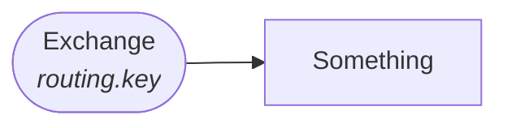
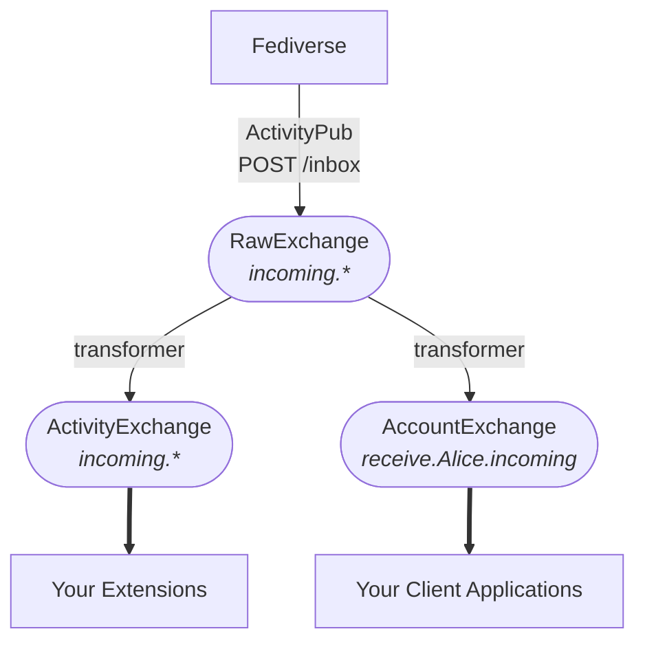

# RabbitMQ Exchanges

cattle_grid uses topic exchanges. This means that every
message has an attached routing key. These have the form
of being separated by a dot `.`, e.g.

```plain
incoming.Follow
```

## Types of Exchange

There are three exchanges used by cattle_grid:

- The __RawExchange__: Handles incoming and outgoing messages as they are transferred to the Fediverse.
- The __ActivityExchange__: You can subscribe to this exchange. Topics are organized by the type of activity, e.g. `incoming.Follow` and `outgoing.Accept`. Furthermore, this exchange is meant to contain the methods, e.g. `send_message` and `update_actor`.
- The __AccountExchange__: This exchange contains the account name as part of the routing key, e.g. `receive.Alice.incoming`.

### Message Flow

In the following, we will denote an exchange using a rounded box
with the exchange name followed by the routing key in italics, e.g.



Square boxes are used to denote other objects. Arrows indicate the
message flow.

#### Incoming messages

We now illustrate what happens when a message is send from an external
Fediverse application to cattle_grid.



## Configuration

The names used for the exchange can be configured via

```toml title="cattle_grid.toml"
activity_pub.internal_exchange = "cattle_grid_internal" # RawExchange
activity_pub.exchange = "cattle_grid" # ActivityExchange
activity_pub.account_exchange = "amq.topic" # AccountExchange
```

where the prescribed values are the default values.

!!! todo
    Harmonize names
