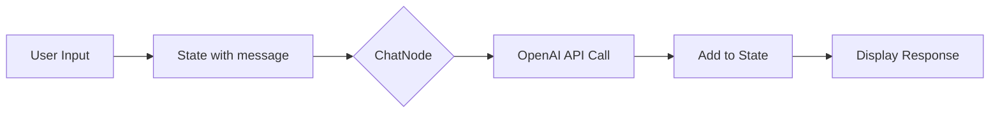
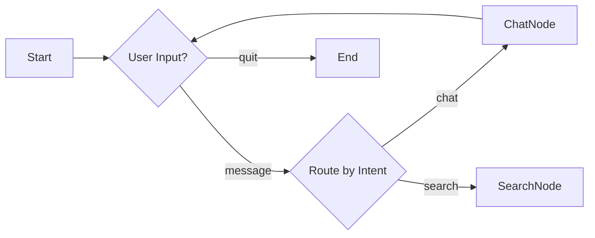

# Creating ClearFlow Examples

This guide explains how to create high-quality examples for ClearFlow that demonstrate production-ready patterns while maintaining educational value.

## Core Principles

1. **Mission-Critical Quality**: Examples must meet the same strict quality standards as the core library
2. **Zero Dependencies in Core**: ClearFlow has zero third-party dependencies; examples manage their own
3. **Educational Yet Production-Ready**: Show real patterns developers can use in production
4. **Self-Contained**: Each example should be independently runnable
5. **First Impressions Matter**: The first/simplest example sets expectations - it must demonstrate value

## Special Considerations for Simple Examples

The first example users see (often the simplest) is critical. It must:
- Answer "Why ClearFlow?" immediately
- Show code organization benefits (nodes, flows, state separation)
- Demonstrate at least one powerful concept (immutability, composition, etc.)
- Provide clear documentation with accurate diagrams
- Avoid over-engineering but hint at extensibility

## Example Structure

Every example should follow this structure:

```
examples/
└── your-example/
    ├── main.py           # Entry point (UI/presentation layer)
    ├── nodes.py          # Node implementations (business logic)
    ├── flow.py           # Flow construction (composition)
    ├── requirements.txt  # Example-specific dependencies
    └── README.md         # Documentation with diagrams
```

## Step-by-Step Guide

### 1. Plan Your Example

Before coding, define:
- **What pattern are you demonstrating?** (e.g., RAG, agents, error handling)
- **What's the minimal working example?** (avoid over-engineering)
- **What dependencies are needed?** (keep minimal)

### 2. Create the Directory

```bash
mkdir examples/your-example
cd examples/your-example
```

### 3. Write the Core Components

#### nodes.py
```python
"""Your example node implementations."""

from dataclasses import dataclass
from typing import Any, override

from clearflow import Node, State, NodeResult

YourState = dict[str, Any]  # Define your state type


@dataclass(frozen=True)
class YourNode(Node[YourState]):
    """Document what this node does."""
    
    # Add any configuration as dataclass fields
    
    @override
    async def exec(self, state: State[YourState]) -> NodeResult[YourState]:
        """Process the state and return result with outcome."""
        # Your logic here
        return NodeResult(state, outcome="completed")
```

#### flow.py
```python
"""Your example flow construction."""

from nodes import YourNode, YourState

from clearflow import Flow, Node


def create_your_flow() -> Node[YourState]:
    """Create and return your example flow."""
    return (
        Flow[YourState]("YourFlowName")
        .start_with(YourNode())
        # Add orchestration if needed: .route(node1, "outcome", node2)
        .build()
    )
```

#### main.py
```python
#!/usr/bin/env python3
"""Main entry point for your example."""

import asyncio

from flow import create_your_flow

from clearflow import State


async def main() -> None:
    """Run your example application."""
    # Create flow
    flow = create_your_flow()
    
    # Initialize state
    initial_state = State({"your_data": "here"})
    
    # Run flow
    result = await flow(initial_state)
    
    # Handle result
    print(f"Result: {result.outcome}")


if __name__ == "__main__":
    asyncio.run(main())
```

**What main.py Should Handle:**
- Application startup and configuration
- User interaction (CLI arguments, prompts)
- Environment setup (API keys, config files)
- Output formatting and display
- Error messages to users
- Application loops and lifecycle

**What main.py Should NOT Handle:**
- Business logic transformations
- Complex decision trees
- API call logic (beyond setup)
- State transformations
- Anything you'd want to unit test

### 4. Define Dependencies

#### requirements.txt
```
# Only include what's needed for this example
# e.g., openai>=1.0.0
```

### 5. Write the README

#### README.md
```markdown
# ClearFlow Your-Example

Brief description of what this example demonstrates.

## 📖 Overview

This example demonstrates:
- Key concept 1
- Key concept 2
- Key concept 3

## 🏃 Quick Start

```bash
# Install dependencies
pip install -r requirements.txt

# Run the example
python main.py
```

## 📁 Files

- `main.py` - Application entry point
- `nodes.py` - Node implementations
- `flow.py` - Flow construction
- `requirements.txt` - Example dependencies
```

## Quality Standards

### Required Checks

Your example MUST pass all quality checks:

```bash
./check-examples.sh
```

This runs:
- **Linting**: Ruff with strict rules (only relaxes: T201 prints, CPY001 copyright, INP001 packages, EXE001 shebang)
- **Formatting**: Ruff format
- **Type Checking**: Both mypy and pyright in strict mode

### Code Standards

1. **Type Everything**: Full type annotations required
2. **Handle Errors**: Show proper error handling patterns
3. **Document Well**: Clear docstrings and comments
4. **Keep It Simple**: Minimal working example, not a framework

### What's Relaxed for Examples

- Print statements (T201) - needed for user interaction
- Copyright notices (CPY001) - not required
- Package markers (INP001) - examples aren't packages
- Shebang executable (EXE001) - convenience not required

Everything else must meet production standards!

## Design Best Practices

### Demonstrating Value (Even in Simple Examples)

Every example, no matter how simple, should answer: "Why use ClearFlow for this?"

**DO:**
- Show how ClearFlow organizes code (separation of nodes, flows, state)
- Demonstrate at least one key concept (immutability, composition, orchestration)
- Include comments about extensibility ("You could add X here")
- Show actual working code, not just abstractions

**DON'T:**
- Create examples that would be simpler without ClearFlow
- Hide the actual implementation behind "run main.py"
- Use overly complex diagrams for simple flows
- Skip interactive demonstrations in notebooks

### State Design
- Use simple types (dict, dataclass) for clarity
- Document the state structure clearly
- Show state transformations explicitly
- Demonstrate immutability with examples

### Node Design
- One clear responsibility per node
- Meaningful outcome names
- Configuration through dataclass fields
- Show how nodes transform state, not just pass it through

### Flow Design
- Clear, linear flows for simple examples
- Show orchestration/branching in advanced examples
- Name flows descriptively
- Explain why a flow is beneficial even with one node

### Routing Requirements (NEW)

ClearFlow now enforces explicit orchestration for all outcomes:

**Key Rules:**
1. **All outcomes must have routes** - No implicit termination
2. **Single termination per flow** - Only one route to `None` allowed
3. **Nested flows don't terminate** - They return outcomes to parent

**Example Patterns:**

```python
# Simple flow with termination
Flow[State]("SimpleFlow")
    .start_with(process)
    .route(process, "success", None)  # Single termination
    .build()

# Loop with explicit exit
Flow[State]("LoopFlow")
    .start_with(chat)
    .route(chat, "continue", chat)     # Loop back
    .route(chat, "exit", None)         # Explicit termination
    .build()

# Multi-path with convergence
Flow[State]("MultiPath")
    .start_with(classifier)
    .route(classifier, "typeA", processA)
    .route(classifier, "typeB", processB)
    .route(processA, "done", cleanup)
    .route(processB, "done", cleanup)
    .route(cleanup, "complete", None)  # Single termination
    .build()

# Nested flow (no termination)
inner_flow = (
    Flow[State]("InnerFlow")
    .start_with(validate)
    .route(validate, "valid", transform)
    # No None routes - outcomes bubble up
    .build()
)

# Parent flow handles termination
Flow[State]("ParentFlow")
    .start_with(inner_flow)
    .route(inner_flow, "success", None)
    .route(inner_flow, "error", None)  # ERROR: Multiple terminations!
    .build()
```

### UI vs Business Logic Separation

ClearFlow is designed for business logic, not UI control flow. Understanding this separation is crucial:

**What belongs in ClearFlow (business logic):**
- Data transformations and processing
- API calls and integrations
- Decision logic with outcomes
- Composable, testable operations
- Async operations that transform state

**What belongs in main.py (UI/presentation layer):**
- User input handling (CLI, web forms, etc.)
- Display/output formatting
- Application lifecycle (start, loop, exit)
- I/O operations (file reading, user prompts)
- Framework-specific code (Flask routes, CLI parsing)

**Example of Good Separation:**
```python
# main.py - Handles UI concerns
while True:
    user_input = input("You: ")  # UI concern
    if user_input.lower() == "quit":  # App lifecycle
        break
    
    # Use ClearFlow for business logic
    result = await chat_flow(state)
    
    print(f"Response: {result}")  # UI concern

# flow.py - Business logic only
Flow[ChatState]("ChatBot")
    .start_with(ChatNode())  # Process message
    .route("chat", "needs_moderation", ModerationNode())
    .build()
```

**Why This Matters:**
- ClearFlow remains testable without UI dependencies
- Business logic can be reused across different UIs (CLI, web, bot)
- Separation of concerns makes code easier to understand
- Each layer can evolve independently

## Testing Your Example

1. **Run Quality Checks**
   ```bash
   ./check-examples.sh
   ```

2. **Test Standalone**
   ```bash
   cd examples/your-example
   pip install -r requirements.txt
   python main.py
   ```


## Mermaid Diagrams Guidelines

### Accuracy is Critical

Your mermaid diagrams must accurately represent what the code does, not what it could do.

**Good Example** (matches implementation):


**Bad Example** (shows non-existent features):


### Diagram Guidelines

1. **Show What Exists**: Only include nodes/flows in your actual code
2. **Use Correct Terms**: "State" not "Data", "Node" not "Step"
3. **Show Transformations**: Indicate how state changes
4. **Keep It Simple**: Better to be clear than comprehensive
5. **Label Outcomes**: Show actual outcome strings from your code

## Common Patterns

### Configuration from Environment
```python
import os
from dotenv import load_dotenv

load_dotenv()

if not os.environ.get("API_KEY"):
    print("Please set API_KEY environment variable")
    return
```

### Interactive Loops
```python
while True:
    user_input = input("You: ")
    if user_input.lower() == "quit":
        break
    
    # Process input through flow
```

### Error Handling
```python
try:
    result = await flow(state)
except Exception as e:
    print(f"Error: {e}")
    # Show recovery pattern
```

## Checklist

Before submitting your example:

- [ ] Follows the standard file structure
- [ ] Passes all quality checks (`./check-examples.sh`)
- [ ] Has clear requirements.txt with minimal dependencies
- [ ] README has clear quick start instructions
- [ ] Demonstrates a single concept clearly
- [ ] Uses production-quality patterns
- [ ] Handles errors appropriately
- [ ] Has meaningful outcome names
- [ ] State structure is documented

## Getting Help

- Review the chat example as a template
- Check existing examples for patterns
- Ensure you understand ClearFlow's functional principles
- Ask in issues if unclear about standards