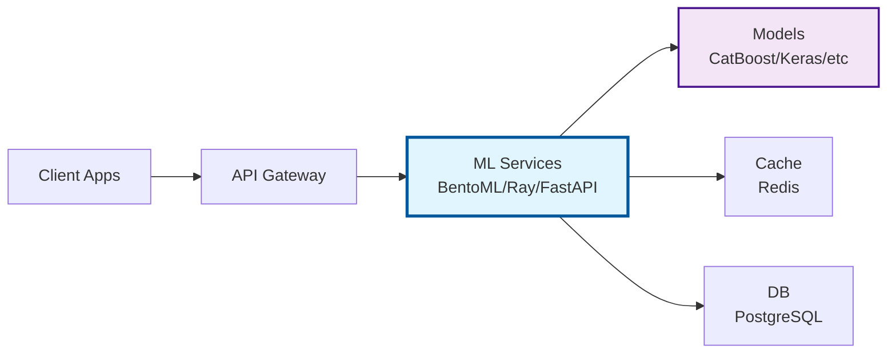

# 🚀 datason

**A comprehensive Python package for intelligent serialization that handles complex data types with ease**

[](https://pypi.org/project/datason/)
[](https://pypi.org/project/datason/)
[](https://pypi.org/project/datason/)
[](https://github.com/danielendler/datason/releases)
[](https://opensource.org/licenses/MIT)
[](https://github.com/danielendler/datason)
[](https://github.com/astral-sh/ruff)
[](https://codecov.io/github/danielendler/datason)
[](https://github.com/danielendler/datason/actions)

🎯 **Perfect Drop-in Replacement for Python's JSON Module** with enhanced features for complex data types and ML workflows. Zero migration effort - your existing JSON code works immediately with smart datetime parsing, type preservation, and advanced serialization capabilities.

> **🔄 Works exactly like `json` module**: Use `import datason.json as json` for perfect compatibility, or `import datason` for enhanced features like automatic datetime parsing and ML type support.

## ✨ Features

### 🎯 **Drop-in JSON Replacement**
- 🔄 **Perfect Compatibility**: Works exactly like Python's `json` module - zero code changes needed
- 🚀 **Enhanced by Default**: Main API provides smart datetime parsing and type detection automatically
- ⚡ **Dual API Strategy**: Choose stdlib compatibility (`datason.json`) or enhanced features (`datason`)
- 🛠️ **Zero Migration**: Existing `json.loads/dumps` code works immediately with optional enhancements

### 🧠 **Intelligent Processing**  
- 🧠 **Smart Type Detection**: Automatically handles pandas DataFrames, NumPy arrays, datetime objects, and more
- 🔄 **Bidirectional**: Serialize to JSON and deserialize back to original objects with perfect fidelity
- 🕒 **Datetime Intelligence**: Automatic ISO 8601 string parsing across Python 3.8-3.11+
- 🛡️ **Type Safety**: Preserves data types and structure integrity with **guaranteed round-trip** serialization

### 🚀 **ML/AI Optimized**
- 🚀 **ML Framework Support**: Production-ready support for 10+ ML frameworks with unified architecture
- ⚡ **High Performance**: Sub-millisecond serialization optimized for ML workloads  
- 🎯 **Simple & Direct API**: Intention-revealing functions (`dump_api`, `dump_ml`, `dump_secure`, `dump_fast`) with automatic optimization
- 📈 **Progressive Loading**: Choose your success rate - `load_basic` (60-70%), `load_smart` (80-90%), `load_perfect` (100%)
- 🏗️ **Production Ready**: Enterprise-grade ML serving with monitoring, A/B testing, and security

### 🔧 **Developer Experience**
- 🔌 **Extensible**: Easy to add custom serializers for your own types
- 📦 **Zero Dependencies**: Core functionality works without additional packages
- 📝 **Integrity Verification**: Hash, sign, and verify objects for compliance workflows
- 📂 **File Operations**: Save and load JSON/JSONL files with compression support

## 🤖 ML Framework Support

datason provides **production-ready integration** for major ML frameworks with consistent serialization:

### **Core ML Libraries**
- 🐼 **Pandas** - DataFrames with schema preservation
- 🔢 **NumPy** - Arrays with dtype and shape preservation  
- 🔥 **PyTorch** - Tensors with exact dtype/shape reconstruction
- 🧠 **TensorFlow/Keras** - Models with architecture and weights
- 🌲 **Scikit-learn** - Fitted models with parameters

### **Advanced ML Frameworks**
- 🚀 **CatBoost** - Models with fitted state and parameter extraction
- 📊 **Optuna** - Studies with trial history and hyperparameter tracking
- 📈 **Plotly** - Interactive figures with data, layout, and configuration
- ⚡ **Polars** - High-performance DataFrames with schema preservation
- 🎯 **XGBoost** - Gradient boosting models (via scikit-learn interface)

### **ML Serving Platforms**
- 🍱 **BentoML** - Production services with A/B testing and monitoring
- ☀️ **Ray Serve** - Scalable deployment with autoscaling
- 🔬 **MLflow** - Model registry integration with experiment tracking
- 🎨 **Streamlit** - Interactive dashboards with real-time data
- 🎭 **Gradio** - ML demos with consistent data handling
- ⚡ **FastAPI** - Custom APIs with validation and rate limiting
- ☸️ **Seldon Core/KServe** - Kubernetes-native model serving

> **Universal Pattern**: All frameworks use the same `get_api_config()` for consistent UUID and datetime handling across your entire ML pipeline.

## 🐍 Python Version Support

datason officially supports **Python 3.8+** and is actively tested on:

- ✅ **Python 3.8** - Minimum supported version (core functionality)
- ✅ **Python 3.9** - Full compatibility  
- ✅ **Python 3.10** - Full compatibility
- ✅ **Python 3.11** - Full compatibility (primary development version)
- ✅ **Python 3.12** - Full compatibility
- ✅ **Python 3.13** - Latest stable version (core features only; many ML libraries still releasing wheels)

### Compatibility Testing

We maintain compatibility through:
- **Automated CI testing** on all supported Python versions with strategic coverage:
  - **Python 3.8**: Core functionality validation (minimal dependencies)
  - **Python 3.9**: Data science focus (pandas integration)
  - **Python 3.10**: ML focus (scikit-learn, scipy)
  - **Python 3.11**: Full test suite (primary development version)
  - **Python 3.12**: Full test suite
  - **Python 3.13**: Core serialization tests only (latest stable)
- **Core functionality tests** ensuring basic serialization works on Python 3.8+
- **Dependency compatibility checks** for optional ML/data science libraries
- **Runtime version validation** with helpful error messages

> **Note**: While core functionality works on Python 3.8, some optional dependencies (like latest ML frameworks) may require newer Python versions. The package will still work - you'll just have fewer optional features available.
>
> **Python 3.13 Caution**: Many machine learning libraries have not yet released official 3.13 builds. Datason runs on Python 3.13, but only with core serialization features until those libraries catch up.

### Python 3.8 Limitations

Python 3.8 users should be aware:
- ✅ **Core serialization** - Full support
- ✅ **Basic types** - datetime, UUID, decimal, etc.
- ✅ **Pandas/NumPy** - Basic DataFrame and array serialization
- ⚠️ **Advanced ML libraries** - Some may require Python 3.9+
- ⚠️ **Latest features** - Some newer configuration options may have limited support

We recommend Python 3.9+ for the best experience with all features.

## 🔄 Drop-in JSON Replacement

**Replace Python's `json` module with zero code changes and get enhanced features automatically!**

### Perfect Compatibility Mode
```python
# Your existing code works unchanged
import datason.json as json

# Exact same API as Python's json module
data = json.loads('{"timestamp": "2024-01-01T00:00:00Z", "value": 42}')
# Returns: {'timestamp': '2024-01-01T00:00:00Z', 'value': 42}

json_string = json.dumps({"key": "value"}, indent=2)
# Works exactly like json.dumps() with all parameters
```

### Enhanced Mode (Automatic Improvements)
```python
# Just use the main datason module for enhanced features
import datason

# Smart datetime parsing automatically enabled
data = datason.loads('{"timestamp": "2024-01-01T00:00:00Z", "value": 42}')
# Returns: {'timestamp': datetime.datetime(2024, 1, 1, 0, 0, tzinfo=timezone.utc), 'value': 42}

# Enhanced serialization with dict output for chaining
result = datason.dumps({"timestamp": datetime.now(), "data": [1, 2, 3]})
# Returns: dict (not string) with smart type handling
```

### Migration Strategy
```python
# Phase 1: Drop-in replacement (zero risk)
import datason.json as json  # Perfect compatibility

# Phase 2: Enhanced features when ready
import datason  # Smart datetime parsing, ML support, etc.

# Phase 3: Advanced features as needed
datason.dump_ml(ml_model)     # ML-optimized serialization
datason.dump_secure(data)     # Automatic PII redaction
datason.load_perfect(data, template)  # 100% accurate reconstruction
```

> **Zero Risk Migration**: Start with `datason.json` for perfect compatibility, then gradually adopt enhanced features when you need them.

## 🏃‍♂️ Quick Start

### Installation

```bash
pip install datason
```

### Production ML Serving - Simple & Direct

```python
import datason as ds
import uuid
from datetime import datetime

# ML prediction data with UUIDs and complex types
prediction_data = {
    "request_id": uuid.uuid4(),
    "timestamp": datetime.now(),
    "features": {"feature1": 1.0, "feature2": 2.0},
    "model_version": "1.0.0"
}

# Simple, direct API with automatic optimizations
api_response = ds.dump_api(prediction_data)  # Perfect for web APIs
# ✅ UUIDs become strings automatically - no more Pydantic errors!

# ML-optimized serialization
import torch
model_data = {"model": torch.nn.Linear(10, 1), "weights": torch.randn(10, 1)}
ml_serialized = ds.dump_ml(model_data)  # Automatic ML optimization

# Security-focused with automatic PII redaction
user_data = {"name": "Alice", "email": "alice@example.com", "ssn": "123-45-6789"}
secure_data = ds.dump_secure(user_data)  # Automatic PII redaction

# Works across ALL ML frameworks with same simple pattern
import bentoml
from bentoml.io import JSON

@svc.api(input=JSON(), output=JSON())
def predict(input_data: dict) -> dict:
    features = ds.load_smart(input_data)  # 80-90% success rate
    prediction = model.predict(features)
    return ds.dump_api({"prediction": prediction})  # Clean API response
```

### Simple & Direct API

```python
import datason as ds
from datetime import datetime
import pandas as pd
import numpy as np

# Complex nested data structure
data = {
    "timestamp": datetime.now(),
    "dataframe": pd.DataFrame({"A": [1, 2, 3], "B": [4, 5, 6]}),
    "array": np.array([1, 2, 3, 4, 5]),
    "nested": {
        "values": [1, 2, {"inner": datetime.now()}]
    }
}

# Simple API with automatic optimization
api_data = ds.dump_api(data)        # Web APIs (UUIDs as strings, clean JSON)
ml_data = ds.dump_ml(data)          # ML optimized (framework detection)
secure_data = ds.dump_secure(data)  # Security focused (PII redaction)
fast_data = ds.dump_fast(data)      # Performance optimized

# Progressive loading - choose your success rate
basic_result = ds.load_basic(api_data)    # 60-70% success, fastest
smart_result = ds.load_smart(api_data)    # 80-90% success, balanced
perfect_result = ds.load_perfect(api_data, template=data)  # 100% with template

# Traditional API still available
serialized = ds.serialize(data)
restored = ds.deserialize(serialized)
```

### Advanced Options - Composable & Flexible

```python
import datason as ds

# Use the main dump() function with options for complex scenarios
large_sensitive_ml_data = {
    "model": trained_model,
    "user_data": {"email": "user@example.com", "preferences": {...}},
    "large_dataset": huge_numpy_array
}

# Combine multiple optimizations
result = ds.dump(
    large_sensitive_ml_data,
    secure=True,           # Enable PII redaction
    ml_mode=True,         # Optimize for ML objects
    chunked=True          # Memory-efficient processing
)

# Or use specialized functions for simple cases
api_data = ds.dump_api(response_data)      # Web API optimized
ml_data = ds.dump_ml(model_data)           # ML optimized
secure_data = ds.dump_secure(sensitive_data)  # Security focused
fast_data = ds.dump_fast(performance_data) # Speed optimized

# Progressive loading with clear success rates
basic_result = ds.load_basic(json_data)    # 60-70% success, fastest
smart_result = ds.load_smart(json_data)    # 80-90% success, balanced
perfect_result = ds.load_perfect(json_data, template)  # 100% with template

# API discovery and help
help_info = ds.help_api()  # Get guidance on function selection
```


## 🏗️ Production Architecture

datason provides a **complete ML serving architecture** with visual documentation:

- **🎯 Universal Integration Pattern**: Single configuration works across all frameworks
- **📊 Comprehensive Monitoring**: Prometheus metrics, health checks, and observability
- **🔒 Enterprise Security**: Input validation, rate limiting, and PII redaction
- **⚡ Performance Optimized**: Sub-millisecond serialization with caching support
- **🔄 A/B Testing**: Framework for testing multiple model versions
- **📈 Production Examples**: Ready-to-deploy BentoML, Ray Serve, and FastAPI services

### Quick Architecture Overview



> **See Full Documentation**: Complete architecture diagrams and production patterns in `docs/features/model-serving/`

## 📚 Documentation

### **Core Documentation**
For full documentation, examples, and API reference, visit: https://datason.readthedocs.io

### **ML Serving Guides**
- 🏗️ **[Architecture Overview](docs/features/model-serving/architecture-overview.md)** - Complete system architecture with Mermaid diagrams
- 🚀 **[Model Serving Integration](docs/features/model-serving/index.md)** - Production-ready examples for all major frameworks
- 🎯 **[Production Patterns](docs/features/model-serving/production-patterns.md)** - Advanced deployment strategies and best practices

### **Production Examples**
- 🍱 **[Advanced BentoML Integration](examples/advanced_bentoml_integration.py)** - Enterprise service with A/B testing and monitoring
- 📊 **[Production ML Serving Guide](examples/production_ml_serving_guide.py)** - Complete implementation with security and observability

> **Quick Start**: Run `python examples/production_ml_serving_guide.py` to see all features in action!

## 🤝 Contributing

We welcome contributions! Please see [CONTRIBUTING.md](CONTRIBUTING.md) for guidelines.

## 📄 License

This project is licensed under the MIT License - see the [LICENSE](LICENSE) file for details.
