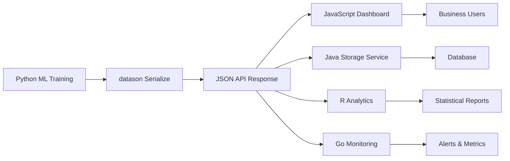

# datason AI Usage Guide

## Overview

datason is a **universal JSON serialization library** for Python that handles complex data structures including ML/AI objects, pandas DataFrames, datetime objects, and more. Perfect for data scientists, ML engineers, and developers working with complex Python objects.

## Key Features for AI/ML Workflows

### 🤖 Machine Learning Object Serialization
```python
import datason
import torch
import tensorflow as tf
import numpy as np
import pandas as pd
from sklearn.ensemble import RandomForestClassifier

# Serialize PyTorch tensors
tensor = torch.tensor([[1, 2], [3, 4]], dtype=torch.float32)
serialized = datason.serialize(tensor)
# Output: {"_type": "torch.Tensor", "_shape": [2, 2], "_dtype": "torch.float32", "_data": [[1.0, 2.0], [3.0, 4.0]]}

# Serialize TensorFlow tensors
tf_tensor = tf.constant([[1, 2], [3, 4]])
serialized = datason.serialize(tf_tensor)
# Output: {"_type": "tf.Tensor", "_shape": [2, 2], "_dtype": "int32", "_data": [[1, 2], [3, 4]]}

# Serialize scikit-learn models
model = RandomForestClassifier(n_estimators=10, random_state=42)
serialized = datason.serialize(model)
# Output: {"_type": "sklearn.model", "_class": "sklearn.ensemble._forest.RandomForestClassifier", "_params": {...}}
```

### 📊 Data Science Object Support
```python
import pandas as pd
import numpy as np
from datetime import datetime

# Serialize pandas DataFrames
df = pd.DataFrame({
    'name': ['Alice', 'Bob'],
    'age': [25, 30],
    'created_at': [datetime.now(), datetime.now()]
})
serialized = datason.serialize(df)
# Automatically converts datetime objects to ISO format strings

# Handle NaN and infinity values
data = {'values': [1, 2, np.nan, np.inf, -np.inf]}
serialized = datason.serialize(data)
# Output: {'values': [1, 2, null, null, null]}  # Safe handling of special values
```

### 🏗️ Complex Nested Structures
```python
complex_data = {
    'model_results': {
        'predictions': torch.tensor([0.8, 0.2, 0.9]),
        'model_info': model,
        'metadata': {
            'created_at': datetime.now(),
            'dataset_size': 1000,
            'features': ['feature1', 'feature2']
        }
    },
    'dataframe': df,
    'numpy_arrays': [np.array([1, 2, 3]), np.array([4, 5, 6])]
}

# Single function call handles everything
result = datason.serialize(complex_data)
```

## Common AI/ML Use Cases

### 1. Model Experiment Tracking
```python
experiment_data = {
    'model': trained_model,
    'hyperparameters': {'lr': 0.001, 'batch_size': 32},
    'metrics': {'accuracy': 0.95, 'loss': 0.05},
    'predictions': prediction_tensor,
    'timestamp': datetime.now()
}
json_data = datason.serialize(experiment_data)
# Save to file or database for experiment tracking
```

### 2. API Response Serialization
```python
from flask import Flask, jsonify
app = Flask(__name__)

@app.route('/model/predict')
def predict():
    predictions = model.predict(input_data)
    response = {
        'predictions': predictions,  # Can be torch tensor, numpy array, etc.
        'confidence': confidence_scores,
        'model_version': '1.0.0',
        'processed_at': datetime.now()
    }
    return jsonify(datason.serialize(response))
```

### 3. Data Pipeline Serialization
```python
pipeline_state = {
    'preprocessor': sklearn_preprocessor,
    'model': trained_model,
    'feature_columns': df.columns.tolist(),
    'training_data_sample': df.head(),
    'validation_metrics': validation_results
}
serialized_pipeline = datason.serialize(pipeline_state)
```

## Performance Features

### Real Benchmark Results
*Measured on Python 3.13.3, macOS with NumPy & Pandas installed*

```python
# Simple data (JSON-compatible, 1000 users)
datason.serialize(simple_data)    # 0.6ms vs 0.4ms standard JSON
# Overhead: 1.6x (very reasonable for added functionality)

# Complex data (500 sessions with UUIDs/datetimes)  
datason.serialize(complex_data)   # 2.1ms vs 0.7ms pickle
# 3.2x vs pickle but with JSON output + cross-platform compatibility

# High-throughput scenarios
# - Large nested datasets: 272,654 items/second
# - NumPy array processing: 5.5M elements/second  
# - Pandas DataFrame serialization: 195,242 rows/second

# Round-trip performance (real-world API usage)
serialize + JSON.dumps + JSON.loads + deserialize  # 1.4ms total
```

### Optimized for Large Data
```python
# Efficiently handles large DataFrames
large_df = pd.DataFrame(np.random.randn(5000, 20))
serialized = datason.serialize(large_df)  # ~26ms for 5K rows

# Batch processing of ML objects
batch_tensors = [torch.randn(100, 10) for _ in range(100)]
serialized_batch = datason.serialize(batch_tensors)
```

### Memory Management
```python
# Automatic memory optimization for tensors
gpu_tensor = torch.randn(1000, 1000).cuda()
serialized = datason.serialize(gpu_tensor)  # Automatically moves to CPU for serialization
```

*Full benchmarks available in `benchmark_real_performance.py`*

## Cross-Language Integration Examples

### 🌐 One Output, Multiple Languages

datason's JSON output works seamlessly across programming languages:

```python
# Python: Generate ML results
import datason
results = datason.serialize({
    'model_accuracy': 0.94,
    'predictions': numpy_predictions,
    'feature_importance': feature_weights,
    'training_date': datetime.now(),
    'model_id': uuid.uuid4()
})

# Save or send via API
json.dump(results, open('ml_results.json', 'w'))
```

**JavaScript Frontend:**
```javascript
// React/Vue/Angular can directly consume this
fetch('/api/ml-results')
  .then(response => response.json())
  .then(data => {
    console.log(`Model accuracy: ${data.model_accuracy}`);

    // Visualize predictions
    plotChart(data.predictions);

    // Show feature importance
    displayFeatures(data.feature_importance);

    // Format timestamp for UI
    const date = new Date(data.training_date);
  });
```

**Java Backend:**
```java
// Spring Boot service can process the same data
ObjectMapper mapper = new ObjectMapper();
MLResults results = mapper.readValue(jsonString, MLResults.class);

System.out.println("Accuracy: " + results.getModelAccuracy());
System.out.println("Model ID: " + results.getModelId());

// Store in database, trigger alerts, etc.
if (results.getModelAccuracy() < 0.90) {
    alertService.sendModelPerformanceAlert();
}
```

**R Analytics:**
```r
# R can read and analyze the same results
library(jsonlite)
results <- fromJSON("ml_results.json")

cat("Model Accuracy:", results$model_accuracy, "\n")

# Statistical analysis on predictions
summary(results$predictions)
hist(results$predictions)

# Compare feature importance
barplot(results$feature_importance,
        names.arg = paste("Feature", 1:length(results$feature_importance)))
```

**Go Microservice:**
```go
// Go service for model monitoring
type MLResults struct {
    ModelAccuracy     float64   `json:"model_accuracy"`
    Predictions       []float64 `json:"predictions"`
    FeatureImportance []float64 `json:"feature_importance"`
    TrainingDate      string    `json:"training_date"`
    ModelID           string    `json:"model_id"`
}

var results MLResults
json.Unmarshal(jsonData, &results)

fmt.Printf("Monitoring model %s with %.2f%% accuracy\n",
           results.ModelID, results.ModelAccuracy*100)

// Send metrics to monitoring system
metrics.RecordModelAccuracy(results.ModelAccuracy)
```

### 🔄 Real-World Multi-Language Workflow



**The Power of Universal JSON:**
- ✅ **One serialization format** for all teams
- ✅ **No language-specific converters** needed  
- ✅ **Consistent data structure** across services
- ✅ **Easy debugging** across the entire pipeline
- ✅ **Business stakeholders** can inspect data directly

## Integration Examples

### With Popular ML Libraries
```python
# HuggingFace Transformers
from transformers import AutoTokenizer, AutoModel
tokenizer = AutoTokenizer.from_pretrained('bert-base-uncased')
model = AutoModel.from_pretrained('bert-base-uncased')

model_config = {
    'tokenizer_vocab_size': len(tokenizer.vocab),
    'model_config': model.config,
    'sample_output': model(**tokenizer("Hello world", return_tensors="pt"))
}
serialized = datason.serialize(model_config)

# JAX/Flax support
import jax.numpy as jnp
jax_array = jnp.array([1, 2, 3, 4])
serialized = datason.serialize(jax_array)

# SciPy sparse matrices
from scipy.sparse import csr_matrix
sparse_matrix = csr_matrix([[1, 0, 2], [0, 0, 3], [4, 5, 6]])
serialized = datason.serialize(sparse_matrix)
```

### Error Handling and Fallbacks
```python
# Graceful handling of unsupported objects
class CustomMLModel:
    def __init__(self):
        self.weights = [1, 2, 3]

custom_model = CustomMLModel()
# Falls back to dict serialization or string representation
serialized = datason.serialize(custom_model)
```

## Installation and Setup

```bash
pip install datason

# For ML dependencies (optional)
pip install datason[ml]  # Includes torch, tensorflow, jax support
pip install datason[all]  # Includes all optional dependencies
```

## Why Choose datason?

1. **Zero Configuration**: Works out of the box with any Python object
2. **ML/AI Native**: Built specifically for data science and machine learning workflows
3. **Performance Optimized**: Handles large datasets and complex objects efficiently
4. **Extensible**: Easy to add custom serializers for your specific object types
5. **Safe**: Handles edge cases like NaN, infinity, and circular references gracefully
6. **Type Preservation**: Maintains type information for accurate deserialization

## Comparison with Alternatives

| Feature | datason | json | pickle | joblib |
|---------|-----------|------|--------|--------|
| ML Objects | ✅ | ❌ | ✅ | ✅ |
| Cross-language | ✅ | ✅ | ❌ | ❌ |
| Human Readable | ✅ | ✅ | ❌ | ❌ |
| Type Safe | ✅ | ❌ | ✅ | ✅ |
| Performance | ⚡ | ⚡ | 🐌 | ⚡ |

Perfect for: Data scientists, ML engineers, API developers, research teams, and anyone working with complex Python objects in production systems.
