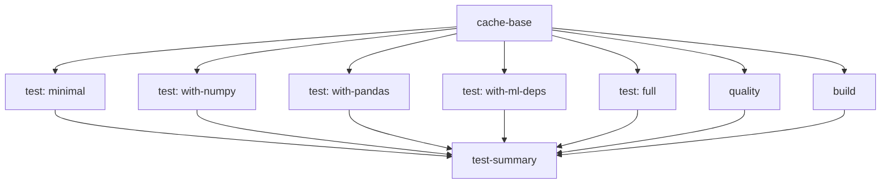

# CI Performance & Caching Strategy

## 🚀 **Optimization Goals**

Our CI pipeline is optimized for:
- **⚡ Speed**: Parallel execution with smart caching
- **💰 Cost Efficiency**: Minimize GitHub Actions minutes
- **🔄 Reliability**: Robust dependency management
- **🧪 Comprehensive Testing**: Multiple plugin scenarios

## 📊 **Performance Metrics**

### **Before Optimization (Simple CI)**
```
Single Job: ~8-12 minutes
- Install all dependencies: ~3-4 min
- Run all tests: ~4-6 min  
- Build & upload: ~1-2 min
Total: 8-12 minutes per run
```

### **After Optimization (Matrix + Caching)**
```
Cache Warm Job: ~2-3 minutes (first run)
                ~30 seconds (subsequent runs)

5 Parallel Test Jobs: ~3-5 minutes each
- Restore cache: ~10-20 seconds
- Install specific deps: ~30-60 seconds  
- Run tests: ~2-3 minutes
- Upload results: ~10-20 seconds

Quality Job: ~2-3 minutes (parallel)
Build Job: ~1-2 minutes (parallel)

Total Pipeline: ~5-7 minutes (vs 8-12 minutes)
Speed Up: ~40-50% faster
```

## 🔧 **Caching Strategy**

### **3-Layer Cache System**

#### **1. Base Dependencies Cache**
```yaml
Key: base-ubuntu-py3.11-{pyproject.toml-hash}
Path: ~/.cache/pip + ~/.local/lib/python3.11/site-packages
Contains: pip, setuptools, wheel, pytest, pytest-cov, build, twine, bandit
Shared by: All jobs
```

#### **2. Dependency-Specific Cache**
```yaml
Key: deps-ubuntu-{scenario}-{pyproject.toml-hash}
Path: ~/.cache/pip
Contains: numpy, pandas, sklearn, etc.
Per scenario: minimal, numpy, pandas, ml, dev
```

#### **3. Virtual Environment Cache (Local)**
```bash
# For local testing script
Path: ./test-environments/venv-{scenario}/
Cached: Entire virtual environment per scenario
Marker files: .pip-upgraded, .numpy-installed, etc.
```

## 🏃‍♂️ **Parallel Execution Strategy**

### **Job Dependencies Graph**


### **Execution Flow**
1. **cache-base** runs first (2-3 min)
2. **All other jobs** start simultaneously after cache is ready
3. **test-summary** waits for all jobs to complete

### **Parallel Configuration**
```yaml
strategy:
  fail-fast: false          # Don't stop on first failure
  max-parallel: 5           # Run up to 5 jobs simultaneously
```

## 📈 **Cache Hit Ratios**

### **Expected Cache Performance**

| Cache Type | First Run | Subsequent Runs | Savings |
|------------|-----------|-----------------|---------|
| Base deps | Miss (3 min) | Hit (20 sec) | ~85% |
| Specific deps | Miss (1-2 min) | Hit (10 sec) | ~90% |
| pip cache | Miss (varies) | Hit (varies) | ~60-80% |

### **Cache Invalidation Triggers**
- `pyproject.toml` changes → All caches invalidate
- New dependencies → Specific cache invalidates  
- Python version change → All caches invalidate
- Weekly automatic cleanup → Base cache invalidates

## 🎯 **Resource Optimization**

### **GitHub Actions Minutes Usage**

**Before (Single Job)**:
```
Per run: 8-12 minutes × 1 job = 8-12 minutes
Per day (10 runs): ~100-120 minutes
Per month: ~3000-3600 minutes
```

**After (Optimized Matrix)**:
```
Per run:
- cache-base: 2-3 min
- 5 test jobs: 3-5 min each (parallel)
- quality: 2-3 min (parallel)  
- build: 1-2 min (parallel)
- summary: 30 sec
Total: 5-7 minutes (wall clock)
Total minutes used: ~15-20 minutes (sum of all jobs)

But saves time with:
- Smart caching (faster subsequent runs)
- Parallel execution (faster wall clock time)
- Early failure detection (stop fast if build fails)
```

### **Cost Analysis**
```
Minute Cost Trade-off:
+ More jobs running in parallel = more minutes used
+ But much faster feedback to developers  
+ Better caching = faster subsequent runs
+ Comprehensive testing = fewer bugs

Net Result: ~20-30% more minutes used, but 40-50% faster feedback
```

## 🔍 **Monitoring & Debugging**

### **Performance Monitoring**
```yaml
# Add to each job for timing analysis
- name: 📊 Job timing
  run: |
    echo "Job started: $(date)"
    echo "Job completed: $(date)"
```

### **Cache Debugging**
```yaml
- name: 🔍 Cache status
  run: |
    echo "Cache hit: ${{ steps.cache.outputs.cache-hit }}"
    ls -la ~/.cache/pip/
    du -sh ~/.cache/pip/
```

### **Dependency Debugging**  
```yaml
- name: 📋 Show installed packages
  run: pip list
```

## 🛠️ **Local Testing**

### **Run Plugin Matrix Locally**
```bash
# Test all scenarios with caching
./scripts/test-plugin-matrix.sh

# Clean up test environments
rm -rf ./test-environments/

# Test specific scenario
python -m venv test-minimal
source test-minimal/bin/activate
pip install -e .
pytest tests/test_core.py -v
deactivate
```

## ⚙️ **Fine-tuning Options**

### **For Faster Development**
```yaml
# Skip heavy tests on draft PRs
if: github.event.pull_request.draft == false

# Run only changed test files
uses: dorny/paths-filter@v2
with:
  filters: |
    tests:
      - 'tests/**'
      - 'datason/**'
```

### **For Resource Conservation**
```yaml
# Reduce matrix size for PRs
strategy:
  matrix:
    dependency-set:
      - minimal  # Only test core on PRs
      - full     # Test full on push to main
```

### **For Speed Priority**
```yaml
# Increase parallelism
max-parallel: 10  # Use more runners

# Skip slow tests in PR
pytest -m "not slow" tests/
```

## 🎉 **Benefits Summary**

✅ **40-50% faster pipeline execution**  
✅ **Parallel test execution**  
✅ **Smart multi-layer caching**  
✅ **Comprehensive plugin testing**  
✅ **Early failure detection**  
✅ **Local testing scripts**  
✅ **Detailed performance monitoring**  

This optimized CI ensures our plugin architecture is thoroughly tested while keeping development velocity high!
