# Dependabot Guide for datason

## 🤖 Overview

Dependabot is GitHub's automated dependency update service that helps keep datason's dependencies current and secure. It automatically scans for outdated dependencies and creates pull requests to update them.

## 🎯 datason's Dependency Strategy

datason follows a **minimal core, modern tooling** philosophy:

- **Core Dependencies**: Minimal to zero - datason works without any required dependencies
- **Optional Dependencies**: Updated conservatively (ML libraries need compatibility testing)
- **Development Dependencies**: Updated aggressively (latest tooling for best developer experience)

## 📋 Dependabot Configuration

### Update Schedules

| Category | Frequency | Target Branch | Rationale |
|----------|-----------|---------------|-----------|
| **Core/Optional Dependencies** | Monthly | `develop` | Conservative updates for stability |
| **Development Dependencies** | Weekly | `develop` | Latest tooling for productivity |
| **GitHub Actions** | Weekly | `develop` | Security and feature updates |
| **Documentation** | Monthly | `develop` | Stability for docs generation |

### Special Handling

#### ML Libraries (Conservative)
```yaml
ignore:
  - dependency-name: "torch"
    update-types: ["version-update:semver-major"]
  - dependency-name: "tensorflow"
    update-types: ["version-update:semver-major"]
  - dependency-name: "jax"
    update-types: ["version-update:semver-major"]
```

**Why?** ML libraries often have breaking changes between major versions and require extensive compatibility testing.

## 🔄 Integration with CI/CD Pipelines

When Dependabot creates a PR, it automatically triggers our CI/CD pipelines:

```mermaid
graph TD
    A[Dependabot Creates PR] --> B[🔍 Quality Pipeline]
    A --> C[🧪 Main CI Pipeline]

    B --> B1[Ruff Linting]
    B --> B2[Security Scanning]
    B --> B3[Pre-commit Checks]

    C --> C1[Multi-Python Testing]
    C --> C2[Coverage Analysis]
    C --> C3[Package Building]
    C --> C4[Optional Dependency Tests]

    B1 --> D{All Checks Pass?}
    B2 --> D
    B3 --> D
    C1 --> D
    C2 --> D
    C3 --> D
    C4 --> D

    D -->|Yes| E[✅ Ready for Review]
    D -->|No| F[❌ Investigation Needed]
```



### Pipeline Validation

1. **Quality Pipeline** (~30-60s)
   - Code formatting with Ruff
   - Security scanning with Bandit
   - Linting and style checks

2. **Main CI Pipeline** (~2-3 min)
   - Tests across Python 3.8-3.13
   - Coverage analysis with Codecov
   - Optional dependency compatibility
   - Package building and validation

## 📝 Reviewing Dependabot PRs

### Automatic Approval Criteria

**Safe to merge automatically** when:
- ✅ All CI pipelines pass
- ✅ Minor/patch version updates
- ✅ Development dependencies (pytest, ruff, mypy, etc.)
- ✅ GitHub Actions updates
- ✅ Documentation dependencies

### Manual Review Required

**Requires investigation** when:
- ❌ CI pipeline failures
- ⚠️ Major version updates
- ⚠️ Core/optional dependency changes
- ⚠️ Security advisories mentioned

### Review Checklist

#### For Development Dependencies
```bash
# Quick verification
git checkout pr-branch
pip install -e ".[dev]"
pytest  # Run tests
ruff check .  # Verify linting
ruff format --check .  # Verify formatting
```

#### For Optional Dependencies
```bash
# Extended testing
pip install -e ".[ml]"  # Install with ML dependencies
pytest tests/test_optional_dependencies.py  # ML integration tests
pytest tests/test_ml_serializers.py  # ML serialization tests
```

#### For Core Dependencies
```bash
# Full regression testing
pip install -e .  # Minimal install
pytest  # All tests should pass
pytest --cov=datason --cov-fail-under=80  # Coverage check
```

## 🚀 Common Dependabot Scenarios

### Scenario 1: Weekly Dev Dependency Updates

**Example PR**: "Bump ruff from 0.1.6 to 0.1.8"

**Action**:
1. Verify CI passes ✅
2. Auto-merge if no breaking changes
3. Monitor for any formatting conflicts

### Scenario 2: Monthly ML Library Update

**Example PR**: "Bump torch from 2.0.0 to 2.1.0"

**Action**:
1. Review release notes for breaking changes
2. Run extended ML tests locally
3. Test with major ML frameworks
4. Manual merge after validation

### Scenario 3: GitHub Actions Security Update

**Example PR**: "Bump actions/checkout from v3 to v4"

**Action**:
1. Verify no workflow syntax changes needed
2. Check CI pipeline compatibility
3. Auto-merge if tests pass

### Scenario 4: Major Version Update

**Example PR**: "Bump pytest from 7.4.0 to 8.0.0"

**Action**:
1. Read migration guide
2. Check for pytest plugin compatibility
3. Run full test suite
4. Update configurations if needed
5. Manual merge after thorough testing

## 🔧 Managing Dependabot

### Enabling/Disabling Updates

```bash
# Temporarily pause all updates
gh api repos/:owner/:repo/vulnerability-alerts -X DELETE

# Re-enable updates
gh api repos/:owner/:repo/vulnerability-alerts -X PUT
```

### Customizing Update Frequency

Edit `.github/dependabot.yml`:
```yaml
schedule:
  interval: "daily"    # daily, weekly, monthly
  day: "monday"        # For weekly/monthly
  time: "09:00"        # UTC time
```

### Ignoring Specific Updates

```yaml
ignore:
  - dependency-name: "problematic-package"
    versions: ["2.0.0"]  # Ignore specific version
  - dependency-name: "another-package"
    update-types: ["version-update:semver-major"]  # Ignore major updates
```

## 📊 Monitoring and Metrics

### Security Alerts

Dependabot automatically creates security advisories PRs for:
- Known vulnerabilities
- Outdated packages with security fixes
- Dependencies with security patches

### Update Statistics

Track update patterns:
- **Development deps**: ~3-5 PRs/week (expected)
- **Optional deps**: ~1-2 PRs/month (manageable)
- **GitHub Actions**: ~1 PR/week (security-focused)

## 🚨 Troubleshooting

### Common Issues

#### 1. CI Failures After Update

**Symptom**: Tests fail after dependency update
**Solution**:
```bash
# Check for breaking changes
git log --oneline dependency-name
# Review release notes
# Update code/tests as needed
```

#### 2. Conflicting PRs

**Symptom**: Multiple Dependabot PRs conflict
**Solution**:
```bash
# Merge compatible updates first
# Close conflicting PRs (Dependabot will recreate)
# Handle major updates separately
```

#### 3. Pre-commit Conflicts

**Symptom**: Formatting issues after updates
**Solution**:
```bash
pre-commit autoupdate  # Update hook versions
pre-commit run --all-files  # Fix formatting
```

## 🎉 Benefits for datason

### Security
- **Automated vulnerability patching**
- **Security advisory notifications**
- **Dependency audit trail**

### Maintenance
- **Reduced manual dependency management**
- **Consistent update cadence**
- **Breaking change notifications**

### Quality
- **CI validation of all updates**
- **Regression testing automation**
- **Compatibility verification**

### Productivity
- **Latest developer tooling**
- **Automated routine updates**
- **Focus on feature development**

---

## 📚 Related Documentation

- [Contributing Guide](community/contributing.md)
- [CI/CD Pipeline](CI_PIPELINE_GUIDE.md)
- [Security Policy](community/security.md)
- [Release Management](RELEASE_MANAGEMENT.md)

---

> 💡 **Tip**: Enable GitHub notifications for Dependabot PRs to stay informed about important security updates and dependency changes.

## ⚙️ **Configuration Overview**

datason uses a **unified Dependabot strategy** with smart update rules:

### **📦 Python Dependencies**
- **Schedule**: Weekly updates every Monday
- **Target**: `main` branch (for faster integration)
- **Strategy**: Unified configuration for all Python packages
- **Conservative approach** for ML/data science libraries
- **Aggressive updates** for development tools

### **🔄 GitHub Actions**
- **Schedule**: Weekly updates every Tuesday  
- **Target**: `main` branch
- **Updates**: All workflow actions and runners

### **🎯 Smart Update Strategy**

#### **Conservative Updates (Major Versions Blocked)**
```yaml
# ML Libraries - Careful version management
- torch, tensorflow, jax, scikit-learn
- pandas, numpy  # Core data science
```

#### **Aggressive Updates (All Versions)**
```yaml
# Development tools get latest versions
- pytest, ruff, mypy, bandit
- mkdocs, mkdocstrings  # Documentation
- pre-commit hooks
```
