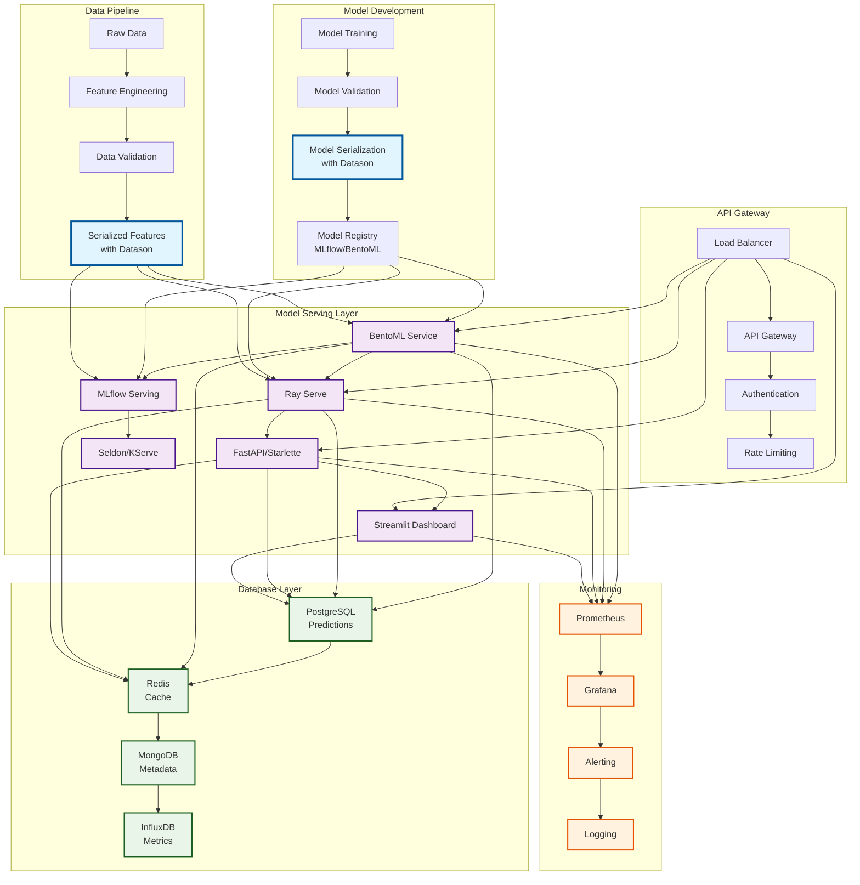
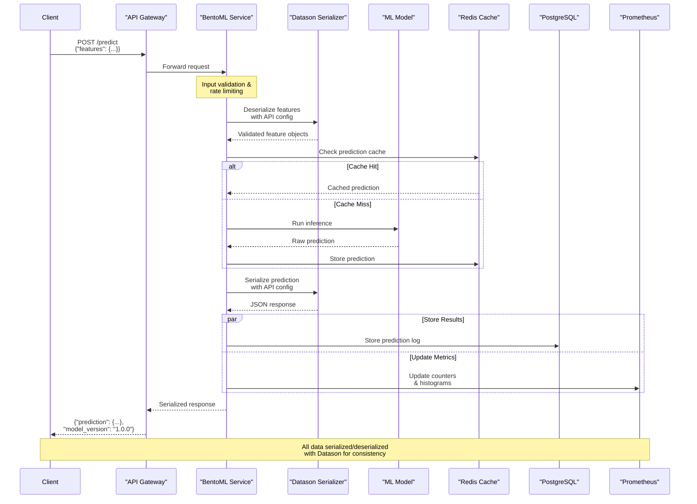
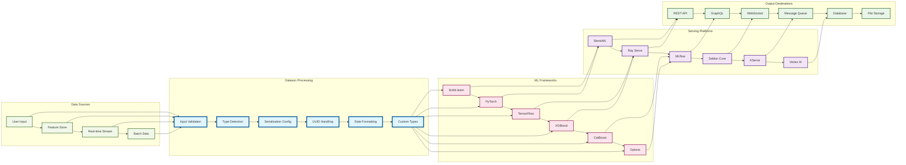
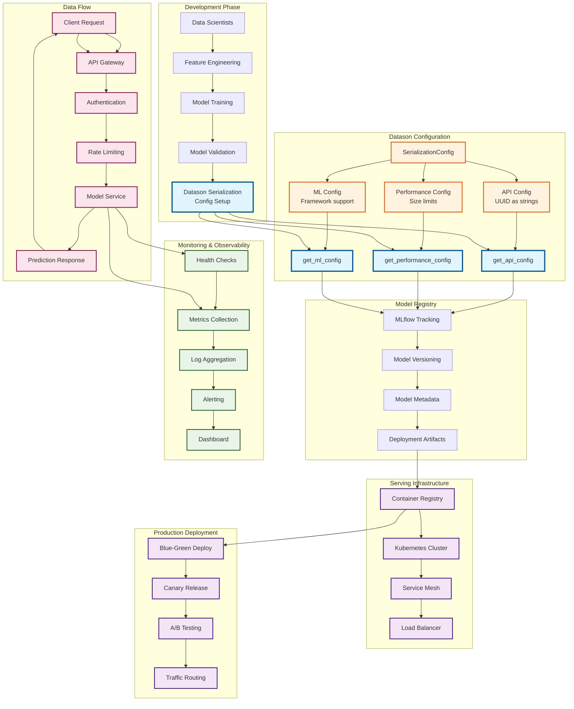
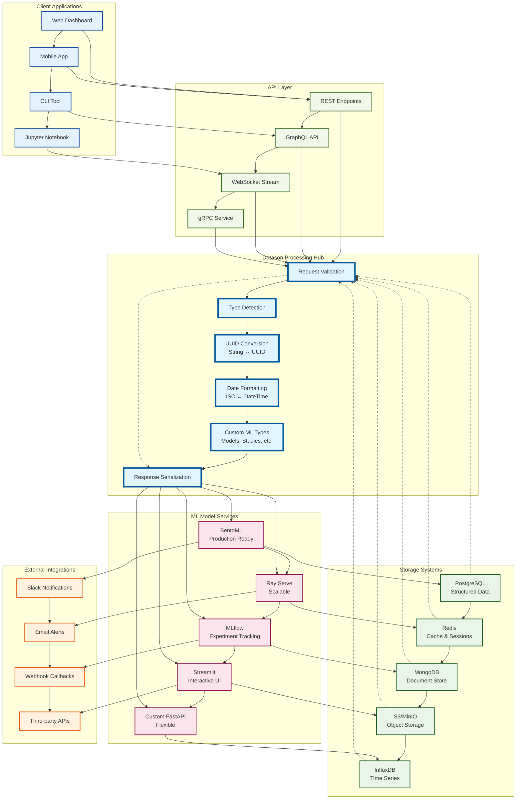

# ML Model Serving Architecture with Datason

This document provides a comprehensive overview of how datason integrates across the entire machine learning model serving pipeline, from development to production deployment.

## Table of Contents

1. [Overview](#overview)
2. [High-Level Architecture](#high-level-architecture)
3. [Data Flow Sequence](#data-flow-sequence)
4. [Framework Integration](#framework-integration)
5. [Production Deployment](#production-deployment)
6. [End-to-End Data Flow](#end-to-end-data-flow)
7. [Key Benefits](#key-benefits)
8. [Implementation Examples](#implementation-examples)

## Overview

Datason serves as the universal serialization layer that ensures consistent data handling across all components of your ML serving infrastructure. It eliminates the common pain points of:

- **Type Inconsistencies**: UUID strings vs objects, datetime formats, custom ML types
- **Framework Incompatibilities**: Different serialization formats between frameworks
- **API Integration Issues**: Pydantic model validation failures
- **Data Pipeline Breaks**: Inconsistent data formats between services

## High-Level Architecture

The following diagram shows how datason integrates across the entire ML serving ecosystem:



### Key Components

- **Model Development**: Datason ensures consistent serialization of trained models and metadata
- **Data Pipeline**: Features and predictions are serialized consistently across all pipeline stages
- **Serving Layer**: All ML frameworks use the same datason configuration for API compatibility
- **Storage**: Consistent data formats across different database systems
- **Monitoring**: Standardized metrics and logging formats

## Data Flow Sequence

This sequence diagram shows how a typical prediction request flows through the system:



### Critical Points

1. **Single Configuration**: All services use the same datason API configuration
2. **Type Safety**: UUIDs, dates, and custom types are handled consistently
3. **Performance**: Caching works reliably due to consistent serialization
4. **Monitoring**: Metrics are comparable across all services

## Framework Integration

Datason acts as the universal adapter between different ML frameworks and serving platforms:



### Framework-Specific Benefits

- **Scikit-learn**: Seamless integration with Pydantic models
- **PyTorch**: Consistent tensor serialization across services
- **TensorFlow**: SavedModel compatibility with API layers
- **XGBoost/CatBoost**: Model metadata preservation
- **Optuna**: Study and trial serialization for experiment tracking

## Production Deployment

The production deployment architecture shows how datason configurations flow through the entire deployment pipeline:



### Deployment Best Practices

1. **Configuration Management**: Use environment-specific datason configs
2. **Version Control**: Track serialization configs with model versions
3. **Testing**: Validate serialization compatibility in CI/CD
4. **Monitoring**: Track serialization performance and errors

## End-to-End Data Flow

This comprehensive diagram shows how data flows through the entire ecosystem:



## Key Benefits

### 1. **Consistency Across Services**
- All services use the same serialization format
- UUIDs are consistently handled as strings in APIs
- Dates follow ISO format standards
- Custom ML types are preserved across frameworks

### 2. **Reduced Integration Complexity**
- No more Pydantic validation errors
- Seamless data exchange between services
- Simplified debugging and troubleshooting
- Consistent error handling

### 3. **Performance Optimization**
- Efficient caching due to consistent serialization
- Reduced data transformation overhead
- Optimized for ML workloads
- Configurable performance limits

### 4. **Developer Experience**
- Single configuration for all services
- Clear documentation and examples
- Type safety and validation
- Easy debugging and monitoring

## Implementation Examples

### Basic Configuration

```python
from datason import get_api_config, serialize, deserialize

# Use the standard API configuration
config = get_api_config()

# Serialize data for API responses
response_data = serialize(prediction_result, config=config)

# Deserialize incoming requests
features = deserialize(request_data, config=config)
```

### Framework Integration

```python
# BentoML Service
import bentoml
from datason import get_api_config

config = get_api_config()

@svc.api(input=JSON(), output=JSON())
def predict(input_data: dict) -> dict:
    features = deserialize(input_data["features"], config=config)
    prediction = model.predict(features)
    return serialize({"prediction": prediction}, config=config)
```

### Production Monitoring

```python
from datason import get_api_config
from prometheus_client import Counter, Histogram

config = get_api_config()
request_counter = Counter('predictions_total', ['model_version', 'status'])
latency_histogram = Histogram('prediction_latency_seconds')

@latency_histogram.time()
def predict_with_monitoring(features):
    try:
        result = model.predict(features)
        request_counter.labels(model_version="1.0.0", status="success").inc()
        return serialize(result, config=config)
    except Exception as e:
        request_counter.labels(model_version="1.0.0", status="error").inc()
        raise
```

## Next Steps

1. **Review the [Production Patterns Guide](production-patterns.md)** for detailed implementation patterns
2. **Explore [Framework-Specific Examples](index.md)** for your ML serving platform
3. **Set up monitoring** using the patterns shown in the architecture
4. **Implement A/B testing** with consistent serialization across model versions
5. **Scale your deployment** using the production-ready patterns

## Related Documentation

- [Model Serving Integration Guide](index.md)
- [Production Patterns](production-patterns.md)
- [API Integration Guide](../api-integration.md)
- [Configuration Reference](../configuration/index.md)
