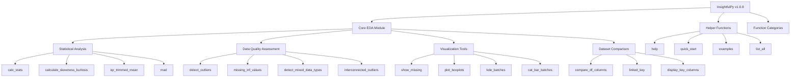
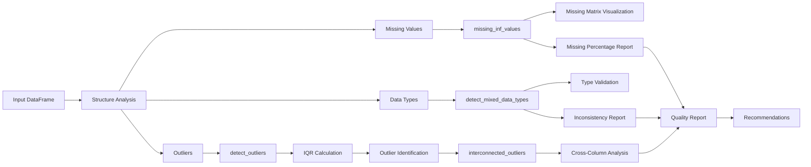
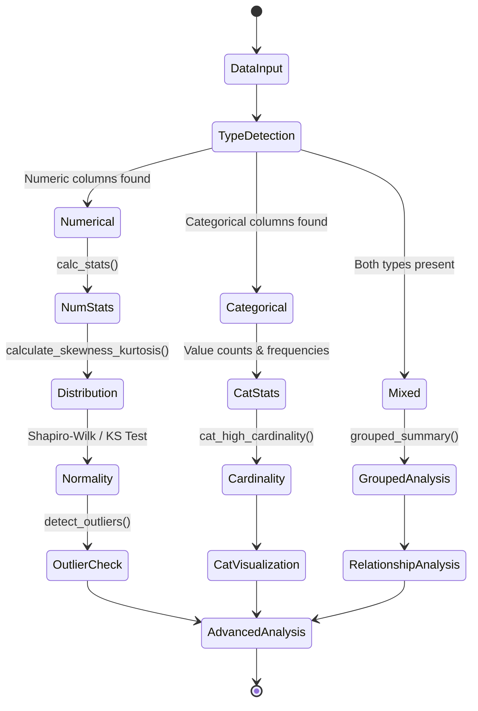
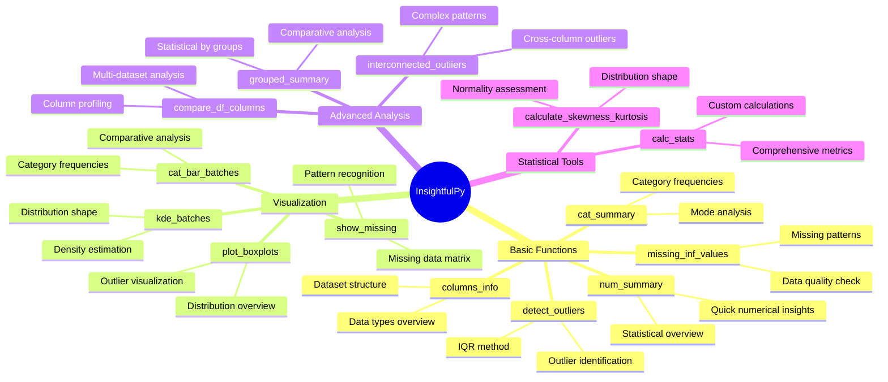
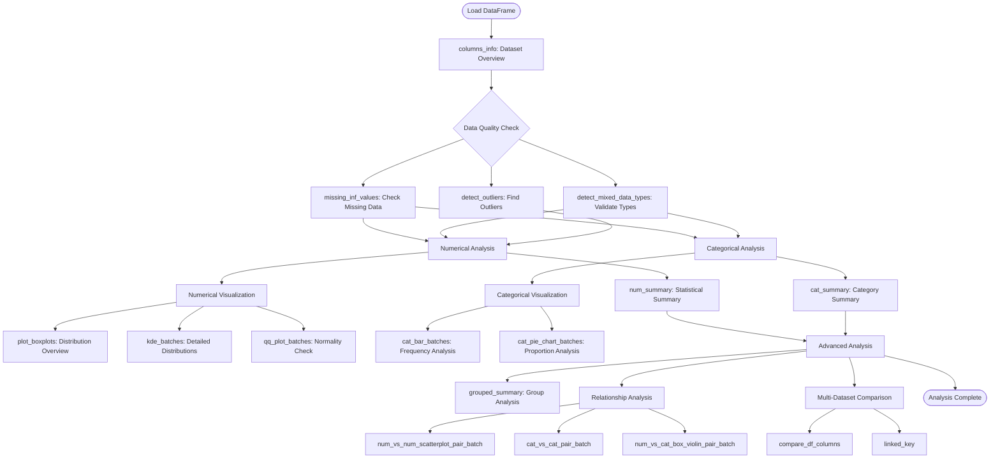
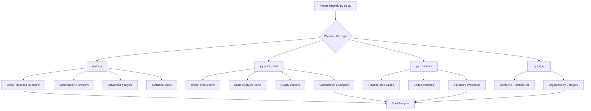

# InsightfulPy Documentation

InsightfulPy is a comprehensive Python package designed to make exploratory data analysis straightforward and thorough. Whether you're a data scientist, analyst, or researcher, this toolkit helps you understand your data quickly and effectively.

## Quick Navigation

### Getting Started
- [Installation Guide](SETUP.md) - How to install and verify InsightfulPy
- [User Guide](USER_GUIDE.md) - Complete workflow tutorial with examples
- [API Reference](API_REFERENCE.md) - Detailed function documentation

### Development
- [Contributing Guidelines](CONTRIBUTING.md) - How to contribute to the project

### Examples
- [Comprehensive Example](../examples/comprehensive_example.ipynb) - Full workflow notebook
- [Quick Examples](../examples/) - Additional usage examples

## What is InsightfulPy?

InsightfulPy streamlines the exploratory data analysis process by providing intuitive functions that work with any pandas DataFrame. Instead of writing dozens of lines of code for basic analysis, you can get comprehensive insights with just a few function calls.

**Package Architecture:**



### Core Features

**Data Quality Assessment**



- Missing value analysis and visualization
- Outlier detection using statistical methods
- Data type validation and mixed type detection
- Quality reports with actionable insights

**Statistical Analysis**



- Comprehensive descriptive statistics
- Distribution analysis with skewness and kurtosis
- Normality testing and custom metrics
- Grouped analysis by categorical variables

**Intelligent Visualization**
- Automatic plot generation for different data types
- Batch processing for large datasets
- Publication-ready charts and graphs
- Relationship analysis between variables

**Advanced Features**
- Multi-dataset comparison tools
- Individual column deep-dive analysis
- Cross-column outlier detection
- Custom statistical functions

### Why Choose InsightfulPy?

1. **Simple to Use**: Functions have intuitive names and clear documentation
2. **Professional Output**: Charts and reports are ready for presentations
3. **Handles Scale**: Batch processing works with datasets of any size
4. **Flexible**: Works with any pandas DataFrame structure
5. **Complete**: Covers the entire EDA workflow from start to finish

## Quick Start

```python
import pandas as pd
import insightfulpy as ipy

# Load your data
df = pd.read_csv('your_data.csv')

# Get immediate help
ipy.help()           # Overview of all functions
ipy.quick_start()    # Step-by-step tutorial

# Basic analysis in three lines
ipy.columns_info('My Dataset', df)
ipy.num_summary(df)
ipy.cat_summary(df)

# Check data quality
ipy.missing_inf_values(df, missing=True)
ipy.detect_outliers(df)
ipy.show_missing(df)

# Create visualizations
ipy.plot_boxplots(df)
ipy.kde_batches(df, batch_num=1)
```

## Function Categories



### Essential Functions
These are the functions you'll use most often:
- `num_summary()` - Statistical overview of numerical columns
- `cat_summary()` - Analysis of categorical columns  
- `columns_info()` - Dataset structure and overview
- `missing_inf_values()` - Data quality assessment
- `detect_outliers()` - Find outliers using IQR method

### Visualization Functions
Create professional charts and plots:
- `show_missing()` - Visualize missing data patterns
- `plot_boxplots()` - Box plots for all numerical columns
- `kde_batches()` - Density plots organized in batches
- `cat_bar_batches()` - Bar charts for categorical data
- `qq_plot_batches()` - Assess normality with Q-Q plots

### Advanced Analysis
For deeper insights and complex analysis:
- `grouped_summary()` - Statistics grouped by categories
- `num_vs_num_scatterplot_pair_batch()` - Explore correlations
- `cat_vs_cat_pair_batch()` - Categorical relationships
- `compare_df_columns()` - Compare multiple datasets
- `interconnected_outliers()` - Find outliers across columns

### Statistical Tools
Mathematical utilities for custom analysis:
- `calc_stats()` - Comprehensive statistical metrics
- `calculate_skewness_kurtosis()` - Distribution characteristics
- `iqr_trimmed_mean()` - Robust measures of central tendency
- `mad()` - Mean absolute deviation

## Typical Workflow

Most analyses follow this general pattern:



## Built-in Help System



InsightfulPy includes comprehensive help that you can access anytime:

```python
import insightfulpy as ipy

# Function overview organized by category
ipy.help()

# Step-by-step tutorial with examples
ipy.quick_start()

# Real-world usage examples
ipy.examples()

# Complete list of all functions
ipy.list_all()
```

## Documentation Structure

The documentation is organized to help you find what you need quickly:

```
docs/
├── README.md              # This overview (start here)
├── SETUP.md              # Installation instructions
├── USER_GUIDE.md         # Complete tutorial with examples
├── API_REFERENCE.md      # Detailed function documentation
└── CONTRIBUTING.md       # How to contribute to the project
```

## Performance Tips

**For Large Datasets:**
- Use `df.sample(n=10000)` for initial exploration
- Process visualizations in batches using batch_num parameter
- Focus on specific columns when needed
- Monitor memory usage with large files

**For Better Results:**
- Always start with data quality checks
- Use batch processing for cleaner visualizations
- Try different groupings to find patterns
- Document your findings as you go

## Getting Help

If you need assistance:

- **Function Help**: Use `help(ipy.function_name)` for specific functions
- **GitHub Issues**: Report bugs or request features
- **Discussions**: Ask questions in GitHub Discussions
- **Email**: Contact the maintainer at dhaneshbb5@gmail.com

## Support the Project

InsightfulPy is open source and welcomes contributions:
- Report bugs and suggest features
- Contribute code improvements
- Help improve documentation
- Share your analysis examples

## License

InsightfulPy is released under the MIT License, making it free for both personal and commercial use.

---

InsightfulPy makes exploratory data analysis comprehensive, intuitive, and professional. Whether you're just starting with data analysis or you're an experienced practitioner, these tools help you understand your data better and communicate your findings effectively.