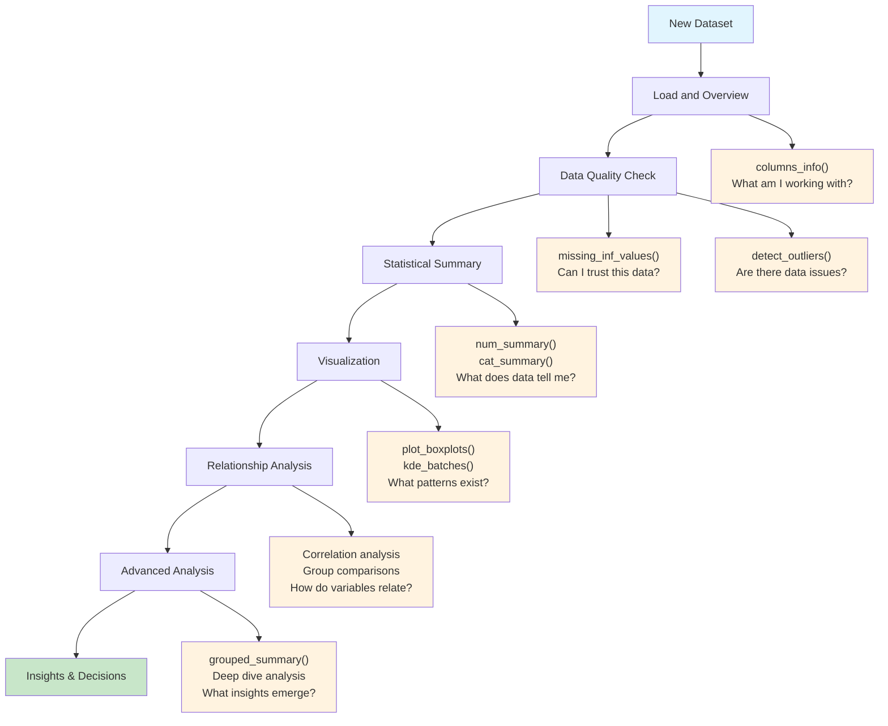
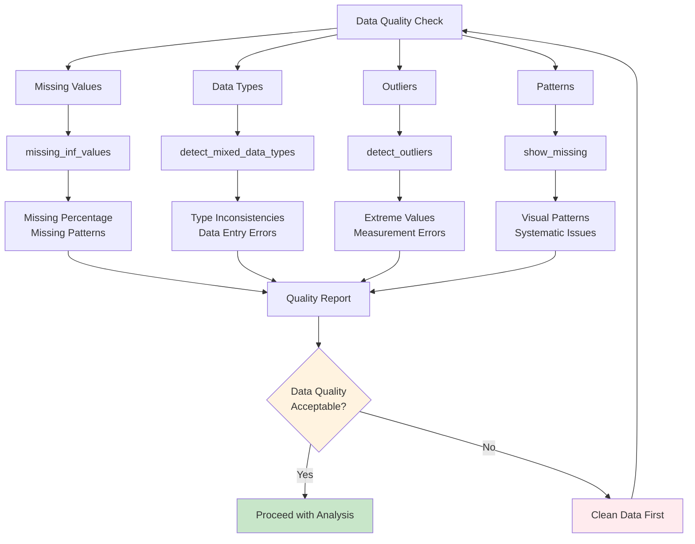
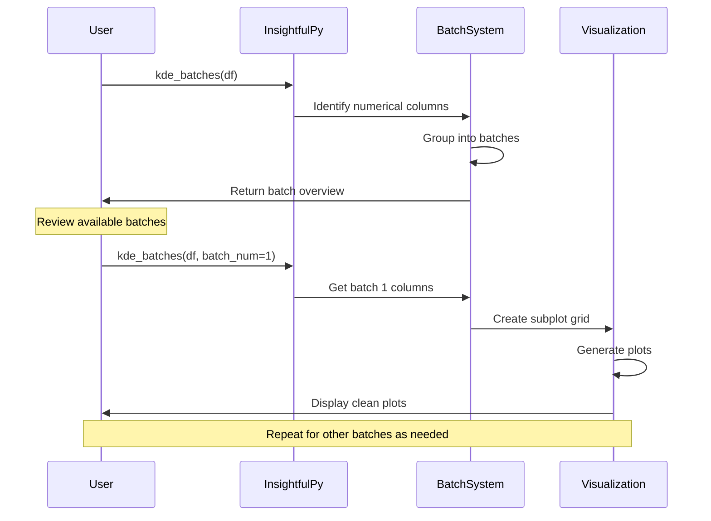

# InsightfulPy User Guide

## Getting Started

This guide walks you through everything you need to know to use InsightfulPy effectively. We'll start with the basics and work up to advanced analysis techniques that will help you understand your data thoroughly.

## The Data Analysis Process

When you first get a new dataset, it can be overwhelming to know where to start. InsightfulPy follows a logical progression that experienced data analysts use:



1. **Load and Overview** - What am I working with?
2. **Data Quality Check** - Can I trust this data?
3. **Statistical Summary** - What does the data tell me?
4. **Visualization** - What patterns can I see?
5. **Relationship Analysis** - How do variables relate to each other?
6. **Advanced Analysis** - What deeper insights can I find?

Let's walk through each step with practical examples.

## Step 1: Load and Overview Your Data

Start every analysis by understanding what you're working with:

```python
import pandas as pd
import insightfulpy as ipy

# Load your dataset
df = pd.read_csv('your_data.csv')

# Get a quick overview
ipy.columns_info('My Dataset', df)
```

This function gives you the essential information you need right away:
- How many rows and columns you have
- What data types you're dealing with
- Value ranges for numerical data
- How many unique values are in each column

Think of this as your first impression of the data. You'll immediately see if you have the columns you expect, if the data types make sense, and if there are any obvious issues.

## Step 2: Data Quality Assessment

Before diving into analysis, you need to know if your data is reliable. Poor quality data leads to poor insights, so this step is critical:



```python
# Check for missing values and infinite values
ipy.missing_inf_values(df, missing=True, inf=True)

# Visualize patterns in missing data
ipy.show_missing(df)

# Look for columns with mixed data types
ipy.detect_mixed_data_types(df)

# Find outliers that might be data entry errors
outliers = ipy.detect_outliers(df)
print(outliers)
```

Here's what to watch out for:
- **Missing values over 20%** usually need special attention
- **Patterns in missing data** might indicate systematic issues
- **Mixed data types** often mean data entry problems
- **Excessive outliers** could indicate measurement or entry errors

Don't skip this step. It's better to identify data quality issues early than to discover them after you've spent hours on analysis.

## Step 3: Statistical Summary

Now you can start understanding what your data actually contains:

```python
# Analyze numerical columns
num_stats = ipy.num_summary(df)
print(num_stats)

# Analyze categorical columns  
cat_stats = ipy.cat_summary(df)
print(cat_stats)

# Understand distribution shapes
dist_stats = ipy.calculate_skewness_kurtosis(df)
print(dist_stats)
```

Pay attention to these key indicators:
- **Mean vs median** - If they're very different, your data is skewed
- **Standard deviation** - Shows how spread out your values are
- **Skewness** - Values over 1 or under -1 indicate highly skewed distributions
- **Kurtosis** - Values over 3 suggest heavy-tailed distributions

These statistics help you choose the right analysis methods later on.

## Step 4: Visualization Exploration

Numbers tell you what happened, but visualizations help you understand why:

```python
# Start with box plots to see distributions and outliers
ipy.plot_boxplots(df)

# Use batch processing for detailed distribution analysis
batches = ipy.kde_batches(df)  # See what batches are available
ipy.kde_batches(df, batch_num=1)  # Plot the first batch

# Analyze categorical data
cat_batches = ipy.cat_bar_batches(df)  # See available batches
ipy.cat_bar_batches(df, batch_num=1)  # Plot the first batch
```

Visualization tips that will save you time:
- **Start with box plots** - They quickly show you outliers and distribution shapes
- **Use KDE plots** - These reveal distribution patterns that histograms might miss
- **Process in batches** - Don't try to plot 50 variables at once
- **Look for patterns** - Unusual shapes often indicate interesting phenomena

## Step 5: Relationship Analysis

This is where you start finding the interesting connections in your data:

```python
# Look at relationships between numerical variables
pairs = ipy.num_vs_num_scatterplot_pair_batch(df)
ipy.num_vs_num_scatterplot_pair_batch(df, pair_num=0, batch_num=1)

# Examine categorical relationships
cat_pairs = ipy.cat_vs_cat_pair_batch(df)
ipy.cat_vs_cat_pair_batch(df, pair_num=0, batch_num=1)

# Analyze how categories affect numerical values
mixed_pairs = ipy.num_vs_cat_box_violin_pair_batch(df)
ipy.num_vs_cat_box_violin_pair_batch(df, pair_num=0, batch_num=1)
```

Look for these patterns:
- **Strong correlations** - Variables that move together
- **Categorical differences** - Groups that behave differently
- **Unexpected relationships** - These often lead to interesting insights

## Step 6: Advanced Analysis

Once you understand the basics, you can dig deeper:

```python
# Analyze data by groups
if 'target_column' in df.columns:
    grouped = ipy.grouped_summary(df, groupby='target_column')
    print(grouped)

# Deep dive into individual columns
ipy.num_analysis_and_plot(df, 'price', target='category')
ipy.cat_analyze_and_plot(df, 'region', target='sales_category')
```

## Working with Different Types of Data

### Numerical Data

For continuous variables like prices, measurements, or scores:

```python
# Comprehensive analysis with visualization
ipy.num_analysis_and_plot(df, 'price', visualize=True)

# Compare across groups
ipy.num_analysis_and_plot(df, 'price', target='category')

# Custom statistical analysis
price_stats = ipy.calc_stats(df['price'])
print(price_stats)
```

Use numerical analysis for:
- Sales figures, prices, measurements
- Continuous ratings and scores
- Time-based metrics (after converting dates)

### Categorical Data

For categories, groups, or labels:

```python
# Basic categorical analysis
ipy.cat_analyze_and_plot(df, 'region')

# Compare with another categorical variable
ipy.cat_analyze_and_plot(df, 'satisfaction_level', target='purchase_decision')

# Handle columns with many categories
ipy.cat_bar_batches(df, batch_num=1, high_cardinality_limit=15)
```

Best practices for categorical data:
- Limit the number of categories shown for readability
- Group rare categories into "Other" when appropriate
- Use bar charts for comparing frequencies
- Use pie charts when showing parts of a whole

## Handling Large Datasets

InsightfulPy automatically organizes visualizations into manageable batches:



```python
# Step 1: See what batches are available
batches = ipy.kde_batches(df)
print(batches)

# Step 2: Process one batch at a time
for i in range(1, len(batches) + 1):
    print(f"Processing batch {i}")
    ipy.kde_batches(df, batch_num=i)
```

The system uses these batch limits:
- **12 columns per batch** for most visualization functions
- **Configurable limits** for relationship analysis
- **Memory-conscious processing** to avoid crashes

## Performance Tips for Large Datasets

When working with datasets over 100,000 rows:

```python
# Sample for initial exploration
sample_df = df.sample(n=10000, random_state=42)
ipy.num_summary(sample_df)

# Focus on important columns first
important_cols = ['revenue', 'customer_type', 'region']
ipy.plot_boxplots(df[important_cols])

# Use batch processing
ipy.kde_batches(df, batch_num=1)  # One batch at a time
```

Memory management tips:
```python
# Check memory usage
print(df.memory_usage(deep=True))

# Optimize data types
df['category'] = df['category'].astype('category')
df['small_integers'] = df['small_integers'].astype('int16')
```

## Real-World Analysis Examples

### Sales Data Analysis

```python
# Start with overview
ipy.columns_info('Sales Data', sales_df)
ipy.missing_inf_values(sales_df, missing=True)

# Analyze revenue patterns
ipy.num_analysis_and_plot(sales_df, 'revenue', target='region')

# Compare product performance
ipy.cat_analyze_and_plot(sales_df, 'product_category', target='quarter')

# Regional comparison
regional_summary = ipy.grouped_summary(sales_df, groupby='region')
```

### Survey Data Analysis

```python
# Check response quality
ipy.show_missing(survey_df)
ipy.detect_outliers(survey_df)

# Analyze satisfaction by department
ipy.cat_analyze_and_plot(survey_df, 'satisfaction', target='department')

# Look at rating distributions
ipy.kde_batches(survey_df, batch_num=1)
```

### Scientific Data Analysis

```python
# Validate measurements
outliers = ipy.detect_outliers(experiment_df)
print(f"Outlier percentage: {len(outliers)/len(experiment_df)*100:.2f}%")

# Check for normal distributions
ipy.qq_plot_batches(experiment_df, batch_num=1)

# Examine variable relationships
ipy.num_vs_num_scatterplot_pair_batch(experiment_df, pair_num=0, batch_num=1)
```

## Troubleshooting Common Issues

### Too Many Categories in Plots

```python
# Limit high cardinality categories
ipy.cat_bar_batches(df, high_cardinality_limit=10, show_high_cardinality=True)
```

### Overlapping Labels

```python
# Use batch processing for cleaner plots
batches = ipy.cat_bar_batches(df)
ipy.cat_bar_batches(df, batch_num=1)
```

### Memory Errors

```python
# Sample your data for exploration
small_df = df.sample(frac=0.1)  # Use 10% sample
ipy.plot_boxplots(small_df)
```

### No Clear Patterns

```python
# Try different groupings
ipy.grouped_summary(df, groupby='different_column')

# Focus on specific relationships
ipy.num_analysis_and_plot(df, 'target_var', target='grouping_var')
```

## Best Practices for Successful Analysis

1. **Always start simple** - Use basic functions before diving into advanced analysis
2. **Check quality first** - Data quality issues compound throughout your analysis
3. **Use batch processing** - Your visualizations will be cleaner and more interpretable
4. **Iterate and explore** - Try different groupings and variable combinations
5. **Document as you go** - Keep notes on interesting findings
6. **Validate insights** - Cross-check surprising results with domain knowledge

## Next Steps After Analysis

Once you've completed your exploration:
- **Document key findings** - What are the most important insights?
- **Identify data improvements** - What quality issues need addressing?
- **Plan deeper analysis** - Which patterns deserve more investigation?
- **Consider statistical testing** - Do you need formal hypothesis tests?
- **Prepare presentations** - How will you share these insights?

Remember, exploratory data analysis is just the beginning. The insights you gain here should guide your next steps, whether that's building models, designing experiments, or making business decisions.

For detailed information about specific functions, check the [API Reference](API_REFERENCE.md).