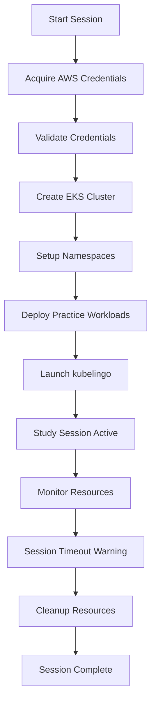

# gosandbox Integration for CKAD Study

## Overview

The gosandbox integration provides ephemeral, cost-free Kubernetes environments for CKAD (Certified Kubernetes Application Developer) study and practice. By leveraging A Cloud Guru's AWS sandbox environments, students can access realistic cloud-native Kubernetes clusters without incurring infrastructure costs.

## Table of Contents

- [Architecture Overview](#architecture-overview)
- [Prerequisites](#prerequisites)
- [Quick Start](#quick-start)
- [Detailed Setup](#detailed-setup)
- [Usage Guide](#usage-guide)
- [Cloud-Specific Exercises](#cloud-specific-exercises)
- [Session Management](#session-management)
- [Troubleshooting](#troubleshooting)
- [API Reference](#api-reference)
- [Contributing](#contributing)

## Architecture Overview

```
┌─────────────────┐    ┌──────────────────┐    ┌─────────────────┐
│   kubelingo     │    │    gosandbox     │    │  AWS Sandbox    │
│   (Learning)    │◄──►│   (Automation)   │◄──►│  (Resources)    │
└─────────────────┘    └──────────────────┘    └─────────────────┘
         │                       │                       │
         │              ┌────────▼────────┐             │
         │              │ Session Manager │             │
         │              │  (Orchestrator) │             │
         │              └─────────────────┘             │
         │                                              │
         └──────────────────────────────────────────────┘
                        EKS Cluster
```

### Components

1. **gosandbox Core**: Automated AWS credential acquisition and browser automation
2. **Session Manager**: Orchestrates study sessions and resource lifecycle
3. **Cloud Integration**: Kubernetes cluster provisioning and management
4. **kubelingo Enhancement**: Cloud-specific exercise generation and validation
5. **Monitoring & Cleanup**: Automatic resource management and cost control

## Prerequisites

### System Requirements

- **Operating System**: macOS, Linux, or Windows with WSL2
- **Go**: Version 1.17 or higher
- **Python**: Version 3.8 or higher
- **Node.js**: Version 16+ (for some automation scripts)
- **Docker**: For containerized components (optional)

### Required Tools

```bash
# Install Go dependencies
go mod download

# Install Python dependencies
pip install -r requirements.txt

# Install AWS CLI
curl "https://awscli.amazonaws.com/awscli-exe-linux-x86_64.zip" -o "awscliv2.zip"
unzip awscliv2.zip
sudo ./aws/install

# Install eksctl
curl --silent --location "https://github.com/weaveworks/eksctl/releases/latest/download/eksctl_$(uname -s)_amd64.tar.gz" | tar xz -C /tmp
sudo mv /tmp/eksctl /usr/local/bin

# Install kubectl
curl -LO "https://dl.k8s.io/release/$(curl -L -s https://dl.k8s.io/release/stable.txt)/bin/linux/amd64/kubectl"
sudo install -o root -g root -m 0755 kubectl /usr/local/bin/kubectl
```

### A Cloud Guru Account

- Active A Cloud Guru subscription with sandbox access
- Valid login credentials
- Understanding of 4-hour session limitations

## Quick Start

### 1. Environment Setup

```bash
# Clone the repository
git clone <repository-url>
cd ckad-exercises

# Set up environment variables
cp .env.example .env
# Edit .env with your A Cloud Guru credentials
```

### 2. Start a Study Session

```bash
# Initialize a new CKAD study session
python3 tools/session_manager.py

# Or use the convenience script
./scripts/ckad-cloud-study.sh
```

### 3. Begin Learning

The session manager will:
1. Acquire AWS sandbox credentials
2. Provision an EKS cluster
3. Set up practice namespaces
4. Launch kubelingo with cloud exercises

## Detailed Setup

### Configuration Files

#### `.env` Configuration
```bash
# A Cloud Guru Credentials
ACLOUD_USERNAME=your_username
ACLOUD_PASSWORD=your_password
ACLOUD_URL=https://learn.acloud.guru

# Session Configuration
DEFAULT_REGION=us-west-2
CLUSTER_INSTANCE_TYPE=t3.medium
NODE_COUNT=2

# Optional: GitHub Integration
GITHUB_TOKEN=your_github_token
GITHUB_REPO=your_repo_name

# Optional: Monitoring
ENABLE_MONITORING=true
SLACK_WEBHOOK_URL=your_slack_webhook
```

#### EKS Cluster Configuration
```yaml
# config/eks-cluster-template.yaml
apiVersion: eksctl.io/v1alpha5
kind: ClusterConfig

metadata:
  name: ${CLUSTER_NAME}
  region: ${AWS_REGION}
  version: "1.24"

nodeGroups:
  - name: worker-nodes
    instanceType: ${INSTANCE_TYPE}
    desiredCapacity: ${NODE_COUNT}
    minSize: 1
    maxSize: 4
    volumeSize: 20
    ssh:
      allow: true
    iam:
      withAddonPolicies:
        ebs: true
        fsx: true
        efs: true

addons:
  - name: aws-ebs-csi-driver
    version: latest
  - name: coredns
    version: latest
  - name: kube-proxy
    version: latest
  - name: vpc-cni
    version: latest

cloudWatch:
  clusterLogging:
    enable: ["api", "audit", "authenticator", "controllerManager", "scheduler"]
```

### Directory Structure

```
gosandbox-integration/
├── docs/
│   ├── api-reference.md
│   ├── troubleshooting.md
│   └── exercises/
├── tools/
│   ├── gosandbox/
│   │   ├── main.go
│   │   ├── k8s_automation.go
│   │   ├── kubelingo_integration.go
│   │   └── browser_automation.go
│   ├── session_manager.py
│   └── monitoring/
├── config/
│   ├── eks-cluster-template.yaml
│   ├── practice-workloads.yaml
│   └── monitoring-stack.yaml
├── scripts/
│   ├── ckad-cloud-study.sh
│   ├── cleanup-sessions.sh
│   └── health-check.sh
├── kubelingo/
│   ├── modules/
│   │   ├── cloud_integration.py
│   │   ├── aws_exercises.py
│   │   └── validation.py
│   └── data/
│       ├── aws_cloud_exercises.json
│       └── gcp_cloud_exercises.json
└── study-sessions/
    └── [session-directories]
```

## Usage Guide

### Starting a Study Session

#### Method 1: Automated Session Manager
```bash
# Start a new session with default configuration
python3 tools/session_manager.py

# Start with custom configuration
python3 tools/session_manager.py --config custom-config.yaml

# Start with specific cluster size
python3 tools/session_manager.py --nodes 3 --instance-type t3.large
```

#### Method 2: Manual Step-by-Step
```bash
# Step 1: Acquire AWS credentials
go run tools/gosandbox/main.go --acquire-credentials

# Step 2: Create EKS cluster
eksctl create cluster -f config/eks-cluster.yaml

# Step 3: Setup practice environment
kubectl apply -f config/practice-workloads.yaml

# Step 4: Start kubelingo
python3 kubelingo/cli_quiz.py --cloud-mode
```

### Session Management Commands

```bash
# List active sessions
python3 tools/session_manager.py --list

# Check session status
python3 tools/session_manager.py --status <session-id>

# Extend session (if possible)
python3 tools/session_manager.py --extend <session-id>

# Cleanup specific session
python3 tools/session_manager.py --cleanup <session-id>

# Emergency cleanup all sessions
./scripts/cleanup-sessions.sh --force
```

### Monitoring and Logging

```bash
# View session logs
tail -f study-sessions/<session-id>/logs/session.log

# Monitor cluster resources
kubectl top nodes
kubectl top pods --all-namespaces

# Check AWS costs (should be $0.00)
aws ce get-cost-and-usage --time-period Start=2023-01-01,End=2023-01-02 --granularity DAILY --metrics BlendedCost
```

## Cloud-Specific Exercises

### AWS EKS Exercises

#### Exercise 1: EBS Persistent Volumes
```yaml
# Objective: Create a Pod with EBS-backed persistent storage
# Difficulty: Intermediate
# Time: 15 minutes

# Starting template:
apiVersion: v1
kind: Pod
metadata:
  name: ebs-pod
  namespace: ckad-practice
spec:
  containers:
  - name: app
    image: nginx:1.21
    volumeMounts:
    - name: ebs-storage
      mountPath: /data
  volumes:
  - name: ebs-storage
    persistentVolumeClaim:
      claimName: # TODO: Complete this
---
apiVersion: v1
kind: PersistentVolumeClaim
metadata:
  name: # TODO: Complete this
  namespace: ckad-practice
spec:
  accessModes:
    - # TODO: Set appropriate access mode
  resources:
    requests:
      storage: # TODO: Set storage size
  storageClassName: # TODO: Use AWS storage class
```

#### Exercise 2: Load Balancer Services
```yaml
# Objective: Expose an application via AWS Network Load Balancer
# Difficulty: Intermediate
# Time: 20 minutes

apiVersion: apps/v1
kind: Deployment
metadata:
  name: web-app
  namespace: ckad-practice
spec:
  replicas: 3
  selector:
    matchLabels:
      app: web
  template:
    metadata:
      labels:
        app: web
    spec:
      containers:
      - name: web
        image: nginx:1.21
        ports:
        - containerPort: 80
---
apiVersion: v1
kind: Service
metadata:
  name: web-service
  namespace: ckad-practice
  annotations:
    # TODO: Add AWS Load Balancer annotations
spec:
  selector:
    app: web
  ports:
  - port: 80
    targetPort: 80
  type: # TODO: Set service type for external access
```

#### Exercise 3: ConfigMaps with AWS Secrets Manager
```yaml
# Objective: Use AWS Secrets Manager with Kubernetes
# Difficulty: Advanced
# Time: 30 minutes

apiVersion: v1
kind: Secret
metadata:
  name: aws-secret
  namespace: ckad-practice
  annotations:
    # TODO: Add AWS Secrets Manager annotations
type: Opaque
data:
  # TODO: Configure secret data
---
apiVersion: apps/v1
kind: Deployment
metadata:
  name: secret-app
  namespace: ckad-practice
spec:
  replicas: 1
  selector:
    matchLabels:
      app: secret-app
  template:
    metadata:
      labels:
        app: secret-app
    spec:
      containers:
      - name: app
        image: nginx:1.21
        env:
        - name: SECRET_VALUE
          valueFrom:
            secretKeyRef:
              name: # TODO: Reference the secret
              key: # TODO: Specify the key
```

### Exercise Solutions and Explanations

#### Solution 1: EBS Persistent Volumes
```yaml
apiVersion: v1
kind: Pod
metadata:
  name: ebs-pod
  namespace: ckad-practice
spec:
  containers:
  - name: app
    image: nginx:1.21
    volumeMounts:
    - name: ebs-storage
      mountPath: /data
  volumes:
  - name: ebs-storage
    persistentVolumeClaim:
      claimName: ebs-pvc
---
apiVersion: v1
kind: PersistentVolumeClaim
metadata:
  name: ebs-pvc
  namespace: ckad-practice
spec:
  accessModes:
    - ReadWriteOnce
  resources:
    requests:
      storage: 10Gi
  storageClassName: gp2
```

**Explanation:**
- `storageClassName: gp2`: Uses AWS EBS General Purpose SSD
- `ReadWriteOnce`: EBS volumes can only be mounted to one node
- `10Gi`: Minimum recommended size for EBS volumes
- The PVC automatically provisions an EBS volume via the AWS EBS CSI driver

#### Solution 2: Load Balancer Services
```yaml
apiVersion: v1
kind: Service
metadata:
  name: web-service
  namespace: ckad-practice
  annotations:
    service.beta.kubernetes.io/aws-load-balancer-type: "nlb"
    service.beta.kubernetes.io/aws-load-balancer-scheme: "internet-facing"
    service.beta.kubernetes.io/aws-load-balancer-cross-zone-load-balancing-enabled: "true"
spec:
  selector:
    app: web
  ports:
  - port: 80
    targetPort: 80
  type: LoadBalancer
```

**Explanation:**
- `aws-load-balancer-type: "nlb"`: Creates a Network Load Balancer (Layer 4)
- `aws-load-balancer-scheme: "internet-facing"`: Makes the LB accessible from the internet
- `cross-zone-load-balancing-enabled`: Distributes traffic across AZs
- `type: LoadBalancer`: Triggers AWS Load Balancer creation

## Session Management

### Session Lifecycle



### Session Configuration

```python
# tools/session_config.py
class SessionConfig:
    def __init__(self):
        self.session_duration = timedelta(hours=4)  # ACG sandbox limit
        self.warning_time = timedelta(minutes=30)   # Cleanup warning
        self.cluster_config = {
            'name_prefix': 'ckad-study',
            'region': 'us-west-2',
            'node_type': 't3.medium',
            'node_count': 2,
            'kubernetes_version': '1.24'
        }
        self.namespaces = [
            'ckad-practice',
            'web-tier',
            'data-tier',
            'monitoring'
        ]
        self.monitoring_enabled = True
        self.auto_cleanup = True
```

### Resource Monitoring

```python
# tools/monitoring/resource_monitor.py
class ResourceMonitor:
    def __init__(self, session_id: str):
        self.session_id = session_id
        self.metrics = {}
        
    def collect_metrics(self):
        """Collect cluster and cost metrics"""
        return {
            'cluster_status': self._get_cluster_status(),
            'node_utilization': self._get_node_metrics(),
            'pod_count': self._get_pod_count(),
            'aws_costs': self._get_aws_costs(),
            'session_time_remaining': self._get_time_remaining()
        }
    
    def _get_aws_costs(self):
        """Verify costs remain at $0.00"""
        # Implementation to check AWS billing
        pass
    
    def send_alerts(self, metrics: dict):
        """Send alerts for resource issues or time warnings"""
        if metrics['session_time_remaining'] < timedelta(minutes=30):
            self._send_cleanup_warning()
        
        if metrics['aws_costs'] > 0:
            self._send_cost_alert()
```

## Troubleshooting

### Common Issues

#### 1. AWS Credential Acquisition Fails

**Symptoms:**
- gosandbox hangs on credential acquisition
- Browser automation fails
- "Unable to locate credentials" errors

**Solutions:**
```bash
# Check A Cloud Guru login status
go run tools/gosandbox/main.go --debug --test-login

# Verify browser automation
go run tools/gosandbox/main.go --debug --show-browser

# Check environment variables
env | grep ACLOUD

# Reset browser state
rm -rf ~/.cache/rod
```

#### 2. EKS Cluster Creation Fails

**Symptoms:**
- eksctl hangs or fails
- "Insufficient capacity" errors
- IAM permission errors

**Solutions:**
```bash
# Check AWS credentials
aws sts get-caller-identity

# Verify region availability
aws ec2 describe-availability-zones --region us-west-2

# Try different instance type
eksctl create cluster --node-type t3.small --nodes 1

# Check eksctl logs
eksctl utils describe-stacks --region us-west-2 --cluster ckad-study-xxx
```

#### 3. kubelingo Cloud Integration Issues

**Symptoms:**
- Cloud exercises not loading
- kubectl commands fail
- Validation errors

**Solutions:**
```bash
# Verify kubectl context
kubectl config current-context

# Test cluster connectivity
kubectl get nodes

# Check namespace access
kubectl get namespaces

# Reload cloud exercises
python3 kubelingo/cli_quiz.py --reload-exercises
```

### Debug Mode

```bash
# Enable debug logging for all components
export DEBUG=true
export LOG_LEVEL=debug

# Run session with verbose output
python3 tools/session_manager.py --debug --verbose

# Check all logs
tail -f study-sessions/*/logs/*.log
```

### Health Checks

```bash
# Run comprehensive health check
./scripts/health-check.sh

# Check specific components
./scripts/health-check.sh --component gosandbox
./scripts/health-check.sh --component eks
./scripts/health-check.sh --component kubelingo
```

## API Reference

### Session Manager API

```python
from tools.session_manager import CKADStudySession

# Create new session
session = CKADStudySession()
session.initialize_session()

# Get session status
status = session.get_status()

# Extend session (if possible)
session.extend_session(minutes=30)

# Cleanup session
session.cleanup_session()
```

### gosandbox API

```go
package main

import "gosandbox/acloud"

// Create provider
provider := acloud.ACloudProvider{}

// Login and acquire credentials
err := provider.Login(username, password)

// Get sandbox credentials
creds := provider.SandboxCredential

// Export to AWS CLI format
provider.ExportAWSCredentials()
```

### Cloud Integration API

```python
from kubelingo.modules.cloud_integration import CloudEnvironmentManager

# Detect cloud environment
manager = CloudEnvironmentManager()
cloud_info = manager.detect_cloud_environment()

# Load cloud-specific exercises
exercises = manager.load_cloud_specific_exercises()

# Validate cloud resources
validation = manager.validate_cloud_resources(yaml_content)
```

## Contributing

### Development Setup

```bash
# Clone repository
git clone <repository-url>
cd ckad-exercises

# Install development dependencies
pip install -r requirements-dev.txt
go mod download

# Install pre-commit hooks
pre-commit install

# Run tests
make test
```

### Adding New Cloud Exercises

1. Create exercise YAML in `kubelingo/data/exercises/`
2. Add validation logic in `kubelingo/modules/validation.py`
3. Update exercise metadata in `kubelingo/data/aws_cloud_exercises.json`
4. Add documentation in `docs/exercises/`
5. Create tests in `tests/exercises/`

### Code Style Guidelines

- **Go**: Follow `gofmt` and `golint` standards
- **Python**: Follow PEP 8, use `black` for formatting
- **YAML**: Use 2-space indentation
- **Documentation**: Use clear, concise language with examples

### Testing

```bash
# Run all tests
make test

# Run specific test suites
make test-gosandbox
make test-kubelingo
make test-integration

# Run with coverage
make test-coverage
```

## License

This project is licensed under the MIT License - see the [LICENSE](LICENSE) file for details.

## Support

- **Documentation**: [docs/](docs/)
- **Issues**: [GitHub Issues](https://github.com/your-repo/issues)
- **Discussions**: [GitHub Discussions](https://github.com/your-repo/discussions)
- **Community**: [Discord/Slack Channel]

## Acknowledgments

- A Cloud Guru for providing sandbox environments
- The Kubernetes community for excellent documentation
- Contributors to the go-rod and eksctl projects