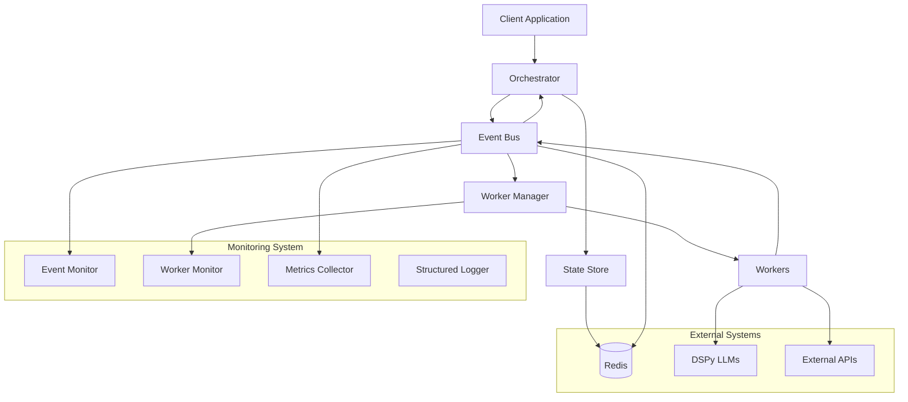

# Architecture Guide

This guide provides a deep dive into the MultiAgents Framework architecture, design patterns, and architectural decisions.

## Table of Contents

- [Core Architectural Principles](#core-architectural-principles)
- [Component Architecture](#component-architecture)
- [Design Patterns](#design-patterns)
- [Communication Flow](#communication-flow)
- [State Management](#state-management)
- [Fault Tolerance](#fault-tolerance)
- [Scalability Design](#scalability-design)
- [Security Architecture](#security-architecture)

## Core Architectural Principles

### Hybrid Orchestration/Choreography

The framework combines two architectural patterns:

```
┌─────────────────────────────────────────────────────────────────────┐
│                    HYBRID ARCHITECTURE                             │
├─────────────────────────────────────────────────────────────────────┤
│                                                                     │
│  ┌─────────────────┐           ┌─────────────────┐                 │
│  │  ORCHESTRATION  │           │  CHOREOGRAPHY   │                 │
│  │                 │           │                 │                 │
│  │ • Central brain │◄─────────►│ • Event-driven  │                 │
│  │ • State machine │           │ • Decoupled     │                 │
│  │ • Workflow logic│           │ • Async messaging│                 │
│  │ • Coordination  │           │ • Pub/Sub       │                 │
│  └─────────────────┘           └─────────────────┘                 │
│                                                                     │
│  Benefits:                      Benefits:                           │
│  • Clear workflow logic         • Scalable                         │
│  • Easy debugging              • Resilient                         │
│  • Centralized control         • Loosely coupled                   │
│                                                                     │
└─────────────────────────────────────────────────────────────────────┘
```

**Orchestration Benefits:**
- Clear, understandable workflow logic
- Centralized state management
- Easy debugging and monitoring
- Predictable execution flow

**Choreography Benefits:**
- Horizontal scalability
- Fault isolation
- Technology diversity
- Loose coupling

### SOLID Principles

Every component follows SOLID principles:

#### Single Responsibility Principle (SRP)
```python
# Each component has one clear responsibility
class Orchestrator:          # Manages workflow execution
class WorkerManager:         # Manages worker lifecycle
class EventBus:             # Handles event communication
class EventMonitor:         # Tracks event performance
```

#### Open/Closed Principle (OCP)
```python
# Extensible through interfaces, closed for modification
class IEventBus(ABC):       # Interface for event buses
class RedisEventBus(IEventBus):    # Redis implementation
class RabbitMQEventBus(IEventBus): # Future RabbitMQ implementation
```

#### Liskov Substitution Principle (LSP)
```python
# Any implementation can replace the interface
def create_framework(event_bus: IEventBus):  # Works with any event bus
    return Orchestrator(workflow, event_bus)
```

#### Interface Segregation Principle (ISP)
```python
# Interfaces are focused and specific
class IOrchestrator(ABC):   # Only orchestration methods
class IStateStore(ABC):     # Only state persistence methods
class IWorker(ABC):         # Only worker execution methods
```

#### Dependency Inversion Principle (DIP)
```python
# Depend on abstractions, not concretions
class Orchestrator:
    def __init__(self, workflow: IWorkflowDefinition, 
                 event_bus: IEventBus, 
                 state_store: IStateStore):
        # Depends on interfaces, not implementations
```

## Component Architecture

### System Overview

```
┌─────────────────────────────────────────────────────────────────────┐
│                        MULTIAGENTS FRAMEWORK                       │
├─────────────────────────────────────────────────────────────────────┤
│                                                                     │
│ ┌─────────────────┐    ┌─────────────────┐    ┌─────────────────┐ │
│ │   ORCHESTRATOR  │    │   EVENT BUS     │    │ WORKER MANAGER  │ │
│ │                 │    │                 │    │                 │ │
│ │ • State machine │◄──►│ • Redis Pub/Sub │◄──►│ • Worker registry│ │
│ │ • Workflow exec │    │ • Event routing │    │ • Lifecycle mgmt│ │
│ │ • Saga pattern  │    │ • Guaranteed    │    │ • Health checks │ │
│ │ • Error handling│    │   delivery      │    │ • Load balancing│ │
│ └─────────────────┘    └─────────────────┘    └─────────────────┘ │
│         │                       │                       │         │
│         └───────────────────────┼───────────────────────┘         │
│                                 │                                 │
│                    ┌─────────────────┐                            │
│                    │   MONITORING    │                            │
│                    │                 │                            │
│                    │ • Event tracking│                            │
│                    │ • Performance   │                            │
│                    │ • Health status │                            │
│                    │ • Metrics       │                            │
│                    └─────────────────┘                            │
│                                                                     │
└─────────────────────────────────────────────────────────────────────┘
```

### Component Interactions



## Design Patterns

### 1. Saga Pattern

Implements distributed transactions with compensation:

```python
# Workflow with compensations
workflow = (WorkflowBuilder("order_processing")
    .add_step("reserve_inventory", "inventory_service", 
              compensation="release_inventory")
    .add_step("charge_payment", "payment_service", 
              compensation="refund_payment")
    .add_step("ship_order", "shipping_service", 
              compensation="cancel_shipment")
    .build())

# If shipping fails, compensations execute in reverse:
# 1. cancel_shipment
# 2. refund_payment  
# 3. release_inventory
```

**Benefits:**
- Maintains data consistency across services
- Handles partial failures gracefully
- Provides clear rollback semantics

### 2. Command Pattern

Events encapsulate commands and their parameters:

```python
@dataclass
class CommandEvent(BaseEvent):
    worker_name: str
    context: Dict[str, Any]
    step_name: Optional[str] = None
    
    # Command encapsulates all execution details
    def execute_via(self, worker_manager: WorkerManager):
        worker = worker_manager.get_worker(self.worker_name)
        return worker.execute(self.context)
```

### 3. Observer Pattern

Event monitoring observes all system events:

```python
class EventMonitor:
    def __init__(self):
        self.observers = []
    
    def track_event_lifecycle(self, event: BaseEvent, stage: str):
        # Notify all observers of event lifecycle changes
        for observer in self.observers:
            observer.on_event_stage(event, stage)
```

### 4. Factory Pattern

Simplified component creation:

```python
def create_simple_framework(workflow: IWorkflowDefinition):
    # Factory creates all components with proper configuration
    monitoring_config = MonitoringConfig()
    logger = monitoring_config.create_logger()
    
    event_monitor = EventMonitor(logger=logger)
    worker_monitor = WorkerMonitor(logger=logger)
    
    event_bus = RedisEventBus(event_monitor=event_monitor)
    worker_manager = WorkerManager(event_bus, worker_monitor=worker_monitor)
    orchestrator = Orchestrator(workflow, event_bus)
    
    return event_bus, worker_manager, orchestrator
```

### 5. Decorator Pattern

Workers use decorators for cross-cutting concerns:

```python
@worker("payment_processor")
@retry(max_attempts=3, backoff_factor=2.0)
@timeout(30)
@monitor_performance
async def process_payment(context):
    # Business logic here
    return {"payment_id": "pay-123", "status": "charged"}
```

### 6. State Machine Pattern

Orchestrator manages workflow states:

```python
class WorkflowStateMachine:
    STATES = {
        'pending': ['running', 'cancelled'],
        'running': ['completed', 'failed', 'cancelled'],
        'completed': [],
        'failed': ['compensating'],
        'compensating': ['compensated', 'failed'],
        'compensated': [],
        'cancelled': []
    }
    
    def transition(self, current_state: str, new_state: str) -> bool:
        return new_state in self.STATES.get(current_state, [])
```

## Communication Flow

### Event Flow Architecture

```
┌─────────────────────────────────────────────────────────────────────┐
│                           EVENT FLOW                               │
├─────────────────────────────────────────────────────────────────────┤
│                                                                     │
│  Client Request                                                     │
│       │                                                             │
│       ▼                                                             │
│  ┌─────────────────┐                                               │
│  │  Orchestrator   │                                               │
│  │                 │                                               │
│  │ 1. Create       │──────┐                                        │
│  │    workflow     │      │                                        │
│  │ 2. Generate     │      │                                        │
│  │    CommandEvent │      │                                        │
│  └─────────────────┘      │                                        │
│                           │                                        │
│                           ▼                                        │
│                  ┌─────────────────┐                              │
│                  │   Event Bus     │                              │
│                  │                 │                              │
│                  │ 1. Route event  │──────┐                       │
│                  │ 2. Notify       │      │                       │
│                  │    monitoring   │      │                       │
│                  └─────────────────┘      │                       │
│                                           │                       │
│                                           ▼                       │
│                                  ┌─────────────────┐              │
│                                  │ Worker Manager  │              │
│                                  │                 │              │
│                                  │ 1. Find worker  │──────┐       │
│                                  │ 2. Execute task │      │       │
│                                  │ 3. Create       │      │       │
│                                  │    ResultEvent  │      │       │
│                                  └─────────────────┘      │       │
│                                                           │       │
│                                                           ▼       │
│                                                  ┌─────────────────┐
│                                                  │     Worker      │
│                                                  │                 │
│                                                  │ 1. Process data │
│                                                  │ 2. Return result│
│                                                  │ 3. Handle errors│
│                                                  └─────────────────┘
│                                                                     │
│  Response ◄─────────────────────────────────────────────────────── │
│                                                                     │
└─────────────────────────────────────────────────────────────────────┘
```

### Detailed Event Sequence

1. **Workflow Initiation**
   ```python
   # Client starts workflow
   transaction_id = await orchestrator.execute_workflow("order_processing", context)
   ```

2. **State Initialization**
   ```python
   # Orchestrator creates saga context
   saga_context = SagaContext(transaction_id, workflow_id, state="running")
   await state_store.save_context(saga_context)
   ```

3. **Command Generation**
   ```python
   # Orchestrator creates command for first step
   command = CommandEvent(
       transaction_id=transaction_id,
       worker_name="validate_order",
       context=initial_context
   )
   ```

4. **Event Publication**
   ```python
   # Event bus publishes command
   await event_bus.publish(command)
   # Monitoring tracks event
   await event_monitor.track_event_lifecycle(command, "published")
   ```

5. **Worker Execution**
   ```python
   # Worker manager receives and processes command
   worker = worker_manager.get_worker("validate_order")
   result = await worker.execute(command.context)
   
   # Create result event
   result_event = ResultEvent(
       transaction_id=transaction_id,
       worker_name="validate_order",
       result=result
   )
   ```

6. **Result Processing**
   ```python
   # Orchestrator receives result and updates state
   saga_context.add_step_result("validate_order", result)
   next_step = workflow.get_next_step("validate_order", saga_context)
   
   if next_step:
       # Continue with next step
       next_command = CommandEvent(...)
       await event_bus.publish(next_command)
   else:
       # Workflow complete
       saga_context.state = "completed"
   ```

## State Management

### State Persistence Strategy

```python
class StateStore:
    """
    Handles all workflow state persistence with:
    - Automatic expiration for completed workflows
    - Optimistic locking for concurrent updates
    - Backup and recovery mechanisms
    - Query capabilities for monitoring
    """
    
    async def save_context(self, context: SagaContext) -> None:
        # Save with TTL based on workflow state
        ttl = self._get_ttl_for_state(context.state)
        await self.redis.setex(
            f"saga:{context.transaction_id}",
            ttl,
            context.serialize()
        )
        
        # Update indexes for querying
        await self._update_indexes(context)
```

### State Consistency

```python
# Optimistic locking for state updates
async def update_context(self, transaction_id: str, 
                        update_func: Callable[[SagaContext], SagaContext]) -> bool:
    while True:
        # Load current state with version
        context, version = await self.load_context_with_version(transaction_id)
        
        # Apply updates
        updated_context = update_func(context)
        
        # Attempt to save with version check
        success = await self.save_context_if_version_matches(
            updated_context, version
        )
        
        if success:
            return True
        
        # Retry on version conflict
        await asyncio.sleep(0.01)  # Brief backoff
```

## Fault Tolerance

### Error Handling Hierarchy

```
┌─────────────────────────────────────────────────────────────────────┐
│                        ERROR HANDLING LEVELS                       │
├─────────────────────────────────────────────────────────────────────┤
│                                                                     │
│  Level 1: Worker Level                                             │
│  ┌─────────────────────────────────────────────┐                   │
│  │ • Input validation                          │                   │
│  │ • Business logic errors                     │                   │
│  │ • Resource timeouts                         │                   │
│  │ • Automatic retries (3x with backoff)      │                   │
│  └─────────────────────────────────────────────┘                   │
│                           │                                         │
│                           ▼ (if unrecoverable)                     │
│  Level 2: Step Level                                               │
│  ┌─────────────────────────────────────────────┐                   │
│  │ • Step execution failures                   │                   │
│  │ • Worker not found errors                   │                   │
│  │ • Step-level compensations                  │                   │
│  │ • Workflow branching decisions              │                   │
│  └─────────────────────────────────────────────┘                   │
│                           │                                         │
│                           ▼ (if step fails)                        │
│  Level 3: Workflow Level                                           │
│  ┌─────────────────────────────────────────────┐                   │
│  │ • Workflow execution failures               │                   │
│  │ • Saga pattern compensations               │                   │
│  │ • Full workflow rollback                   │                   │
│  │ • Error event generation                   │                   │
│  └─────────────────────────────────────────────┘                   │
│                           │                                         │
│                           ▼ (if compensation fails)                │
│  Level 4: System Level                                             │
│  ┌─────────────────────────────────────────────┐                   │
│  │ • Infrastructure failures                   │                   │
│  │ • Event bus disconnections                  │                   │
│  │ • State store failures                      │                   │
│  │ • Circuit breaker patterns                  │                   │
│  │ • Dead letter queues                        │                   │
│  └─────────────────────────────────────────────┘                   │
│                                                                     │
└─────────────────────────────────────────────────────────────────────┘
```

### Compensation Pattern Implementation

```python
class CompensationEngine:
    """
    Handles the saga pattern compensation logic:
    1. Maintains compensation stack during workflow execution
    2. Executes compensations in reverse order on failure
    3. Handles nested compensation failures
    """
    
    async def execute_compensations(self, saga_context: SagaContext) -> None:
        compensation_stack = saga_context.get_compensation_stack()
        
        for compensation_worker in reversed(compensation_stack):
            try:
                await self._execute_compensation(compensation_worker, saga_context)
            except Exception as e:
                # Log compensation failure but continue with others
                await self.logger.error(
                    f"Compensation failed: {compensation_worker}",
                    error=str(e),
                    transaction_id=saga_context.transaction_id
                )
                # Could implement nested compensation here
```

### Circuit Breaker Pattern

```python
class CircuitBreaker:
    """
    Protects against cascading failures by:
    - Tracking failure rates
    - Opening circuit when threshold exceeded
    - Providing fallback responses
    - Auto-recovery after timeout
    """
    
    def __init__(self, failure_threshold: float = 0.5, 
                 timeout_seconds: int = 60):
        self.failure_threshold = failure_threshold
        self.timeout_seconds = timeout_seconds
        self.failure_count = 0
        self.success_count = 0
        self.last_failure_time = None
        self.state = "closed"  # closed, open, half-open
    
    async def call(self, func: Callable, *args, **kwargs):
        if self.state == "open":
            if self._should_attempt_reset():
                self.state = "half-open"
            else:
                raise CircuitBreakerOpenError()
        
        try:
            result = await func(*args, **kwargs)
            self._record_success()
            return result
        except Exception as e:
            self._record_failure()
            raise
```

## Scalability Design

### Horizontal Scaling

```
┌─────────────────────────────────────────────────────────────────────┐
│                      HORIZONTAL SCALING                            │
├─────────────────────────────────────────────────────────────────────┤
│                                                                     │
│  ┌─────────────────┐    ┌─────────────────┐    ┌─────────────────┐ │
│  │ Orchestrator 1  │    │ Orchestrator 2  │    │ Orchestrator N  │ │
│  │                 │    │                 │    │                 │ │
│  │ • Workflow A    │    │ • Workflow B    │    │ • Workflow C    │ │
│  │ • Workflow D    │    │ • Workflow E    │    │ • Workflow F    │ │
│  └─────────────────┘    └─────────────────┘    └─────────────────┘ │
│          │                       │                       │         │
│          └───────────────────────┼───────────────────────┘         │
│                                  │                                 │
│                     ┌─────────────────┐                            │
│                     │ Shared Event Bus│                            │
│                     │                 │                            │
│                     │ • Redis Cluster │                            │
│                     │ • Pub/Sub       │                            │
│                     │ • Load balancing│                            │
│                     └─────────────────┘                            │
│                                  │                                 │
│          ┌───────────────────────┼───────────────────────┐         │
│          │                       │                       │         │
│  ┌─────────────────┐    ┌─────────────────┐    ┌─────────────────┐ │
│  │Worker Manager 1 │    │Worker Manager 2 │    │Worker Manager N │ │
│  │                 │    │                 │    │                 │ │
│  │ • Workers 1-10  │    │ • Workers 11-20 │    │ • Workers N+    │ │
│  │ • Health checks │    │ • Health checks │    │ • Health checks │ │
│  └─────────────────┘    └─────────────────┘    └─────────────────┘ │
│                                                                     │
└─────────────────────────────────────────────────────────────────────┘
```

### Load Distribution Strategies

#### 1. Workflow-Based Partitioning
```python
class WorkflowPartitioner:
    """Distribute workflows based on workflow type or characteristics."""
    
    def select_orchestrator(self, workflow_id: str) -> str:
        # Hash-based partitioning
        partition = hash(workflow_id) % self.orchestrator_count
        return f"orchestrator-{partition}"
```

#### 2. Worker Specialization
```python
class WorkerPool:
    """Specialize worker managers for different types of work."""
    
    def __init__(self):
        self.cpu_intensive_workers = WorkerManager()  # CPU-bound tasks
        self.io_intensive_workers = WorkerManager()   # I/O-bound tasks
        self.llm_workers = WorkerManager()            # DSPy/LLM tasks
        
    def route_work(self, worker_name: str) -> WorkerManager:
        worker_config = self.worker_configs[worker_name]
        if worker_config.type == "cpu_intensive":
            return self.cpu_intensive_workers
        elif worker_config.type == "io_intensive":
            return self.io_intensive_workers
        elif worker_config.type == "llm":
            return self.llm_workers
```

### Performance Optimization

#### Event Bus Optimization
```python
class OptimizedEventBus:
    """Optimized event bus with batching and connection pooling."""
    
    def __init__(self):
        self.connection_pool = redis.ConnectionPool(
            max_connections=50,
            retry_on_timeout=True
        )
        self.batch_queue = asyncio.Queue(maxsize=1000)
        self.batch_size = 100
        self.batch_timeout = 0.01  # 10ms
        
    async def publish_batch(self, events: List[BaseEvent]) -> None:
        """Batch multiple events into single Redis operation."""
        pipeline = self.redis.pipeline()
        for event in events:
            pipeline.publish(event.get_channel(), event.serialize())
        await pipeline.execute()
```

## Security Architecture

### Authentication and Authorization

```python
class SecurityManager:
    """Handles authentication and authorization for framework components."""
    
    def __init__(self):
        self.jwt_secret = os.getenv("JWT_SECRET")
        self.worker_permissions = self._load_worker_permissions()
        
    async def authenticate_worker(self, worker_name: str, token: str) -> bool:
        """Verify worker authentication token."""
        try:
            payload = jwt.decode(token, self.jwt_secret, algorithms=["HS256"])
            return payload.get("worker_name") == worker_name
        except jwt.InvalidTokenError:
            return False
            
    async def authorize_operation(self, worker_name: str, 
                                operation: str, context: Dict) -> bool:
        """Check if worker is authorized for operation."""
        permissions = self.worker_permissions.get(worker_name, [])
        return operation in permissions
```

### Input Validation

```python
class InputValidator:
    """Validates all inputs to prevent injection attacks."""
    
    @staticmethod
    def validate_context(context: Dict[str, Any]) -> Dict[str, Any]:
        """Sanitize and validate workflow context."""
        # Remove potentially dangerous keys
        dangerous_keys = ["__", "eval", "exec", "import"]
        cleaned = {
            k: v for k, v in context.items() 
            if not any(dangerous in str(k) for dangerous in dangerous_keys)
        }
        
        # Validate data types and sizes
        for key, value in cleaned.items():
            if isinstance(value, str) and len(value) > 10000:
                raise ValueError(f"String value too long for key: {key}")
                
        return cleaned
```

### Event Encryption

```python
class EncryptedEventBus(RedisEventBus):
    """Event bus with automatic event encryption."""
    
    def __init__(self, encryption_key: str, **kwargs):
        super().__init__(**kwargs)
        self.cipher = Fernet(encryption_key.encode())
        
    async def publish(self, event: BaseEvent) -> None:
        # Encrypt sensitive data before publishing
        encrypted_event = self._encrypt_event(event)
        await super().publish(encrypted_event)
        
    def _encrypt_event(self, event: BaseEvent) -> BaseEvent:
        """Encrypt sensitive fields in event."""
        if hasattr(event, 'context'):
            event.context = self._encrypt_dict(event.context)
        return event
```

This architecture provides a robust, scalable, and maintainable foundation for building distributed workflow systems with the MultiAgents Framework.