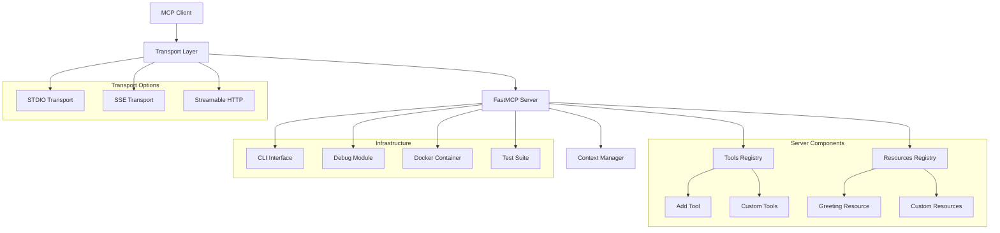

# Design Document

## Overview

Python MCP Server Starter Template представляет собой готовый к использованию шаблон для создания серверов Model Context Protocol (MCP) на Python. Проект использует FastMCP SDK для упрощения разработки и предоставляет полную инфраструктуру для быстрого старта разработки MCP приложений.

Архитектура основана на современных Python практиках с использованием uv для управления зависимостями, поддержкой Docker для контейнеризации, и интеграцией с VS Code для отладки.

## Architecture

### Core Components



### Transport Layer Design

Система поддерживает три типа транспорта:

1. **STDIO Transport** - для интеграции с MCP Inspector и локальной разработки
2. **SSE (Server-Sent Events)** - для веб-интеграций и HTTP клиентов
3. **Streamable HTTP** - для production развертывания с поддержкой stateless режима

### FastMCP Integration

Использует официальный Python SDK для MCP с FastMCP классом как основным интерфейсом:

- Автоматическая регистрация инструментов через декораторы `@mcp.tool()`
- Автоматическая регистрация ресурсов через декораторы `@mcp.resource()`
- Встроенная поддержка типизации и валидации
- Контекстное управление через Context API

## Components and Interfaces

### FastMCP Server Core

```python
class MCPServerTemplate:
    def __init__(self, app_id: str):
        self.mcp = FastMCP(app_id)
        self.starlette_app = Starlette(routes=[Mount("/", app=self.mcp.sse_app())])
    
    def register_tools(self):
        # Регистрация инструментов через декораторы
        pass
    
    def register_resources(self):
        # Регистрация ресурсов через декораторы
        pass
```

### Tool Interface

```python
@mcp.tool()
def tool_function(param1: type1, param2: type2, ctx: Context) -> return_type:
    """Tool description for LLM"""
    # Реализация инструмента
    # Поддержка прогресса через ctx.report_progress()
    # Логирование через ctx.info(), ctx.debug(), ctx.error()
    return result
```

### Resource Interface

```python
@mcp.resource("resource://uri/{parameter}")
def resource_function(parameter: str) -> str:
    """Resource description"""
    # Возврат данных без побочных эффектов
    return data
```

### CLI Interface

```python
@click.command()
@click.option("--sse", is_flag=True, help="Start as SSE server")
@click.option("--host", default="0.0.0.0", help="Host for SSE mode")
@click.option("--port", type=int, default=8000, help="Port for SSE mode")
def main(sse: bool, host: str, port: int):
    # Запуск сервера в выбранном режиме
```

### Debug Interface

```python
class DebugModule:
    def __init__(self, port: int = 5678):
        self.debug_port = port
    
    def start_debug_server(self):
        # Запуск debugpy сервера
        # Ожидание подключения отладчика
```

## Data Models

### Configuration Model

```python
@dataclass
class ServerConfig:
    app_id: str
    host: str = "0.0.0.0"
    port: int = 8000
    debug_port: int = 5678
    transport: Literal["stdio", "sse", "streamable-http"] = "stdio"
```

### Tool Response Model

```python
@dataclass
class ToolResponse:
    result: Any
    status: str = "success"
    message: Optional[str] = None
```

### Resource Model

```python
@dataclass
class ResourceData:
    uri: str
    content: str
    mime_type: str = "text/plain"
```

### Context Model

```python
class ExecutionContext:
    session: MCPSession
    progress_callback: Callable
    logger: Logger
    
    async def report_progress(self, progress: float, total: float, message: str):
        # Отчет о прогрессе выполнения
    
    async def info(self, message: str):
        # Информационное сообщение
    
    async def debug(self, message: str):
        # Отладочное сообщение
```

## Error Handling

### Exception Hierarchy

```python
class MCPServerError(Exception):
    """Базовый класс для ошибок MCP сервера"""
    pass

class ToolExecutionError(MCPServerError):
    """Ошибка выполнения инструмента"""
    pass

class ResourceNotFoundError(MCPServerError):
    """Ресурс не найден"""
    pass

class TransportError(MCPServerError):
    """Ошибка транспортного уровня"""
    pass
```

### Error Handling Strategy

1. **Tool Errors**: Перехват исключений в инструментах и возврат структурированных ошибок
2. **Resource Errors**: Graceful handling отсутствующих ресурсов
3. **Transport Errors**: Автоматическое переподключение и retry логика
4. **Validation Errors**: Автоматическая валидация параметров через типизацию

### Logging Strategy

```python
import logging

logger = logging.getLogger("mcp_server")
logger.setLevel(logging.INFO)

# Структурированное логирование
async def log_tool_execution(tool_name: str, params: dict, result: Any):
    logger.info(f"Tool executed: {tool_name}", extra={
        "tool": tool_name,
        "params": params,
        "result_type": type(result).__name__
    })
```

## Testing Strategy

### Unit Testing

```python
# Тестирование инструментов
@pytest.mark.asyncio
async def test_tool_function():
    result = await tool_function(param1="test", param2=123)
    assert result == expected_result

# Тестирование ресурсов
def test_resource_function():
    result = resource_function("test_param")
    assert isinstance(result, str)
    assert "expected_content" in result
```

### Integration Testing

```python
# Тестирование MCP протокола
@pytest.mark.asyncio
async def test_mcp_server_integration():
    async with stdio_client(server_params) as (read, write):
        async with ClientSession(read, write) as session:
            await session.initialize()
            
            # Тест списка инструментов
            tools = await session.list_tools()
            assert len(tools.tools) > 0
            
            # Тест вызова инструмента
            result = await session.call_tool("add", {"a": 2, "b": 3})
            assert result.content[0].text == "5"
```

### Docker Testing

```dockerfile
# Multi-stage тестирование
FROM python:3.10-slim as test
WORKDIR /app
COPY . .
RUN pip install -e ".[dev]"
RUN pytest

FROM python:3.10-slim as production
WORKDIR /app
COPY . .
RUN pip install -e .
CMD ["python", "-m", "hello_mcp_server", "--sse"]
```

### Debug Testing

```python
def test_debug_mode():
    # Тестирование режима отладки
    debug_module = DebugModule()
    assert debug_module.debug_port == 5678
    
    # Проверка подключения отладчика
    with patch('debugpy.listen') as mock_listen:
        debug_module.start_debug_server()
        mock_listen.assert_called_once_with(5678)
```

### Performance Testing

```python
@pytest.mark.performance
async def test_tool_performance():
    start_time = time.time()
    result = await heavy_computation_tool()
    execution_time = time.time() - start_time
    
    assert execution_time < 5.0  # Максимум 5 секунд
    assert result is not None
```

### Configuration Testing

```python
def test_environment_configuration():
    # Тестирование конфигурации через переменные окружения
    os.environ['HOST'] = '127.0.0.1'
    os.environ['PORT'] = '9000'
    
    config = load_server_config()
    assert config.host == '127.0.0.1'
    assert config.port == 9000
```