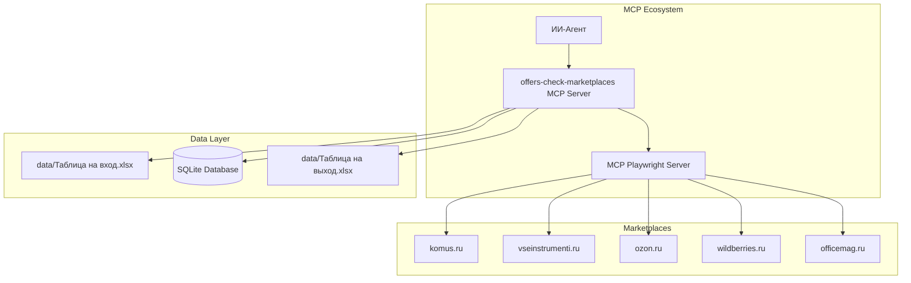
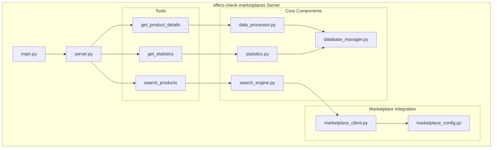

# Документ проектирования

## Обзор

Система `offers-check-marketplaces` представляет собой MCP сервер, который автоматизирует процесс сравнения цен товаров на различных маркетплейсах. Сервер работает в связке с MCP Playwright для выполнения веб-скрапинга и обеспечивает полный цикл обработки данных: от загрузки Excel файлов до генерации отчетов с анализом цен.

Основная архитектурная особенность - это координирующая роль сервера, который делегирует задачи веб-скрапинга специализированному MCP Playwright серверу, обеспечивая модульность и разделение ответственности.

## Архитектура

### Общая архитектура системы



### Архитектура MCP сервера



## Компоненты и интерфейсы

### 1. Основной сервер (server.py)

**Назначение:** Главный модуль MCP сервера, регистрирует инструменты и обрабатывает запросы.

**Ключевые функции:**

- Инициализация FastMCP сервера с ID `offers-check-marketplaces`
- Регистрация трех основных инструментов
- Предоставление системных промптов для ИИ-агента
- Обработка ошибок и логирование

**Интерфейс:**

```python
@mcp.tool()
async def search_products(model_name: str, ctx: Context) -> dict

@mcp.tool()
async def get_product_details(product_code: float, ctx: Context) -> dict

@mcp.tool()
async def get_statistics(ctx: Context) -> dict
```

### 2. Обработчик данных (data_processor.py)

**Назначение:** Обработка Excel файлов и преобразование данных в JSON формат.

**Ключевые функции:**

- Чтение Excel файла `data/Таблица на вход.xlsx`
- Преобразование в JSON с заданной структурой
- Валидация данных и обработка пустых ячеек
- Генерация выходного Excel файла

**Интерфейс:**

```python
class DataProcessor:
    async def load_excel_data(self, file_path: str) -> List[dict]
    async def save_excel_data(self, data: List[dict], file_path: str) -> bool
    def validate_product_data(self, product: dict) -> bool
    def calculate_price_delta(self, price1: float, price2: float) -> float
```

### 3. Поисковый движок (search_engine.py)

**Назначение:** Координация поиска товаров на маркетплейсах через MCP Playwright.

**Ключевые функции:**

- Определение приоритетных источников для поиска
- Делегирование задач веб-скрапинга MCP Playwright
- Агрегация результатов поиска
- Обработка ошибок поиска

**Интерфейс:**

```python
class SearchEngine:
    async def search_product(self, model_name: str, marketplaces: List[str]) -> dict
    async def get_marketplace_price(self, marketplace: str, model_name: str) -> dict
    def parse_search_results(self, raw_results: dict) -> dict
```

### 4. Менеджер базы данных (database_manager.py)

**Назначение:** Управление SQLite базой данных для хранения продуктов и цен.

**Ключевые функции:**

- Создание и управление схемой базы данных
- CRUD операции для продуктов и цен
- Оптимизированные запросы для статистики
- Обеспечение целостности данных

**Интерфейс:**

```python
class DatabaseManager:
    async def init_database(self) -> None
    async def save_product(self, product_data: dict) -> int
    async def update_product_prices(self, product_id: int, prices: dict) -> bool
    async def get_product_by_code(self, code: float) -> dict
    async def get_statistics(self) -> dict
```

### 5. Клиент маркетплейсов (marketplace_client.py)

**Назначение:** Интерфейс для взаимодействия с MCP Playwright сервером.

**Ключевые функции:**

- Формирование запросов к MCP Playwright
- Передача конфигурации селекторов
- Обработка ответов от веб-скрапинга
- Управление ошибками скрапинга

**Интерфейс:**

```python
class MarketplaceClient:
    async def scrape_marketplace(self, marketplace_config: dict, search_query: str) -> dict
    async def extract_price_info(self, marketplace: str, html_content: str) -> dict
    def format_playwright_request(self, url: str, selectors: dict) -> dict
```

### 6. Конфигурация маркетплейсов (marketplace_config.py)

**Назначение:** Хранение конфигурации для каждого поддерживаемого маркетплейса.

**Структура конфигурации:**

```python
MARKETPLACE_CONFIGS = {
    "komus.ru": {
        "name": "Комус",
        "base_url": "https://www.komus.ru",
        "search_url": "https://www.komus.ru/search?q={query}",
        "selectors": {
            "price": ".price-current",
            "availability": ".availability-status",
            "product_link": ".product-item a",
            "product_title": ".product-title"
        },
        "rate_limit": 2.0  # секунды между запросами
    },
    # ... конфигурации для других маркетплейсов
}
```

## Модели данных

### 1. Структура продукта (Product)

```python
@dataclass
class Product:
    code: float  # Код модели
    model_name: str
    category: str  # Категория
    unit: str  # Единица измерения
    priority_1_source: str  # Приоритет 1 Источники
    priority_2_source: str  # Приоритет 2 Источники
    mp_price_with_vat: Optional[float] = None  # Цена позиции МП c НДС
    b2c_price_with_vat: Optional[float] = None  # Цена позиции B2C c НДС
    delta_percent: Optional[float] = None  # Дельта в процентах
    source_link: Optional[str] = None  # Ссылка на источник
    second_b2c_price_with_vat: Optional[float] = None  # Цена 2 позиции B2C c НДС
```

### 2. Результат поиска (SearchResult)

```python
@dataclass
class SearchResult:
    marketplace: str
    product_found: bool
    price: Optional[float]
    currency: str
    availability: str
    product_url: Optional[str]
    error_message: Optional[str] = None
    search_timestamp: datetime
```

### 3. Статистика (Statistics)

```python
@dataclass
class Statistics:
    total_products: int
    products_with_prices: int
    average_delta_percent: float
    category_breakdown: Dict[str, int]
    marketplace_coverage: Dict[str, int]
    processing_timestamp: datetime
```

## Схема базы данных

```sql
-- Таблица продуктов
CREATE TABLE products (
    id INTEGER PRIMARY KEY AUTOINCREMENT,
    code REAL UNIQUE NOT NULL,
    model_name TEXT NOT NULL,
    category TEXT NOT NULL,
    unit TEXT NOT NULL,
    priority_1_source TEXT NOT NULL,
    priority_2_source TEXT NOT NULL,
    created_at TIMESTAMP DEFAULT CURRENT_TIMESTAMP,
    updated_at TIMESTAMP DEFAULT CURRENT_TIMESTAMP
);

-- Таблица цен
CREATE TABLE prices (
    id INTEGER PRIMARY KEY AUTOINCREMENT,
    product_id INTEGER NOT NULL,
    marketplace TEXT NOT NULL,
    price REAL,
    currency TEXT DEFAULT 'RUB',
    availability TEXT,
    product_url TEXT,
    scraped_at TIMESTAMP DEFAULT CURRENT_TIMESTAMP,
    FOREIGN KEY (product_id) REFERENCES products (id),
    UNIQUE(product_id, marketplace)
);

-- Индексы для оптимизации
CREATE INDEX idx_products_code ON products(code);
CREATE INDEX idx_prices_product_marketplace ON prices(product_id, marketplace);
CREATE INDEX idx_prices_scraped_at ON prices(scraped_at);
```

## Обработка ошибок

### 1. Стратегия обработки ошибок

**Принципы:**

- Graceful degradation - система продолжает работать при частичных сбоях
- Подробное логирование для диагностики
- Информативные сообщения об ошибках для пользователя
- Retry механизмы для временных сбоев

### 2. Типы ошибок и их обработка

**Ошибки чтения Excel:**

```python
try:
    data = await self.load_excel_data(file_path)
except FileNotFoundError:
    return {"error": "Входной Excel файл не найден", "code": "FILE_NOT_FOUND"}
except PermissionError:
    return {"error": "Нет доступа к Excel файлу", "code": "PERMISSION_DENIED"}
```

**Ошибки веб-скрапинга:**

```python
try:
    result = await self.scrape_marketplace(config, query)
except PlaywrightError as e:
    logger.warning(f"Скрапинг {marketplace} не удался: {e}")
    return {"marketplace": marketplace, "error": str(e), "product_found": False}
```

**Ошибки базы данных:**

```python
try:
    await self.save_product(product_data)
except sqlite3.IntegrityError:
    logger.info(f"Продукт {product_data['code']} уже существует, обновляем")
    await self.update_product(product_data)
```

## Стратегия тестирования

### 1. Модульные тесты

**Компоненты для тестирования:**

- DataProcessor: тестирование парсинга Excel и валидации данных
- DatabaseManager: тестирование CRUD операций
- SearchEngine: тестирование логики поиска (с мокированием MCP Playwright)
- MarketplaceClient: тестирование формирования запросов

**Пример теста:**

```python
async def test_data_processor_excel_parsing():
    processor = DataProcessor()
    test_data = await processor.load_excel_data("test_data.xlsx")

    assert len(test_data) > 0
    assert "Код\nмодели" in test_data[0]
    assert "model_name" in test_data[0]
```

### 2. Интеграционные тесты

**Сценарии тестирования:**

- Полный цикл: загрузка Excel → поиск → сохранение результатов
- Взаимодействие с MCP Playwright (с использованием тестового сервера)
- Обработка ошибок при недоступности маркетплейсов

### 3. Тестирование MCP инструментов

**Тестирование инструментов:**

```python
async def test_search_products_tool():
    result = await search_products("Полотно техническое БЯЗЬ", mock_context)

    assert "results" in result
    assert len(result["results"]) > 0
    assert "komus.ru" in [r["marketplace"] for r in result["results"]]
```

## Конфигурация и развертывание

### 1. Переменные окружения

```bash
# Основные настройки
MCP_SERVER_ID=offers-check-marketplaces
DATABASE_PATH=data/products.db
EXCEL_INPUT_PATH=data/Таблица на вход.xlsx
EXCEL_OUTPUT_PATH=data/Таблица на выход (отработанная).xlsx

# Настройки скрапинга
SCRAPING_DELAY=2.0
MAX_RETRIES=3
REQUEST_TIMEOUT=30

# Настройки логирования
LOG_LEVEL=INFO
LOG_FILE=logs/marketplace_scraper.log
```

### 2. Структура проекта

```
offers_check_marketplaces/
├── __init__.py
├── __main__.py
├── server.py                 # Основной MCP сервер
├── data_processor.py         # Обработка Excel данных
├── search_engine.py          # Поисковый движок
├── database_manager.py       # Управление БД
├── marketplace_client.py     # Клиент для MCP Playwright
├── marketplace_config.py     # Конфигурация маркетплейсов
├── statistics.py            # Генерация статистики
├── models.py                # Модели данных
└── utils.py                 # Вспомогательные функции

data/
├── Таблица на вход.xlsx
├── Таблица на выход (отработанная).xlsx
└── products.db

tests/
├── test_data_processor.py
├── test_search_engine.py
├── test_database_manager.py
└── test_integration.py
```

### 3. Зависимости

```toml
dependencies = [
    "mcp>=1.7.1",
    "pandas>=2.0.0",
    "openpyxl>=3.1.0",
    "aiosqlite>=0.19.0",
    "aiohttp>=3.8.0",
    "pydantic>=2.0.0",
    "click>=8.1.3",
    "anyio>=3.7.0"
]
```

## Производительность и масштабирование

### 1. Оптимизация производительности

**Асинхронная обработка:**

- Параллельный поиск на нескольких маркетплейсах
- Асинхронные операции с базой данных
- Batch обработка продуктов

**Кэширование:**

- Кэширование результатов поиска на короткий период
- Кэширование конфигурации маркетплейсов
- Оптимизация SQL запросов с индексами

### 2. Ограничения скорости

**Rate limiting для маркетплейсов:**

```python
class RateLimiter:
    def __init__(self, delay: float):
        self.delay = delay
        self.last_request = {}

    async def wait_if_needed(self, marketplace: str):
        now = time.time()
        if marketplace in self.last_request:
            elapsed = now - self.last_request[marketplace]
            if elapsed < self.delay:
                await asyncio.sleep(self.delay - elapsed)
        self.last_request[marketplace] = time.time()
```

## Безопасность

### 1. Защита от блокировки

**Меры предосторожности:**

- Соблюдение robots.txt
- Использование случайных задержек
- Ротация User-Agent заголовков
- Обработка CAPTCHA через MCP Playwright

### 2. Обработка персональных данных

**Принципы:**

- Минимизация сбора данных
- Шифрование чувствительной информации
- Соблюдение GDPR при необходимости
- Логирование без персональных данных
