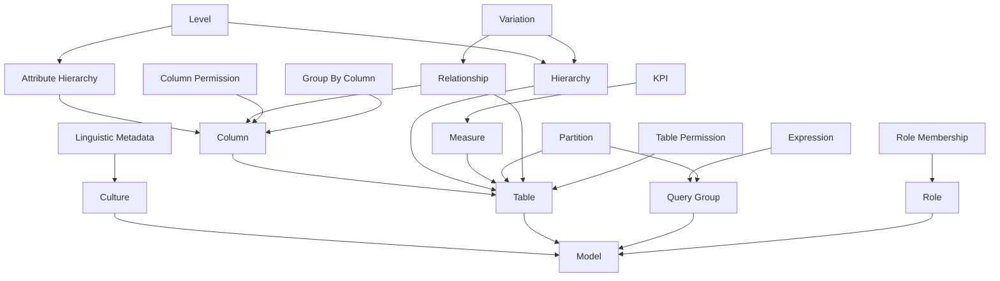

# Dev Instructions


## Set Up

```shell
python -m venv venv
venv\Scripts\activate
python -m pip install .[dev,docs,internationalization]
pre-commit install
```

# Running the Documentation Server

```shell
python -m pip install .[docs]
mkdocs serve -f docs/mkdocs.yml
```

## Testing

```shell

pip install -e .
```

filters, condition
sources:
  arithmatic
  hierarchy
  aggregation


# SSAS Entity Hierarchy

Unmapped Tables:
-   alternate_of[Alternate Of]
-   annotations[Annotations]
-   calculation_group[Calculation Group]
-   calculation_item[Calculation Item]
-   data_source[Data Source]
-   detail_row_definition[Detail Row Definition]
-   extended_property[Extended Property]
-   format_string_definition[Format String Definition]
-   object_translation[Object Translation]
-   perspective_column[Perspective Column]
-   perspective_hierarchy[Perspective Hierarchy]
-   perspective_measure[Perspective Measure]
-   perspective_set[Perspective Set]
-   perspective_table[Perspective Table]
-   perspective[Perspective]
-   refresh_policy[Refresh Policy]
-   related_column_detail[Related Column Detail]
-   set[Set]




# Notes:

## Refreshing

Refreshing is only possible when a "Microsoft.Mashup.Container.NetFX45.exe" instance is running. This gets created when Desktop does a refresh and stays forever(?)

The process is run with the arguments:

10440 9852 <UUID> 4
The first and second are references to pipes? Note: the first two are always multiples of 8
The 3rd is a UUID that stays the same across children, so I assume it's related to the SSAS instance. Could not find a match in the tables though
The last indicates how many living/dead instances of the exe were run before this one (0-indexed)

## 

    ignored_names: set[str] = set(['_', '_parent'])


Added to _model_construction, line 372 of pydantic


Added 

    "python.analysis.diagnosticSeverityOverrides": {
        "reportIncompatibleVariableOverride": false
    }

to vscode settings

# Prototype Query

Property:Microsoft.InfoNav.Explore.VisualContracts.SingleVisualConfig.PrototypeQuery
Click on QueryDefinition
C:\Program Files\Microsoft Power BI Desktop\bin\Microsoft.InfoNav.Explore.VisualContracts.dll
C:\Program Files\Microsoft Power BI Desktop\bin\Microsoft.InfoNav.Insights.Engines.dll
  namespace: Microsoft.InfoNav.Experimental.Insights.Engines.DAX
    Writer.cs creates the string to SSAS


# PBI SSAS definitions
"C:\Program Files\Microsoft Power BI Desktop\bin\Microsoft.PowerBI.Tabular.dll"