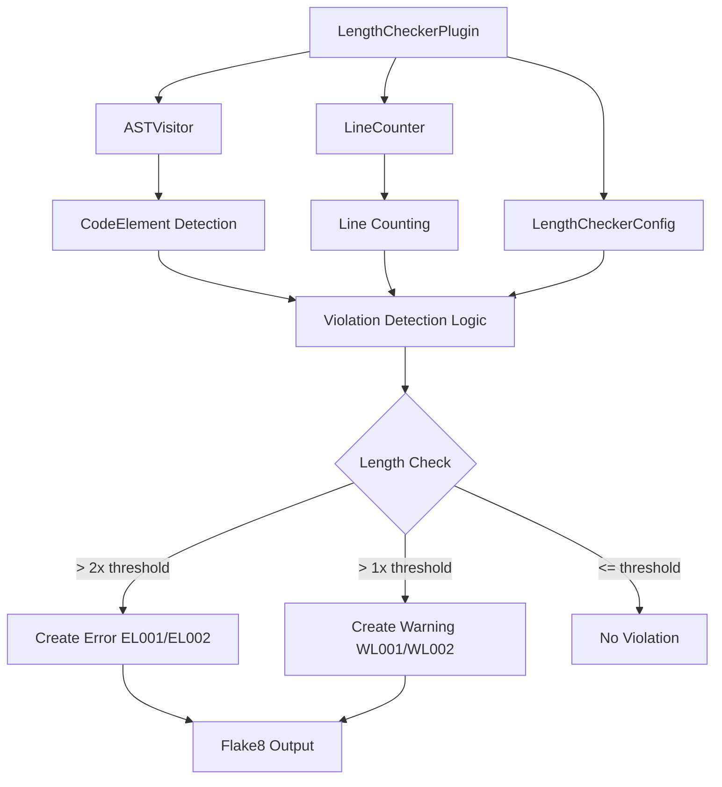
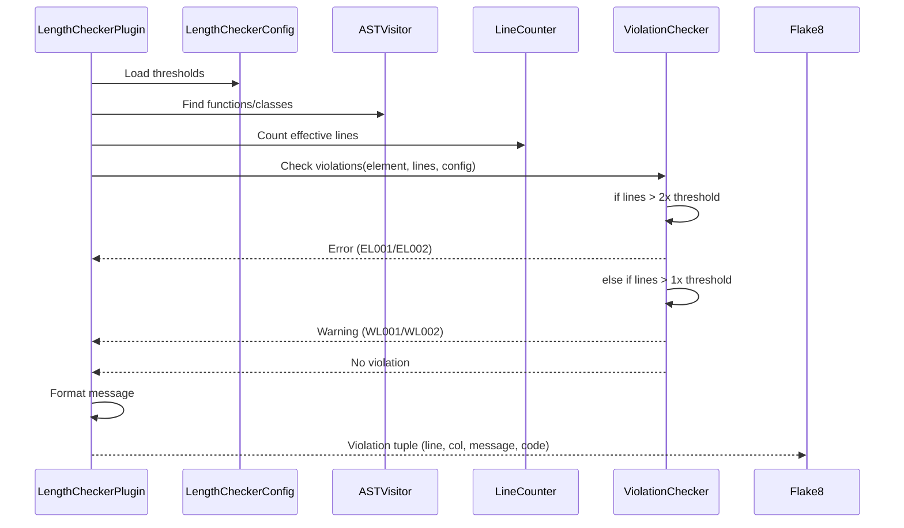

# Feature Implementation Plan: Add Warnings to Length Linter

_Generated: 2025-06-22_
_Based on Feature Specification: [20250622-add-warnings-to-length-linter-feature.md](./20250622-add-warnings-to-length-linter-feature.md)_

## Architecture Overview

The length linter currently implements a single-tier violation system where functions/classes exceeding configured limits generate errors (EL001/EL002). This implementation will modify the core plugin logic to support a two-tier system:

- **Warning Tier**: Violations at configured threshold (WL001/WL002)  
- **Error Tier**: Violations at 2x configured threshold (EL001/EL002)

The implementation preserves all existing architecture components (AST visitor, line counter, configuration system) while extending the violation detection and message generation logic.

### System Architecture

### Data Flow

## Technology Stack

### Core Technologies
- **Language/Runtime:** Python 3.12
- **Framework:** Flake8 plugin system
- **Configuration:** pyproject.toml with tomllib/tomli parsing

### Libraries & Dependencies
- **AST Processing:** Built-in ast module
- **Configuration:** tomllib (Python 3.11+) / tomli (compatibility)
- **Testing:** pytest with pytest-mock
- **Code Quality:** black, isort, pylama, pyright

### Patterns & Approaches
- **Plugin Pattern:** Flake8 extension interface
- **Visitor Pattern:** AST traversal for code element detection
- **Strategy Pattern:** Line counting with comment/docstring exclusion
- **Configuration Pattern:** Hierarchical config loading (defaults → file → CLI)

### External Integrations
- **Flake8:** Plugin registration and violation reporting
- **Pylama:** Compatible linting pipeline integration
- **Poetry:** Build system and dependency management

## Relevant Files

- `src/linters/length_checker/plugin.py` - Main plugin class requiring two-tier violation logic
- `src/linters/length_checker/config.py` - Configuration system (no changes needed)
- `src/linters/length_checker/ast_visitor.py` - AST visitor (no changes needed)
- `src/linters/length_checker/line_counter.py` - Line counting logic (no changes needed)
- `src/tests/linters/length_checker/test_length_checker.py` - Main test suite requiring warning test coverage
- `pyproject.toml` - Plugin registration and project configuration (no changes needed)

## Implementation Notes

- Tests should be added directly to the existing test file following current patterns
- Use `poetry run pytest` for running tests  
- Run quality tools after each task: `poetry run poe autolint` and `poetry run pyright`
- Warning codes (WL001/WL002) must follow flake8 conventions for compatibility
- Error codes (EL001/EL002) remain unchanged for backward compatibility
- Message format changes apply to both warnings and errors consistently

## Implementation Tasks

- [x] 1.0 Update Plugin Violation Detection Logic

  - [x] 1.1 Modify `_check_element_violations` method to implement two-tier threshold checking
  - [x] 1.2 Update method to generate both warnings and errors based on length thresholds
  - [x] 1.3 Ensure violations are yielded in correct order (warnings before errors for same element)
  - [x] 1.4 Test the updated violation detection logic with existing test helper functions

  ### Files modified with description of changes

  - `src/linters/length_checker/plugin.py` - Updated `_check_element_violations` method to implement two-tier threshold system (warnings at 1x threshold, errors at 2x threshold). Added new warning message creation methods `_create_function_warning` and `_create_class_warning` for WL001/WL002 codes. Updated existing error message methods to reference 2x threshold and include "recommend refactoring" text.

- [x] 2.0 Update Message Generation Methods

  - [x] 2.1 Update `_create_function_violation` method to use new message format with threshold type
  - [x] 2.2 Update `_create_class_violation` method to use new message format with threshold type
  - [x] 2.3 Update `_create_function_warning` method to use new message format with threshold type
  - [x] 2.4 Update `_create_class_warning` method to use new message format with threshold type
  - [x] 2.5 Ensure all messages include "recommend refactoring" as specified in requirements

  ### Files modified with description of changes

  - `src/linters/length_checker/plugin.py` - Updated all four message generation methods to use proper threshold terminology. Error methods now use "error threshold of X*2" and warning methods use "warning threshold of X". All messages include "recommend refactoring" text as required. Message format now follows specification: "[CODE] [Type] 'name' is X lines long, exceeds [warning/error] threshold of Y, recommend refactoring"

- [x] 3.0 Add Comprehensive Test Coverage

  - [x] 3.1 Add tests for warning generation at 1x threshold for functions and classes
  - [x] 3.2 Add tests for error generation at 2x threshold for functions and classes  
  - [x] 3.3 Add tests for no violations when under 1x threshold
  - [x] 3.4 Add tests for correct message format including all required elements
  - [x] 3.5 Add tests for warning codes WL001 and WL002 generation
  - [x] 3.6 Add tests for mixed scenarios (warnings and errors in same file)
  - [x] 3.7 Add tests ensuring existing functionality remains unchanged
  - [x] 3.8 Add edge case tests (exactly at thresholds, exactly at 2x thresholds)

  ### Files modified with description of changes

  - `src/tests/linters/length_checker/test_length_checker.py` - Added comprehensive test coverage for new two-tier warning/error system. Added new test classes: TestWarningGeneration (tests WL001/WL002 warnings at 1x threshold), TestErrorGeneration (tests EL001/EL002 errors at 2x threshold), TestNoViolationsUnderThreshold (tests no violations below 1x threshold), TestMixedScenarios (tests files with both warnings and errors), and TestNewEdgeCases (tests boundary conditions and edge cases). Updated existing tests to match new two-tier behavior. All tests verify correct violation codes, message formats, line counts, and threshold logic.

- [x] 4.0 Quality Verification and Integration Testing

  - [x] 4.1 Run all existing tests to ensure no regressions
  - [x] 4.2 Run code formatting tools (black, isort) and fix any issues
  - [x] 4.3 Run linting (pylama) and address any violations  
  - [x] 4.4 Run type checking (pyright) and fix any type issues
  - [x] 4.5 Test flake8 integration manually with sample code files
  - [x] 4.6 Verify configuration compatibility with existing pyproject.toml settings
  - [x] 4.7 Test command-line option compatibility (--length-max-function, --length-max-class)

  ### Files modified with description of changes

  - `src/tests/linters/length_checker/test_length_checker.py` - Updated existing test cases to work with the new two-tier warning/error system. Fixed test expectations to match new behavior where violations at 1x threshold generate warnings (WL001/WL002) and violations at 2x threshold generate errors (EL001/EL002). Fixed flake8 integration tests to use --select=WL,EL instead of just --select=EL. Corrected expected line counts and message formats in failing tests. Fixed whitespace linting issue on line 1827.