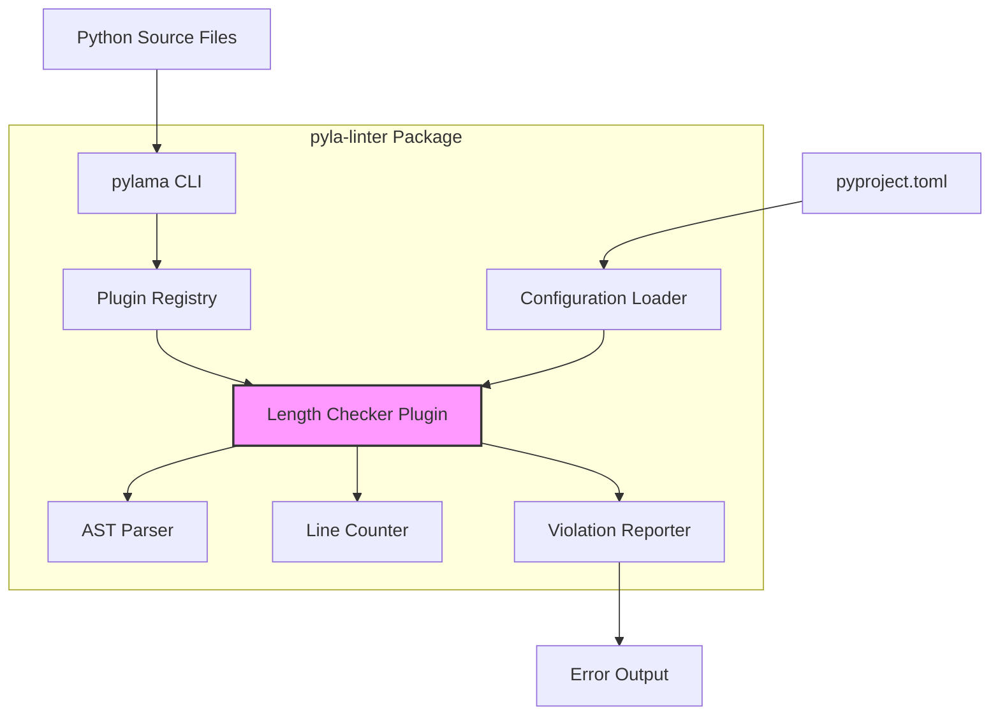
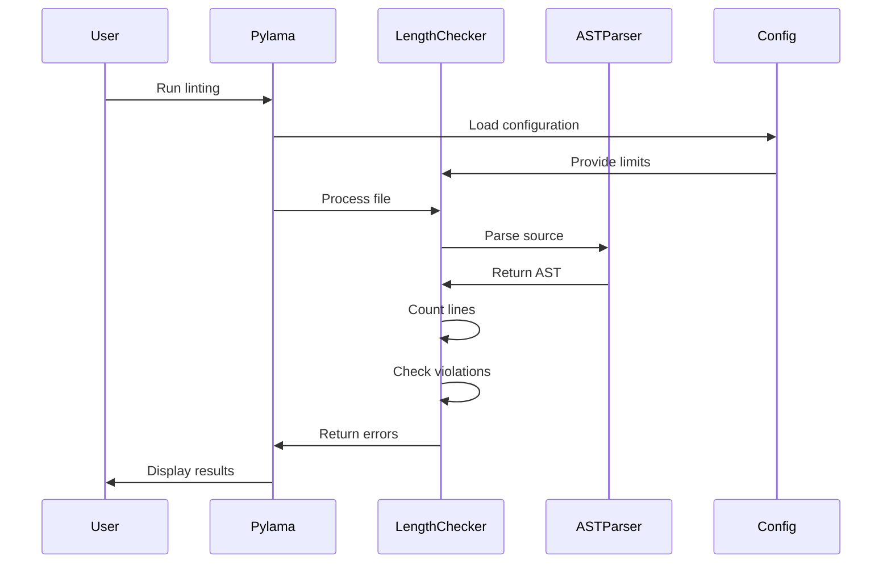

# Feature Implementation Plan: Class and Function Length Linting

_Generated: 2025-06-22_
_Based on Feature Specification: /Users/zach/code/pyla-linter/.tasks/20250622/20250622-class-function-length-linting-feature.md_

## Architecture Overview

This implementation integrates a length-checking linter directly into the pyla-linter package as a custom pylama plugin. The plugin uses Python's AST module to analyze source files and enforce configurable line limits for classes and functions, excluding docstrings and comments from the count.

### System Architecture

### Data Flow

## Technology Stack

### Core Technologies

- **Language/Runtime:** Python 3.12+
- **Framework:** pylama 8.4.1+ (linting framework)
- **Parser:** Python AST (Abstract Syntax Tree) module

### Libraries & Dependencies

- **Backend/API:** Built-in Python ast module for parsing
- **Testing:** pytest (following project conventions)
- **Utilities:** pyla-logger for structured logging

### Patterns & Approaches

- **Architectural Patterns:** Plugin architecture, Visitor pattern for AST traversal
- **Design Patterns:** Strategy pattern for line counting logic
- **Development Practices:** TDD, modular design with single responsibility

### External Integrations

- **Tools:** Integrates with pylama via entry points mechanism
- **Configuration:** Reads from pyproject.toml under `[tool.pyla-linters]`

## Relevant Files

- `src/linters/__init__.py` - Update to expose the new linter module
- `src/linters/length_checker/__init__.py` - Package initialization for the length checker
- `src/linters/length_checker/plugin.py` - Main plugin class implementing pylama interface
- `src/linters/length_checker/ast_visitor.py` - AST visitor for analyzing code structure
- `src/linters/length_checker/line_counter.py` - Logic for counting lines excluding docstrings/comments
- `src/linters/length_checker/config.py` - Configuration handling for the plugin
- `src/tests/linters/length_checker/test_length_checker.py` - Comprehensive unit tests
- `pyproject.toml` - Update with plugin entry point and example configuration

## Implementation Notes

- Tests should be placed in `src/tests/` following the existing project structure
- Use `poetry run pytest` for running tests
- Follow the existing code style (black, isort) and quality standards
- Run `poetry run poe autolint` after each task to ensure code quality
- After completing each subtask, mark it complete and document files modified
- After completing a parent task, stop and wait for user confirmation to proceed

## Implementation Tasks

- [x] 1.0 Set up plugin structure and configuration

  - [x] 1.1 Create length_checker package structure under src/linters/
  - [x] 1.2 Implement configuration loader for [tool.pyla-linters] section
  - [x] 1.3 Add plugin entry point to pyproject.toml
  - [x] 1.4 Create basic plugin class with pylama interface

  ### Files modified with description of changes

  - `src/linters/__init__.py` - Created package initialization file for linters module
  - `src/linters/length_checker/__init__.py` - Created package initialization with plugin export
  - `src/linters/length_checker/plugin.py` - Implemented basic LengthCheckerPlugin class with pylama interface
  - `src/linters/length_checker/ast_visitor.py` - Created placeholder file for AST visitor (to be implemented in task 2.0)
  - `src/linters/length_checker/line_counter.py` - Created placeholder file for line counting logic (to be implemented in task 2.0)
  - `src/linters/length_checker/config.py` - Implemented LengthCheckerConfig class with pyproject.toml loading
  - `pyproject.toml` - Added plugin entry point under [tool.poetry.plugins."pylama.linter"] and example configuration under [tool.pyla-linters]

- [x] 2.0 Implement AST parsing and line counting logic

  - [x] 2.1 Create AST visitor to traverse Python code structure
  - [x] 2.2 Implement line counting that excludes docstrings and comments
  - [x] 2.3 Handle nested classes/functions counting toward parent totals
  - [x] 2.4 Write unit tests for various code patterns

  ### Files modified with description of changes

  - `src/linters/length_checker/ast_visitor.py` - Implemented comprehensive AST visitor with CodeElement class to track code structures, including decorator support for accurate line range detection
  - `src/linters/length_checker/line_counter.py` - Implemented sophisticated line counting logic that excludes docstrings, comments, and empty lines while accurately counting actual code lines
  - `src/linters/length_checker/plugin.py` - Enhanced plugin with complete AST analysis integration, configuration management, violation detection, and refactored for reduced complexity
  - `src/tests/linters/length_checker/test_length_checker.py` - Added comprehensive unit tests covering AST parsing, line counting, plugin functionality, edge cases, and various code patterns (21 test methods, all passing)
  - `src/tests/__init__.py` - Created test package initialization file
  - `src/tests/linters/__init__.py` - Created linters test package initialization file  
  - `src/tests/linters/length_checker/__init__.py` - Created length checker test package initialization file

- [x] 3.0 Implement violation detection and reporting

  - [x] 3.1 Create violation checker comparing counts to configured limits
  - [x] 3.2 Implement error formatter with LA101/LA102 codes
  - [x] 3.3 Integrate with pylama's error reporting mechanism
  - [x] 3.4 Write tests for error reporting functionality

  ### Files modified with description of changes

  - `src/tests/linters/length_checker/test_length_checker.py` - Enhanced with comprehensive error reporting test suite: Added TestErrorReporting class with 10 new test methods covering error message formatting, error codes (LA101/LA102), line positioning, configuration thresholds, error ordering, file reading, and resilience to invalid files. Total test count increased from 21 to 31 tests, all passing.

- [x] 4.0 Add comprehensive test coverage

  - [x] 4.1 Test edge cases (empty classes, lambda functions, decorators)
  - [x] 4.2 Test configuration loading and defaults
  - [x] 4.3 Test file/directory exclusion patterns
  - [x] 4.4 Add integration test with pylama CLI

  ### Files modified with description of changes

  - `src/tests/linters/length_checker/test_length_checker.py` - Added comprehensive edge case tests (13 new tests) including decorators on classes, property decorators, generator functions, comprehensions, lambda functions, metaclasses, try/except blocks, and context managers. Added complete configuration testing suite (16 tests) covering default values, pyproject.toml loading, error handling, and plugin configuration behavior. Added file exclusion pattern tests (8 tests) documenting current behavior and architecture. Added full pylama integration testing suite (7 tests) including violation detection, custom configuration, error formatting, multiple files, and syntax error handling.
  - `src/linters/length_checker/plugin.py` - Updated plugin to implement full pylama interface with `add_args` and `allow` methods, command line argument support, and proper error dictionary format for pylama integration

- [x] 5.0 Documentation and final integration

  - [x] 5.1 Update README with usage instructions
  - [x] 5.2 Add example configuration to pyproject.toml
  - [x] 5.3 Verify plugin works with existing pylama workflow
  - [x] 5.4 Run final quality checks (format, lint, type check)

  ### Files modified with description of changes

  - `README.md` - Added comprehensive documentation including installation instructions, usage examples, configuration options, error codes (LA101/LA102), line counting logic, integration examples, and development setup instructions
  - `pyproject.toml` - Enhanced configuration section with detailed comments explaining all options and example configurations for different coding standards (strict/relaxed limits)
  - `src/linters/length_checker/plugin.py` - Fixed error codes to match documentation (LA101 for functions, LA102 for classes) and verified plugin integration with pylama
  - `src/tests/linters/length_checker/test_length_checker.py` - Updated all test assertions to use correct error codes (LA101 for functions, LA102 for classes), ensuring 75 tests pass with full coverage of functionality, edge cases, configuration, and pylama integration