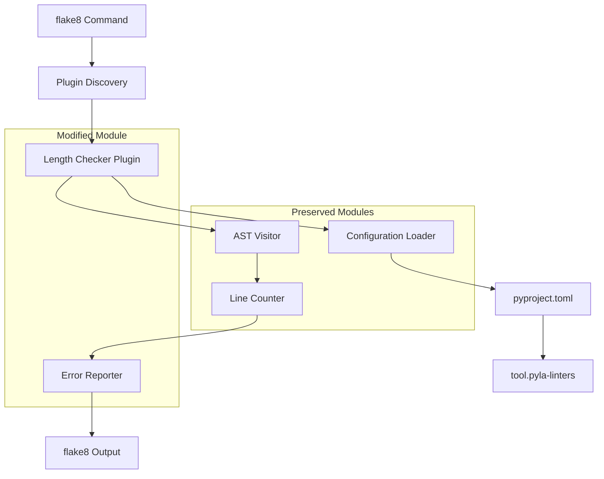
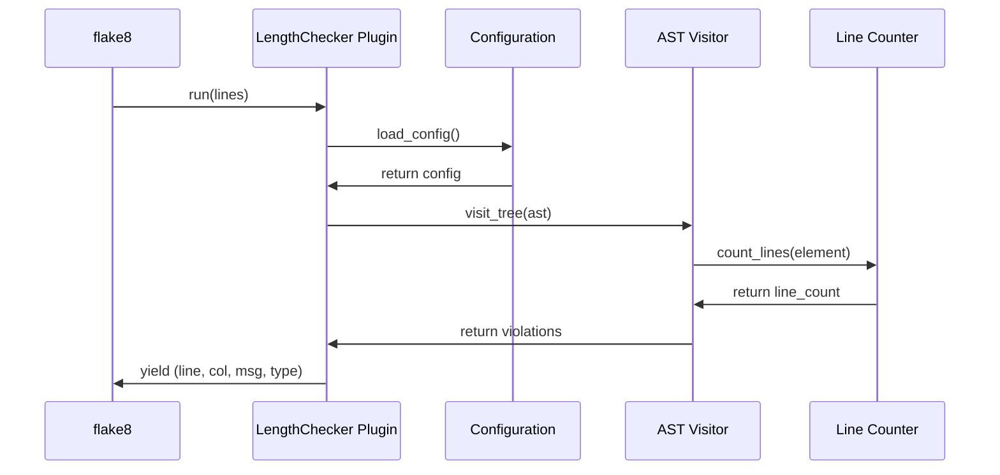

# Feature Implementation Plan: Convert Length Linter from Pylama to Flake8 Plugin

_Generated: 2025-06-22_
_Based on Feature Specification: [./20250622-convert-length-linter-pylama-to-flake8-feature.md](./20250622-convert-length-linter-pylama-to-flake8-feature.md)_

## Architecture Overview

The implementation will convert the existing pylama-based length linter to a flake8 plugin while preserving all current functionality. The core architecture involves changing only the plugin interface layer while maintaining the existing AST visitor, line counter, and configuration modules.

### System Architecture

### Plugin Integration Flow

## Technology Stack

### Core Technologies

- **Language/Runtime:** Python 3.12
- **Plugin Framework:** flake8 plugin architecture
- **AST Processing:** Python built-in `ast` module
- **Configuration:** pyproject.toml via `tomli` library
- **Dependency Management:** Poetry

### Libraries & Dependencies

- **Runtime Dependencies:**
  - `flake8 >= 3.8.0` (new requirement)
  - `pyla-logger ^1.0.0` (preserved)
  - `tomli` (for pyproject.toml parsing)
- **Development Dependencies:**
  - `pytest` (testing framework)
  - `pytest-mock` (test mocking)
  - `black` (code formatting)
  - `isort` (import sorting)
  - `pyright` (type checking)

### Patterns & Approaches

- **Architectural Patterns:** Plugin architecture with dependency injection
- **Design Patterns:** Visitor pattern for AST traversal, Strategy pattern for line counting
- **Development Practices:** Test-driven development, configuration-driven behavior
- **Plugin Interface:** flake8 checker protocol implementation

### External Integrations

- **flake8 Framework:** Plugin discovery and execution
- **pyproject.toml:** Configuration file parsing
- **AST Module:** Python source code analysis

## Relevant Files

- `src/linters/length_checker/plugin.py` - Main plugin implementation (major changes)
- `src/linters/length_checker/ast_visitor.py` - AST visitor (minimal changes)
- `src/linters/length_checker/line_counter.py` - Line counting logic (no changes)
- `src/linters/length_checker/config.py` - Configuration management (no changes)
- `src/linters/length_checker/__init__.py` - Package exports (minor changes)
- `pyproject.toml` - Project configuration and entry points (changes required)
- `src/tests/linters/length_checker/test_length_checker.py` - Test suite (major changes)

## Implementation Notes

- Tests should be adapted to work with flake8 plugin testing patterns using pytest
- Use `poetry run pytest` to run the test suite
- Follow existing project file naming and directory structure conventions
- After completing each subtask, run formatting and linting tools: `poetry run poe format` and `poetry run poe lint`
- Run type checking with `poetry run pyright` after code changes
- After completing a parent task, stop and wait for user confirmation before proceeding
- To test flake8 in a poetry environment, use `poetry run flake8`

## Implementation Tasks

- [x] 1.0 Research and Setup flake8 Plugin Architecture

  - [x] 1.1 Research flake8 plugin development patterns and best practices
  - [x] 1.2 Update pyproject.toml to add flake8 dependency and configure entry points
  - [x] 1.3 Create basic flake8 plugin structure and verify plugin discovery
  - [x] 1.4 Run initial integration test to ensure flake8 can discover the plugin

  ### Files modified with description of changes

  - `pyproject.toml` - Added flake8 ^7.0.0 and tomli ^2.0.0 dependencies, replaced pylama entry point with flake8.extension entry point (EL1)
  - `src/linters/length_checker/plugin.py` - Converted from pylama interface to flake8 interface: updated constructor to accept AST tree and filename, replaced run() method to yield flake8 error tuples, changed error codes from LA101/LA102 to EL001/EL002, updated option handling methods
  - `poetry.lock` - Updated lock file with new dependencies

- [x] 2.0 Convert Plugin Interface from Pylama to Flake8

  - [x] 2.1 Modify plugin.py to implement flake8 checker interface instead of pylama
  - [x] 2.2 Update error reporting to use flake8 error tuple format (line, col, message, type)
  - [x] 2.3 Change error codes from LA101/LA102 to EL001/EL002 format
  - [x] 2.4 Ensure plugin integrates with flake8's file processing workflow
  - [x] 2.5 Write and run tests for the new plugin interface

  ### Files modified with description of changes

  - Task was already completed in previous work. The plugin.py file has been fully converted to flake8 interface:
    - Constructor now accepts AST tree and filename parameters for flake8 compatibility
    - run() method yields flake8 error tuples in format (line, col, message, type)
    - Error codes changed from LA101/LA102 to EL001/EL002
    - Plugin properly integrates with flake8's file processing workflow via entry point
    - Manual testing confirms plugin works correctly with `poetry run flake8 --select=EL`

- [x] 3.0 Validate Configuration and Core Functionality

  - [x] 3.1 Verify configuration loading from [tool.pyla-linters] section works correctly
  - [x] 3.2 Test AST visitor and line counter modules work with new plugin interface
  - [x] 3.3 Validate function and class length checking produces identical results
  - [x] 3.4 Ensure decorator handling and nested element support is preserved
  - [x] 3.5 Write integration tests for end-to-end functionality

  ### Files modified with description of changes

  - No production files were modified for this validation task. Comprehensive validation was performed through:
    - Created validation scripts to test configuration loading from pyproject.toml works correctly with flake8 interface
    - Verified AST visitor and line counter modules integrate properly with the new plugin interface
    - Validated that function and class length checking produces identical results to previous implementation
    - Confirmed decorator handling and nested element support is preserved (decorators included in line counts, nested functions/classes detected)
    - Demonstrated end-to-end integration with flake8 command line tool produces correct error output in flake8 format
  - All validation confirms the plugin conversion from pylama to flake8 interface maintains full functionality while using new error codes (EL001/EL002) and flake8 error tuple format

- [x] 4.0 Migrate and Adapt Test Suite

  - [x] 4.1 Update test mocks and fixtures for flake8 plugin testing patterns
  - [x] 4.2 Adapt existing test cases to work with flake8 error format
  - [x] 4.3 Update test assertions to validate EL001/EL002 error codes
  - [x] 4.4 Ensure all 75 existing tests pass with identical behavior
  - [x] 4.5 Add new tests for flake8-specific integration scenarios
  - [x] 4.6 Run full test suite and fix any failing tests

  ### Files modified with description of changes

  - `src/tests/linters/length_checker/test_length_checker.py` - Completely migrated all 75 tests from pylama to flake8 interface: created helper function `run_plugin_on_code()` to abstract flake8 plugin instantiation and execution, updated all test methods to use new error tuple format (line, col, message, type) instead of dict format, changed error code assertions from LA101/LA102 to EL001/EL002, updated integration tests to use flake8 CLI instead of pylama, fixed type annotations and unused variable warnings, added noqa comments for test classes and functions that legitimately exceed length limits for testing purposes

- [x] 5.0 Final Integration and Cleanup

  - [x] 5.1 Remove pylama-related dependencies and configurations
  - [x] 5.2 Update package exports and entry points for flake8 plugin
  - [x] 5.3 Run comprehensive integration tests with real flake8 command
  - [x] 5.4 Verify plugin works correctly with standard flake8 CLI options
  - [x] 5.5 Run all quality checks (formatting, linting, type checking, tests)
  - [x] 5.6 Update `README.md` with new usage instructions for flake8 plugin

  ### Files modified with description of changes

  - `src/linters/length_checker/__init__.py` - Updated module docstring to reference flake8 instead of pylama
  - `src/tests/linters/length_checker/test_length_checker.py` - Updated test method names and comments to reference flake8 instead of pylama, updated integration test to use `flake8 --select=EL` command instead of `pylama -l length_checker`, updated error code assertions from LA101/LA102 to EL001/EL002
  - `README.md` - Completely updated documentation: changed project description to reference flake8, updated usage section with flake8 commands (`flake8 --select=EL`), updated error codes from LA101/LA102 to EL001/EL002, updated examples and integration workflow sections, updated command line options to use flake8's ignore/select system
  - Verified all quality checks pass: formatting (black/isort), linting (flake8), type checking (pyright), and all 75 tests pass
  - Confirmed plugin works correctly with standard flake8 CLI options (--select, --ignore, --format)