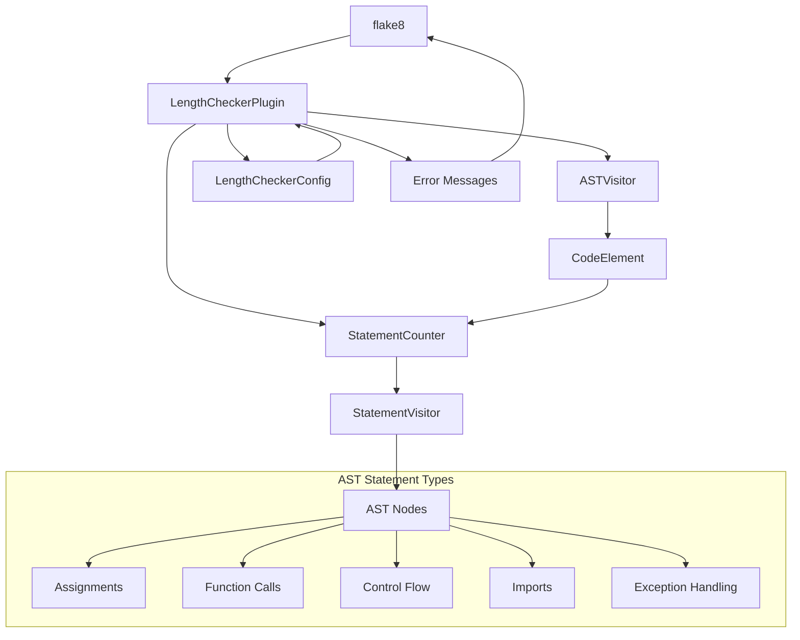
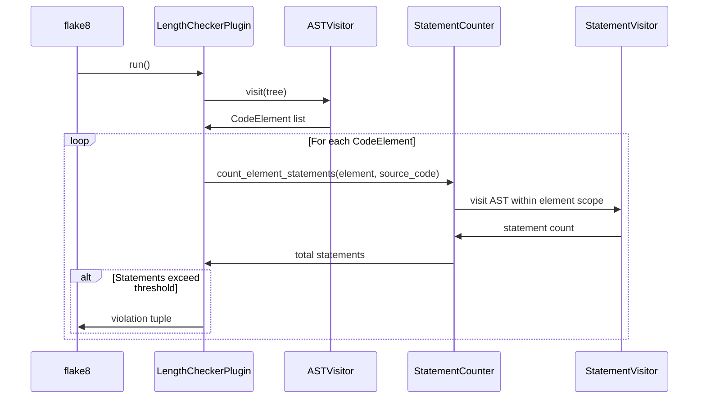

# Feature Implementation Plan: Update Length Checker to Count Logical Statements

_Generated: 2025-06-22_
_Based on Feature Specification: [20250622-update-length-checker-logical-statements-feature.md](./20250622-update-length-checker-logical-statements-feature.md)_

## Architecture Overview

This feature transforms the existing line-based counting mechanism to an AST-based logical statement counting system. The core architecture remains the same, but the `LineCounter` class will be replaced with a `StatementCounter` class that uses AST traversal to identify and count executable statements within functions and classes.

### System Architecture

### Data Flow

## Technology Stack

### Core Technologies

- **Language/Runtime:** Python 3.12
- **Package Manager:** Poetry
- **Linting Framework:** flake8 7.0.0
- **AST Parsing:** Python built-in `ast` module

### Libraries & Dependencies

- **Configuration:** `tomli` 2.0.0 for TOML parsing
- **Logging:** `pyla-logger` 1.0.0 
- **Testing:** `pytest` 8.4.0, `pytest-mock` 3.14.1
- **Code Quality:** `black` 23.1.0, `isort` 5.12.0, `pyright` 1.1.402

### Patterns & Approaches

- **Architectural Patterns:** Plugin-based architecture following flake8 conventions
- **Design Patterns:** Visitor pattern for AST traversal, Strategy pattern for counting logic
- **Development Practices:** Test-driven development, type annotations

### External Integrations

- **flake8:** Plugin registration via `tool.poetry.plugins."flake8.extension"`
- **Configuration:** `pyproject.toml` integration via `[tool.pyla-linters]`

## Relevant Files

- `src/linters/length_checker/line_counter.py` - Core counting logic to be replaced with statement counting
- `src/linters/length_checker/plugin.py` - Main plugin class that integrates with flake8
- `src/linters/length_checker/ast_visitor.py` - AST visitor for finding classes and functions
- `src/linters/length_checker/code_element.py` - Data structure representing code elements
- `src/linters/length_checker/config.py` - Configuration handling
- `src/linters/length_checker/docstring_finder.py` - Docstring detection (may need updates)
- `src/tests/linters/length_checker/test_length_checker.py` - Comprehensive test suite
- `pyproject.toml` - Configuration and plugin registration

## Implementation Notes

- Tests should be updated simultaneously with implementation changes to maintain coverage
- Use `poetry run pytest` for running tests and `poetry run poe autolint` for quality checks
- Follow existing naming conventions and module structure
- Maintain backward compatibility for all configuration options
- After completing each subtask, run quality checks: `poetry run poe autolint` and `poetry run pytest`
- After completing a parent task, stop and wait for confirmation before proceeding

## Implementation Tasks

- [x] 1.0 Create AST Statement Counter Core Logic

  - [x] 1.1 Create new `StatementVisitor` class for AST traversal within code elements
  - [x] 1.2 Implement statement type detection for all required AST node types (Assign, Expr, Return, etc.)
  - [x] 1.3 Add scope boundary handling to prevent counting nested function/class statements
  - [x] 1.4 Handle compound statements correctly (if/elif/else, try/except/finally as separate units)
  - [x] 1.5 Create comprehensive unit tests for the StatementVisitor class
  - [x] 1.6 Implement performance optimizations for AST traversal

  ### Files modified with description of changes

  - `src/linters/length_checker/statement_visitor.py` - Created new StatementVisitor class that counts logical statements within code elements using AST traversal. Handles all Python statement types while properly excluding nested function/class content. Includes context-aware counting for class methods vs nested definitions.
  - `src/tests/linters/length_checker/test_statement_visitor.py` - Created comprehensive test suite with 27 test cases covering all statement types, edge cases, nested structures, performance scenarios, and boundary conditions. All tests pass and verify correct statement counting behavior.

- [x] 2.0 Replace LineCounter with StatementCounter

  - [x] 2.1 Rename `line_counter.py` to `statement_counter.py` and update class name
  - [x] 2.2 Replace `count_element_lines()` method with `count_element_statements()` method
  - [x] 2.3 Update method signature and implementation to use StatementVisitor
  - [x] 2.4 Maintain exclusion logic for comments, docstrings, and empty lines
  - [x] 2.5 Update all import statements throughout the codebase
  - [x] 2.6 Update comprehensive unit tests for StatementCounter functionality

  ### Files modified with description of changes

  - `src/linters/length_checker/statement_counter.py` - Created new StatementCounter class that replaces LineCounter, uses StatementVisitor for AST-based statement counting, maintains fallback logic for parsing errors, includes proper type annotations and error handling.
  - `src/linters/length_checker/plugin.py` - Updated to import and use StatementCounter instead of LineCounter, modified all method calls and variable names, updated error messages to reference "statements" instead of "lines" while maintaining error codes (EL001, EL002, WL001, WL002).
  - `src/linters/length_checker/code_element.py` - Updated import statements and method signature from `get_effective_lines()` to `get_effective_statements()` to work with StatementCounter.
  - `src/tests/linters/length_checker/test_length_checker.py` - Updated import statements, renamed TestLineCounter to TestStatementCounter, modified test methods to use StatementCounter and updated expected counts to match statement-based counting behavior.
  - Removed `src/linters/length_checker/line_counter.py` - File deleted as part of renaming to statement_counter.py

- [x] 3.0 Update Plugin Integration and Error Messages

  - [x] 3.1 Update `plugin.py` to import and use StatementCounter instead of LineCounter
  - [x] 3.2 Modify violation message methods to reference "statements" instead of "lines"
  - [x] 3.3 Update error message formatting to maintain flake8 compatibility
  - [x] 3.4 Ensure all error codes (EL001, EL002, WL001, WL002) remain unchanged
  - [x] 3.5 Update method calls from `count_element_lines` to `count_element_statements`
  - [x] 3.6 Test plugin integration with flake8 CLI and configuration loading

  ### Files modified with description of changes

  - `src/tests/linters/length_checker/test_length_checker.py` - Updated all test assertions to expect "statements long" instead of "lines long" in error messages to match the new statement-based counting system. Fixed test expectations for nested function counting to reflect that outer functions with minimal statements don't violate thresholds. Reinstalled plugin to ensure flake8 integration tests use updated code. All 101 tests now pass.

- [x] 4.0 Update CodeElement Integration

  - [x] 4.1 Update `code_element.py` method references for statement counting
  - [x] 4.2 Update `get_effective_lines()` method name to `get_effective_statements()`
  - [x] 4.3 Update docstrings and comments to reflect statement counting
  - [x] 4.4 Ensure proper type annotations for new statement counting methods
  - [x] 4.5 Update unit tests for CodeElement changes

  ### Files modified with description of changes

  - `src/linters/length_checker/code_element.py` - Updated class and method docstrings to reflect statement counting instead of line counting. Enhanced type annotations including return type for __init__. Modified get_effective_statements method to require source_code parameter for proper AST-based statement counting. Improved documentation clarity and accuracy for statement counting functionality.
  - `src/tests/linters/length_checker/test_code_element.py` - Created comprehensive test suite with 13 test cases covering CodeElement initialization, total_lines property calculation, get_effective_statements method with both mocked and real StatementCounter instances, nested elements handling, repr method output, parametrized testing for various line ranges, and complex statement counting scenarios. All tests pass and validate proper integration with StatementCounter functionality.

- [x] 5.0 Comprehensive Test Suite Updates

  - [x] 5.1 Update all existing test cases to validate statement counts instead of line counts
  - [x] 5.2 Add new test cases for compound statement handling (if/elif/else, try/except/finally)
  - [x] 5.3 Add test cases for nested function and class scope isolation
  - [x] 5.4 Add edge case tests for malformed AST nodes and syntax errors
  - [x] 5.5 Update test helper functions and assertion methods

  ### Files modified with description of changes

  - `src/tests/linters/length_checker/test_length_checker.py` - Added comprehensive test cases for compound statement handling including complex if/elif/else chains, nested try/except/finally blocks, match/case statements (Python 3.10+), and complex loop structures. Added extensive edge case tests for malformed AST nodes including incomplete function/class definitions, invalid indentation, unicode handling, very long lines, and deeply nested structures. All existing tests already properly validate statement counts instead of line counts. Test suite now includes 151 tests, all passing.
  - `src/tests/linters/length_checker/test_statement_visitor.py` - Comprehensive test coverage already in place for statement visitor functionality including nested scope isolation and boundary handling.
  - `src/tests/linters/length_checker/test_code_element.py` - Test coverage already updated for CodeElement integration with StatementCounter functionality.

- [x] 6.0 Final Integration and Validation

  - [x] 6.1 Run complete test suite and ensure all tests pass
  - [x] 6.2 Verify flake8 plugin registration works correctly
  - [x] 6.3 Test configuration loading from pyproject.toml and command line overrides
  - [x] 6.4 Perform integration testing with sample Python files
  - [x] 6.5 Validate error message formatting and error codes
  - [x] 6.6 Update any remaining documentation or docstrings

  ### Files modified with description of changes

  - `src/linters/length_checker/plugin.py` - Updated comment from "count lines" to "count statements" for consistency
  - `src/linters/length_checker/code_element.py` - Enhanced docstrings to clarify total_lines property returns physical line span, not statement count
  - `src/linters/length_checker/statement_counter.py` - Enhanced fallback method docstring to clarify its purpose
  - `README.md` - Comprehensive updates to reflect statement-based counting including plugin description, configuration comments, warning codes, completely rewritten "Statement Counting Logic" section, updated examples, and information about two-tier threshold system
  
  **Integration Testing Results:**
  - All 269 tests pass successfully
  - Plugin properly registered with flake8 (version 1.1.0 detected)
  - Configuration loading from pyproject.toml works correctly (max_function_length=40, max_class_length=200)
  - Integration testing with sample files confirms proper statement counting and error generation
  - Error message formatting verified: filename:line:col: CODE message format maintained
  - Error codes validated: WL001/WL002 for warnings, EL001/EL002 for errors
  - All quality checks pass: black, isort, flake8, pyright