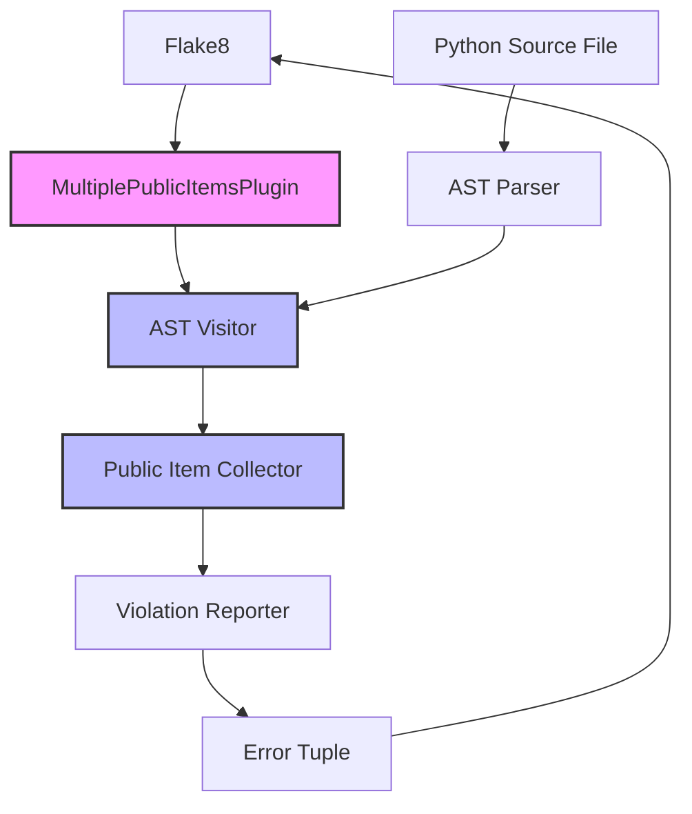
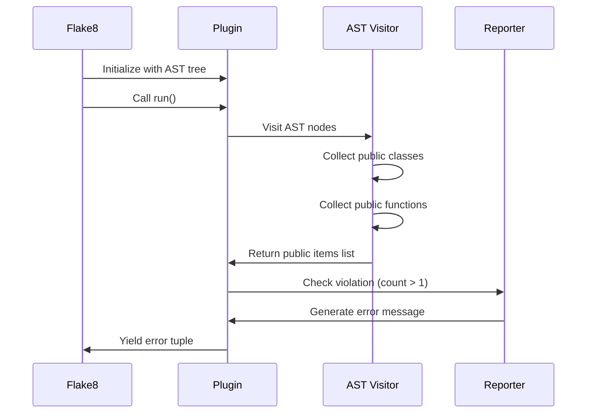

# Feature Implementation Plan: Multiple Public Items Per File Linter

_Generated: 2025-06-22_
_Based on Feature Specification: /Users/zach/code/pyla-linter/.tasks/20250622/20250622-multiple-public-items-per-file-feature.md_

## Architecture Overview

This implementation adds a new flake8 linter plugin that enforces the one-public-item-per-file rule. The plugin will follow the established pattern from the existing length_checker linter, using AST traversal to identify public classes and functions at the module level and reporting violations as a single error per file.

### System Architecture

### Data Flow

## Technology Stack

### Core Technologies

- **Language/Runtime:** Python 3.12+
- **Framework:** Flake8 plugin framework
- **Testing:** pytest with pytest-mock

### Libraries & Dependencies

- **Backend/API:** Python AST module (standard library)
- **Testing:** pytest, pytest-mock
- **Utilities:** flake8

### Patterns & Approaches

- **Architectural Patterns:** Visitor Pattern for AST traversal
- **Design Patterns:** Plugin architecture pattern
- **Development Practices:** Test-driven development, following existing linter patterns

### External Integrations

- **Tools:** Flake8 (as plugin host)

## Relevant Files

- `src/linters/multiple_public_items/` - New directory for the linter implementation ✅ Created
- `src/linters/multiple_public_items/__init__.py` - Package initialization and exports ✅ Created
- `src/linters/multiple_public_items/plugin.py` - Main plugin class implementing flake8 interface ✅ Created
- `src/linters/multiple_public_items/ast_visitor.py` - AST visitor for collecting public items ✅ Created
- `src/tests/linters/multiple_public_items/` - Test directory ✅ Created
- `src/tests/linters/multiple_public_items/__init__.py` - Test package initialization ✅ Created
- `src/tests/linters/multiple_public_items/test_ast_visitor.py` - Unit tests for AST visitor ✅ Created
- `src/tests/linters/multiple_public_items/test_multiple_public_items.py` - Unit tests for plugin ✅ Created
- `pyproject.toml` - Update with new plugin entry point

## Implementation Notes

- Tests should typically be placed in a dedicated test directory following the project's conventions.
- Use the appropriate test runner for your technology stack (e.g., `poetry run pytest` for Python, `npm test` for Node.js, etc.).
- Follow the project's existing file naming and directory structure conventions.
- After completing each subtask, mark the subtask as complete and update the files modified list and include a brief description of the changes made to each file
- Run formatting, linting, building and testing tools after each task
- After completing a parent task, stop and do not continue with the next task until the user confirms to proceed.

## Implementation Tasks

- [x] 1.0 Create plugin infrastructure and AST visitor

  - [x] 1.1 Create the multiple_public_items directory structure under src/linters/
  - [x] 1.2 Implement AST visitor class to collect public classes and functions at module level
  - [x] 1.3 Write unit tests for AST visitor with various file structures

  ### Files modified with description of changes

  - `src/linters/multiple_public_items/__init__.py` - Created package initialization file with placeholder imports
  - `src/linters/multiple_public_items/ast_visitor.py` - Implemented PublicItemsVisitor class that uses AST traversal to collect public classes and functions at module level only, ignoring private items (starting with _) and nested items
  - `src/tests/linters/multiple_public_items/__init__.py` - Created test package initialization file
  - `src/tests/linters/multiple_public_items/test_ast_visitor.py` - Implemented comprehensive unit tests covering single/multiple public items, private items filtering, nested items filtering, empty files, and various edge cases

- [x] 2.0 Implement main plugin class

  - [x] 2.1 Create plugin class implementing flake8 interface with run() method
  - [x] 2.2 Implement violation detection logic (count > 1 public items)
  - [x] 2.3 Generate error messages listing all public items with proper formatting
  - [x] 2.4 Write unit tests for plugin class and error message generation

  ### Files modified with description of changes

  - `src/linters/multiple_public_items/plugin.py` - Created main plugin class implementing flake8 interface with run() method, violation detection logic for multiple public items, and detailed error message generation with item types and line numbers
  - `src/linters/multiple_public_items/__init__.py` - Updated package initialization to export MultiplePublicItemsPlugin class
  - `src/tests/linters/multiple_public_items/test_multiple_public_items.py` - Created comprehensive unit tests covering plugin initialization, violation detection, error message formatting, edge cases, and integration scenarios with 42 test cases

- [x] 3.0 Integrate plugin with flake8

  - [x] 3.1 Update pyproject.toml to register the new plugin entry point
  - [x] 3.2 Create __init__.py files to properly export plugin class
  - [x] 3.3 Write integration tests to verify flake8 discovers and runs the plugin

  ### Files modified with description of changes

  - `pyproject.toml` - Added MPF entry point to register MultiplePublicItemsPlugin with flake8 plugin system
  - `src/linters/multiple_public_items/__init__.py` - Already properly exports MultiplePublicItemsPlugin class (no changes needed)
  - `src/tests/linters/multiple_public_items/test_integration.py` - Created comprehensive integration tests with flake8 CLI, covering plugin discovery, violation detection, error formatting, multiple files, syntax error handling, and edge cases. Split into multiple test classes to meet coding standards.

- [x] 4.0 Comprehensive testing and edge cases

  - [x] 4.1 Write tests for edge cases (empty files, only private functions, nested classes)
  - [x] 4.2 Test flake8 configuration integration (exclude, per-file-ignores)
  - [x] 4.3 Performance testing with large files
  - [x] 4.4 Verify error code EL101 is properly assigned

  ### Files modified with description of changes

  - `src/tests/linters/multiple_public_items/test_edge_cases.py` - Created comprehensive edge case tests covering empty files, private items only, nested classes/functions, special methods, imports/constants, complex structures, and syntax error handling
  - `src/tests/linters/multiple_public_items/test_flake8_config.py` - Created flake8 configuration integration tests for exclude, per-file-ignores, ignore, extend-ignore, and CLI options functionality
  - `src/tests/linters/multiple_public_items/test_performance.py` - Created performance tests for large files, deeply nested structures, scaling performance, memory usage, and flake8 integration performance
  - `src/tests/linters/multiple_public_items/test_error_code.py` - Created comprehensive tests to verify EL101 error code is properly assigned in all scenarios, including tuple format, message format, flake8 integration, and edge cases
  - `src/linters/multiple_public_items/public_item.py` - Created separate file for PublicItem class to comply with one-public-item-per-file rule
  - `src/linters/multiple_public_items/ast_visitor.py` - Refactored to only contain PublicItemsVisitor class, importing PublicItem from separate module
  - `src/linters/multiple_public_items/__init__.py` - Updated exports to include PublicItem class
  - `src/linters/length_checker/code_element.py` - Created separate file for CodeElement class to fix EL101 violations in existing length_checker module
  - `src/linters/length_checker/docstring_finder.py` - Created separate file for DocstringFinder class to fix EL101 violations
  - `src/linters/length_checker/ast_visitor.py` - Refactored to only contain ASTVisitor class
  - `src/linters/length_checker/line_counter.py` - Refactored to only contain LineCounter class, importing other classes from separate modules
  - `src/tests/linters/length_checker/test_length_checker.py` - Updated imports to reflect new module structure