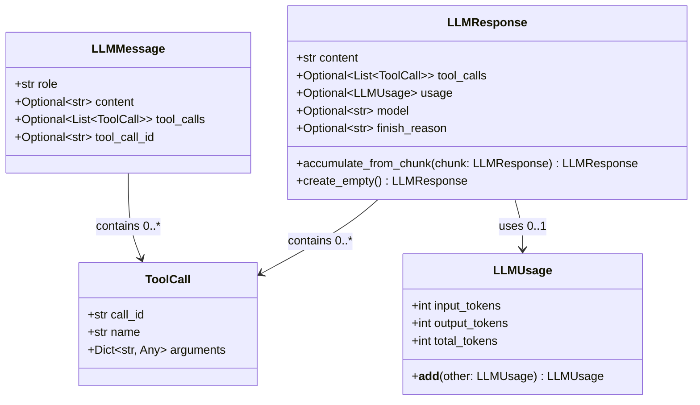

```mermaid
classDiagram
    class ToolCall {
        +str call_id
        +str name
        +Dict~str, Any~ arguments
    }

    class LLMMessage {
        +str role
        +Optional~str~ content
        +Optional~List~ToolCall~~ tool_calls
        +Optional~str~ tool_call_id
    }

    class LLMUsage {
        +int input_tokens
        +int output_tokens
        +int total_tokens
        +__add__(other: LLMUsage) LLMUsage
    }

    class LLMResponse {
        +str content
        +Optional~List~ToolCall~~ tool_calls
        +Optional~LLMUsage~ usage
        +Optional~str~ model
        +Optional~str~ finish_reason
        +accumulate_from_chunk(chunk: LLMResponse) LLMResponse
        +create_empty() LLMResponse
    }

    %% 关系
    LLMMessage --> ToolCall : contains 0..*
    LLMResponse --> ToolCall : contains 0..*
    LLMResponse --> LLMUsage : uses 0..1

```