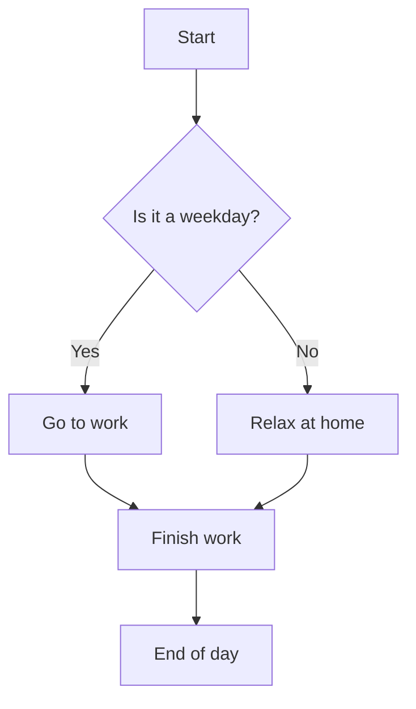
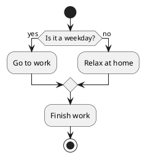
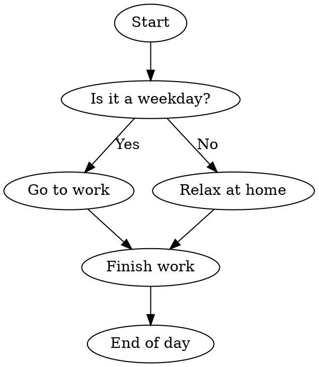
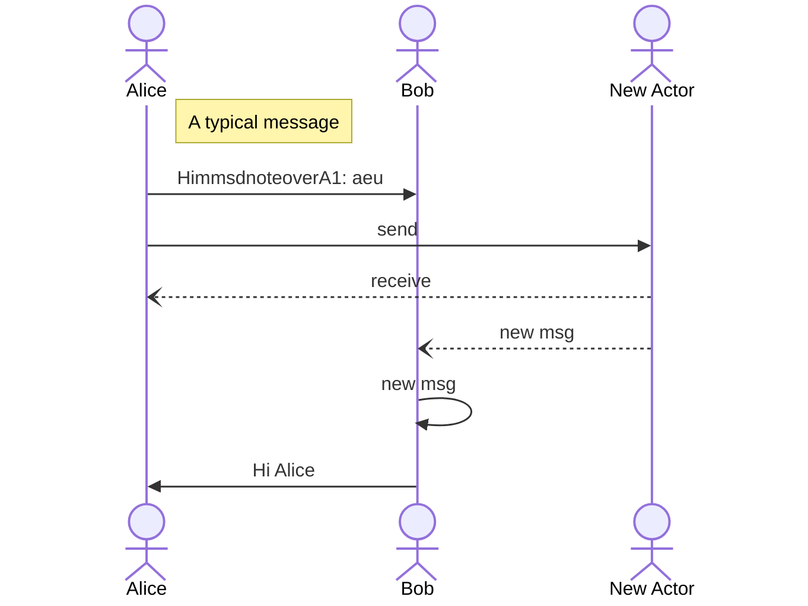

```mermaid

flowchart TD
    A[Start] --> B{Is it a weekday?}
    B -- Yes --> C[Go to work]
    B -- No --> D[Relax at home]
    C --> E[Finish work]
    D --> E
    E --> F[End of day]
```

```plantuml
@startuml
start
if (Is it a weekday?) then (yes)
  :Go to work;
else (no)
  :Relax at home;
endif
:Finish work;
stop
@enduml
```

```dot
digraph G {
    A [label="Start"]
    B [label="Is it a weekday?"]
    C [label="Go to work"]
    D [label="Relax at home"]
    E [label="Finish work"]
    F [label="End of day"]

    A -> B
    B -> C [label="Yes"]
    B -> D [label="No"]
    C -> E
    D -> E
    E -> F
}
```

```mermaid
sequenceDiagram
actor Alice as Alice
actor Bob as Bob
actor A1 as New Actor

Note right of Alice: A typical message
Alice ->> Bob: HimmsdnoteoverA1: aeu
Alice ->> A1: send
A1 --) Alice: receive
A1 --) Bob: new msg
Bob ->> Bob: new msg
Bob ->> Alice: Hi Alice

```
