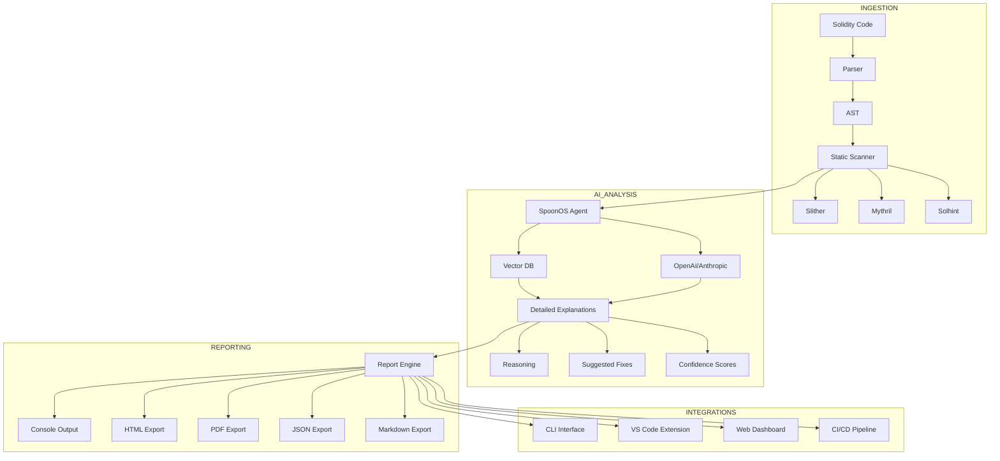

# AI-Powered Smart Contract Audit Assistant

An interactive SpoonOS-powered tool that provides real-time vulnerability checks, natural-language explanations, and hands-on learning for your Solidity contracts—before you deploy.

## Features

- **Real-time Security Analysis**: Instant vulnerability detection using static analysis tools (Slither, Mythril, Solhint)
- **AI-Powered Explanations**: Natural language explanations of vulnerabilities with reasoning and suggested fixes powered by SpoonOS Agent Framework
- **Interactive Learning**: Step-by-step tutorials and remediation guidance
- **Multiple Interfaces**: CLI tool, VS Code extension, and web dashboard
- **Professional Reports**: Export detailed audit reports in HTML, JSON, Markdown, and PDF formats
- **CI/CD Integration**: GitHub Actions and Git hooks for automated security checks
- **Watch Mode**: Continuous monitoring of contract changes during development

## Installation

### Prerequisites

- Python 3.10+
- Node.js 16+ (for VS Code extension and web dashboard)
- Git

### Install from PyPI

```bash
pip install spoon-audit
```

### Install from Source

```bash
git clone https://github.com/CodeKage25/smart-audit-assistant.git
cd smart-audit-assistant
pip install -e .
```

### Optional Dependencies

For PDF export functionality:
```bash
pip install weasyprint
```

## Quick Start

### 1. Configuration

First, configure your API keys and preferences:

```bash
# View current configuration
spoon-audit config --show

# Set OpenAI API key (required for AI explanations)
spoon-audit config --set api_keys.openai "your-api-key-here"

# Set LLM provider (default: openai)
spoon-audit config --set llm_provider "openai"

# Set model preference
spoon-audit config --set model_name "gpt-4"
```

### 2. Scan a Contract

```bash
# Scan a single Solidity file
spoon-audit scan ./contracts/MyContract.sol

# Scan with detailed AI explanations
spoon-audit scan --detailed ./contracts/MyContract.sol

# Scan entire project directory
spoon-audit scan ./contracts/

# Enable debug mode for detailed output
spoon-audit scan --debug ./contracts/MyContract.sol
```

### 3. View Reports

```bash
# Show the last scan report
spoon-audit report

# Show detailed report with AI reasoning and suggested fixes
spoon-audit report --detailed

# Filter by severity level
spoon-audit report --severity high

# Show only AI findings
spoon-audit report --ai-only
```

### 4. Export Professional Reports

```bash
# Export as HTML (modern, interactive report)
spoon-audit export --format html

# Export and open in browser
spoon-audit export --format html --open-browser

# Export as PDF (requires weasyprint)
spoon-audit export --format pdf

# Export as JSON for CI/CD integration
spoon-audit export --format json > audit-report.json

# Export as Markdown
spoon-audit export --format markdown
```

### 5. Watch Mode

Monitor your contracts during development:

```bash
# Watch a file and re-scan on changes
spoon-audit watch ./contracts/MyContract.sol

# Watch entire directory with detailed output
spoon-audit watch ./contracts/ --detailed

# Watch with custom interval
spoon-audit watch ./contracts/ --interval 5
```

## CLI Commands Reference

### `spoon-audit scan`

Analyze Solidity files or directories for vulnerabilities.

**Options:**
- `--detailed`: Show comprehensive AI analysis with reasoning and suggested fixes
- `--output-format`: Report format (console, json, markdown)
- `--severity`: Minimum severity level (info, low, medium, high, critical)
- `--exclude`: Patterns to exclude from scanning
- `--include-dependencies`: Include node_modules and dependencies
- `--debug`: Enable debug mode with verbose output

**Examples:**
```bash
# Comprehensive scan with detailed AI analysis
spoon-audit scan ./contracts/ --detailed

# High-severity issues only in JSON format
spoon-audit scan ./contracts/ --output-format json --severity high

# Exclude test files
spoon-audit scan ./src/ --exclude "**/test/**" --include-dependencies
```

### `spoon-audit report`

Display the last scan report with various filtering options.

**Options:**
- `--detailed`: Show comprehensive analysis with AI reasoning
- `--severity`: Filter by severity level (info, low, medium, high, critical)
- `--ai-only`: Show only AI-detected vulnerabilities
- `--static-only`: Show only static analysis findings
- `--format`: Output format (console, json, markdown)

**Examples:**
```bash
# Detailed report with all AI explanations
spoon-audit report --detailed

# Only critical and high severity issues
spoon-audit report --severity high --detailed

# AI findings only with reasoning
spoon-audit report --ai-only --detailed
```

### `spoon-audit export`

Export professional audit reports in various formats.

**Options:**
- `--format`: Export format (html, pdf, json, markdown)
- `--output, -o`: Output file path
- `--open-browser`: Open HTML report in browser automatically
- `--detailed`: Include comprehensive AI analysis in export

**Examples:**
```bash
# Professional HTML report with auto-open
spoon-audit export --format html --open-browser --detailed

# PDF audit report
spoon-audit export --format pdf -o security_audit.pdf

# JSON for CI/CD integration
spoon-audit export --format json -o results.json
```

### `spoon-audit watch`

Continuously monitor files for changes and re-scan automatically.

**Options:**
- `--detailed`: Show detailed AI analysis on each scan
- `--interval`: Check interval in seconds (default: 2)
- `--clear`: Clear screen between scans

**Examples:**
```bash
# Watch with detailed analysis
spoon-audit watch ./contracts/Token.sol --detailed

# Custom interval with screen clearing
spoon-audit watch ./src/ --interval 5 --clear
```

### `spoon-audit config`

Manage runtime configuration and API keys.

**Options:**
- `--show`: Display current configuration
- `--set key value`: Set configuration value
- `--reset`: Reset to default configuration

**Examples:**
```bash
spoon-audit config --show
spoon-audit config --set model_name "gpt-4"
spoon-audit config --set base_url "https://api.openai.com/v1"
spoon-audit config --set scan_settings.severity_threshold "high"
```

## Configuration

The tool uses a `config.json` file stored in your home directory (`~/.spoon-audit/config.json`). You can also set environment variables:

```bash
export SPOON_AUDIT_OPENAI_API_KEY="your-api-key"
export SPOON_AUDIT_LLM_PROVIDER="openai"
export SPOON_AUDIT_MODEL_NAME="gpt-4"
```

### Configuration Schema

```json
{
  "api_keys": {
    "openai": "your-openai-api-key",
    "anthropic": "your-anthropic-api-key"
  },
  "base_url": "https://api.openai.com/v1",
  "default_agent": "default",
  "llm_provider": "openai",
  "model_name": "gpt-4",
  "scan_settings": {
    "include_dependencies": false,
    "severity_threshold": "medium",
    "output_format": "console",
    "detailed_by_default": false
  }
}
```

## Report Formats

### Console Output
- Color-coded severity levels
- Detailed AI explanations with `--detailed` flag
- Clean, readable formatting for terminal use

### HTML Export
- **Modern Design**: Professional gradient styling and responsive layout
- **Interactive Features**: Table of contents, print button, smooth scrolling
- **Comprehensive**: Includes all findings with AI reasoning and suggestions
- **Mobile-Friendly**: Responsive design for all devices

### PDF Export
- **Professional Layout**: Print-ready audit reports
- **Complete Analysis**: All vulnerabilities with detailed explanations
- **Requires**: `weasyprint` package (`pip install weasyprint`)

### JSON Export
- **Structured Data**: Perfect for CI/CD integration and automated processing
- **Complete Information**: All findings with metadata and confidence scores
- **API Integration**: Easy to parse and integrate with other tools

## Project Structure

```
smart-audit-assistant/
├── README.md
├── pyproject.toml
├── .env.example
├── cli/
│   ├── __init__.py
│   └── main.py            # CLI entry point with enhanced reporting
├── analysis/
│   ├── __init__.py
│   ├── parser.py          # Solidity AST parsing
│   ├── static_scanner.py  # Static analysis integration
│   └── ai_analyzer.py     # SpoonOS AI analysis with reasoning
├── reports/
│   ├── __init__.py
│   ├── exporters.py       # HTML, PDF, JSON, Markdown exporters
│   └── templates/         # Professional report templates
├── extension/             # VS Code extension
│   ├── package.json
│   ├── src/
│   │   └── extension.ts
│   └── README.md
├── web-dashboard/         # Next.js web interface
│   ├── package.json
│   ├── src/
│   │   ├── app/
│   │   └── components/
│   └── README.md
├── tests/
│   ├── test_parser.py
│   ├── test_static_scanner.py
│   ├── test_ai_analyzer.py
│   └── test_exporters.py
└── docs/
    └── architecture.md
```

## Architecture

The tool follows a modular architecture with enhanced AI analysis and professional reporting:



## AI Analysis Features

The SpoonOS-powered AI analysis provides:

- **Detailed Reasoning**: Explains why each vulnerability is problematic
- **Suggested Fixes**: Specific code changes to resolve issues
- **Confidence Scores**: AI certainty levels for each finding
- **Context Awareness**: Understands contract patterns and business logic
- **Natural Language**: Clear explanations for developers of all levels

## VS Code Extension

Install the VS Code extension for inline diagnostics and quick fixes:

1. Open VS Code
2. Go to Extensions (Ctrl+Shift+X)
3. Search for "Spoon Audit"
4. Install and reload

Features:
- Real-time vulnerability highlighting
- Hover tooltips with AI explanations
- Quick-fix suggestions with reasoning
- Integrated with CLI backend

## Web Dashboard

Launch the web dashboard for project management and interactive tutorials:

```bash
cd web-dashboard
npm install
npm run dev
```

Visit `http://localhost:3000` to access:
- Project scan history with detailed reports
- Interactive vulnerability tutorials
- Team collaboration features
- Professional report generation
- Detailed analytics and trends

## CI/CD Integration

### GitHub Actions

Add to `.github/workflows/audit.yml`:

```yaml
name: Smart Contract Audit
on: [push, pull_request]

jobs:
  audit:
    runs-on: ubuntu-latest
    steps:
      - uses: actions/checkout@v3
      - uses: actions/setup-python@v4
        with:
          python-version: '3.10'
      - name: Install spoon-audit
        run: pip install spoon-audit
      - name: Run comprehensive audit
        run: |
          spoon-audit scan ./contracts/ --detailed
          spoon-audit export --format json -o audit-results.json
        env:
          SPOON_AUDIT_OPENAI_API_KEY: ${{ secrets.OPENAI_API_KEY }}
      - name: Upload audit results
        uses: actions/upload-artifact@v3
        with:
          name: audit-results
          path: audit-results.json
```

### Git Hooks

Set up pre-commit hooks:

```bash
# Install pre-commit
pip install pre-commit

# Add to .pre-commit-config.yaml
repos:
  - repo: local
    hooks:
      - id: spoon-audit
        name: Smart Contract Audit
        entry: spoon-audit scan
        language: system
        files: \.sol$
        args: [--severity, high, --detailed]
```

## Supported Vulnerabilities

The tool detects and provides AI-powered explanations for:

### Critical Issues
- **Reentrancy attacks** - Complete analysis with attack vectors and fixes
- **Access control bypasses** - Detailed explanation of privilege escalation risks
- **Integer overflow/underflow** - Context-aware detection with SafeMath recommendations

### High-Risk Issues
- **Unchecked external calls** - Analysis of failure handling and return value checks
- **Timestamp dependence** - Explanation of miner manipulation risks
- **Front-running vulnerabilities** - MEV risks and mitigation strategies

### Medium-Risk Issues
- **Gas optimization opportunities** - Detailed gas usage analysis
- **Logic errors** - Business logic vulnerabilities and edge cases
- **State inconsistencies** - Contract state management issues

### Low-Risk Issues
- **Code quality improvements** - Best practices and maintainability suggestions
- **Documentation gaps** - Missing NatSpec and comment recommendations

## Development

### Setting up Development Environment

```bash
# Clone the repository
git clone https://github.com/CodeKage25/smart-audit-assistant.git
cd smart-audit-assistant

# Create virtual environment
python -m venv .venv
source .venv/bin/activate  # On Windows: .venv\Scripts\activate

# Install development dependencies
pip install -e ".[dev]"

# Install optional PDF support
pip install weasyprint

# Run tests
pytest tests/

# Run with debug mode
spoon-audit scan --debug --detailed ./examples/vulnerable-contract.sol
```

### Running Tests

```bash
# Run all tests
pytest

# Run with coverage
pytest --cov=analysis --cov=cli --cov=reports

# Run specific test categories
pytest tests/test_static_scanner.py
pytest tests/test_exporters.py
pytest tests/test_ai_analyzer.py
```

## Usage Examples

### Basic Workflow
```bash
# 1. Scan your contracts
spoon-audit scan ./contracts/ --detailed

# 2. Review findings in detail
spoon-audit report --detailed --severity medium

# 3. Export professional report
spoon-audit export --format html --open-browser

# 4. Fix issues and re-scan
spoon-audit watch ./contracts/ --detailed
```

### Advanced Usage
```bash
# Comprehensive security audit with PDF export
spoon-audit scan ./contracts/ --detailed --severity low
spoon-audit export --format pdf -o comprehensive_audit.pdf

# CI/CD integration
spoon-audit scan ./src/ --detailed --output-format json > results.json
spoon-audit export --format markdown -o SECURITY_REPORT.md

# Development workflow with continuous monitoring
spoon-audit watch ./contracts/ --detailed --clear --interval 3
```

## Contributing

1. Fork the repository
2. Create a feature branch (`git checkout -b feature/enhanced-analysis`)
3. Commit your changes (`git commit -m 'Add enhanced AI analysis'`)
4. Push to the branch (`git push origin feature/enhanced-analysis`)
5. Open a Pull Request

## License

This project is licensed under the MIT License - see the [LICENSE](LICENSE) file for details.

## Support

- **Documentation**: [docs.spoon-audit.com](https://docs.spoon-audit.com)
- **Issues**: [GitHub Issues](https://github.com/CodeKage25/smart-audit-assistant/issues)
- **Discord**: [SpoonOS Community](https://discord.gg/spoonos)
- **Email**: team@secureaudit.xyz

## Changelog

### Latest Updates
- ✅ **Enhanced AI Analysis**: Complete reasoning and suggested fixes now display properly
- ✅ **Professional Reports**: Beautiful HTML and PDF export with modern design
- ✅ **Interactive Features**: Auto-open browser, table of contents, mobile-responsive design
- ✅ **Comprehensive CLI**: Detailed reporting options with filtering and export capabilities
- ✅ **Improved Configuration**: Better API key management and settings

## Acknowledgments

- Built with [SpoonOS Agent Framework](https://spoonai.io/)
- Powered by [OpenAI GPT-4](https://openai.com) and [Anthropic Claude](https://anthropic.com)
- Static analysis by [Slither](https://github.com/crytic/slither), [Mythril](https://github.com/ConsenSys/mythril), and [Solhint](https://github.com/protofire/solhint)
- PDF generation by [WeasyPrint](https://weasyprint.org)
- Special thanks to the Web3 security community