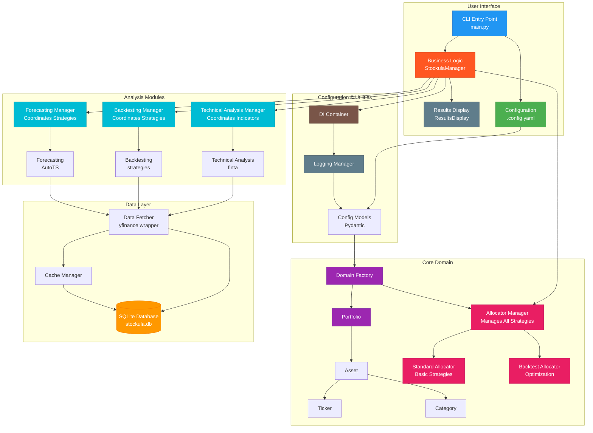
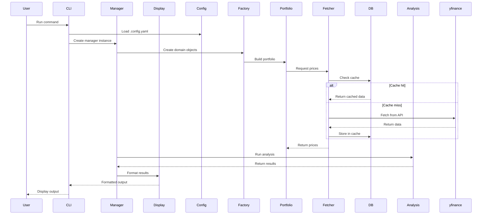

# Architecture Overview

Stockula is built with a modular, domain-driven architecture that separates concerns and provides clean interfaces between components.

## High-Level Architecture



## Data Flow



## Module Structure

```
src/stockula/
├── __init__.py           # Main package exports
├── main.py               # CLI entry point (minimal orchestration)
├── manager.py            # Business logic manager (StockulaManager)
├── display.py            # Results display and formatting (ResultsDisplay)
├── container.py          # Dependency injection container
├── interfaces.py         # Abstract interfaces
├── config/               # Configuration management
│   ├── __init__.py
│   ├── models.py        # Pydantic models
│   └── settings.py      # Config loading
├── domain/               # Domain models
│   ├── __init__.py
│   ├── portfolio.py     # Portfolio management
│   ├── asset.py         # Asset representation
│   ├── ticker.py        # Ticker & registry
│   ├── category.py      # Category enum
│   └── factory.py       # Domain object factory
├── allocation/           # Allocation strategies
│   ├── __init__.py
│   ├── manager.py       # AllocatorManager - coordinates strategies
│   ├── base_allocator.py # Base allocator interface
│   ├── allocator.py     # Standard allocation strategies
│   └── backtest_allocator.py  # Backtest-optimized allocation
├── data/                 # Data fetching module
│   ├── __init__.py
│   └── fetcher.py       # yfinance wrapper with SQLite caching
├── database/             # SQLite database management
│   ├── __init__.py
│   ├── manager.py       # Database operations
│   └── cli.py           # Command-line interface
├── technical_analysis/   # Technical indicators
│   ├── __init__.py
│   ├── manager.py       # TechnicalAnalysisManager - coordinates strategies
│   └── indicators.py    # finta wrapper
├── backtesting/         # Strategy backtesting
│   ├── __init__.py
│   ├── strategies.py    # Pre-built strategies
│   └── runner.py        # Backtest execution
├── forecasting/         # Price prediction
│   ├── __init__.py
│   ├── manager.py       # ForecastingManager - coordinates strategies
│   └── forecaster.py    # AutoTS wrapper
└── utils/               # Utilities
    ├── __init__.py
    └── logging_manager.py # Centralized logging management
```

## Core Components

### Configuration Layer

**Purpose**: Manages all application settings using Pydantic for validation

**Key Files**:

- `config/models.py` - Pydantic models for type-safe configuration
- `config/settings.py` - Configuration loading and validation

**Features**:

- YAML file support with environment variable overrides
- Strong typing with Pydantic validation
- Hierarchical configuration structure
- Default value management

### Domain Layer

**Purpose**: Represents business concepts and rules

**Key Components**:

- **StockulaManager**: Orchestrates all business logic and operations
- **ResultsDisplay**: Handles formatting and presentation of results
- **Portfolio**: Manages collections of assets with allocation strategies
- **Asset**: Represents individual holdings with market data
- **Ticker**: Maps symbols to detailed information
- **Factory**: Creates and configures domain objects
- **Category**: Categorizes assets (INDEX, MOMENTUM, etc.)
- **AllocatorManager**: Coordinates all allocation strategies and provides unified interface
- **Allocator**: Standard allocator for basic strategies (equal weight, market cap, custom, dynamic, auto)
- **BacktestOptimizedAllocator**: Advanced allocation using backtest performance data
- **ForecastingManager**: Coordinates forecasting strategies and provides unified interface for different forecasting models

**Patterns**:

- Domain-driven design principles
- Factory pattern for object creation
- Value objects for immutable data

### Data Layer

**Purpose**: Handles all data fetching and caching

**Key Components**:

- **DataFetcher**: yfinance wrapper with intelligent caching
- **DatabaseManager**: SQLite operations with schema management
- **Cache Strategy**: Automatic data freshness management

**Features**:

- Automatic SQLite caching for all market data
- Database migrations with Alembic
- Multiple data sources (yfinance, Treasury rates)
- Offline capability with cached data

### Analysis Modules

**Purpose**: Implements financial analysis algorithms

**Modules**:

1. **Technical Analysis** (`technical_analysis/`)

   - TechnicalAnalysisManager for coordinating analysis strategies
   - Wraps finta library for indicators
   - Pre-configured analysis groups (basic, momentum, trend, volatility)
   - Vectorized calculations for performance
   - Configurable indicator parameters
   - Automatic signal generation and summary

1. **Backtesting** (`backtesting/`)

   - Strategy implementation framework
   - Integration with backtesting.py library
   - Risk management features

1. **Forecasting** (`forecasting/`)

   - ForecastingManager for coordinating different forecasting strategies
   - AutoTS integration for time series prediction
   - Multiple model ensembles (standard, fast, financial)
   - Confidence intervals and validation
   - Quick forecast for rapid predictions
   - Financial-specific forecasting optimizations

### Utilities

**Purpose**: Cross-cutting concerns and shared functionality

**Components**:

- **LoggingManager**: Centralized logging with Rich integration
- **Container**: Dependency injection container
- **Interfaces**: Abstract base classes for modularity

## Design Principles

### Separation of Concerns

Each module has a single responsibility:

- **main.py**: CLI entry point and minimal orchestration
- **manager.py**: Business logic orchestration and coordination
- **display.py**: Results formatting and presentation
- **Config**: Settings and validation
- **Domain**: Business logic and rules
- **Allocation**: Portfolio allocation strategies
- **Data**: External data access
- **Analysis**: Financial computations
- **Utils**: Shared utilities

### Dependency Injection

The application uses a container-based dependency injection system:

```python
from stockula.container import Container

# Container manages all dependencies
container = Container()

# Automatic injection of configured services
data_fetcher = container.data_fetcher()
backtest_runner = container.backtest_runner()
portfolio_factory = container.domain_factory()
allocator_manager = container.allocator_manager()
forecasting_manager = container.forecasting_manager()

# The allocator manager provides access to all allocation strategies
quantities = allocator_manager.calculate_quantities(config, tickers)

# The forecasting manager provides access to all forecasting strategies
forecast = forecasting_manager.forecast_symbol('AAPL', config)
```

### Interface-Based Design

Abstract interfaces enable modularity and testing:

```python
from stockula.interfaces import IDataFetcher, IBacktestRunner

class CustomDataFetcher(IDataFetcher):
    def get_stock_data(self, symbol: str) -> pd.DataFrame:
        # Custom implementation
        pass
```

### Rich CLI Integration

The Rich library provides enhanced user experience:

- **Progress Bars**: Real-time operation tracking
- **Tables**: Formatted result displays
- **Panels**: Grouped information display
- **Colors**: Status indication and highlighting

## Data Management

### SQLite Database Schema

The database stores all market data for fast access:

```sql
-- Core tables
stocks              -- Stock metadata
price_history       -- OHLCV data
dividends          -- Dividend history
splits             -- Stock splits
stock_info         -- Complete yfinance data as JSON

-- Options data
options_calls      -- Call options chains
options_puts       -- Put options chains
```

### Caching Strategy

Intelligent caching reduces API calls:

1. **Cache First**: Check database before API calls
1. **Freshness Check**: Validate data age
1. **Selective Updates**: Fetch only missing data
1. **Background Updates**: Refresh stale data automatically

### Migration Management

Database schema evolution with Alembic:

```bash
# Automatic migrations on startup
# Manual migration commands available
uv run python -m stockula.database.cli migrate upgrade head
```

## Performance Considerations

### Data Access Patterns

- **Bulk Operations**: Minimize database round trips
- **Vectorized Calculations**: Use pandas/numpy for speed
- **Lazy Loading**: Load data only when needed
- **Connection Pooling**: Reuse database connections

### Memory Management

- **Streaming**: Process large datasets incrementally
- **Chunking**: Break large operations into smaller pieces
- **Cleanup**: Automatic resource cleanup
- **Caching Limits**: Configurable cache size limits

### Async Operations

While not fully async, the architecture supports async patterns:

- **Progress Tracking**: Non-blocking progress updates
- **Background Tasks**: Concurrent data fetching
- **Graceful Shutdown**: Clean process termination

## Testing Architecture

### Test Organization

```
tests/
├── unit/               # Fast, isolated tests
│   ├── test_config.py
│   ├── test_domain.py
│   ├── test_strategies.py
│   └── ...
├── integration/        # Component integration tests
│   ├── test_data.py
│   ├── test_database.py
│   └── ...
└── conftest.py        # Shared fixtures
```

### Testing Patterns

- **Dependency Injection**: Easy mock injection
- **Interface Mocking**: Mock at interface boundaries
- **Fixture Reuse**: Shared test data and mocks
- **Isolated Tests**: No cross-test dependencies

## Extensibility

### Adding New Strategies

1. Create strategy class inheriting from base strategy
1. Implement required methods (`init`, `next`)
1. Add strategy name mapping in factory
1. Add configuration model if needed

### Custom Data Sources

1. Implement `IDataFetcher` interface
1. Register in dependency injection container
1. Configure via settings if needed

### New Analysis Modules

1. Create module in appropriate directory
1. Define interface for contract
1. Implement concrete classes
1. Wire into main application flow

This architecture provides a solid foundation for financial analysis while remaining flexible and maintainable.
