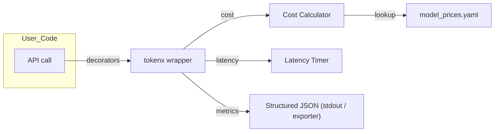

<p align="center">
  
</p>

<p align="center"><em>Track cost and latency of your LLM calls </em></p>

<p align="center">
  <a href="https://pypi.org/project/tokenx-core/"></a>
  <a href="https://github.com/dvlshah/tokenx/actions/workflows/test.yml"></a>
  <!-- <a href="https://codecov.io/gh/dvlshah/tokenx"></a> -->
  <a href="https://pypi.org/project/tokenx-core/"></a>
  <a href="https://opensource.org/licenses/MIT"></a>
</p>

<p align="center"><strong>👉 Like what you see? <a href="https://github.com/dvlshah/tokenx/stargazers">Star the repo</a>  and <a href="https://github.com/dvlshah">follow @dvlshah</a> for updates!</strong></p>

> **Decorator in → Metrics out.**
> Monitor cost & latency of any LLM function without touching its body.

```bash
pip install tokenx-core                                    # 1️⃣ install
```

```python
from tokenx.metrics import measure_cost, measure_latency   # 2️⃣ decorate
from openai import OpenAI

@measure_latency
@measure_cost(provider="openai", model="gpt-4o-mini")
def ask(prompt: str):
    return OpenAI().chat.completions.create(
        model="gpt-4o-mini",
        messages=[{"role": "user", "content": prompt}]
    )

resp, m = ask("Hello!")                                   # 3️⃣ run
print(m["cost_usd"], "USD |", m["latency_ms"], "ms")
```

---

## 🤔 Why tokenx?

Integrating with LLM APIs often involves hidden costs and variable performance. Manually tracking token usage and calculating costs across different models and providers is tedious and error-prone. `tokenx` simplifies this by:

*   **Decorator-based monitoring:** Add cost and latency tracking with simple decorators.
*   **Accurate cost calculation:** Uses configurable pricing with caching discounts.
*   **Latency measurement:** Measures API call response times.
*   **Multi-provider support:** Supports OpenAI and Anthropic APIs.

> **Note:** While tokenx strives for accuracy, there may be occasional discrepancies in token and cost metrics. If you encounter issues, please [report them here](https://github.com/dvlshah/tokenx/issues).

---

## 🏗️ Architecture (1‑min overview)



*No vendor lock‑in:*  pure‑Python wrapper emits plain dicts—pipe them to Prometheus, Datadog, or stdout.

---

## 💡 Features at a glance

* **Cost tracking** – USD costing with cached‑token discounts (if applicable)
* **No estimates policy** – only real usage data, numbers will match what you see in the portal
* **Latency measurement** – measures API response times
* **Decorator interface** – works with sync and async functions
* **Provider support** – OpenAI, Anthropic, adding more providers soon!
* **Minimal deps** – tiktoken and pyyaml only

---

## 📦 Installation

```bash
pip install tokenx-core                 # stable
pip install tokenx-core[openai]         # with OpenAI provider extras
pip install tokenx-core[anthropic]      # with Anthropic provider extras
pip install tokenx-core[all]            # with all provider extras
```

---

## 🚀 Quick Start

Here's how to monitor your OpenAI API calls with just two lines of code:

```python
from tokenx.metrics import measure_cost, measure_latency
from openai import OpenAI

@measure_latency
@measure_cost(provider="openai", model="gpt-4o-mini")  # Always specify provider and model
def call_openai():
    client = OpenAI()
    return client.chat.completions.create(
        model="gpt-4o-mini",
        messages=[{"role": "user", "content": "Hello, world!"}]
    )

response, metrics = call_openai()

# Access your metrics
print(f"Cost: ${metrics['cost_usd']:.6f}")
print(f"Latency: {metrics['latency_ms']:.2f}ms")
print(f"Tokens: {metrics['input_tokens']} in, {metrics['output_tokens']} out")
print(f"Cached tokens: {metrics['cached_tokens']}")  # New in v0.2.0
```

Here's how to monitor your Anthropic API calls with just two lines of code:

```python
from tokenx.metrics import measure_cost, measure_latency
from anthropic import Anthropic # Or AsyncAnthropic

@measure_latency
@measure_cost(provider="anthropic", model="claude-3-haiku-20240307")
def call_anthropic(prompt: str):
    # For Anthropic prompt caching metrics, initialize client with .beta
    # and use 'cache_control' in your messages.
    # Example: client = Anthropic(api_key="YOUR_KEY").beta
    client = Anthropic() # Standard client
    return client.messages.create(
        model="claude-3-haiku-20240307", # Ensure model matches decorator
        max_tokens=150,
        messages=[{"role": "user", "content": prompt}]
    )

response_claude, metrics_claude = call_anthropic("Why is the sky blue?")
print(f"Cost: ${metrics_claude['cost_usd']:.6f} USD")
print(f"Latency: {metrics_claude['latency_ms']:.2f} ms")
print(f"Input Tokens: {metrics_claude['input_tokens']}")
print(f"Output Tokens: {metrics_claude['output_tokens']}")
# For Anthropic, 'cached_tokens' reflects 'cache_read_input_tokens'.
# 'cache_creation_input_tokens' will also be in metrics if caching beta is active.
print(f"Cached (read) tokens: {metrics_claude.get('cached_tokens', 0)}")
print(f"Cache creation tokens: {metrics_claude.get('cache_creation_input_tokens', 'N/A (requires caching beta)')}")
```

Here's how to monitor OpenAI's new audio models with dual token pricing:

```python
from tokenx.metrics import measure_cost, measure_latency
from openai import OpenAI

@measure_latency
@measure_cost(provider="openai", model="gpt-4o-mini-transcribe")
def transcribe_audio(audio_file_path: str):
    client = OpenAI()
    with open(audio_file_path, "rb") as audio_file:
        return client.audio.transcriptions.create(
            model="gpt-4o-mini-transcribe",
            file=audio_file,
            response_format="verbose_json"
        )

@measure_latency
@measure_cost(provider="openai", model="gpt-4o-mini-tts")
def generate_speech(text: str):
    client = OpenAI()
    return client.audio.speech.create(
        model="gpt-4o-mini-tts",
        voice="alloy",
        input=text
    )

# Real usage data with separate audio/text token costs
response, metrics = transcribe_audio("path/to/audio.mp3")  # Replace with actual audio file path
print(f"Transcription cost: ${metrics['cost_usd']:.6f}")  # Combines audio + text tokens
print(f"Audio tokens: {metrics.get('audio_input_tokens', 0)}")
print(f"Text tokens: {metrics['input_tokens']}")
```

## 🔍 Detailed Usage

### Cost Tracking

The `measure_cost` decorator requires explicit provider and model specification:

```python
@measure_cost(provider="openai", model="gpt-4o")  # Explicit specification required
def my_function(): ...

@measure_cost(provider="openai", model="gpt-4o", tier="flex")  # Optional tier
def my_function(): ...
```

### Latency Measurement

The `measure_latency` decorator works with both sync and async functions:

```python
@measure_latency
def sync_function(): ...

@measure_latency
async def async_function(): ...
```

### Combining Decorators

Decorators can be combined in any order:

```python
@measure_latency
@measure_cost(provider="openai", model="gpt-4o")
def my_function(): ...

# Equivalent to:
@measure_cost(provider="openai", model="gpt-4o")
@measure_latency
def my_function(): ...
```

### Async Usage

Both decorators work seamlessly with `async` functions:

```python
import asyncio
from tokenx.metrics import measure_cost, measure_latency
from openai import AsyncOpenAI # Use Async client

@measure_latency
@measure_cost(provider="openai", model="gpt-4o-mini")
async def call_openai_async():
    client = AsyncOpenAI()
    response = await client.chat.completions.create(
        model="gpt-4o-mini",
        messages=[{"role": "user", "content": "Tell me an async joke!"}]
    )
    return response

async def main():
    response, metrics = await call_openai_async()
    print(metrics)

# asyncio.run(main()) # Example of how to run it
```

---

## 🔄 Provider Compatibility

tokenx is designed to work with multiple LLM providers. Here's the current compatibility overview:

| Provider | Status | SDK Version | Supported APIs | Cache Support |
|----------|--------|-------------|----------------|---------------|
| OpenAI | ✅ | >= 1.0.0 | Chat, Responses, Embeddings, Audio (Transcription/TTS), Moderation, Images | ✅ |
| Anthropic | ✅ | >= 0.20.0 | Messages | ✅ |

📊 **[View Complete Coverage Matrix](docs/COVERAGE_MATRIX.md)** - Detailed breakdown of all supported APIs, models, and features

### OpenAI Support Details

- **SDK Versions**: Compatible with OpenAI Python SDK v1.0.0 and newer.
- **Response Formats**: Supports dictionary responses from older SDK versions and Pydantic model responses from newer SDK versions, with cached token extraction from `prompt_tokens_details.cached_tokens`.
- **API Types**:
  - ✅ Chat Completions API
  - ✅ Responses API (advanced interface)
  - ✅ Embeddings API
  - ✅ Audio Transcription API (token-based models)
  - ✅ Text-to-Speech API (token-based models)
  - ✅ Audio Preview API
  - ✅ Realtime Audio API
  - ✅ Moderation API
  - ✅ Image Generation API (gpt-image-1 with hybrid pricing)
- **Pricing Features**:
  - ✅ Dual token pricing (separate audio/text tokens)
  - ✅ Hybrid pricing (tokens + per-image costs)
  - ✅ No estimates policy (accuracy guaranteed)
- **Models**: 47+ models including o3, o4-mini, gpt-4o-transcribe, gpt-4o-mini-tts, gpt-image-1

### Anthropic Support Details

- **SDK Versions**: Compatible with Anthropic Python SDK (e.g., v0.20.0+ for full prompt caching beta fields).
- **Response Formats**: Supports Pydantic-like response objects.
- **Token Extraction**: Extracts input_tokens and output_tokens from the usage object.
- **Caching (Prompt Caching Beta)**: To utilize Anthropic's prompt caching and see related metrics, enable the beta feature in your client (`client = Anthropic().beta`) and define `cache_control` checkpoints in messages. tokenx maps `cache_read_input_tokens` to `cached_tokens` (for cost discounts if `cached_in` is defined) and includes `cache_creation_input_tokens` directly in metrics.
- **API Types**: Supports Messages API.

## 🛠️ Advanced Configuration

### Custom Pricing

Prices are loaded from the `model_prices.yaml` file. You can update this file when new models are released or prices change:

```yaml
openai:
  gpt-4o:
    sync:
      in: 2.50        # USD per million input tokens
      cached_in: 1.25 # USD per million cached tokens (OpenAI specific)
      out: 10.00      # USD per million output tokens

  # Audio models with dual token pricing
  gpt-4o-mini-transcribe:
    sync:
      in: 1.25        # USD per million input tokens (text tokens)
      out: 5.00       # USD per million output tokens (text tokens)
      audio_in: 3.00  # USD per million input tokens (audio tokens)

  gpt-4o-mini-tts:
    sync:
      in: 0.60        # USD per million input tokens (text tokens)
      audio_out: 12.00  # USD per million output tokens (audio tokens)

anthropic:
  claude-3-haiku-20240307:
    sync:
      in: 0.25        # USD per million input tokens
      # cached_in: 0.10 # Example: if Anthropic offered a specific rate for cache_read_input_tokens
      out: 1.25       # USD per million output tokens
  # If 'cached_in' is not specified for an Anthropic model,
  # all input_tokens (including cache_read_input_tokens) are billed at the 'in' rate.
```

### How Pricing Configuration is loaded?

By default, tokenx will:
- Check for updated pricing daily (24-hour cache)
- Automatically fetch the latest prices from the official repository
- Use stale cache if network is unavailable
- Show clear error if no pricing data available

The price yaml will be automatically uploaded in the remote as the pricing information is updated by supported providers.

```python
# First run - fetches latest prices
from tokenx.cost_calc import CostCalculator
calc = CostCalculator.for_provider("openai", "gpt-4o")
# Output: "tokenx: Fetching latest model prices..."
# Output: "tokenx: Cached latest prices locally."

# Subsequent runs - uses cache
calc2 = CostCalculator.for_provider("openai", "gpt-4o-mini")
# Output: "tokenx: Using cached model prices."
```

#### Custom Pricing Overrides

For enterprise users with custom pricing contracts:

```bash
# Set environment variable to your custom pricing file
export TOKENX_PRICES_PATH="/path/to/my-custom-pricing.yaml"
```

Create a YAML file with only the prices you want to override:

```yaml
# my-custom-pricing.yaml
openai:
  gpt-4o:
    sync:
      in: 1.50   # Custom rate: $1.50 per million tokens
      out: 8.00  # Custom rate: $8.00 per million tokens

  # You only need to specify what you're overriding
  # All other models use the standard pricing
```

## 📊 Example Metrics Output

When you use the decorators, you'll get a structured metrics dictionary:

```python
{
    "provider": "openai",
    "model": "gpt-4o-mini",
    "tier": "sync",
    "input_tokens": 12,
    "output_tokens": 48,
    "cached_tokens": 20,        # New in v0.2.0
    "cost_usd": 0.000348,       # $0.000348 USD
    "latency_ms": 543.21        # 543.21 milliseconds
}
```

For Anthropic (when prompt caching beta is active and cache is utilized):

```python
{
    "provider": "anthropic",
    "model": "claude-3-haiku-20240307",
    "tier": "sync",
    "input_tokens": 25,                     # Total input tokens for the request
    "output_tokens": 60,
    "cached_tokens": 10,                    # Populated from Anthropic's 'cache_read_input_tokens'
    "cache_creation_input_tokens": 15,      # Anthropic's 'cache_creation_input_tokens'
    "cost_usd": 0.0000XX,
    "usd": 0.0000XX,
    "latency_ms": 750.21
}
```

If Anthropic's prompt caching beta is not used or no cache interaction occurs, cached_tokens will be 0 and cache_creation_input_tokens might be 0 or absent.

## 🔌 Adding a Custom Provider

TokenX makes it easy to add support for new LLM providers using the `@register_provider` decorator:

```python
from tokenx.providers import register_provider
from tokenx.providers.base import ProviderAdapter, Usage
from typing import Any, Optional

@register_provider("custom")
class CustomAdapter(ProviderAdapter):
    @property
    def provider_name(self) -> str:
        return "custom"

    def usage_from_response(self, response: Any) -> Usage:
        # Extract standardized usage information from provider response
        return Usage(
            input_tokens=response.usage.input_tokens,
            output_tokens=response.usage.output_tokens,
            cached_tokens=getattr(response.usage, 'cached_tokens', 0),
            extra_fields={'provider': 'custom'}
        )

    def matches_function(self, func: Any, args: tuple, kwargs: dict) -> bool:
        # Detect if this function uses your provider
        return "custom" in kwargs.get("model", "").lower()

    def detect_model(self, func: Any, args: tuple, kwargs: dict) -> Optional[str]:
        return kwargs.get("model")

    def calculate_cost(self, model: str, input_tokens: int,
                      output_tokens: int, cached_tokens: int = 0,
                      tier: str = "sync") -> float:
        # Implement your pricing logic
        return input_tokens * 0.001 + output_tokens * 0.002

# Now you can use it immediately
from tokenx.metrics import measure_cost

@measure_cost(provider="custom", model="custom-model")
def call_custom_llm():
    # Your API call here
    pass
```

## 🤝 Contributing

```bash
git clone https://github.com/dvlshah/tokenx.git
pre-commit install
pip install -e .[dev]   # or `poetry install`
pytest -q && mypy src/
```

See [CONTRIBUTING.md](https://github.com/dvlshah/tokenx/blob/main/docs/CONTRIBUTING.md) for details.

---

## 📝 Changelog

See [CHANGELOG.md](https://github.com/dvlshah/tokenx/blob/main/docs/CHANGELOG.md) for full history.

---

## 📜 License

MIT © 2025 Deval Shah

<p align="center"><em>If tokenX saves you time or money, please consider <a href="https://github.com/sponsors/dvlshah">sponsoring</a> or giving a ⭐ – it really helps!</em></p>
