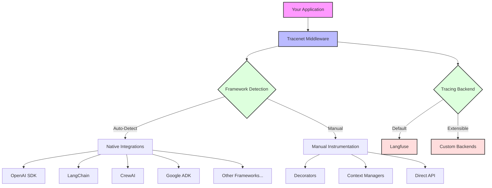
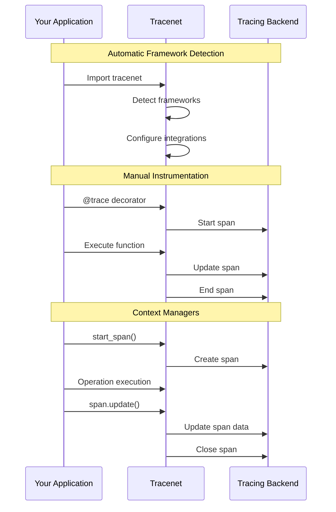

# Tracenet

<div align="center">

[](https://badge.fury.io/py/tracenet)
[](https://www.npmjs.com/package/@stackgen-ai/tracenet)
[](https://opensource.org/licenses/MIT)
[](https://pypi.org/project/tracenet/)
[](https://www.typescriptlang.org/)

**Universal tracing middleware for LLM-powered applications with seamless integration and powerful observability.**

[Quick Start](#-quick-start) •
[Installation](#-installation) •
[Features](#-features) •
[Examples](#-examples) •
[Contributing](#-contributing)

</div>

---

## 🌟 Overview

Tracenet is a language-agnostic tracing middleware designed specifically for AI/ML applications. It provides automatic instrumentation for popular AI frameworks while offering powerful manual instrumentation capabilities when 
needed.

### Why Tracenet?

Modern LLM applications face several critical challenges:
- **Complexity**: LLM interactions are complex, involving multiple steps, retries, and chain-of-thought processes
- **Observability Gap**: Traditional APM tools don't understand LLM-specific concepts like prompt engineering, token usage, or completion quality
- **Integration Overhead**: Manually instrumenting each LLM interaction is time-consuming and error-prone

Tracenet solves these challenges by providing:
- **Zero-Config Auto-Instrumentation**: Automatically captures LLM interactions, tokens, latency, and costs
- **AI-Native Design**: Purpose-built for LLM applications with deep understanding of AI patterns
- **Universal Integration**: Works with any LLM framework or provider while maintaining consistent observability

Unlike general-purpose tracing tools, Tracenet is specifically designed for LLM applications, offering:
- Native understanding of LLM concepts (prompts, completions, tokens)
- Automatic framework detection for popular LLM libraries
- Built-in support for common AI patterns and architectures

### Key Benefits

- 🚀 **Zero-Config Setup**: Just import and go - automatic framework detection and configuration
- 🔄 **Language Agnostic**: First-class support for both Python and TypeScript
- 🎯 **AI-First Design**: Built specifically for tracing AI/ML applications
- 📊 **Rich Observability**: Detailed tracing for both automatic and manual instrumentation
- 🔌 **Extensible**: Plugin architecture for custom tracing backends

### Architecture

The following diagram illustrates Tracenet's architecture and integration points:



## 🚀 Quick Start

### Python

```python
# Just import the package - it automatically sets up tracing
import tracenet

# Your existing code will now be traced automatically!
from openai import OpenAI
client = OpenAI()

response = client.chat.completions.create(
    model="gpt-3.5-turbo",
    messages=[{"role": "user", "content": "Hello!"}]
)
# The API call is automatically traced!
```

### TypeScript

```typescript
// Import the package
import { tracenet } from '@stackgen-ai/tracenet';

// Your existing code will now be traced automatically!
import OpenAI from 'openai';
const client = new OpenAI();

const response = await client.chat.completions.create({
    model: "gpt-3.5-turbo",
    messages: [{ role: "user", content: "Hello!" }]
});
// The API call is automatically traced!
```

## 📦 Installation

### Python

```bash
pip install tracenet
```

### TypeScript/JavaScript

```bash
npm install @stackgen-ai/tracenet
# or
yarn add @stackgen-ai/tracenet
```

## ✨ Features

### Framework Support

| Framework | Python | TypeScript | Auto-Instrumentation |
|-----------|---------|------------|---------------------|
| OpenAI SDK | ✅ | ✅ | ✅ |
| Anthropic | ✅ | ✅ | ✅ |
| LangChain | ✅ | ✅ | ✅ |
| LlamaIndex | ✅ | - | ✅ |
| CrewAI | ✅ | - | ✅ |
| Google ADK | ✅ | - | ✅ |
| Autogen | ✅ | - | ✅ |
| Instructor | ✅ | - | ✅ |
| Guardrails | ✅ | - | ✅ |
| Haystack | ✅ | - | ✅ |
| VertexAI | ✅ | - | ✅ |
| Groq | ✅ | - | ✅ |
| BeeAI | ✅ | - | ✅ |

### Manual Instrumentation

Both Python and TypeScript support:

- Function/Method Tracing
- Context Managers/Spans
- LLM Generation Tracking
- Custom Attributes
- Error Handling
- Async Operations

## ⚙️ Configuration

### Environment Variables

| Variable | Description | Default | Required |
|----------|-------------|---------|----------|
| `TRACENET_TRACER` | Tracing backend to use | `langfuse` | No |
| `TRACENET_SERVICE_NAME` | Service name for traces | `agent_service` | No |
| `AGENT_NAME` | Agent identifier for traces | None | No |

### Langfuse Backend Configuration

| Variable | Description | Required |
|----------|-------------|----------|
| `LANGFUSE_PUBLIC_KEY` | Your Langfuse public key | Yes |
| `LANGFUSE_SECRET_KEY` | Your Langfuse secret key | Yes |
| `LANGFUSE_HOST` | Custom Langfuse host | No |

## 📚 API Reference

### Python API

#### Automatic Tracing

```python
import tracenet  # Automatically sets up tracing
```

#### Manual Instrumentation

```python
from tracenet import trace, start_span, start_generation

# Function decorator
@trace(name="my_function")
def my_function(arg1, arg2):
    return arg1 + arg2

# Context manager
with start_span("operation_name", tags=["tag1"]) as span:
    result = operation()
    span.update(output=result)

# LLM Generation tracking
with start_generation("text_gen", model="gpt-4") as span:
    response = llm.generate("prompt")
    span.update(output=response)
```

### TypeScript API

#### Automatic Tracing

```typescript
import { tracenet } from '@stackgen-ai/tracenet';  // Automatically sets up tracing
```

#### Manual Instrumentation

```typescript
import { trace, startSpan, startGeneration } from '@stackgen-ai/tracenet';

// Function decorator
@trace({ name: "myFunction" })
myFunction(arg1: string, arg2: string): string {
    return arg1 + arg2;
}

// Context manager
const span = await startSpan("operationName", { tags: ["tag1"] });
try {
    const result = await operation();
    span.update({ output: result });
} finally {
    await span.end();
}

// LLM Generation tracking
const genSpan = await startGeneration("textGen", { model: "gpt-4" });
try {
    const response = await llm.generate("prompt");
    genSpan.update({ output: response });
} finally {
    await genSpan.end();
}
```

## 🔍 Tracing Flow

The following diagram shows how Tracenet handles different types of traces:



## 📖 Examples

For detailed examples, check out our example repositories:

- [Python Examples](examples/python/)
- [TypeScript Examples](examples/typescript/)

## 🤝 Contributing

We welcome contributions! Please see our [Contributing Guide](CONTRIBUTING.md) for details.

### Development Setup

1. Clone the repository:
```bash
git clone https://github.com/stackgenhq/tracenet
cd tracenet
```

2. Install dependencies:
```bash
# Python
pip install -e ".[dev]"

# TypeScript
npm install
```

3. Run tests:
```bash
# Python
pytest

# TypeScript
npm test
```

## 📄 License

This project is licensed under the MIT License - see the [LICENSE](LICENSE) file for details.

## 🙏 Acknowledgments

- [Langfuse](https://langfuse.com) for the amazing tracing backend
- [OpenTelemetry](https://opentelemetry.io) for inspiration on observability patterns
- All our [contributors](https://github.com/stackgenhq/tracenet/graphs/contributors)

---

<div align="center">
Made with ❤️ by the Tracenet Team
</div> 