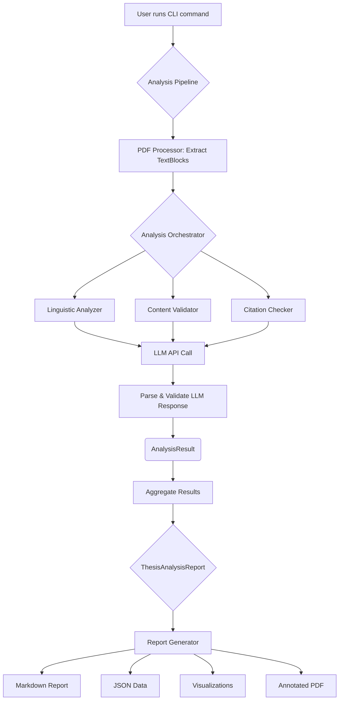

# VeritaScribe

**AI-Powered Thesis Review Tool**

VeritaScribe is an intelligent document analysis system that automatically reviews PDF thesis documents for quality issues including grammar errors, content plausibility problems, and citation format inconsistencies. Built with DSPy for LLM orchestration, Pydantic for structured data modeling, and PyMuPDF for PDF processing.

## ✨ Features

- **Multi-Provider LLM Support**: Works with OpenAI, OpenRouter, Anthropic Claude, and custom endpoints.
- **Multi-Language Analysis**: Automatic language detection with native support for English and German documents, including language-specific grammar rules and cultural context.
- **Comprehensive Analysis**: Grammar checking, content validation, and citation format verification.
- **DSPy Prompt Optimization**: Advanced few-shot learning system with bilingual training data to fine-tune analysis prompts for maximum accuracy.
- **Smart PDF Processing**: Extracts text while preserving layout context and location information.
- **Structured Reporting**: Generates detailed reports with error locations, severities, and suggestions.
- **Visual Analytics & Annotated PDFs**: Creates charts, visualizations, and annotated PDFs to highlight error patterns.
- **Flexible Configuration**: Customizable analysis parameters and provider selection.
- **CLI Interface**: Easy-to-use command-line interface with multiple analysis modes.
- **Cost Optimization**: Choose from 100+ models across providers for optimal cost/performance.

## 🚀 Quick Start

### Prerequisites

- Python 3.13 or higher
- API key for your chosen LLM provider:
  - **OpenAI**: [Get API key](https://platform.openai.com/api-keys)
  - **OpenRouter**: [Get API key](https://openrouter.ai/keys) (access to 100+ models)
  - **Anthropic**: [Get API key](https://console.anthropic.com/) (for Claude models)
  - **Custom**: Any OpenAI-compatible endpoint (local models, Azure, etc.)

### Installation

1. **Clone the repository**:
   ```bash
   git clone <repository-url>
   cd VeritaScribe
   ```

2. **Install dependencies using uv**:
   ```bash
   uv sync
   ```

3. **Configure your LLM provider**:
   ```bash
   # Copy the example environment file
   cp .env.example .env
   
   # Edit .env and configure your preferred provider
   # See "LLM Providers" section below for examples
   ```

### Basic Usage

1. **Try the demo** (creates and analyzes a sample document):
   ```bash
   uv run python -m veritascribe demo
   ```

2. **Analyze your thesis**:
   ```bash
   uv run python -m veritascribe analyze your_thesis.pdf
   ```

3. **Generate an annotated PDF** with highlighted errors and detailed annotations:
   ```bash
   uv run python -m veritascribe analyze your_thesis.pdf --annotate
   ```
   
   This creates an interactive PDF with:
   - Color-coded error highlights (red/orange/yellow by severity)
   - Sticky note annotations with suggestions and explanations
   - Perfect for sharing with supervisors or collaborators

##  CLI Commands

### `analyze` - Full Document Analysis
Performs comprehensive analysis of a thesis document.

```bash
uv run python -m veritascribe analyze [OPTIONS] PDF_PATH
```

**Options:**
- `--output, -o`: Output directory for reports (default: `./analysis_output`)
- `--citation-style, -c`: Expected citation style (default: `APA`)
- `--quick, -q`: Quick analysis mode (first 10 blocks only)
- `--no-viz`: Skip generating visualization charts
- `--annotate`: Generate an annotated PDF with highlighted errors
- `--verbose, -v`: Enable verbose logging

**Examples:**

```bash
# Standard analysis with annotated PDF
uv run python -m veritascribe analyze thesis.pdf --output ./results --annotate

# Quick analysis with annotation for iterative writing
uv run python -m veritascribe analyze draft.pdf --quick --annotate

# Full analysis with specific citation style and annotations
uv run python -m veritascribe analyze thesis.pdf --citation-style MLA --annotate --verbose
```

### `quick` - Fast Analysis
Analyzes a subset of the document for quick feedback.

```bash
uv run python -m veritascribe quick [OPTIONS] PDF_PATH
```

**Options:**
- `--blocks, -b`: Number of text blocks to analyze (default: 5)

### `demo` - Create Sample Document
Creates and analyzes a demo thesis document.

```bash
uv run python -m veritascribe demo
```

### `config` - View Configuration
Displays current configuration settings.

```bash
uv run python -m veritascribe config
```

### `providers` - List Available Providers
Shows all supported LLM providers, models, and configuration examples.

```bash
uv run python -m veritascribe providers
```

### `optimize-prompts` - DSPy Prompt Optimization
Fine-tunes the analysis prompts using few-shot learning with bilingual training data for improved accuracy.

```bash
uv run python -m veritascribe optimize-prompts
```

This command:
- Creates optimized modules for English and German analysis
- Uses curated training examples for grammar, content, and citation checking
- Improves analysis accuracy through DSPy's BootstrapFewShot compilation
- Takes several minutes to complete but significantly enhances analysis quality

### `test` - Run System Tests
Verifies that all components are working correctly.

```bash
uv run python -m veritascribe test
```

## 🌐 LLM Providers

VeritaScribe supports multiple LLM providers, giving you flexibility in model choice, cost optimization, and feature access.

### Available Providers

#### 1. OpenAI (Default)
- **Models**: GPT-4, GPT-4 Turbo, GPT-4o, GPT-3.5 Turbo
- **Best for**: High quality, reliability
- **Setup**:
  ```bash
  LLM_PROVIDER=openai
  OPENAI_API_KEY=sk-your-key-here
  DEFAULT_MODEL=gpt-4
  ```

#### 2. OpenRouter
- **Models**: 100+ models including Claude, Llama, Mistral, Gemini
- **Best for**: Cost optimization, model variety
- **Setup**:
  ```bash
  LLM_PROVIDER=openrouter
  OPENROUTER_API_KEY=sk-or-your-key-here
  DEFAULT_MODEL=anthropic/claude-3.5-sonnet
  ```

#### 3. Anthropic Claude
- **Models**: Claude 3.5 Sonnet, Claude 3 Opus, Claude 3 Haiku
- **Best for**: Advanced reasoning, long context
- **Setup**:
  ```bash
  LLM_PROVIDER=anthropic
  ANTHROPIC_API_KEY=sk-ant-your-key-here
  DEFAULT_MODEL=claude-3-5-sonnet-20241022
  ```

#### 4. Custom Endpoints
- **Models**: Any OpenAI-compatible API (Ollama, Azure, local models)
- **Best for**: Privacy, local deployment, custom setups
- **Examples**:
  ```bash
  # Local Ollama
  LLM_PROVIDER=custom
  OPENAI_API_KEY=ollama
  OPENAI_BASE_URL=http://localhost:11434/v1
  DEFAULT_MODEL=llama3.1:8b
  
  # Azure OpenAI
  LLM_PROVIDER=custom
  OPENAI_API_KEY=your-azure-key
  OPENAI_BASE_URL=https://your-resource.openai.azure.com/
  DEFAULT_MODEL=gpt-4
  ```

### Provider Comparison

| Provider | Cost | Speed | Quality | Models | Privacy |
|----------|------|-------|---------|--------|---------|
| OpenAI | High | Fast | Excellent | 6+ | Cloud |
| OpenRouter | Variable | Variable | Excellent | 100+ | Cloud |
| Anthropic | Medium | Fast | Excellent | 5+ | Cloud |
| Custom | Variable | Variable | Variable | Unlimited | Configurable |

## 🔧 Configuration

VeritaScribe uses environment variables for configuration. Copy `.env.example` to `.env` and customize.

## 🌍 Multi-Language Support

VeritaScribe automatically detects document language and applies language-specific analysis:

### Supported Languages
- **English**: Full grammar checking, content validation, and citation verification
- **German**: Native grammar rules, cultural context awareness, and German academic conventions

### Language Detection
The system automatically detects the primary language of your document and:
- Applies appropriate grammar rules and linguistic patterns
- Uses language-specific training data for enhanced accuracy
- Provides culturally-aware content validation
- Supports mixed-language documents with intelligent switching

### Examples
```bash
# English thesis
uv run python -m veritascribe analyze english_thesis.pdf

# German thesis (automatically detected)
uv run python -m veritascribe analyze german_thesis.pdf

# Optimize prompts for both languages
uv run python -m veritascribe optimize-prompts
```

## 📄 Understanding the Output

VeritaScribe generates several types of output:

### 1. Analysis Report (`*_report.md`)
A comprehensive Markdown report containing:
- Document summary and statistics
- Detailed error listings with locations
- Severity breakdown and recommendations

### 2. JSON Data Export (`*_data.json`)
Structured data in JSON format for programmatic access:
- All detected errors with metadata
- Text block information
- Analysis statistics

### 3. Visualizations (`*_visualizations/`)
Charts and graphs showing:
- Error distribution by type
- Error density per page
- Severity breakdown

### 4. Annotated PDF (`*_annotated.pdf`) 
An interactive PDF with errors visually highlighted and detailed annotations. Generated using `--annotate` flag.

**Features:**
- **Color-coded highlights** directly on problematic text:
  - 🔴 **Red**: High-severity errors (critical issues requiring immediate attention)
  - 🟠 **Orange**: Medium-severity errors (important improvements needed) 
  - 🟡 **Yellow**: Low-severity errors (minor suggestions)
- **Sticky note annotations** with comprehensive error details:
  - Error type and severity level
  - Original problematic text excerpt
  - Specific suggested corrections
  - Detailed explanations of the issue
  - AI confidence scores
- **Smart positioning** to prevent overlapping annotations
- **Preserves original formatting** while adding review layers

**Perfect for:** Collaborative review, supervisor feedback, iterative editing, and visual error identification.

### 5. Cost and Token Usage
The console output and Markdown report include details on token usage and the estimated cost of the analysis.

## Troubleshooting

Run into issues? Check the [Troubleshooting Guide](docs/troubleshooting.qmd) for help.

## 🏛️ Architecture

VeritaScribe is built on a modular and extensible pipeline architecture, designed to process PDF documents, analyze their content using Large Language Models (LLMs), and generate comprehensive reports. The system leverages modern Python libraries like DSPy for LLM orchestration, Pydantic for data integrity, and PyMuPDF for efficient PDF handling.

### Core Components

The system is composed of several key components that work together in a coordinated workflow:

1.  **CLI (Command Line Interface)** (`main.py`):
    *   Built with **Typer**, providing a user-friendly command-line interface.
    *   Handles user commands (`analyze`, `quick`, `demo`, etc.), parses arguments, and initiates the analysis pipeline.

2.  **Configuration Management** (`config.py`):
    *   Uses **Pydantic-Settings** to manage configuration from environment variables and `.env` files.
    *   Provides type-safe, centralized settings for LLM providers, API keys, analysis parameters, and processing options.
    *   Dynamically configures the DSPy environment based on the selected LLM provider.

3.  **PDF Processor** (`pdf_processor.py`):
    *   Utilizes **PyMuPDF (fitz)** for high-performance PDF parsing.
    *   Extracts text content along with its layout and location information (bounding boxes), which is crucial for accurate error reporting and annotation.
    *   Cleans and preprocesses text to handle common PDF artifacts and formatting issues.

4.  **LLM Analysis Modules** (`llm_modules.py`):
    *   The core of the analysis engine, built with **DSPy (Declarative Self-improving Language Programs)**.
    *   Consists of specialized modules for different analysis types:
        *   `LinguisticAnalyzer`: Checks for grammar, spelling, and style errors.
        *   `ContentValidator`: Assesses logical consistency and content plausibility.
        *   `CitationChecker`: Verifies citation formats against specified styles (e.g., APA, MLA).
    *   Each module uses strongly-typed **DSPy Signatures** to ensure structured and predictable interactions with LLMs.
    *   Supports multi-language analysis by leveraging language detection and language-specific prompts and training data.

5.  **Data Models** (`data_models.py`):
    *   Employs **Pydantic** models to define clear, validated data structures for the entire application.
    *   Key models include `TextBlock`, `BaseError` (with subclasses for different error types), and `ThesisAnalysisReport`.
    *   Ensures data integrity and provides a consistent data flow between components.

6.  **Analysis Pipeline** (`pipeline.py`):
    *   Orchestrates the end-to-end analysis workflow.
    *   Coordinates the PDF processor, analysis modules, and report generator.
    *   Manages the flow of data from raw PDF to the final analysis report.
    *   Supports both sequential and parallel processing of text blocks for performance optimization, using Python's `concurrent.futures`.

7.  **Report Generator** (`report_generator.py`):
    *   Generates multiple output formats from the final `ThesisAnalysisReport`.
    *   Creates detailed **Markdown reports** for human-readable summaries.
    *   Exports structured **JSON data** for programmatic use.
    *   Produces **visualizations** (e.g., error distribution charts) using **Matplotlib**.
    *   Generates **annotated PDFs** with highlighted errors and comments.

### Data and Control Flow

The typical workflow is as follows:



This modular design allows for easy extension, such as adding new analysis modules, supporting more output formats, or integrating different LLM providers. For more details, see the [Architecture Guide](docs/architecture.qmd).