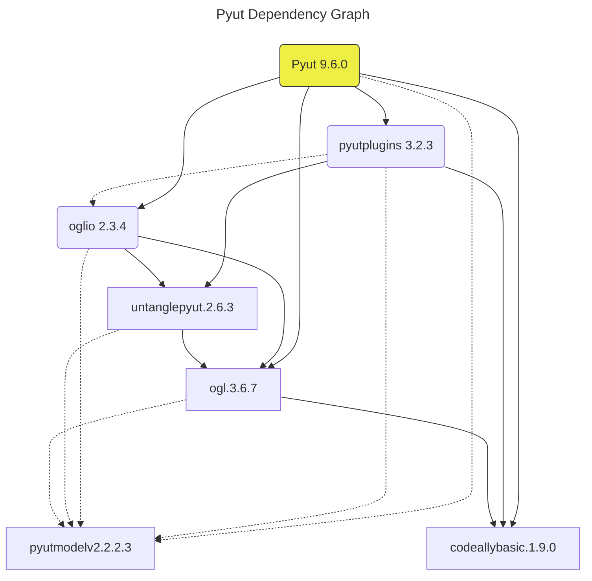

[](https://dl.circleci.com/status-badge/redirect/gh/hasii2011/versionoverlord/tree/master)
[](https://GitHub.com/Naereen/StrapDown.js/graphs/commit-activity)
[](https://badge.fury.io/py/versionoverlord)

[](https://www.python.org/)

## Rationale

These utilities are meant to solve a problem with related repositories and their dependency relationships

Projects may have hierarchical dependencies.  See the following [Pyut](https://github.com/hasii2011/PyUt) dependency diagram. 




The above diagram illustrates how low-level dependencies ripple up the dependency tree.  

## Dependency Locations

Additionally, projects may specify dependencies in different places.  Examples of the dependency locations are

* pyproject.toml
* setup.py
* requirements.txt
* .circleci/config.yml
* .travis.yml


## Python Console Scripts

VersionOverlord means to handle this problem by providing a set of Python command line scripts to automate updating the first three of the above dependency specification locations

* versionoverlord     -- lists all the commands and their short names
* querySlugs          -- queries repositories for their latest release version
* createSpecification -- creates a dependency specification for a project 
* updateDependencies  -- updates the supported dependency locations using the generated specification
* draftRelease        -- This command creates draft release in the appropriate repository.  You must provide a repository slug
* bumpVersion         -- Bump version looks for file in `src/<moduleName>/_version.py`.  It echoes it to stdout and asks the developer to provide an updated value.
* pickDependencies 
    * Reads pyproject.toml and picks the dependencies from the `dependencies` section.  
    * It displays them in an editor.
    * The developer removes dependencies he/she does not want to update.  
    * This command updates the dependency csv file in the same format as the `createSpecification` command.
    * It then invokes the `updateDependencies` command to update the files.  Unlike `createSpecification`, pickDependencies queries pypi to get the module versions
    
* publishRelease -- Publishes a previously created draft release


## Required Environment Variables

The above commands depend on the following environment variables.

```bash
GH_TOKEN       - A personal GitHub access token necessary to read repository release information
PROJECTS_BASE  - The local directory where the python projects are based
PROJECT        - The name of the project;  It should be a directory name
```

See the [GitHub Documentation](https://docs.github.com/en/authentication/keeping-your-account-and-data-secure/creating-a-personal-access-token) for instructions on how to create a usable access token.  These scripts assume  that a developer keeps all checked out repositories in a single directory.  An example, of a PROJECTS_BASE is:

```bash
export PROJECTS_BASE="${HOME}/PycharmProjects" 
```

This should be set in your shell startup script.  For example `.bash_profile`.

The developer sets the PROJECT environment variable on a project by project basis.  
I recommend you use [direnv](https://direnv.net) to manage these.  An example of a .envrc follows:

```bash
export PROJECT=pyutmodel
export GH_TOKEN=DEADBEEF
source pyenv-3.10.6/bin/activate
```

## Advanced Slugs

The command line options for querySlug and createSpecification are advanced GitHub slugs.  For example, for the following repositories

https://github.com/hasii2011/pyutmodel

https://github.com/hasii2011/code-ally-basic

The slugs are `hasii2011/pyutmodel`  and `hasii2011/code-ally-basic,codeallybasic`, respectively.
Note the advanced part of the third slugs because the package name does not match the repository name;  


## Usage

From the above dependency diagram assume the following:

Both the `pyutmodel` and `code-ally-basic` repositories releases have been updated.  We need to update the `ogl` dependencies to match the latest of both.  Assume both `GH_TOKEN` and `PROJECTS_BASE` are correctly set and `PROJECT` is set to `'ogl'`.  Use the following CLI invocation to create the specification file.

```bash
createSpecification -s hasii2011/pyutmodel -s hasii2011/code-ally-basic,codeallybasic
```

The command creates the file `versionSpecification.csv` with the following contents.

```
PackageName,OldVersion,NewVersion
pyutmodel,1.4.0,1.4.1
codeallybasic,0.0.7,0.1.0                   
```

Again assuming, the previously mentioned environment variables are set the following CLI invocation;

```
updateDependencies
```

correctly updates the following

* setup.py
* requirements.txt
* .circleci/config.yml
* .travis.yml
* pyproject.toml

## Installation

```
pip install versionoverlord

or

pipx install versionoverlord
```
___

Written by <a href="mailto:email@humberto.a.sanchez.ii@gmail.com?subject=Hello Humberto">Humberto A. Sanchez II</a>  (C) 2025


## Note
For all kind of problems, requests, enhancements, bug reports, etc., drop me an e-mail.


---
I am concerned about GitHub's Copilot project


I urge you to read about the [Give up GitHub](https://GiveUpGitHub.org) campaign from[the Software Freedom Conservancy](https://sfconservancy.org).

While I do not advocate for all the issues listed there, I do not like that a company like Microsoft may profit from open source projects.

I continue to use GitHub because it offers the services I need for free.  I continue to monitor their terms of service.

Any use of this project's code by GitHub Copilot, past or present, is done without my permission.  I do not consent to GitHub's use of this project's code in Copilot.
