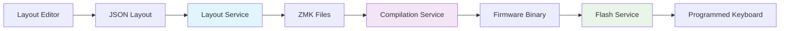

# Developer Documentation

Welcome to the comprehensive Glovebox developer documentation. This guide provides everything developers need to understand, contribute to, and extend the Glovebox keyboard firmware management system.

## Quick Start

### Prerequisites
- **Python 3.11+** (required minimum version)
- **Docker** (for firmware compilation)
- **Git** (for version control)
- **uv** (recommended Python package manager)

### Development Environment Setup

```bash
# Clone the repository
git clone https://github.com/your-org/glovebox.git
cd glovebox

# Install with development dependencies (recommended approach)
uv sync

# Alternative: Install with pip
pip install -e ".[dev]"

# Set up pre-commit hooks for code quality
pre-commit install

# Verify installation
make test
```

### Essential Development Commands

```bash
# Code Quality (MANDATORY before commits)
make lint          # Run linting checks with ruff
make format        # Format code and fix linting issues
make test          # Run all tests with pytest
make coverage      # Run tests with coverage reporting

# Individual Tools
uv run ruff check . --fix        # Fix linting issues
uv run ruff format .             # Format code
uv run mypy glovebox/            # Type checking
uv run pytest                   # Run tests
uv run pytest --cov=glovebox    # Run with coverage

# Development Workflow
uv run python -m glovebox.cli --help    # Test CLI locally
```

## Architecture at a Glance

Glovebox implements **Domain-Driven Design** with clean separation of concerns:

```
glovebox/
├── 🏗️  layout/           # Layout Domain: JSON→DTSI conversion, version management
├── 🔧  firmware/         # Firmware Domain: Building & flashing operations  
├── ⚙️   compilation/      # Compilation Domain: Build strategies & caching
├── 📋  config/           # Configuration Domain: Profiles & settings
├── 🔌  adapters/         # Adapter Layer: External system interfaces
├── 📊  models/           # Core Models: Shared data structures
├── 🎯  protocols/        # Interface Definitions: Type-safe contracts
├── 💻  cli/              # CLI Interface: Command-line interface
├── ⚡  core/             # Core Infrastructure: Logging, caching, startup
└── 🌐  moergo/           # MoErgo Integration: API client & services
```

### Core Design Principles

1. **🏗️ Domain-Driven Design**: Business logic organized by domains with clear boundaries
2. **🏭 Factory Functions**: Consistent creation patterns (`create_*_service()`)
3. **📋 Protocol-Based Interfaces**: Type-safe abstractions with runtime checking
4. **🧩 Service Layer Pattern**: Domain services with single responsibility
5. **🚪 Clean Imports**: No backward compatibility layers - single source of truth
6. **💾 Shared Cache Coordination**: Unified caching across domains with proper isolation

## Understanding the Pipeline

Glovebox transforms keyboard layouts through a comprehensive pipeline:



**Key Transformations**:
- **JSON → DTSI**: Layout processing with behavior analysis
- **DTSI → Firmware**: Multi-strategy compilation (Docker-based)
- **Firmware → Device**: Cross-platform USB flashing

## Domain Architecture Deep Dive

### 🏗️ Layout Domain (`glovebox/layout/`)

**Purpose**: Transform JSON layouts into ZMK files, manage versions and components

```python
from glovebox.layout import create_layout_service
from glovebox.layout.models import LayoutData

# Core layout operations
layout_service = create_layout_service()
result = layout_service.generate(profile, layout_data, output_prefix)

# Component operations (decompose/compose)
component_service = create_layout_component_service()
components = component_service.decompose(layout_data, output_dir)

# Version management (NEW)
version_manager = create_version_manager()
version_manager.import_master_layout(layout_file, version, keyboard)
upgraded = version_manager.upgrade_layout(custom_layout, target_version)
```

**Key Components**:
- **LayoutService**: Primary layout operations (generate, validate, compile)
- **LayoutComponentService**: Layer extraction and merging operations
- **LayoutDisplayService**: Terminal visualization with Rich formatting
- **VersionManager**: Master layout imports and intelligent upgrades
- **FirmwareTracker**: Links compiled firmware to layout files

**Subdomains**:
- `behavior/`: Behavior analysis, formatting, and models
- `comparison/`: Layout comparison and diffing services
- `diffing/`: Diff and patch operations
- `editor/`: Layout editing and field manipulation
- `layer/`: Layer management services
- `utils/`: Field parsing, JSON operations, validation

### ⚙️ Compilation Domain (`glovebox/compilation/`)

**Purpose**: Direct compilation strategies with intelligent caching and workspace management

```python
from glovebox.compilation import create_compilation_service

# Direct strategy selection - user chooses via CLI
service = create_compilation_service(strategy="zmk_config") 
result = service.compile(profile, keymap_file, config_file, options)

# Multiple compilation strategies available
strategies = ["zmk_config", "west", "cmake", "make", "ninja", "custom"]
```

**Key Features**:
- **🎯 Direct Strategy Selection**: Clean service selection without coordination layer
- **🏗️ Dynamic ZMK Config Generation**: Creates complete workspaces on-the-fly
- **📋 Build Matrix Support**: GitHub Actions style matrices with split keyboard detection
- **💾 Shared Cache Integration**: Uses `create_compilation_cache_service()` for workspace caching
- **⚡ Multi-Strategy Support**: Flexible compilation methods for different use cases

**Cache Architecture**:
```python
# Domain uses shared cache coordination
from glovebox.compilation.cache import create_compilation_cache_service

cache_manager, workspace_service = create_compilation_cache_service(user_config)
# Shared instance across all compilation operations
```

### 🔧 Firmware Domain (`glovebox/firmware/`)

**Purpose**: Firmware building and cross-platform device flashing

```python
from glovebox.firmware import create_build_service
from glovebox.firmware.flash import create_flash_service

# Build firmware using Docker
build_service = create_build_service()
result = build_service.compile(profile, keymap_file, config_file, options)

# Flash firmware to USB devices
flash_service = create_flash_service()
result = flash_service.flash_device(device, firmware_file)
```

**Flash Subdomain** (`glovebox/firmware/flash/`):
- **FlashService**: Main flash operations with retry logic
- **DeviceDetector**: Cross-platform USB device detection and monitoring
- **FlashOperations**: Low-level mount/unmount operations
- **OS Adapters**: Platform-specific implementations (Linux, macOS, Windows, WSL2)

### 📋 Configuration Domain (`glovebox/config/`)

**Purpose**: Type-safe configuration management with modular YAML structure

```python
from glovebox.config import create_keyboard_profile, create_user_config

# Full profile with firmware configuration
profile = create_keyboard_profile("glove80", "v25.05")

# Keyboard-only profile for flashing operations
keyboard_profile = create_keyboard_profile("glove80")

# User configuration management
user_config = create_user_config()
```

**Key Features**:
- **🧩 Modular YAML Structure**: Configuration files with includes and inheritance
- **⚡ Keyboard-Only Profile Support**: Minimal configurations for flashing operations
- **🔧 Multi-source Configuration**: Environment, global, local precedence
- **🛡️ Type Safety**: Pydantic models with comprehensive validation
- **⚙️ Compilation Configuration**: Unified models for all compilation strategies

**Modular Configuration Structure**:
```yaml
# keyboards/glove80.yaml (main entry point)
includes:
  - "glove80/main.yaml"

# keyboards/glove80/main.yaml
keyboard: "glove80"
includes:
  - "hardware.yaml"      # Hardware specifications
  - "firmwares.yaml"     # Firmware variants  
  - "strategies.yaml"    # Compilation methods
  - "kconfig.yaml"       # Kconfig options
  - "behaviors.yaml"     # Behavior definitions
```

### 🔌 Adapter Layer (`glovebox/adapters/`)

**Purpose**: Clean interfaces to external systems following adapter pattern

```python
from glovebox.adapters import (
    create_docker_adapter,
    create_file_adapter, 
    create_usb_adapter,
    create_template_adapter
)

# External system interfaces
docker = create_docker_adapter()
file_ops = create_file_adapter()
usb_ops = create_usb_adapter()
templates = create_template_adapter()
```

**Key Adapters**:
- **DockerAdapter**: Container operations for firmware compilation
- **FileAdapter**: File system operations with error handling
- **USBAdapter**: USB device operations and monitoring
- **TemplateAdapter**: Jinja2 template processing for ZMK files

## Development Patterns

### Factory Function Pattern

All services use consistent factory functions for creation:

```python
# Domain service factories
from glovebox.layout import create_layout_service
from glovebox.firmware.flash import create_flash_service  
from glovebox.compilation import create_compilation_service
from glovebox.config import create_keyboard_profile

# Adapter factories
from glovebox.adapters import create_docker_adapter
from glovebox.core.cache import create_default_cache
```

### Protocol-Based Interfaces

Type-safe abstractions with runtime checking:

```python
from glovebox.protocols import (
    FileAdapterProtocol,
    DockerAdapterProtocol,
    FlashOSProtocol
)

# Services implement protocols for type safety
class MyService:
    def __init__(self, file_adapter: FileAdapterProtocol):
        self.file_adapter = file_adapter
```

### Shared Cache Coordination

Unified caching system with domain isolation:

```python
from glovebox.core.cache import create_default_cache, get_shared_cache_instance

# Each domain gets isolated cache namespace
compilation_cache = create_default_cache(tag="compilation")
metrics_cache = create_default_cache(tag="metrics") 
layout_cache = create_default_cache(tag="layout")

# Same tag = same instance, different tag = separate instance
cache1 = create_default_cache(tag="compilation")  # Same as above
cache2 = create_default_cache(tag="compilation")  # Same instance as cache1
```

## Development Workflow

### 🔄 Standard Development Process

1. **📋 Create Feature Branch**: `git checkout -b feature/my-feature`
2. **💻 Implement Changes**: Follow established patterns and conventions
3. **✅ Quality Checks**: `make lint && make test` (MANDATORY)
4. **📝 Commit Changes**: Use conventional commit format
5. **🔍 Code Review**: Submit PR for review and merge to `dev`

### 🧪 Testing Strategy

```bash
# Run all tests
pytest

# Domain-specific testing
pytest tests/test_layout/           # Layout domain tests
pytest tests/test_firmware/         # Firmware domain tests  
pytest tests/test_compilation/      # Compilation domain tests
pytest tests/test_config/           # Configuration tests

# Integration and coverage
pytest tests/test_integration/      # Integration tests
pytest --cov=glovebox --cov-report=html  # Coverage reporting
```

**Test Organization**:
- **Unit Tests**: Individual component testing with mocking
- **Integration Tests**: Component interaction testing  
- **CLI Tests**: Command-line interface functionality
- **Isolation**: All tests use isolated fixtures preventing pollution

### 🛡️ Code Quality Gates

**MANDATORY Requirements** (Enforced):
- ✅ **Maximum 500 lines per file**
- ✅ **Maximum 50 lines per method** 
- ✅ **All code MUST pass linting**: `ruff check . && ruff format .`
- ✅ **All code MUST pass type checking**: `mypy glovebox/`
- ✅ **Minimum 90% test coverage** for new code
- ✅ **NO CODE can be merged without tests**

## Documentation Structure

### 📚 This Documentation Set

- **[README.md](README.md)** - This comprehensive overview
- **[Architecture](architecture/)** - Detailed system architecture guides
- **[Domains](domains/)** - Deep-dive documentation for each domain
- **[Guides](guides/)** - Step-by-step development guides
- **[Patterns](patterns/)** - Code patterns and best practices
- **[API](api/)** - API reference and interfaces
- **[Workflows](workflows/)** - Development workflows and processes
- **[Examples](examples/)** - Code examples and usage patterns

### 🎯 Quick Navigation

**New Developer Setup**:
1. [Development Environment Setup](guides/development-setup.md)
2. [Architecture Overview](architecture/overview.md)
3. [Code Conventions](patterns/code-conventions.md)

**Understanding the Codebase**:
1. [Domain Architecture](architecture/domain-driven-design.md)
2. [Service Layer Patterns](patterns/service-layer.md)
3. [Factory Functions](patterns/factory-functions.md)

**Making Changes**:
1. [Adding New Features](guides/adding-features.md)
2. [Testing Strategy](guides/testing-strategy.md)
3. [Code Review Process](workflows/code-review.md)

**Advanced Topics**:
1. [Cache Coordination System](architecture/cache-coordination.md)
2. [CLI Modular Structure](architecture/cli-architecture.md)
3. [Extension Points](guides/extension-points.md)

## Getting Help and Contributing

### 🤝 Community

- **🐛 Bug Reports**: Submit detailed issue reports on GitHub Issues
- **💡 Feature Requests**: Propose new features in GitHub Discussions
- **❓ Questions**: Ask questions in GitHub Discussions
- **📚 Documentation**: Keep documentation updated with code changes

### ⚡ Quick References

- **[Testing Quick Reference](testing-quick-reference.md)** - Fast testing commands and patterns
- **[CLI Reference](../user/cli-reference.md)** - Complete command reference
- **[Troubleshooting](troubleshooting.md)** - Common issues and solutions
- **[API Reference](api/)** - Comprehensive API documentation

---

**Ready to contribute?** Start with the [Development Setup Guide](guides/development-setup.md) and [Architecture Overview](architecture/overview.md).