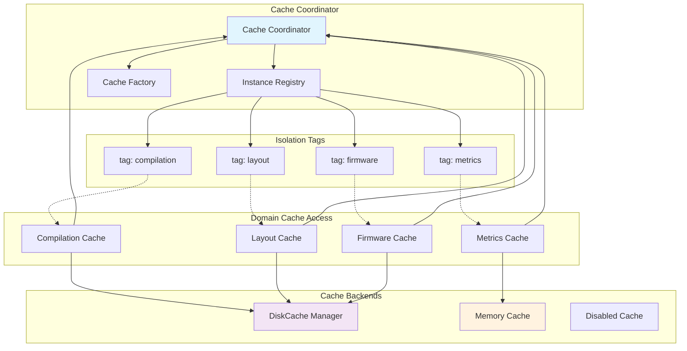

# Shared Cache Coordination System

This document explains the shared cache coordination system in Glovebox, which provides unified caching across all domains while maintaining proper isolation and following factory function patterns.

## Architecture Overview

The shared cache coordination system eliminates multiple independent cache instances by coordinating cache access across domains while maintaining isolation through namespace tags:



## Core Concepts

### Shared Coordination Benefits

- **🔄 Single Cache Instances**: Same tag → same cache instance across all usage
- **🏗️ Domain Isolation**: Different tags → separate cache instances with isolated namespaces
- **💾 Memory Efficiency**: Eliminates duplicate cache managers and reduces memory usage
- **🔒 Thread/Process Safety**: DiskCache with SQLite backend supports concurrent access
- **🧪 Test Isolation**: `reset_shared_cache_instances()` ensures clean state between tests

### Tag-Based Isolation

Each domain gets its own isolated cache namespace through tags:

```python
# Each domain uses a specific tag for isolation
compilation_cache = create_default_cache(tag="compilation")
metrics_cache = create_default_cache(tag="metrics")
layout_cache = create_default_cache(tag="layout")
firmware_cache = create_default_cache(tag="firmware")

# Same tag = same instance (shared coordination)
cache1 = create_default_cache(tag="compilation")  # Same as compilation_cache
cache2 = create_default_cache(tag="compilation")  # Same instance as cache1

# Different tag = separate instance (isolated namespaces)
cache3 = create_default_cache(tag="metrics")      # Different from compilation caches
```

## Cache Coordinator Implementation

### Core Coordinator

The cache coordinator manages shared instances with proper isolation:

```python
# glovebox/core/cache/cache_coordinator.py

import logging
from pathlib import Path
from typing import Dict, Optional

logger = logging.getLogger(__name__)

# Global registry for shared cache instances
_shared_cache_instances: Dict[str, "CacheManager"] = {}

def get_shared_cache_instance(
    cache_root: Path,
    tag: Optional[str] = None,
    enabled: bool = True,
    max_size_gb: int = 2,
    timeout: int = 30,
) -> "CacheManager":
    """Get shared cache instance, creating if needed.
    
    Args:
        cache_root: Root directory for cache storage
        tag: Cache namespace tag for domain isolation
        enabled: Whether caching is enabled
        max_size_gb: Maximum cache size in GB
        timeout: Cache operation timeout in seconds
    
    Returns:
        CacheManager instance (shared if same key used)
    """
    from glovebox.core.cache.diskcache_manager import DiskCacheManager
    from glovebox.core.cache.disabled_cache import DisabledCache
    
    # Create unique key for cache instance
    cache_key = _create_cache_key(cache_root, tag, enabled, max_size_gb, timeout)
    
    # Return existing instance if available
    if cache_key in _shared_cache_instances:
        logger.debug("Returning existing cache instance for key: %s", cache_key)
        return _shared_cache_instances[cache_key]
    
    # Create new cache instance
    if not enabled:
        cache_manager = DisabledCache()
    else:
        # Create DiskCache with SQLite backend for thread safety
        cache_dir = cache_root / f"cache_{tag}" if tag else cache_root / "cache"
        cache_manager = DiskCacheManager(
            cache_dir=cache_dir,
            max_size_gb=max_size_gb,
            timeout=timeout,
            tag=tag,
        )
    
    # Store in registry
    _shared_cache_instances[cache_key] = cache_manager
    logger.info("Created new cache instance: key=%s, tag=%s, enabled=%s", 
               cache_key, tag, enabled)
    
    return cache_manager

def _create_cache_key(
    cache_root: Path,
    tag: Optional[str],
    enabled: bool,
    max_size_gb: int,
    timeout: int,
) -> str:
    """Create unique key for cache instance."""
    return f"{cache_root}:{tag}:{enabled}:{max_size_gb}:{timeout}"

def reset_shared_cache_instances() -> None:
    """Reset shared cache instances (for testing)."""
    global _shared_cache_instances
    
    # Close all cache instances properly
    for cache_key, cache_instance in _shared_cache_instances.items():
        try:
            if hasattr(cache_instance, 'close'):
                cache_instance.close()
        except Exception as e:
            logger.warning("Error closing cache instance %s: %s", cache_key, e)
    
    # Clear registry
    _shared_cache_instances.clear()
    logger.debug("Reset shared cache instances")

def get_cache_instance_count() -> int:
    """Get number of active cache instances (for monitoring)."""
    return len(_shared_cache_instances)

def get_cache_instance_keys() -> list[str]:
    """Get list of active cache instance keys (for debugging)."""
    return list(_shared_cache_instances.keys())
```

### Factory Function Integration

The cache coordinator integrates with the factory function pattern:

```python
# glovebox/core/cache/__init__.py

from pathlib import Path
from typing import Optional

def create_default_cache(
    tag: Optional[str] = None,
    cache_root: Optional[Path] = None,
    enabled: bool = True,
    max_size_gb: int = 2,
    timeout: int = 30,
) -> "CacheManager":
    """Create cache manager with shared coordination.
    
    Args:
        tag: Cache namespace tag for domain isolation
        cache_root: Root directory for cache storage
        enabled: Whether caching is enabled
        max_size_gb: Maximum cache size in GB
        timeout: Cache operation timeout in seconds
    
    Returns:
        CacheManager instance (shared if same parameters used)
    """
    if cache_root is None:
        cache_root = _get_default_cache_root()
    
    # Check if caching is globally disabled
    if _is_cache_globally_disabled():
        enabled = False
    
    # Check if module-specific caching is disabled
    if tag and _is_module_cache_disabled(tag):
        enabled = False
    
    # Use shared coordination
    from glovebox.core.cache.cache_coordinator import get_shared_cache_instance
    return get_shared_cache_instance(
        cache_root=cache_root,
        tag=tag,
        enabled=enabled,
        max_size_gb=max_size_gb,
        timeout=timeout,
    )

def create_cache_from_user_config(
    user_config: "UserConfig",
    tag: Optional[str] = None,
) -> "CacheManager":
    """Create cache manager from user configuration."""
    return create_default_cache(
        tag=tag,
        cache_root=user_config.cache_directory,
        enabled=user_config.cache_enabled,
        max_size_gb=user_config.cache_max_size_gb,
        timeout=user_config.cache_timeout,
    )

def _get_default_cache_root() -> Path:
    """Get default cache root directory."""
    from glovebox.config import get_user_cache_directory
    return get_user_cache_directory()

def _is_cache_globally_disabled() -> bool:
    """Check if caching is globally disabled."""
    import os
    return os.environ.get("GLOVEBOX_CACHE_DISABLED", "").lower() in ("1", "true", "yes")

def _is_module_cache_disabled(tag: str) -> bool:
    """Check if cache is disabled for specific module."""
    import os
    env_var = f"GLOVEBOX_CACHE_{tag.upper()}_DISABLED"
    return os.environ.get(env_var, "").lower() in ("1", "true", "yes")
```

## Domain-Specific Cache Integration

### Compilation Domain Cache Services

The compilation domain uses shared coordination for workspace and build caching:

```python
# glovebox/compilation/cache/__init__.py

from typing import Tuple

def create_compilation_cache_service(
    user_config: Optional["UserConfig"] = None,
) -> Tuple["CacheManager", "ZmkWorkspaceCacheService"]:
    """Create compilation cache services with shared coordination.
    
    Returns:
        Tuple of (cache_manager, workspace_service) for compilation operations.
    """
    from glovebox.compilation.cache.workspace_cache_service import ZmkWorkspaceCacheService
    
    if user_config is None:
        from glovebox.config import create_user_config
        user_config = create_user_config()
    
    # Use shared cache coordination with compilation tag
    from glovebox.core.cache import create_cache_from_user_config
    cache_manager = create_cache_from_user_config(user_config, tag="compilation")
    
    # Create workspace service using shared cache
    workspace_service = ZmkWorkspaceCacheService(
        cache_manager=cache_manager,
        user_config=user_config,
    )
    
    return cache_manager, workspace_service

def create_zmk_workspace_cache_service(
    cache_manager: Optional["CacheManager"] = None,
    user_config: Optional["UserConfig"] = None,
) -> "ZmkWorkspaceCacheService":
    """Create ZMK workspace cache service."""
    from glovebox.compilation.cache.workspace_cache_service import ZmkWorkspaceCacheService
    
    if cache_manager is None or user_config is None:
        cache_manager, _ = create_compilation_cache_service(user_config)
        if user_config is None:
            from glovebox.config import create_user_config
            user_config = create_user_config()
    
    return ZmkWorkspaceCacheService(
        cache_manager=cache_manager,
        user_config=user_config,
    )

def create_compilation_build_cache_service(
    cache_manager: Optional["CacheManager"] = None,
) -> "CompilationBuildCacheService":
    """Create compilation build cache service."""
    from glovebox.compilation.cache.compilation_build_cache_service import CompilationBuildCacheService
    
    if cache_manager is None:
        # Use shared coordination with compilation tag
        from glovebox.core.cache import create_default_cache
        cache_manager = create_default_cache(tag="compilation")
    
    return CompilationBuildCacheService(cache_manager=cache_manager)
```

### Service Integration Example

Services use the shared cache coordination transparently:

```python
# glovebox/compilation/services/zmk_west_service.py

class ZmkWestService:
    """ZMK west-based compilation service."""
    
    def __init__(
        self,
        docker_adapter: "DockerAdapterProtocol",
        user_config: "UserConfig",
        cache_manager: "CacheManager",
        workspace_service: "ZmkWorkspaceCacheService",
    ):
        self.docker_adapter = docker_adapter
        self.user_config = user_config
        self.cache_manager = cache_manager  # Shared cache instance
        self.workspace_service = workspace_service
    
    def compile(self, keymap: str, config: str, options: "CompilationOptions") -> "BuildResult":
        """Compile ZMK firmware using cached workspace."""
        # Use shared cache for compilation artifacts
        cache_key = self._generate_cache_key(keymap, config, options)
        
        # Check cache first
        cached_result = self.cache_manager.get(cache_key)
        if cached_result is not None:
            logger.info("Using cached compilation result")
            return cached_result
        
        # Perform compilation
        result = self._perform_compilation(keymap, config, options)
        
        # Cache result
        self.cache_manager.set(cache_key, result, expire=3600)  # 1 hour TTL
        
        return result

# Factory function using shared coordination
def create_zmk_west_service(
    docker_adapter: Optional["DockerAdapterProtocol"] = None,
    user_config: Optional["UserConfig"] = None,
    cache_manager: Optional["CacheManager"] = None,
    workspace_service: Optional["ZmkWorkspaceCacheService"] = None,
) -> "ZmkWestService":
    """Create ZMK west service with shared cache coordination."""
    
    if docker_adapter is None:
        from glovebox.adapters import create_docker_adapter
        docker_adapter = create_docker_adapter()
    
    if user_config is None:
        from glovebox.config import create_user_config
        user_config = create_user_config()
    
    # Use shared cache coordination
    if cache_manager is None or workspace_service is None:
        from glovebox.compilation.cache import create_compilation_cache_service
        cache_manager, workspace_service = create_compilation_cache_service(user_config)
    
    return ZmkWestService(
        docker_adapter=docker_adapter,
        user_config=user_config,
        cache_manager=cache_manager,
        workspace_service=workspace_service,
    )
```

## Cache Backend Implementation

### DiskCache Manager

The DiskCache manager provides thread-safe caching with SQLite backend:

```python
# glovebox/core/cache/diskcache_manager.py

import logging
from pathlib import Path
from typing import Any, Optional

import diskcache

logger = logging.getLogger(__name__)

class DiskCacheManager:
    """Cache manager using DiskCache with SQLite backend."""
    
    def __init__(
        self,
        cache_dir: Path,
        max_size_gb: int = 2,
        timeout: int = 30,
        tag: Optional[str] = None,
    ):
        self.cache_dir = cache_dir
        self.max_size_gb = max_size_gb
        self.timeout = timeout
        self.tag = tag
        
        # Create cache directory
        cache_dir.mkdir(parents=True, exist_ok=True)
        
        # Initialize DiskCache with SQLite backend
        self._cache = diskcache.Cache(
            directory=str(cache_dir),
            size_limit=max_size_gb * 1024 * 1024 * 1024,  # Convert GB to bytes
            timeout=timeout,
        )
        
        logger.info(
            "Initialized DiskCache: dir=%s, max_size=%dGB, tag=%s",
            cache_dir, max_size_gb, tag
        )
    
    def get(self, key: str, default: Any = None) -> Any:
        """Get value from cache."""
        try:
            namespaced_key = self._namespace_key(key)
            value = self._cache.get(namespaced_key, default)
            
            if value is not default:
                logger.debug("Cache hit: key=%s, tag=%s", key, self.tag)
            else:
                logger.debug("Cache miss: key=%s, tag=%s", key, self.tag)
            
            return value
        except Exception as e:
            logger.warning("Cache get error for key %s: %s", key, e)
            return default
    
    def set(self, key: str, value: Any, expire: Optional[int] = None) -> bool:
        """Set value in cache with optional expiration."""
        try:
            namespaced_key = self._namespace_key(key)
            success = self._cache.set(namespaced_key, value, expire=expire)
            
            if success:
                logger.debug("Cache set: key=%s, tag=%s, expire=%s", key, self.tag, expire)
            else:
                logger.warning("Cache set failed: key=%s, tag=%s", key, self.tag)
            
            return success
        except Exception as e:
            logger.error("Cache set error for key %s: %s", key, e)
            return False
    
    def delete(self, key: str) -> bool:
        """Delete value from cache."""
        try:
            namespaced_key = self._namespace_key(key)
            success = self._cache.delete(namespaced_key)
            
            if success:
                logger.debug("Cache delete: key=%s, tag=%s", key, self.tag)
            
            return success
        except Exception as e:
            logger.warning("Cache delete error for key %s: %s", key, e)
            return False
    
    def clear(self) -> None:
        """Clear all cache entries for this namespace."""
        try:
            if self.tag:
                # Clear only entries with this tag's namespace
                prefix = f"{self.tag}:"
                keys_to_delete = [key for key in self._cache.iterkeys() if key.startswith(prefix)]
                for key in keys_to_delete:
                    self._cache.delete(key)
                logger.info("Cleared cache entries for tag: %s", self.tag)
            else:
                # Clear entire cache
                self._cache.clear()
                logger.info("Cleared entire cache")
        except Exception as e:
            logger.error("Cache clear error: %s", e)
    
    def stats(self) -> dict[str, Any]:
        """Get cache statistics."""
        try:
            return {
                "size": self._cache.volume(),
                "count": len(self._cache),
                "hits": getattr(self._cache, 'hits', 0),
                "misses": getattr(self._cache, 'misses', 0),
                "directory": str(self.cache_dir),
                "tag": self.tag,
            }
        except Exception as e:
            logger.error("Cache stats error: %s", e)
            return {}
    
    def close(self) -> None:
        """Close cache connection."""
        try:
            self._cache.close()
            logger.debug("Closed cache: tag=%s", self.tag)
        except Exception as e:
            logger.warning("Cache close error: %s", e)
    
    def _namespace_key(self, key: str) -> str:
        """Add namespace prefix to key for domain isolation."""
        if self.tag:
            return f"{self.tag}:{key}"
        return key
```

### Disabled Cache Implementation

For testing and disabled scenarios:

```python
# glovebox/core/cache/disabled_cache.py

from typing import Any, Optional

class DisabledCache:
    """Cache implementation that does nothing (for testing/disabled scenarios)."""
    
    def get(self, key: str, default: Any = None) -> Any:
        """Always return default (cache disabled)."""
        return default
    
    def set(self, key: str, value: Any, expire: Optional[int] = None) -> bool:
        """Always return True but don't store anything."""
        return True
    
    def delete(self, key: str) -> bool:
        """Always return True but don't delete anything."""
        return True
    
    def clear(self) -> None:
        """Do nothing (cache disabled)."""
        pass
    
    def stats(self) -> dict[str, Any]:
        """Return empty stats."""
        return {
            "size": 0,
            "count": 0,
            "hits": 0,
            "misses": 0,
            "enabled": False,
        }
    
    def close(self) -> None:
        """Do nothing (no resources to close)."""
        pass
```

## Testing with Shared Cache Coordination

### Test Isolation

Ensure tests don't interfere with each other:

```python
# conftest.py

import pytest

@pytest.fixture(autouse=True)
def reset_shared_cache() -> None:
    """Reset shared cache instances between tests (autouse=True)."""
    from glovebox.core.cache.cache_coordinator import reset_shared_cache_instances
    
    # Reset before test
    reset_shared_cache_instances()
    
    yield
    
    # Reset after test
    reset_shared_cache_instances()
```

### Testing Cache Coordination

Test the coordination system itself:

```python
# tests/test_core/test_cache_coordination.py

class TestCacheCoordination:
    def test_same_tag_returns_same_instance(self, tmp_path):
        """Test that same tag returns same cache instance."""
        # Act
        cache1 = create_default_cache(tag="test", cache_root=tmp_path)
        cache2 = create_default_cache(tag="test", cache_root=tmp_path)
        
        # Assert
        assert cache1 is cache2  # Same instance
    
    def test_different_tag_returns_different_instance(self, tmp_path):
        """Test that different tags return different instances."""
        # Act
        cache1 = create_default_cache(tag="test1", cache_root=tmp_path)
        cache2 = create_default_cache(tag="test2", cache_root=tmp_path)
        
        # Assert
        assert cache1 is not cache2  # Different instances
    
    def test_cache_isolation_between_tags(self, tmp_path):
        """Test that caches with different tags are isolated."""
        # Arrange
        cache1 = create_default_cache(tag="test1", cache_root=tmp_path)
        cache2 = create_default_cache(tag="test2", cache_root=tmp_path)
        
        # Act
        cache1.set("key", "value1")
        cache2.set("key", "value2")
        
        # Assert
        assert cache1.get("key") == "value1"
        assert cache2.get("key") == "value2"  # Isolated namespaces
    
    def test_reset_shared_cache_instances(self, tmp_path):
        """Test resetting shared cache instances."""
        # Arrange
        cache1 = create_default_cache(tag="test", cache_root=tmp_path)
        instance_count_before = get_cache_instance_count()
        
        # Act
        reset_shared_cache_instances()
        
        # Assert
        assert get_cache_instance_count() == 0
        
        # Creating new cache should be different instance
        cache2 = create_default_cache(tag="test", cache_root=tmp_path)
        assert cache1 is not cache2
```

### Domain Service Testing

Test services with shared cache coordination:

```python
# tests/test_compilation/test_zmk_west_service.py

class TestZmkWestService:
    def test_shared_cache_coordination(self, tmp_path):
        """Test that services use shared cache coordination."""
        # Arrange
        user_config = create_test_user_config(cache_root=tmp_path)
        
        # Act - Create two services
        service1 = create_zmk_west_service(user_config=user_config)
        service2 = create_zmk_west_service(user_config=user_config)
        
        # Assert - Should use same cache instance
        assert service1.cache_manager is service2.cache_manager
    
    def test_different_domains_use_different_caches(self, tmp_path):
        """Test that different domains get isolated caches."""
        # Arrange
        user_config = create_test_user_config(cache_root=tmp_path)
        
        # Act
        compilation_cache = create_default_cache(tag="compilation", cache_root=tmp_path)
        metrics_cache = create_default_cache(tag="metrics", cache_root=tmp_path)
        
        # Assert
        assert compilation_cache is not metrics_cache
        
        # Test isolation
        compilation_cache.set("key", "compilation_value")
        metrics_cache.set("key", "metrics_value")
        
        assert compilation_cache.get("key") == "compilation_value"
        assert metrics_cache.get("key") == "metrics_value"
```

## Performance and Monitoring

### Cache Performance Monitoring

Monitor cache performance across domains:

```python
def get_aggregated_cache_stats() -> dict[str, Any]:
    """Get aggregated statistics from all active cache instances."""
    from glovebox.core.cache.cache_coordinator import _shared_cache_instances
    
    stats = {
        "total_instances": len(_shared_cache_instances),
        "instances": {},
        "total_size": 0,
        "total_count": 0,
        "total_hits": 0,
        "total_misses": 0,
    }
    
    for cache_key, cache_instance in _shared_cache_instances.items():
        instance_stats = cache_instance.stats()
        stats["instances"][cache_key] = instance_stats
        
        # Aggregate totals
        stats["total_size"] += instance_stats.get("size", 0)
        stats["total_count"] += instance_stats.get("count", 0)
        stats["total_hits"] += instance_stats.get("hits", 0)
        stats["total_misses"] += instance_stats.get("misses", 0)
    
    # Calculate hit rate
    total_requests = stats["total_hits"] + stats["total_misses"]
    if total_requests > 0:
        stats["hit_rate"] = stats["total_hits"] / total_requests
    else:
        stats["hit_rate"] = 0.0
    
    return stats
```

### Cache Cleanup and Maintenance

Automatic cleanup for long-running processes:

```python
def cleanup_shared_cache_instances() -> None:
    """Clean up and close shared cache instances."""
    from glovebox.core.cache.cache_coordinator import _shared_cache_instances
    
    for cache_key, cache_instance in _shared_cache_instances.items():
        try:
            # Cleanup expired entries
            if hasattr(cache_instance, 'expire'):
                cache_instance.expire()
            
            # Get stats before cleanup
            stats = cache_instance.stats()
            logger.info(
                "Cache cleanup: key=%s, size=%s, count=%d",
                cache_key, stats.get("size", "unknown"), stats.get("count", 0)
            )
            
        except Exception as e:
            logger.warning("Error during cache cleanup for %s: %s", cache_key, e)
```

---

**Next Steps**:
- Explore [Service Layer Patterns](../patterns/service-layer.md) for service implementation with caching
- Review [Testing Strategy](../guides/testing-strategy.md) for cache testing approaches
- Check [Performance Guidelines](../guides/performance-optimization.md) for cache optimization techniques