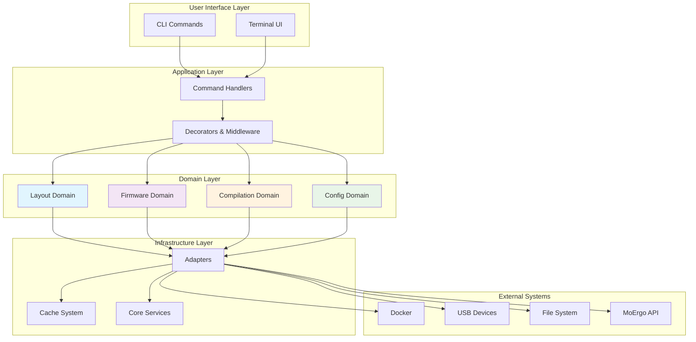
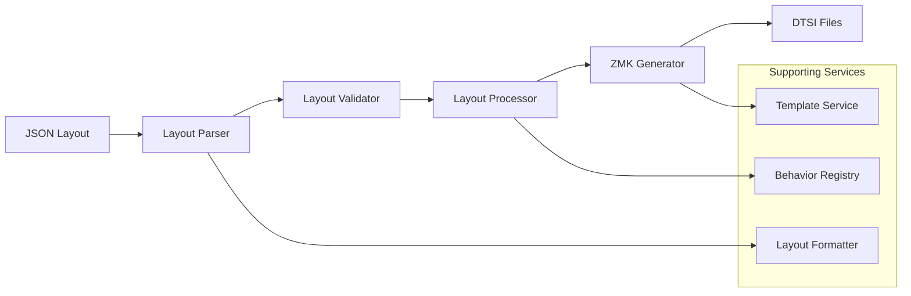
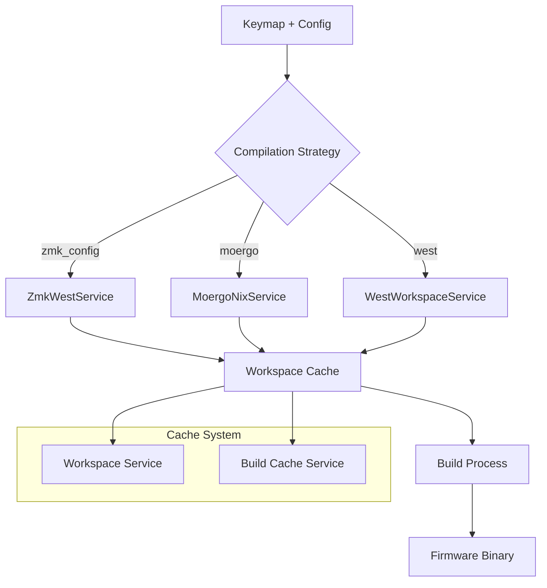
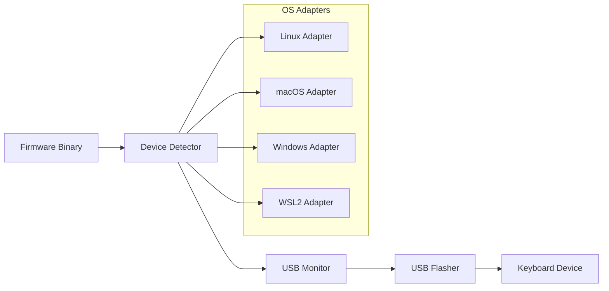
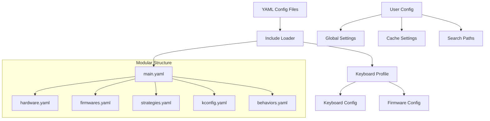
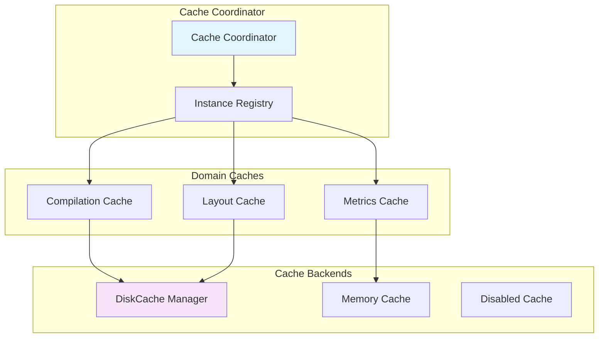
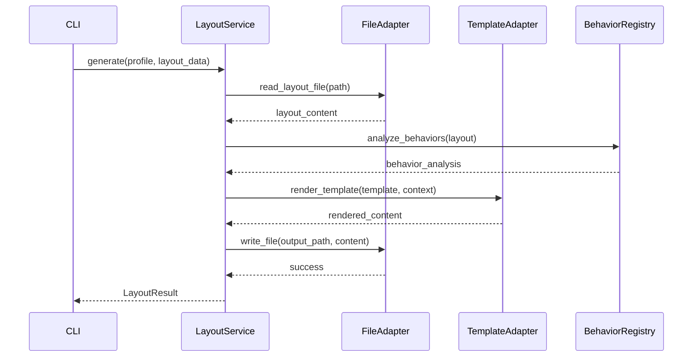

# Architecture Overview

This document provides a comprehensive overview of the Glovebox architecture, focusing on the domain-driven design approach and how components interact to provide keyboard firmware management capabilities.

## High-Level Architecture

Glovebox implements a **domain-driven design** with clean separation of concerns across multiple business domains:



## Architectural Principles

### 1. Domain-Driven Design (DDD)

The codebase is organized around business domains that represent distinct areas of functionality:

- **🏗️ Layout Domain**: Keyboard layout processing and transformation
- **🔧 Firmware Domain**: Firmware building and device flashing
- **⚙️ Compilation Domain**: Build strategies and workspace management
- **📋 Configuration Domain**: System configuration and keyboard profiles

Each domain has:
- **Clear boundaries** - No cross-domain dependencies
- **Domain ownership** - Models, services, and business logic
- **Single responsibility** - Focused on specific business capabilities

### 2. Layered Architecture

```
┌─────────────────────────────────────────────┐
│                UI Layer                     │  ← CLI, TUI, Output formatting
├─────────────────────────────────────────────┤
│            Application Layer                │  ← Commands, decorators, workflows
├─────────────────────────────────────────────┤
│              Domain Layer                   │  ← Business logic, domain services
├─────────────────────────────────────────────┤
│           Infrastructure Layer              │  ← Adapters, cache, core services
└─────────────────────────────────────────────┘
```

### 3. Dependency Inversion

High-level modules don't depend on low-level modules. Both depend on abstractions:

```python
# High-level domain service
class LayoutService:
    def __init__(self, file_adapter: FileAdapterProtocol):
        self.file_adapter = file_adapter  # Depends on abstraction
        
# Low-level infrastructure adapter
class FileAdapter(FileAdapterProtocol):  # Implements abstraction
    def read_file(self, path: Path) -> str:
        return path.read_text()
```

### 4. Factory Function Pattern

Consistent object creation across the entire codebase:

```python
# Every service has a factory function
def create_layout_service() -> LayoutService:
    file_adapter = create_file_adapter()
    template_adapter = create_template_adapter()
    return LayoutService(file_adapter, template_adapter)

# No singletons, no global state
service1 = create_layout_service()  # New instance
service2 = create_layout_service()  # Another new instance
```

### 5. Protocol-Based Interfaces

Type-safe contracts using Python protocols:

```python
from typing import Protocol, runtime_checkable

@runtime_checkable
class FileAdapterProtocol(Protocol):
    def read_file(self, path: Path) -> str: ...
    def write_file(self, path: Path, content: str) -> None: ...
    
# Runtime checking available
assert isinstance(file_adapter, FileAdapterProtocol)
```

## Domain Architecture Deep Dive

### Layout Domain (`glovebox/layout/`)

**Core Responsibility**: Transform JSON keyboard layouts into ZMK Device Tree Source Interface (DTSI) files.



**Key Components**:

- **LayoutService**: Main orchestrator for layout operations
- **LayoutComponentService**: Decomposition and composition operations
- **ZmkFileContentGenerator**: DTSI file generation with Jinja2 templates
- **BehaviorRegistry**: ZMK behavior analysis and formatting
- **VersionManager**: Master layout import and intelligent upgrades

**Subdomains**:
```
layout/
├── behavior/           # Behavior analysis and formatting
├── comparison/         # Layout comparison services
├── diffing/           # Diff and patch operations
├── editor/            # Layout editing and field manipulation
├── layer/             # Layer management services
├── parsers/           # Keymap parsing with AST walker
└── utils/             # Core utilities and operations
```

### Compilation Domain (`glovebox/compilation/`)

**Core Responsibility**: Compile ZMK files into firmware using multiple strategies.



**Key Features**:

- **Direct Strategy Selection**: Users choose compilation method via CLI
- **Build Matrix Support**: GitHub Actions style matrices for complex builds
- **Workspace Management**: Automatic setup and caching of build environments
- **Multi-Strategy Support**: Flexible compilation methods (zmk_config, west, cmake, etc.)

### Firmware Domain (`glovebox/firmware/`)

**Core Responsibility**: Flash compiled firmware to USB keyboard devices.



**Flash Subdomain** (`glovebox/firmware/flash/`):

- **FlashService**: Main flash operations with retry logic
- **DeviceDetector**: Cross-platform USB device detection
- **USBFlasher**: Low-level flashing operations
- **OS Adapters**: Platform-specific implementations

### Configuration Domain (`glovebox/config/`)

**Core Responsibility**: Manage keyboard profiles and user configuration.



**Key Features**:

- **Modular YAML Structure**: Configuration files with includes
- **Profile Pattern**: Keyboard + firmware combinations
- **Multi-source Configuration**: Environment, global, local precedence
- **Type Safety**: Pydantic models with validation

## Infrastructure Layer

### Adapter Pattern Implementation

Adapters provide clean interfaces to external systems:

```python
# Protocol definition
class DockerAdapterProtocol(Protocol):
    def run_container(self, image: str, command: list[str]) -> DockerResult: ...

# Concrete implementation
class DockerAdapter(DockerAdapterProtocol):
    def run_container(self, image: str, command: list[str]) -> DockerResult:
        # Implementation details
        pass

# Factory function
def create_docker_adapter() -> DockerAdapterProtocol:
    return DockerAdapter()
```

**Available Adapters**:
- **DockerAdapter**: Container operations for compilation
- **FileAdapter**: File system operations with error handling
- **USBAdapter**: USB device operations and monitoring
- **TemplateAdapter**: Jinja2 template processing

### Shared Cache Coordination System

Unified caching across domains with proper isolation:



**Key Features**:
- **Shared Coordination**: Same tag → same cache instance
- **Domain Isolation**: Different tags → separate namespaces
- **Memory Efficiency**: Eliminates duplicate cache managers
- **Test Safety**: `reset_shared_cache_instances()` for clean test state

### Service Layer Pattern

Domain services encapsulate business logic:

```python
class LayoutService(BaseService):
    """Main service for layout operations."""
    
    def __init__(
        self,
        file_adapter: FileAdapterProtocol,
        template_adapter: TemplateAdapterProtocol,
        behavior_registry: BehaviorRegistryProtocol,
    ):
        super().__init__()
        self.file_adapter = file_adapter
        self.template_adapter = template_adapter
        self.behavior_registry = behavior_registry
    
    def generate(self, profile: KeyboardProfile, layout: LayoutData) -> LayoutResult:
        """Generate ZMK files from layout data."""
        # Business logic implementation
        pass
```

## CLI Architecture

### Modular Command Structure

Commands organized by domain with consistent patterns:

```
cli/commands/
├── layout/             # Layout management commands
│   ├── compilation.py  # Compile, validate commands
│   ├── comparison.py   # Diff, create-patch commands
│   ├── editor.py       # Field editing commands
│   └── version.py      # Version management commands
├── firmware/           # Firmware operations
├── config/             # Configuration management
├── cache/              # Cache management
└── moergo/             # MoErgo integration
```

### Command Registration Pattern

Consistent command discovery and registration:

```python
# In each command module
def register_commands(app: typer.Typer) -> None:
    """Register commands with the main app."""
    app.add_typer(command_app, name="command-name")

# In cli/commands/__init__.py
def register_all_commands(app: typer.Typer) -> None:
    """Register all CLI commands with the main app."""
    register_layout_commands(app)
    register_firmware_commands(app)
    register_config_commands(app)
    # ... other domains
```

### Parameter Decorators

Consistent parameter handling across commands:

```python
from glovebox.cli.decorators import with_profile, with_input_file, with_output_file

@with_profile()
@with_input_file()
@with_output_file()
def compile_layout(
    ctx: typer.Context,
    validate_only: bool = False,
) -> None:
    """Compile a JSON layout file to ZMK files."""
    # Command implementation
```

## Data Flow Patterns

### Request-Response Flow

Typical flow for layout compilation:



### Error Handling Flow

Consistent error handling across all layers:

```python
try:
    result = service.perform_operation()
except DomainSpecificError as e:
    # Domain-specific error handling
    logger.error("Domain operation failed: %s", e)
    raise
except Exception as e:
    # Generic error handling with debug-aware stack traces
    exc_info = logger.isEnabledFor(logging.DEBUG)
    logger.error("Unexpected error: %s", e, exc_info=exc_info)
    raise GloveboxError(f"Operation failed: {e}") from e
```

## Extension Points

### Adding New Domains

1. **Create domain package** under `glovebox/new_domain/`
2. **Define domain models** in `models.py`
3. **Implement domain service** with `*Service` naming
4. **Create protocol interface** for type safety
5. **Add factory function** following `create_*` pattern
6. **Add CLI commands** in `cli/commands/new_domain/`

### Adding New Adapters

1. **Define protocol** in `glovebox/protocols/`
2. **Implement adapter** in `glovebox/adapters/`
3. **Create factory function** following `create_*_adapter` pattern
4. **Add comprehensive tests** with mocking
5. **Update domain services** to use new adapter

### Adding New Compilation Strategies

1. **Implement CompilationServiceProtocol** in `compilation/services/`
2. **Add configuration model** in `compilation/models/`
3. **Create factory function** following `create_*_service` pattern
4. **Register strategy** in compilation service factory
5. **Add CLI support** for new strategy selection

## Performance Considerations

### Caching Strategy

- **Workspace Caching**: Build environments cached across operations
- **Template Caching**: Jinja2 templates cached for reuse
- **Configuration Caching**: Keyboard profiles cached after loading
- **Dependency Caching**: ZMK dependencies cached for faster builds

### Resource Management

- **Memory Usage**: Services created on-demand, not as singletons
- **File Handles**: Proper context managers for file operations
- **Process Management**: Docker containers cleaned up after use
- **USB Resources**: Device handles properly released

### Scalability Patterns

- **Stateless Services**: All services are stateless and thread-safe
- **Immutable Models**: Pydantic models are immutable by design
- **Protocol-Based Design**: Easy to swap implementations
- **Modular Architecture**: Domains can evolve independently

---

**Next Steps**: 
- Explore [Domain Deep Dives](../domains/) for detailed domain documentation
- Review [Development Patterns](../patterns/) for coding guidelines
- Check [API Reference](../api/) for comprehensive interface documentation