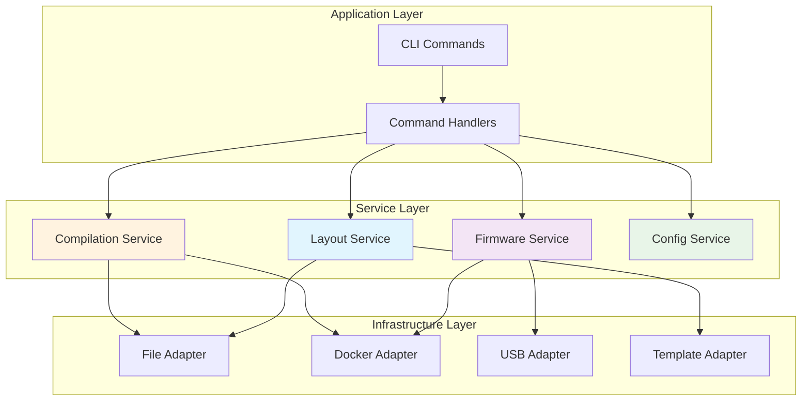

# Service Layer Patterns

This document explains the service layer patterns used throughout Glovebox, providing guidelines for implementing domain services that encapsulate business logic and coordinate between adapters.

## Service Layer Architecture

The service layer sits between the application layer (CLI commands) and the infrastructure layer (adapters), implementing domain-specific business logic:



## Base Service Pattern

All domain services inherit from a common base class that provides logging and common functionality:

```python
from glovebox.services import BaseService
from glovebox.core.logging import get_logger

class BaseService:
    """Base class for all domain services."""
    
    def __init__(self):
        self.logger = get_logger(self.__class__.__name__)
    
    def _log_operation_start(self, operation: str, **kwargs) -> None:
        """Log the start of an operation with context."""
        self.logger.info("Starting %s", operation, extra=kwargs)
    
    def _log_operation_success(self, operation: str, **kwargs) -> None:
        """Log successful completion of an operation."""
        self.logger.info("Completed %s successfully", operation, extra=kwargs)
    
    def _log_operation_failure(self, operation: str, error: Exception, **kwargs) -> None:
        """Log operation failure with appropriate detail level."""
        exc_info = self.logger.isEnabledFor(logging.DEBUG)
        self.logger.error("Failed %s: %s", operation, error, exc_info=exc_info, extra=kwargs)
```

## Domain Service Implementation

### Layout Service Example

The `LayoutService` demonstrates the complete service pattern:

```python
from typing import Protocol
from pathlib import Path

from glovebox.services import BaseService
from glovebox.layout.models import LayoutData, LayoutResult
from glovebox.config.models import KeyboardProfile
from glovebox.protocols import FileAdapterProtocol, TemplateAdapterProtocol
from glovebox.core.errors import LayoutError

class LayoutService(BaseService):
    """Main service for layout operations."""
    
    def __init__(
        self,
        file_adapter: FileAdapterProtocol,
        template_adapter: TemplateAdapterProtocol,
        behavior_registry: BehaviorRegistryProtocol,
    ):
        super().__init__()
        self.file_adapter = file_adapter
        self.template_adapter = template_adapter
        self.behavior_registry = behavior_registry
    
    def generate(
        self,
        profile: KeyboardProfile,
        layout_data: LayoutData,
        output_prefix: Path | str
    ) -> LayoutResult:
        """Generate ZMK files from layout data."""
        try:
            self._log_operation_start(
                "layout_generation",
                profile=profile.name,
                layout=layout_data.title
            )
            
            # Business logic implementation
            result = self._perform_generation(profile, layout_data, output_prefix)
            
            self._log_operation_success(
                "layout_generation",
                files_generated=len(result.files),
                output_path=str(result.output_path)
            )
            
            return result
            
        except LayoutError:
            # Domain-specific errors are re-raised
            raise
        except Exception as e:
            # Wrap unexpected errors
            self._log_operation_failure("layout_generation", e)
            raise LayoutError(f"Layout generation failed: {e}") from e
    
    def validate(self, layout_data: LayoutData) -> bool:
        """Validate layout data against domain rules."""
        try:
            self._log_operation_start("layout_validation", layout=layout_data.title)
            
            # Validation logic
            self._validate_layer_count(layout_data)
            self._validate_bindings(layout_data)
            self._validate_behaviors(layout_data)
            
            self._log_operation_success("layout_validation")
            return True
            
        except Exception as e:
            self._log_operation_failure("layout_validation", e)
            raise LayoutError(f"Layout validation failed: {e}") from e
    
    def _perform_generation(
        self,
        profile: KeyboardProfile,
        layout_data: LayoutData,
        output_prefix: Path | str
    ) -> LayoutResult:
        """Internal method for generation logic."""
        output_path = Path(output_prefix)
        
        # Generate keymap content
        keymap_content = self._generate_keymap_content(layout_data, profile)
        keymap_path = output_path / f"{layout_data.title}.keymap"
        self.file_adapter.write_file(keymap_path, keymap_content)
        
        # Generate config content
        config_content = self._generate_config_content(layout_data, profile)
        config_path = output_path / f"{layout_data.title}.conf"
        self.file_adapter.write_file(config_path, config_content)
        
        return LayoutResult(
            success=True,
            output_path=output_path,
            files={
                "keymap": keymap_path,
                "config": config_path
            },
            layout_data=layout_data
        )
    
    def _generate_keymap_content(self, layout_data: LayoutData, profile: KeyboardProfile) -> str:
        """Generate keymap file content using templates."""
        # Analyze behaviors used in layout
        behavior_analysis = self.behavior_registry.analyze_layout(layout_data)
        
        # Prepare template context
        context = {
            "layout": layout_data,
            "profile": profile,
            "behaviors": behavior_analysis,
            "includes": behavior_analysis.required_includes
        }
        
        # Render keymap template
        template_name = profile.keyboard_config.keymap_template
        return self.template_adapter.render(template_name, context)
    
    def _validate_layer_count(self, layout_data: LayoutData) -> None:
        """Validate that layout has required layers."""
        if len(layout_data.layers) < 1:
            raise LayoutError("Layout must have at least one layer")
    
    def _validate_bindings(self, layout_data: LayoutData) -> None:
        """Validate layer bindings."""
        for layer in layout_data.layers:
            if len(layer.bindings) != 80:  # Glove80 specific
                raise LayoutError(f"Layer '{layer.name}' must have exactly 80 bindings")
```

### Factory Function

Every service has a corresponding factory function:

```python
def create_layout_service(
    file_adapter: FileAdapterProtocol | None = None,
    template_adapter: TemplateAdapterProtocol | None = None,
    behavior_registry: BehaviorRegistryProtocol | None = None,
) -> LayoutService:
    """Create a layout service with proper dependencies."""
    
    # Use provided dependencies or create defaults
    if file_adapter is None:
        from glovebox.adapters import create_file_adapter
        file_adapter = create_file_adapter()
    
    if template_adapter is None:
        from glovebox.adapters import create_template_adapter
        template_adapter = create_template_adapter()
    
    if behavior_registry is None:
        from glovebox.layout.behavior import create_behavior_registry
        behavior_registry = create_behavior_registry()
    
    return LayoutService(
        file_adapter=file_adapter,
        template_adapter=template_adapter,
        behavior_registry=behavior_registry,
    )
```

## Protocol-Based Dependencies

Services depend on protocols, not concrete implementations:

### Defining Service Protocols

```python
from typing import Protocol, runtime_checkable
from pathlib import Path

@runtime_checkable
class FileAdapterProtocol(Protocol):
    """Protocol for file operations."""
    
    def read_file(self, path: Path) -> str:
        """Read text content from file."""
        ...
    
    def write_file(self, path: Path, content: str) -> None:
        """Write text content to file."""
        ...
    
    def exists(self, path: Path) -> bool:
        """Check if file or directory exists."""
        ...

@runtime_checkable
class TemplateAdapterProtocol(Protocol):
    """Protocol for template operations."""
    
    def render(self, template_name: str, context: dict) -> str:
        """Render template with given context."""
        ...
    
    def add_template_path(self, path: Path) -> None:
        """Add template search path."""
        ...
```

### Using Protocols in Services

```python
class LayoutService(BaseService):
    def __init__(
        self,
        file_adapter: FileAdapterProtocol,  # Protocol, not concrete class
        template_adapter: TemplateAdapterProtocol,
    ):
        super().__init__()
        # Runtime checking (optional, useful for debugging)
        assert isinstance(file_adapter, FileAdapterProtocol)
        assert isinstance(template_adapter, TemplateAdapterProtocol)
        
        self.file_adapter = file_adapter
        self.template_adapter = template_adapter
```

## Error Handling Patterns

### Domain-Specific Errors

Each domain defines its own error hierarchy:

```python
# glovebox/core/errors.py
class GloveboxError(Exception):
    """Base exception for all Glovebox errors."""
    pass

class LayoutError(GloveboxError):
    """Errors related to layout processing."""
    pass

class LayoutValidationError(LayoutError):
    """Errors in layout validation."""
    pass

class LayoutGenerationError(LayoutError):
    """Errors in layout generation."""
    pass
```

### Error Handling in Services

```python
class LayoutService(BaseService):
    def generate(self, profile: KeyboardProfile, layout_data: LayoutData) -> LayoutResult:
        try:
            # Validate inputs
            self._validate_inputs(profile, layout_data)
            
            # Perform generation
            result = self._perform_generation(profile, layout_data)
            
            return result
            
        except LayoutValidationError:
            # Re-raise domain-specific validation errors
            raise
        except LayoutGenerationError:
            # Re-raise domain-specific generation errors
            raise
        except FileNotFoundError as e:
            # Convert infrastructure errors to domain errors
            raise LayoutError(f"Required file not found: {e}") from e
        except PermissionError as e:
            # Convert infrastructure errors to domain errors
            raise LayoutError(f"Permission denied: {e}") from e
        except Exception as e:
            # Wrap unexpected errors with debug-aware stack traces
            exc_info = self.logger.isEnabledFor(logging.DEBUG)
            self.logger.error("Unexpected error in layout generation: %s", e, exc_info=exc_info)
            raise LayoutError(f"Layout generation failed: {e}") from e
```

## Service Composition Patterns

### Service Dependencies

Services can depend on other services within the same domain:

```python
class LayoutService(BaseService):
    def __init__(
        self,
        file_adapter: FileAdapterProtocol,
        template_adapter: TemplateAdapterProtocol,
        component_service: LayoutComponentService,  # Domain service dependency
        display_service: LayoutDisplayService,      # Domain service dependency
    ):
        super().__init__()
        self.file_adapter = file_adapter
        self.template_adapter = template_adapter
        self.component_service = component_service
        self.display_service = display_service
    
    def generate_with_preview(self, profile: KeyboardProfile, layout_data: LayoutData) -> LayoutResult:
        """Generate layout with preview display."""
        # Use display service for preview
        preview = self.display_service.format_layout(layout_data)
        self.logger.info("Layout preview:\n%s", preview)
        
        # Generate files
        result = self.generate(profile, layout_data)
        
        return result
```

### Cross-Domain Communication

Services in different domains communicate through well-defined interfaces:

```python
# Layout service provides content for compilation
class LayoutService(BaseService):
    def generate_for_compilation(self, layout_data: LayoutData, profile: KeyboardProfile) -> tuple[str, str]:
        """Generate keymap and config content for compilation services."""
        keymap_content = self._generate_keymap_content(layout_data, profile)
        config_content = self._generate_config_content(layout_data, profile)
        return keymap_content, config_content

# Compilation service receives content, not domain models
class CompilationService(BaseService):
    def compile_from_content(self, keymap_content: str, config_content: str, options: CompilationOptions) -> BuildResult:
        """Compile firmware from keymap and config content."""
        # Implementation doesn't know about LayoutData
        pass
```

## Service Registry Pattern

For complex scenarios, use a service registry to manage dependencies:

```python
from typing import TypeVar, Type, Dict, Any
from dataclasses import dataclass

T = TypeVar('T')

@dataclass
class ServiceRegistration:
    """Registration information for a service."""
    service_type: Type
    factory_function: callable
    singleton: bool = False
    dependencies: list[str] = None

class ServiceRegistry:
    """Registry for managing service dependencies."""
    
    def __init__(self):
        self._registrations: Dict[str, ServiceRegistration] = {}
        self._instances: Dict[str, Any] = {}
    
    def register(
        self,
        name: str,
        service_type: Type[T],
        factory_function: callable,
        singleton: bool = False,
        dependencies: list[str] = None
    ) -> None:
        """Register a service with the registry."""
        self._registrations[name] = ServiceRegistration(
            service_type=service_type,
            factory_function=factory_function,
            singleton=singleton,
            dependencies=dependencies or []
        )
    
    def get(self, name: str) -> Any:
        """Get a service instance from the registry."""
        if name not in self._registrations:
            raise ValueError(f"Service '{name}' not registered")
        
        registration = self._registrations[name]
        
        # Return singleton instance if available
        if registration.singleton and name in self._instances:
            return self._instances[name]
        
        # Resolve dependencies
        dependencies = {}
        for dep_name in registration.dependencies:
            dependencies[dep_name] = self.get(dep_name)
        
        # Create instance
        instance = registration.factory_function(**dependencies)
        
        # Store singleton
        if registration.singleton:
            self._instances[name] = instance
        
        return instance

# Usage example
def create_service_registry() -> ServiceRegistry:
    """Create a service registry with all services."""
    registry = ServiceRegistry()
    
    # Register adapters
    registry.register("file_adapter", FileAdapterProtocol, create_file_adapter, singleton=True)
    registry.register("template_adapter", TemplateAdapterProtocol, create_template_adapter, singleton=True)
    
    # Register services with dependencies
    registry.register(
        "layout_service",
        LayoutService,
        create_layout_service,
        dependencies=["file_adapter", "template_adapter"]
    )
    
    return registry
```

## Service Testing Patterns

### Mocking Dependencies

Test services in isolation by mocking their dependencies:

```python
from unittest.mock import Mock, patch
import pytest

class TestLayoutService:
    @pytest.fixture
    def mock_file_adapter(self):
        """Create mock file adapter."""
        return Mock(spec=FileAdapterProtocol)
    
    @pytest.fixture
    def mock_template_adapter(self):
        """Create mock template adapter."""
        return Mock(spec=TemplateAdapterProtocol)
    
    @pytest.fixture
    def service(self, mock_file_adapter, mock_template_adapter):
        """Create service with mocked dependencies."""
        return LayoutService(
            file_adapter=mock_file_adapter,
            template_adapter=mock_template_adapter
        )
    
    def test_generate_success(self, service, mock_file_adapter, mock_template_adapter):
        """Test successful layout generation."""
        # Arrange
        mock_template_adapter.render.return_value = "rendered content"
        layout_data = create_test_layout_data()
        profile = create_test_keyboard_profile()
        
        # Act
        result = service.generate(profile, layout_data, "/tmp/output")
        
        # Assert
        assert result.success is True
        assert mock_template_adapter.render.called
        assert mock_file_adapter.write_file.called
    
    def test_generate_template_error(self, service, mock_template_adapter):
        """Test error handling when template rendering fails."""
        # Arrange
        mock_template_adapter.render.side_effect = TemplateError("Template not found")
        layout_data = create_test_layout_data()
        profile = create_test_keyboard_profile()
        
        # Act & Assert
        with pytest.raises(LayoutError, match="Template not found"):
            service.generate(profile, layout_data, "/tmp/output")
```

### Integration Testing

Test service interactions with real dependencies:

```python
class TestLayoutServiceIntegration:
    def test_real_template_rendering(self, tmp_path):
        """Test service with real template adapter."""
        # Arrange
        file_adapter = create_file_adapter()
        template_adapter = create_template_adapter()
        service = LayoutService(file_adapter, template_adapter)
        
        layout_data = create_test_layout_data()
        profile = create_test_keyboard_profile()
        
        # Act
        result = service.generate(profile, layout_data, tmp_path)
        
        # Assert
        assert result.success is True
        assert result.files["keymap"].exists()
        assert result.files["config"].exists()
        
        # Verify file contents
        keymap_content = result.files["keymap"].read_text()
        assert "/ {" in keymap_content  # ZMK keymap structure
```

## Performance Considerations

### Service Caching

Cache expensive operations within services:

```python
from functools import lru_cache
from typing import Dict, Any

class LayoutService(BaseService):
    def __init__(self, file_adapter: FileAdapterProtocol, template_adapter: TemplateAdapterProtocol):
        super().__init__()
        self.file_adapter = file_adapter
        self.template_adapter = template_adapter
        self._behavior_cache: Dict[str, Any] = {}
    
    @lru_cache(maxsize=128)
    def _get_template_content(self, template_name: str) -> str:
        """Cache template content to avoid repeated file reads."""
        return self.template_adapter.get_template_source(template_name)
    
    def _get_behavior_analysis(self, layout_hash: str, layout_data: LayoutData) -> BehaviorAnalysis:
        """Cache behavior analysis for layouts."""
        if layout_hash not in self._behavior_cache:
            analysis = self.behavior_registry.analyze_layout(layout_data)
            self._behavior_cache[layout_hash] = analysis
        return self._behavior_cache[layout_hash]
```

### Lazy Loading

Load dependencies only when needed:

```python
class LayoutService(BaseService):
    def __init__(self, file_adapter: FileAdapterProtocol):
        super().__init__()
        self.file_adapter = file_adapter
        self._template_adapter: TemplateAdapterProtocol | None = None
        self._behavior_registry: BehaviorRegistryProtocol | None = None
    
    @property
    def template_adapter(self) -> TemplateAdapterProtocol:
        """Lazy-load template adapter."""
        if self._template_adapter is None:
            from glovebox.adapters import create_template_adapter
            self._template_adapter = create_template_adapter()
        return self._template_adapter
    
    @property
    def behavior_registry(self) -> BehaviorRegistryProtocol:
        """Lazy-load behavior registry."""
        if self._behavior_registry is None:
            from glovebox.layout.behavior import create_behavior_registry
            self._behavior_registry = create_behavior_registry()
        return self._behavior_registry
```

## Service Evolution Guidelines

### Adding New Methods

When adding new methods to existing services:

1. **Follow naming conventions** - Use descriptive verbs
2. **Maintain consistent error handling** - Use domain-specific exceptions
3. **Add comprehensive logging** - Include operation context
4. **Update protocols** if method should be part of the interface
5. **Add tests** for new functionality

### Refactoring Services

When services become too large:

1. **Extract sub-services** for cohesive functionality
2. **Use composition** instead of inheritance
3. **Maintain backward compatibility** in public interfaces
4. **Update factory functions** to handle new dependencies
5. **Migrate tests** to cover new structure

### Service Versioning

For breaking changes to service interfaces:

1. **Create new protocol versions** alongside old ones
2. **Implement adapter patterns** for compatibility
3. **Deprecate old interfaces** with clear migration paths
4. **Update factory functions** to support both versions
5. **Document migration guide** for consumers

---

**Next Steps**:
- Explore [Factory Functions Guide](factory-functions.md) for dependency management patterns
- Review [Protocol Design](protocol-design.md) for interface definition guidelines
- Check [Domain Services](../domains/) for domain-specific service implementations