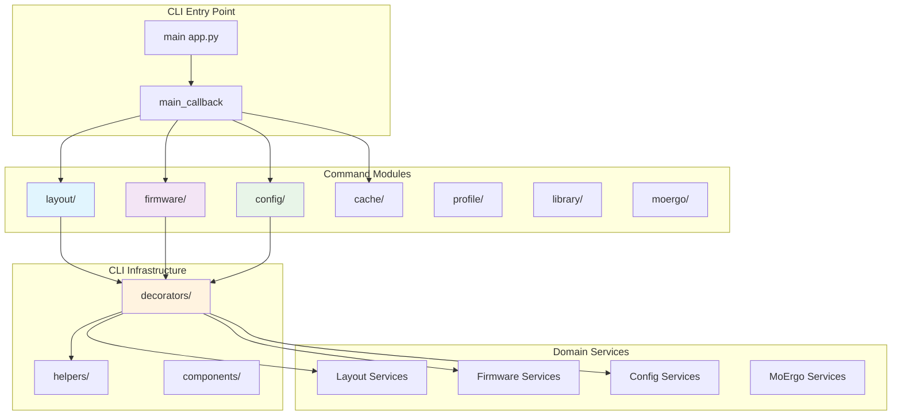

# CLI Architecture and Modular Design

This document explains the modular CLI architecture in Glovebox, covering command organization, parameter handling, decorators, and the design patterns that enable maintainable and extensible command-line interfaces.

## CLI Architecture Overview

The Glovebox CLI implements a **modular, domain-driven architecture** that mirrors the domain structure of the application:



## Modular Command Structure

### Domain-Based Organization

Commands are organized by business domain, ensuring clear boundaries and maintainability:

```
cli/commands/
├── __init__.py                 # Command registration orchestration
├── layout/                     # Layout management commands
│   ├── __init__.py            # Layout app registration
│   ├── core.py                # Compile, validate, show commands
│   ├── comparison.py          # Diff, patch commands
│   ├── edit.py                # Field editing commands
│   ├── parsing.py             # Keymap parsing commands
│   └── file_operations.py     # Split, merge commands
├── firmware/                   # Firmware operations
│   ├── __init__.py
│   ├── compilation.py         # Firmware compilation
│   ├── flashing.py            # Device flashing
│   └── devices.py             # Device management
├── config/                     # Configuration management
│   ├── __init__.py
│   ├── management.py          # List, show, export commands
│   ├── edit.py                # Configuration editing
│   └── updates.py             # Version checking
├── cache/                      # Cache management
│   ├── __init__.py
│   ├── show.py                # Cache inspection
│   ├── clear.py               # Cache clearing
│   ├── workspace.py           # Workspace operations
│   └── debug.py               # Cache debugging
├── profile/                    # Profile management
│   ├── __init__.py
│   ├── info.py                # Profile information
│   ├── edit.py                # Profile editing
│   └── firmwares.py           # Firmware management
├── library/                    # Layout library operations
├── moergo/                     # MoErgo integration
└── status.py                   # System status commands
```

### File Size Enforcement

**MANDATORY**: Maximum 500 lines per command file

When command files exceed this limit:
1. **Split by functional area** (e.g., `compilation.py`, `validation.py`)
2. **Create subdirectories** for complex command domains
3. **Use shared utilities** in helper modules
4. **Extract common patterns** into decorators

## Command Registration Pattern

### Hierarchical Registration

Commands use a consistent hierarchical registration pattern:

```python
# cli/commands/__init__.py
import typer

def register_all_commands(app: typer.Typer) -> None:
    """Register all CLI commands with the main app."""
    
    # Register domain command modules
    register_layout_commands(app)
    register_firmware_commands(app)
    register_config_commands(app)
    register_profile_commands(app)
    register_library_commands(app)
    register_moergo_commands(app)
    
    # Register standalone command modules
    app.add_typer(cache_app, name="cache")
    register_commands(app)  # status commands

def register_layout_commands(app: typer.Typer) -> None:
    """Register layout domain commands."""
    from glovebox.cli.commands.layout import layout_app
    app.add_typer(layout_app, name="layout")

def register_firmware_commands(app: typer.Typer) -> None:
    """Register firmware domain commands."""
    from glovebox.cli.commands.firmware import firmware_app
    app.add_typer(firmware_app, name="firmware")

# Similar patterns for other domains...
```

### Domain Command Registration

Each domain module registers its own commands:

```python
# cli/commands/layout/__init__.py
import typer

# Create domain-specific Typer app
layout_app = typer.Typer(
    name="layout",
    help="Layout processing and management commands",
    no_args_is_help=True,
)

def register_commands(app: typer.Typer) -> None:
    """Register layout commands with the main app."""
    app.add_typer(layout_app, name="layout")

# Register individual command modules with the layout app
from .core import register_core_commands
from .comparison import register_comparison_commands
from .edit import register_edit_commands
from .parsing import register_parsing_commands
from .file_operations import register_file_commands

register_core_commands(layout_app)
register_comparison_commands(layout_app)
register_edit_commands(layout_app)
register_parsing_commands(layout_app)
register_file_commands(layout_app)
```

### Command Module Pattern

Individual command modules follow a consistent pattern:

```python
# cli/commands/layout/core.py
import typer
from pathlib import Path
from typing import Optional

from glovebox.cli.decorators import with_profile, with_input_file, with_output_directory
from glovebox.cli.helpers.parameters import ProfileOption, OutputFormatOption

def register_core_commands(app: typer.Typer) -> None:
    """Register core layout commands."""
    app.command("compile")(compile_layout)
    app.command("validate")(validate_layout)
    app.command("show")(show_layout)

@with_profile()
@with_input_file()
@with_output_directory()
def compile_layout(
    ctx: typer.Context,
    validate_only: bool = typer.Option(False, "--validate-only", "-V", help="Only validate, don't generate files"),
    force: bool = typer.Option(False, "--force", "-f", help="Overwrite existing files"),
) -> None:
    """Compile JSON layout file to ZMK files.
    
    This command converts a JSON layout file into ZMK keymap (.keymap) and 
    configuration (.conf) files suitable for firmware compilation.
    
    Examples:
        glovebox layout compile my_layout.json output/ --profile glove80/v25.05
        glovebox layout compile my_layout.json output/ --validate-only
    """
    # Implementation uses decorators to access input, output, and profile
    # from context set by decorators
    pass

@with_profile(required=False)
@with_input_file()
def validate_layout(
    ctx: typer.Context,
    format: OutputFormatOption = "text",
) -> None:
    """Validate JSON layout file structure and content.
    
    This command checks layout files for structural integrity, valid bindings,
    and compliance with keyboard specifications.
    """
    # Implementation
    pass
```

## Decorator Architecture

### Parameter Processing Decorators

Decorators handle common parameter patterns and context management:

```python
# cli/decorators/parameters.py
from functools import wraps
from typing import Callable, TypeVar

F = TypeVar('F', bound=Callable)

def with_input_file() -> Callable[[F], F]:
    """Decorator to handle input file parameter processing."""
    
    def decorator(func: F) -> F:
        @wraps(func)
        def wrapper(*args, **kwargs) -> Any:
            # Extract Typer context
            ctx = _get_context_from_args(args)
            
            # Process input file parameter
            input_result = _process_input_parameter(func, *args, **kwargs)
            
            # Store result in context for command access
            ctx.obj = ctx.obj or {}
            ctx.obj[PARAM_INPUT_RESULT_KEY] = input_result
            
            # Call original function
            return func(*args, **kwargs)
        
        # Add Typer parameter to function
        input_param = typer.Argument(..., help="Input file path or '-' for stdin")
        wrapper = typer.Option(input_param)(wrapper)
        
        return wrapper
    
    return decorator

def with_output_directory() -> Callable[[F], F]:
    """Decorator to handle output directory parameter processing."""
    
    def decorator(func: F) -> F:
        @wraps(func)
        def wrapper(*args, **kwargs) -> Any:
            ctx = _get_context_from_args(args)
            
            # Process output directory parameter
            output_result = _process_output_parameter(func, *args, **kwargs)
            
            # Store in context
            ctx.obj = ctx.obj or {}
            ctx.obj[PARAM_OUTPUT_RESULT_KEY] = output_result
            
            return func(*args, **kwargs)
        
        # Add Typer parameter
        output_param = typer.Argument(..., help="Output directory path")
        wrapper = typer.Option(output_param)(wrapper)
        
        return wrapper
    
    return decorator

def with_profile(required: bool = True) -> Callable[[F], F]:
    """Decorator to handle profile parameter and keyboard profile creation."""
    
    def decorator(func: F) -> F:
        @wraps(func)
        def wrapper(*args, **kwargs) -> Any:
            ctx = _get_context_from_args(args)
            
            # Extract profile parameter
            profile_str = kwargs.get('profile')
            
            if required and not profile_str:
                raise typer.BadParameter("Profile is required for this command")
            
            # Create keyboard profile
            if profile_str:
                profile = create_profile_from_option(profile_str)
                ctx.obj = ctx.obj or {}
                ctx.obj['keyboard_profile'] = profile
            
            return func(*args, **kwargs)
        
        # Add profile parameter based on required flag
        if required:
            profile_param = typer.Option(..., "--profile", "-p", help="Keyboard profile (keyboard/firmware)")
        else:
            profile_param = typer.Option(None, "--profile", "-p", help="Keyboard profile (optional)")
        
        wrapper = profile_param(wrapper)
        
        return wrapper
    
    return decorator
```

### Service Integration Decorators

Decorators that integrate with domain services:

```python
# cli/decorators/profile.py

def with_metrics() -> Callable[[F], F]:
    """Decorator to add metrics collection to commands."""
    
    def decorator(func: F) -> F:
        @wraps(func)
        def wrapper(*args, **kwargs) -> Any:
            ctx = _get_context_from_args(args)
            
            # Create metrics session
            from glovebox.core.metrics import create_session_metrics
            metrics = create_session_metrics()
            
            # Start command timer
            with metrics.timer("command_execution"):
                # Store metrics in context
                ctx.obj = ctx.obj or {}
                ctx.obj['metrics'] = metrics
                
                try:
                    result = func(*args, **kwargs)
                    metrics.counter("command_success").inc()
                    return result
                except Exception as e:
                    metrics.counter("command_error").inc()
                    metrics.counter("command_error", labels={"error_type": type(e).__name__}).inc()
                    raise
        
        return wrapper
    
    return decorator

def with_cache() -> Callable[[F], F]:
    """Decorator to add cache manager to commands."""
    
    def decorator(func: F) -> F:
        @wraps(func)
        def wrapper(*args, **kwargs) -> Any:
            ctx = _get_context_from_args(args)
            
            # Get or create user config
            user_config = get_user_config_from_context(ctx)
            
            # Create cache manager
            from glovebox.core.cache import create_cache_from_user_config
            cache_manager = create_cache_from_user_config(user_config)
            
            # Store in context
            ctx.obj = ctx.obj or {}
            ctx.obj['cache_manager'] = cache_manager
            
            return func(*args, **kwargs)
        
        return wrapper
    
    return decorator

def with_user_config() -> Callable[[F], F]:
    """Decorator to add user configuration to commands."""
    
    def decorator(func: F) -> F:
        @wraps(func)
        def wrapper(*args, **kwargs) -> Any:
            ctx = _get_context_from_args(args)
            
            # Create user configuration
            from glovebox.config import create_user_config
            user_config = create_user_config()
            
            # Store in context
            ctx.obj = ctx.obj or {}
            ctx.obj['user_config'] = user_config
            
            return func(*args, **kwargs)
        
        return wrapper
    
    return decorator
```

## Parameter System Architecture

### Parameter Types and Helpers

Centralized parameter definitions ensure consistency:

```python
# cli/helpers/parameters.py

import typer
from typing import Annotated

# Reusable parameter definitions
ProfileOption = Annotated[
    str,
    typer.Option(
        "--profile", "-p",
        help="Keyboard profile (keyboard/firmware)",
        autocompletion=complete_profile_names,
    )
]

OutputFormatOption = Annotated[
    str,
    typer.Option(
        "--format", "-f",
        help="Output format",
        click_type=typer.Choice(["text", "json", "yaml"]),
    )
]

ViewModeOption = Annotated[
    str,
    typer.Option(
        "--mode", "-m",
        help="View mode for layout display",
        click_type=typer.Choice(["grid", "list", "compact"]),
        autocompletion=complete_view_modes,
    )
]

JsonFileArgument = Annotated[
    Path,
    typer.Argument(
        help="JSON layout file path",
        autocompletion=complete_json_files,
    )
]

LayerOption = Annotated[
    str,
    typer.Option(
        "--layer", "-l",
        help="Layer name",
        autocompletion=complete_layer_names,
    )
]

FieldPathOption = Annotated[
    str,
    typer.Option(
        "--field", "-f",
        help="Field path (e.g., 'title', 'layers[0].name')",
        autocompletion=complete_field_paths,
    )
]
```

### Smart Autocompletion

Dynamic autocompletion based on context and cached data:

```python
# cli/helpers/parameters.py

def complete_profile_names(incomplete: str) -> list[str]:
    """Provide autocompletion for profile names."""
    try:
        # Use cached profile data for performance
        cached_data = _get_cached_profile_data()
        if cached_data:
            profiles = cached_data
        else:
            # Fallback to direct lookup
            from glovebox.config import get_available_keyboards, get_available_firmwares
            keyboards = get_available_keyboards()
            profiles = []
            for keyboard in keyboards:
                firmwares = get_available_firmwares(keyboard)
                for firmware in firmwares:
                    profiles.append(f"{keyboard}/{firmware}")
            
            # Cache for future use
            cache_manager = _get_completion_cache()
            cache_manager.set(PROFILE_COMPLETION_CACHE_KEY, profiles, expire=PROFILE_COMPLETION_TTL)
        
        # Filter by incomplete input
        return [profile for profile in profiles if profile.startswith(incomplete)]
    
    except Exception:
        # Graceful fallback for autocompletion errors
        return []

def complete_layer_names(ctx: typer.Context, incomplete: str) -> list[str]:
    """Provide autocompletion for layer names based on current layout file."""
    try:
        # Extract JSON file from context or command line
        json_file = _extract_json_file_from_context(ctx)
        if not json_file:
            return []
        
        # Use cached layer names for this file
        cache_key = f"{LAYER_NAMES_CACHE_KEY_PREFIX}:{json_file}"
        cached_layers = _get_cached_layer_names(cache_key)
        
        if cached_layers is None:
            # Load layout and extract layer names
            from glovebox.layout.utils import load_layout_file
            layout = load_layout_file(Path(json_file))
            layer_names = [layer.name for layer in layout.layers]
            
            # Cache layer names
            cache_manager = _get_completion_cache()
            cache_manager.set(cache_key, layer_names, expire=LAYER_NAMES_TTL)
            cached_layers = layer_names
        
        # Filter by incomplete input
        return [name for name in cached_layers if name.startswith(incomplete)]
    
    except Exception:
        return []

def complete_field_paths(ctx: typer.Context, incomplete: str) -> list[str]:
    """Provide autocompletion for field paths in layout data."""
    try:
        # Extract JSON file from context
        json_file = _extract_json_file_from_context(ctx)
        if not json_file:
            return _get_shortcut_completions(incomplete)
        
        # Use cached field completions
        cache_key = f"{FIELD_COMPLETION_CACHE_KEY}:{json_file}"
        cached_completions = _get_cached_field_completions(cache_key)
        
        if cached_completions is None:
            # Build field completions from layout structure
            cached_completions = _build_layout_field_completions(json_file)
            
            # Cache completions
            cache_manager = _get_completion_cache()
            cache_manager.set(cache_key, cached_completions, expire=FIELD_COMPLETION_TTL)
        
        # Include shortcut completions
        all_completions = cached_completions + _get_shortcut_completions(incomplete)
        
        # Filter by incomplete input
        return [comp for comp in all_completions if comp.startswith(incomplete)]
    
    except Exception:
        return _get_shortcut_completions(incomplete)

def _get_shortcut_completions(incomplete: str) -> list[str]:
    """Get common field path shortcuts."""
    shortcuts = [
        "title",
        "keyboard", 
        "layers",
        "layers[0]",
        "layers[0].name",
        "layers[0].bindings",
        "behaviors",
        "config",
    ]
    return [shortcut for shortcut in shortcuts if shortcut.startswith(incomplete)]
```

## Command Implementation Patterns

### Layout Commands Example

Comprehensive example of layout domain commands:

```python
# cli/commands/layout/core.py

import typer
from pathlib import Path
from typing import Optional

from glovebox.cli.decorators import with_profile, with_input_file, with_output_directory, with_metrics
from glovebox.cli.helpers.parameters import (
    ProfileOption, OutputFormatOption, ViewModeOption,
    ValidateOnlyOption, ForceOverwriteOption
)
from glovebox.cli.helpers.profile import get_keyboard_profile_from_context
from glovebox.cli.helpers.parameter_helpers import (
    get_input_data_from_context, get_output_path_from_context
)
from glovebox.cli.helpers.theme import get_themed_console, format_operation_status

def register_core_commands(app: typer.Typer) -> None:
    """Register core layout commands."""
    app.command("compile")(compile_layout)
    app.command("validate")(validate_layout) 
    app.command("show")(show_layout)

@with_profile()
@with_input_file()
@with_output_directory()
@with_metrics()
def compile_layout(
    ctx: typer.Context,
    validate_only: ValidateOnlyOption = False,
    force: ForceOverwriteOption = False,
    format: OutputFormatOption = "text",
) -> None:
    """Compile JSON layout file to ZMK files.
    
    Converts a JSON layout file into ZMK keymap (.keymap) and configuration 
    (.conf) files suitable for firmware compilation.
    
    The compilation process includes:
    - Layout validation and structure checking
    - Behavior analysis and dependency resolution
    - Template rendering with keyboard-specific configurations
    - Output file generation with proper formatting
    
    Examples:
        # Basic compilation
        glovebox layout compile my_layout.json output/ --profile glove80/v25.05
        
        # Validation only (no file generation)
        glovebox layout compile my_layout.json output/ --validate-only
        
        # Force overwrite existing files
        glovebox layout compile my_layout.json output/ --force
        
        # JSON output format
        glovebox layout compile my_layout.json output/ --format json
    """
    console = get_themed_console()
    
    try:
        # Get processed parameters from context (set by decorators)
        profile = get_keyboard_profile_from_context(ctx)
        layout_data = get_input_data_from_context(ctx)
        output_path = get_output_path_from_context(ctx)
        
        console.print(format_operation_status(
            "STARTING", f"Compiling layout for {profile.name}"
        ))
        
        # Create layout service
        from glovebox.layout import create_layout_service
        layout_service = create_layout_service()
        
        if validate_only:
            # Validation only mode
            is_valid = layout_service.validate(layout_data)
            if is_valid:
                console.print_success("Layout validation passed")
            else:
                console.print_error("Layout validation failed")
                raise typer.Exit(1)
        else:
            # Full compilation mode
            result = layout_service.generate(profile, layout_data, output_path)
            
            if result.success:
                console.print_success(
                    f"Successfully compiled layout to {output_path}"
                )
                
                # Display generated files
                if format == "json":
                    output_data = {
                        "success": True,
                        "output_path": str(output_path),
                        "files": {k: str(v) for k, v in result.files.items()}
                    }
                    console.print_json(output_data)
                else:
                    console.print("Generated files:")
                    for file_type, file_path in result.files.items():
                        console.print(f"  {file_type}: {file_path}")
            else:
                console.print_error("Layout compilation failed")
                raise typer.Exit(1)
        
    except Exception as e:
        console.print_error(f"Compilation error: {e}")
        if ctx.obj and ctx.obj.get("debug"):
            console.print_exception()
        raise typer.Exit(1)

@with_profile(required=False)
@with_input_file()
def show_layout(
    ctx: typer.Context,
    mode: ViewModeOption = "grid",
    layer: Optional[str] = typer.Option(None, "--layer", "-l", help="Show specific layer"),
    format: OutputFormatOption = "text",
) -> None:
    """Display layout in terminal with visual formatting.
    
    This command renders keyboard layouts in the terminal using Rich formatting,
    showing the layout structure, key bindings, and layer information in a 
    human-readable format.
    
    View modes:
        - grid: Visual grid representation of the keyboard
        - list: List format showing all bindings
        - compact: Condensed view for quick overview
    
    Examples:
        # Show full layout in grid mode
        glovebox layout show my_layout.json
        
        # Show specific layer
        glovebox layout show my_layout.json --layer "Function"
        
        # Compact view format
        glovebox layout show my_layout.json --mode compact
        
        # JSON output for scripting
        glovebox layout show my_layout.json --format json
    """
    console = get_themed_console()
    
    try:
        # Get layout data from context
        layout_data = get_input_data_from_context(ctx)
        profile = get_keyboard_profile_from_context(ctx) if ctx.obj.get('keyboard_profile') else None
        
        console.print(format_operation_status(
            "DISPLAYING", f"Layout: {layout_data.title}"
        ))
        
        # Create display service
        from glovebox.layout import create_layout_display_service
        display_service = create_layout_display_service()
        
        if format == "json":
            # JSON output mode
            output_data = display_service.format_as_json(layout_data, layer=layer)
            console.print_json(output_data)
        else:
            # Rich terminal display
            display_service.show(layout_data, mode=mode, layer=layer, profile=profile)
        
    except Exception as e:
        console.print_error(f"Display error: {e}")
        if ctx.obj and ctx.obj.get("debug"):
            console.print_exception()
        raise typer.Exit(1)
```

### Configuration Commands Example

Example of configuration domain commands with unified editing:

```python
# cli/commands/config/edit.py

import typer
from typing import Optional, List

from glovebox.cli.decorators import with_user_config
from glovebox.cli.helpers.parameters import (
    ConfigFieldPathOption, GetConfigFieldOption, SetConfigFieldOption
)

def register_edit_commands(app: typer.Typer) -> None:
    """Register configuration editing commands."""
    app.command("edit")(edit_config)

@with_user_config()
def edit_config(
    ctx: typer.Context,
    get: List[GetConfigFieldOption] = typer.Option([], "--get", "-g", help="Get configuration values"),
    set: List[SetConfigFieldOption] = typer.Option([], "--set", "-s", help="Set configuration values (key=value)"),
    add: List[str] = typer.Option([], "--add", "-a", help="Add values to list configurations"),
    remove: List[str] = typer.Option([], "--remove", "-r", help="Remove values from list configurations"),
    save: bool = typer.Option(True, "--save/--no-save", help="Save changes to configuration file"),
    interactive: bool = typer.Option(False, "--interactive", "-i", help="Interactive editing mode"),
) -> None:
    """Edit user configuration with multiple operations.
    
    This unified command supports multiple configuration operations in a single call,
    including getting, setting, adding, and removing configuration values.
    
    Field paths support dot notation with array indexing:
        - Simple fields: cache_enabled, log_level
        - Nested fields: cache.max_size_gb, logging.level
        - List fields: keyboard_paths[0], template_paths
    
    Examples:
        # Get configuration values
        glovebox config edit --get cache_enabled --get log_level
        
        # Set configuration values
        glovebox config edit --set cache_enabled=false --set log_level=DEBUG
        
        # Add to list configurations
        glovebox config edit --add keyboard_paths=/new/path
        
        # Remove from list configurations
        glovebox config edit --remove keyboard_paths=/old/path
        
        # Multiple operations in one command
        glovebox config edit \\
            --get cache_strategy \\
            --set emoji_mode=true \\
            --add keyboard_paths=/new/path \\
            --remove keyboard_paths=/old/path \\
            --save
        
        # Interactive editing mode
        glovebox config edit --interactive
    """
    console = get_themed_console()
    
    try:
        # Get user config from context
        user_config = get_user_config_from_context_decorator(ctx)
        
        # Create configuration editor
        editor = ConfigEditor(user_config)
        
        if interactive:
            # Interactive editing mode
            _handle_interactive_edit(editor, console)
        else:
            # Batch operations mode
            has_changes = False
            
            # Process get operations
            if get:
                for field_path in get:
                    value = editor.get_field(field_path)
                    console.print(f"{field_path}: {value}")
            
            # Process set operations
            if set:
                for set_spec in set:
                    field_path, value = parse_key_value_pair(set_spec)
                    editor.set_field(field_path, value)
                    has_changes = True
                    console.print_success(f"Set {field_path} = {value}")
            
            # Process add operations
            if add:
                for add_spec in add:
                    field_path, value = parse_key_value_pair(add_spec)
                    editor.add_to_field(field_path, value)
                    has_changes = True
                    console.print_success(f"Added {value} to {field_path}")
            
            # Process remove operations
            if remove:
                for remove_spec in remove:
                    field_path, value = parse_key_value_pair(remove_spec)
                    editor.remove_from_field(field_path, value)
                    has_changes = True
                    console.print_success(f"Removed {value} from {field_path}")
            
            # Save changes if requested and there are changes
            if save and has_changes:
                editor.save()
                console.print_success("Configuration saved")
            elif has_changes and not save:
                console.print_warning("Changes made but not saved (use --save to persist)")
        
    except Exception as e:
        console.print_error(f"Configuration edit error: {e}")
        if ctx.obj and ctx.obj.get("debug"):
            console.print_exception()
        raise typer.Exit(1)
```

## Error Handling and User Experience

### Consistent Error Handling

All CLI commands follow consistent error handling patterns:

```python
# cli/decorators/error_handling.py

def handle_errors() -> Callable[[F], F]:
    """Decorator for consistent CLI error handling."""
    
    def decorator(func: F) -> F:
        @wraps(func)
        def wrapper(*args, **kwargs) -> Any:
            try:
                return func(*args, **kwargs)
            
            except KeyboardInterrupt:
                console = get_themed_console()
                console.print_warning("Operation cancelled by user")
                raise typer.Abort()
            
            except FileNotFoundError as e:
                console = get_themed_console()
                console.print_error(f"File not found: {e}")
                print_stack_trace_if_verbose(e, args)
                raise typer.Exit(1)
            
            except PermissionError as e:
                console = get_themed_console()
                console.print_error(f"Permission denied: {e}")
                print_stack_trace_if_verbose(e, args)
                raise typer.Exit(1)
            
            except (LayoutError, CompilationError, FlashError) as e:
                # Domain-specific errors
                console = get_themed_console()
                console.print_error(f"Operation failed: {e}")
                print_stack_trace_if_verbose(e, args)
                raise typer.Exit(1)
            
            except Exception as e:
                # Unexpected errors
                console = get_themed_console()
                console.print_error(f"Unexpected error: {e}")
                print_stack_trace_if_verbose(e, args, force=True)
                raise typer.Exit(1)
        
        return wrapper
    
    return decorator

def print_stack_trace_if_verbose(exception: Exception, args: tuple, force: bool = False) -> None:
    """Print stack trace based on verbosity settings."""
    # Extract context from args to check debug/verbose flags
    ctx = _get_context_from_args(args)
    
    debug_mode = ctx.obj and ctx.obj.get("debug", False)
    verbose_mode = ctx.obj and ctx.obj.get("verbose", False)
    
    if force or debug_mode or verbose_mode:
        console = get_themed_console()
        console.print_exception()
```

### User-Friendly Output

Rich-based output formatting for better user experience:

```python
# cli/helpers/theme.py

class ThemedConsole:
    """Console with consistent theming and formatting."""
    
    def __init__(self, console: Console, icon_mode: IconMode = IconMode.TEXT):
        self.console = console
        self.icon_mode = icon_mode
    
    def print_success(self, message: str) -> None:
        """Print success message with consistent formatting."""
        icon = Icons.get_icon("SUCCESS", self.icon_mode)
        self.console.print(f"{icon} {message}", style=Colors.SUCCESS)
    
    def print_error(self, message: str) -> None:
        """Print error message with consistent formatting."""
        icon = Icons.get_icon("ERROR", self.icon_mode)
        self.console.print(f"{icon} {message}", style=Colors.ERROR)
    
    def print_warning(self, message: str) -> None:
        """Print warning message with consistent formatting."""
        icon = Icons.get_icon("WARNING", self.icon_mode)
        self.console.print(f"{icon} {message}", style=Colors.WARNING)
    
    def print_info(self, message: str) -> None:
        """Print info message with consistent formatting."""
        icon = Icons.get_icon("INFO", self.icon_mode)
        self.console.print(f"{icon} {message}", style=Colors.INFO)
    
    def print_json(self, data: Any) -> None:
        """Print JSON data with syntax highlighting."""
        import json
        json_str = json.dumps(data, indent=2, default=str)
        syntax = Syntax(json_str, "json", theme="github-dark")
        self.console.print(syntax)

def get_themed_console(icon_mode: IconMode | None = None) -> ThemedConsole:
    """Get themed console with user preferences."""
    if icon_mode is None:
        icon_mode = get_icon_mode_from_config()
    
    console = Console(theme=GLOVEBOX_THEME)
    return ThemedConsole(console, icon_mode)
```

## Testing CLI Commands

### CLI Testing Patterns

Comprehensive testing approach for CLI commands:

```python
# tests/test_cli/test_layout_commands.py

class TestLayoutCommands:
    def test_compile_command_success(self, isolated_cli_environment, cli_runner):
        """Test successful layout compilation command."""
        # Arrange
        layout_file = isolated_cli_environment.create_test_layout()
        output_dir = isolated_cli_environment.temp_dir / "output"
        
        # Act
        result = cli_runner.invoke(app, [
            "layout", "compile",
            str(layout_file),
            str(output_dir),
            "--profile", "glove80/v25.05"
        ])
        
        # Assert
        assert result.exit_code == 0
        assert "Successfully compiled" in result.output
        assert (output_dir / "keymap.keymap").exists()
        assert (output_dir / "config.conf").exists()
    
    def test_compile_command_validation_only(self, isolated_cli_environment, cli_runner):
        """Test validation-only mode."""
        # Arrange
        layout_file = isolated_cli_environment.create_test_layout()
        output_dir = isolated_cli_environment.temp_dir / "output"
        
        # Act
        result = cli_runner.invoke(app, [
            "layout", "compile",
            str(layout_file),
            str(output_dir),
            "--profile", "glove80/v25.05",
            "--validate-only"
        ])
        
        # Assert
        assert result.exit_code == 0
        assert "validation passed" in result.output
        assert not (output_dir / "keymap.keymap").exists()  # No files generated
    
    def test_compile_command_invalid_profile(self, isolated_cli_environment, cli_runner):
        """Test command with invalid profile."""
        # Arrange
        layout_file = isolated_cli_environment.create_test_layout()
        output_dir = isolated_cli_environment.temp_dir / "output"
        
        # Act
        result = cli_runner.invoke(app, [
            "layout", "compile",
            str(layout_file),
            str(output_dir),
            "--profile", "invalid/profile"
        ])
        
        # Assert
        assert result.exit_code != 0
        assert "Profile not found" in result.output
```

### Decorator Testing

Test CLI decorators in isolation:

```python
# tests/test_cli/test_decorators.py

class TestParameterDecorators:
    def test_with_profile_decorator(self):
        """Test profile parameter decorator."""
        
        @with_profile()
        def test_command(ctx: typer.Context) -> str:
            profile = get_keyboard_profile_from_context(ctx)
            return profile.name
        
        # Mock context
        ctx = Mock()
        ctx.obj = {}
        
        # Test with valid profile
        result = test_command(ctx, profile="glove80/v25.05")
        assert result == "glove80/v25.05"
    
    def test_with_input_file_decorator(self, tmp_path):
        """Test input file parameter decorator."""
        
        @with_input_file()
        def test_command(ctx: typer.Context) -> dict:
            return get_input_data_from_context(ctx)
        
        # Create test file
        test_file = tmp_path / "test.json"
        test_file.write_text('{"title": "Test Layout", "keyboard": "glove80"}')
        
        # Mock context
        ctx = Mock()
        ctx.obj = {}
        
        # Test file reading
        result = test_command(ctx, input_file=str(test_file))
        assert result["title"] == "Test Layout"
```

---

**Next Steps**:
- Review [Service Layer Patterns](../patterns/service-layer.md) for domain service integration
- Explore [Testing Strategy](../guides/testing-strategy.md) for CLI testing approaches
- Check [Theme System](theme-system.md) for UI consistency guidelines