# Domain-Driven Design in Glovebox

This document explains how Glovebox implements Domain-Driven Design (DDD) principles to organize complex business logic into manageable, focused domains.

## What is Domain-Driven Design?

Domain-Driven Design is an approach to software development that focuses on modeling software around the business domain. Key concepts:

- **Domain**: A sphere of knowledge or activity around which the business logic revolves
- **Bounded Context**: Clear boundaries around domain models to avoid confusion
- **Domain Services**: Business logic that doesn't naturally fit within entity or value objects
- **Ubiquitous Language**: Common terminology shared between developers and domain experts

## Glovebox Domain Architecture

Glovebox is organized into four primary business domains, each with clear responsibilities and boundaries:

```mermaid
graph TB
    subgraph "🏗️ Layout Domain"
        L1[JSON Processing]
        L2[DTSI Generation]
        L3[Version Management]
        L4[Component Operations]
    end
    
    subgraph "⚙️ Compilation Domain"
        C1[Build Strategies]
        C2[Workspace Management]
        C3[Caching System]
        C4[Build Matrix Support]
    end
    
    subgraph "🔧 Firmware Domain"
        F1[Device Detection]
        F2[USB Flashing]
        F3[OS Adapters]
        F4[Flash Operations]
    end
    
    subgraph "📋 Configuration Domain"
        CF1[Keyboard Profiles]
        CF2[User Settings]
        CF3[YAML Processing]
        CF4[Modular Config]
    end
    
    subgraph "🔌 Infrastructure"
        I1[Adapters]
        I2[Cache Coordination]
        I3[Core Services]
        I4[Protocols]
    end
    
    L1 --> I1
    C1 --> I1
    F1 --> I1
    CF1 --> I1
    
    style L1 fill:#e1f5fe
    style C1 fill:#fff3e0
    style F1 fill:#f3e5f5
    style CF1 fill:#e8f5e8
```



## Domain Boundaries and Responsibilities

### 🏗️ Layout Domain (`glovebox/layout/`)

**Ubiquitous Language**: Layout, Layer, Binding, Behavior, Template, Component

**Core Responsibility**: Transform keyboard layouts from JSON format into ZMK Device Tree Source Interface (DTSI) files.

**Domain Entities**:
- `LayoutData`: Complete keyboard layout with metadata
- `LayoutLayer`: Individual layer within a layout
- `LayoutBinding`: Key binding within a layer
- `BehaviorData`: ZMK behavior configuration

**Domain Services**:
- `LayoutService`: Main orchestrator for layout operations
- `LayoutComponentService`: Handle decomposition and composition
- `ZmkFileContentGenerator`: Generate DTSI content from layouts
- `BehaviorRegistry`: Analyze and format ZMK behaviors

**Domain Rules**:
- Layouts must have at least one layer
- Each layer must have exactly 80 bindings (for Glove80)
- Behaviors must be valid ZMK behaviors
- Generated DTSI must be syntactically correct

**Subdomain Organization**:
```
layout/
├── behavior/           # Behavior analysis and formatting
│   ├── analysis.py     # Behavior code extraction
│   ├── formatter.py    # ZMK behavior formatting
│   └── models.py       # Behavior data models
├── comparison/         # Layout comparison services
│   └── service.py      # Layout diff operations
├── diffing/           # Diff and patch operations
│   ├── diff.py        # Diff generation
│   ├── patch.py       # Patch application
│   └── models.py      # Diff result models
├── editor/            # Layout editing operations
│   └── service.py     # Field manipulation
├── layer/             # Layer management
│   └── service.py     # Layer operations
├── parsers/           # Keymap parsing
│   ├── keymap_parser.py    # Main parser
│   ├── ast_nodes.py        # AST representation
│   └── ast_walker.py       # AST traversal
└── utils/             # Domain utilities
    ├── field_parser.py     # Field path parsing
    ├── json_operations.py  # JSON processing
    └── validation.py       # Layout validation
```

### ⚙️ Compilation Domain (`glovebox/compilation/`)

**Ubiquitous Language**: Strategy, Workspace, Cache, Build Matrix, Target, Artifact

**Core Responsibility**: Compile ZMK files into firmware using multiple build strategies with intelligent caching.

**Domain Entities**:
- `CompilationConfig`: Configuration for compilation strategies
- `BuildTarget`: Individual build target (board/shield combination)
- `BuildMatrix`: Collection of build targets
- `WorkspaceCacheMetadata`: Workspace cache information

**Domain Services**:
- `ZmkWestService`: ZMK west-based compilation
- `MoergoNixService`: MoErgo Nix-based compilation
- `WorkspaceCreationService`: Dynamic workspace setup
- `CompilationBuildCacheService`: Build artifact caching

**Domain Rules**:
- Each compilation strategy must implement `CompilationServiceProtocol`
- Workspaces must be properly isolated and cached
- Build matrices must specify valid board/shield combinations
- Cache keys must be deterministic based on inputs

**Strategy Pattern Implementation**:
```python
# Direct strategy selection - no coordination layer
def create_compilation_service(strategy: str) -> CompilationServiceProtocol:
    if strategy == "zmk_config":
        return create_zmk_west_service()
    elif strategy == "moergo":
        return create_moergo_nix_service()
    else:
        raise ValueError(f"Unknown strategy: {strategy}")
```

### 🔧 Firmware Domain (`glovebox/firmware/`)

**Ubiquitous Language**: Device, Flash, Mount, USB, Bootloader, Firmware

**Core Responsibility**: Flash compiled firmware to USB keyboard devices across different operating systems.

**Domain Entities**:
- `BlockDevice`: USB device representation
- `FlashResult`: Result of flash operation
- `USBDeviceInfo`: USB device metadata
- `DiskInfo`: Disk/mount information

**Domain Services**:
- `FlashService`: Main flash orchestration
- `DeviceDetector`: USB device detection and monitoring
- `USBFlasher`: Low-level flash operations
- `FlashOperations`: Mount/unmount operations

**Domain Rules**:
- Devices must be in bootloader mode for flashing
- Flash operations must verify firmware integrity
- USB devices must be properly mounted before writing
- Flash operations should include retry logic

**OS Adapter Pattern**:
```python
# Platform-specific implementations
class FlashOSProtocol(Protocol):
    def detect_devices(self) -> list[BlockDevice]: ...
    def mount_device(self, device: BlockDevice) -> str: ...
    def unmount_device(self, device: BlockDevice) -> None: ...

# Concrete implementations
class LinuxFlashOS(FlashOSProtocol): ...
class MacOSFlashOS(FlashOSProtocol): ...
class WindowsFlashOS(FlashOSProtocol): ...
```

### 📋 Configuration Domain (`glovebox/config/`)

**Ubiquitous Language**: Profile, Keyboard, Firmware, Configuration, Include, YAML

**Core Responsibility**: Manage keyboard profiles and user configuration with modular YAML structure.

**Domain Entities**:
- `KeyboardProfile`: Combination of keyboard and firmware configuration
- `KeyboardConfig`: Keyboard-specific settings
- `FirmwareConfig`: Firmware-specific settings  
- `UserConfigData`: User preferences and settings

**Domain Services**:
- `IncludeConfigLoader`: YAML include processing
- `UserConfig`: User configuration management

**Domain Rules**:
- Keyboard profiles must specify valid keyboard and firmware combinations
- Configuration files must follow modular include structure
- User configuration takes precedence over defaults
- All configuration must be validated against Pydantic models

**Modular Configuration Pattern**:
```yaml
# keyboards/glove80.yaml (entry point)
includes:
  - "glove80/main.yaml"

# keyboards/glove80/main.yaml
keyboard: "glove80"
includes:
  - "hardware.yaml"      # Hardware specifications
  - "firmwares.yaml"     # Available firmware versions
  - "strategies.yaml"    # Compilation strategies
  - "kconfig.yaml"       # Kconfig options
  - "behaviors.yaml"     # Behavior definitions
```

## Domain Communication Patterns

### Anti-Corruption Layer

Domains communicate through well-defined interfaces without sharing internal models:

```python
# Layout domain doesn't know about compilation internals
class LayoutService:
    def generate_for_compilation(self, layout: LayoutData) -> tuple[str, str]:
        """Generate keymap and config content for compilation."""
        keymap_content = self._generate_keymap_content(layout)
        config_content = self._generate_config_content(layout)
        return keymap_content, config_content

# Compilation domain receives content, not layout models
class CompilationService:
    def compile(self, keymap_content: str, config_content: str) -> BuildResult:
        """Compile keymap and config content to firmware."""
        # Implementation doesn't know about LayoutData
```

### Domain Events

Important domain events are communicated through explicit interfaces:

```python
# Version management event
class LayoutUpgradeEvent:
    layout_id: str
    old_version: str
    new_version: str
    upgrade_timestamp: datetime

# Firmware tracking event  
class FirmwareBuildEvent:
    layout_hash: str
    firmware_path: str
    build_timestamp: datetime
    profile: str
```

### Shared Kernel

Some models are shared across domains when they represent fundamental concepts:

```python
# Shared across domains - fundamental to the business
from glovebox.models.base import GloveboxBaseModel
from glovebox.models.results import BaseResult
from glovebox.models.docker import DockerUserContext

# Domain-specific models stay in their domains
from glovebox.layout.models import LayoutData          # Layout domain only
from glovebox.firmware.models import FlashResult       # Firmware domain only
from glovebox.compilation.models import BuildMatrix    # Compilation domain only
```

## Domain Service Implementation Patterns

### Service Base Class

All domain services inherit from a common base:

```python
class BaseService:
    """Base class for all domain services."""
    
    def __init__(self):
        self.logger = get_logger(self.__class__.__name__)
    
    def _log_operation_start(self, operation: str, **kwargs) -> None:
        """Log the start of an operation with context."""
        self.logger.info("Starting %s", operation, extra=kwargs)
    
    def _log_operation_success(self, operation: str, **kwargs) -> None:
        """Log successful completion of an operation."""
        self.logger.info("Completed %s successfully", operation, extra=kwargs)
```

### Error Handling Pattern

Consistent error handling across all domain services:

```python
class LayoutService(BaseService):
    def generate(self, profile: KeyboardProfile, layout: LayoutData) -> LayoutResult:
        try:
            self._log_operation_start("layout_generation", profile=profile.name)
            
            # Domain logic implementation
            result = self._perform_generation(profile, layout)
            
            self._log_operation_success("layout_generation", files_generated=len(result.files))
            return result
            
        except LayoutError:
            # Domain-specific errors are re-raised
            raise
        except Exception as e:
            # Generic errors are wrapped with debug-aware stack traces
            exc_info = self.logger.isEnabledFor(logging.DEBUG)
            self.logger.error("Layout generation failed: %s", e, exc_info=exc_info)
            raise LayoutError(f"Generation failed: {e}") from e
```

### Factory Function Pattern

Every domain service has a corresponding factory function:

```python
def create_layout_service(
    file_adapter: FileAdapterProtocol | None = None,
    template_adapter: TemplateAdapterProtocol | None = None,
    behavior_registry: BehaviorRegistryProtocol | None = None,
) -> LayoutService:
    """Create a layout service with proper dependencies."""
    
    # Use provided dependencies or create defaults
    file_adapter = file_adapter or create_file_adapter()
    template_adapter = template_adapter or create_template_adapter()
    behavior_registry = behavior_registry or create_behavior_registry()
    
    return LayoutService(
        file_adapter=file_adapter,
        template_adapter=template_adapter,
        behavior_registry=behavior_registry,
    )
```

## Domain Model Patterns

### Rich Domain Models

Domain models contain behavior, not just data:

```python
class LayoutData(GloveboxBaseModel):
    """Rich domain model with behavior."""
    
    title: str
    keyboard: str
    layers: list[LayoutLayer]
    behaviors: list[BehaviorData] = []
    
    def get_layer_by_name(self, name: str) -> LayoutLayer | None:
        """Business logic method."""
        return next((layer for layer in self.layers if layer.name == name), None)
    
    def has_required_layers(self) -> bool:
        """Domain rule validation."""
        required_layers = {"Base", "Lower", "Upper", "Function"}
        layer_names = {layer.name for layer in self.layers}
        return required_layers.issubset(layer_names)
    
    def extract_behavior_codes(self) -> set[str]:
        """Extract all behavior codes used in the layout."""
        codes = set()
        for layer in self.layers:
            for binding in layer.bindings:
                if hasattr(binding, 'behavior_code'):
                    codes.add(binding.behavior_code)
        return codes
```

### Value Objects

Immutable objects that represent domain concepts:

```python
class BuildTarget(GloveboxBaseModel):
    """Value object representing a build target."""
    
    board: str
    shield: str | None = None
    
    def to_build_key(self) -> str:
        """Generate unique identifier for this build target."""
        return f"{self.board}_{self.shield}" if self.shield else self.board
    
    def is_split_keyboard(self) -> bool:
        """Determine if this target represents a split keyboard."""
        split_boards = {"nice_nano_v2", "seeeduino_xiao_ble"}
        return self.board in split_boards and self.shield is not None
```

### Domain Aggregates

Complex domain objects that maintain consistency:

```python
class BuildMatrix(GloveboxBaseModel):
    """Aggregate representing a collection of build targets."""
    
    board: list[str]
    shield: list[str] = []
    include: list[str] = []
    exclude: list[str] = []
    
    def generate_targets(self) -> list[BuildTarget]:
        """Generate all valid build targets from matrix specification."""
        targets = []
        
        for board in self.board:
            if not self.shield:
                # Single board targets
                targets.append(BuildTarget(board=board))
            else:
                # Board + shield combinations
                for shield in self.shield:
                    target = BuildTarget(board=board, shield=shield)
                    if self._is_target_valid(target):
                        targets.append(target)
        
        return self._apply_filters(targets)
    
    def _is_target_valid(self, target: BuildTarget) -> bool:
        """Validate that board/shield combination is valid."""
        # Domain rules for valid combinations
        return True  # Simplified for example
```

## Domain Testing Patterns

### Domain Service Testing

Test domain services in isolation with mocked dependencies:

```python
class TestLayoutService:
    def test_generate_layout_success(self):
        # Arrange
        mock_file_adapter = Mock(spec=FileAdapterProtocol)
        mock_template_adapter = Mock(spec=TemplateAdapterProtocol)
        mock_behavior_registry = Mock(spec=BehaviorRegistryProtocol)
        
        service = LayoutService(
            file_adapter=mock_file_adapter,
            template_adapter=mock_template_adapter,
            behavior_registry=mock_behavior_registry,
        )
        
        profile = create_test_keyboard_profile()
        layout = create_test_layout_data()
        
        # Act
        result = service.generate(profile, layout)
        
        # Assert
        assert isinstance(result, LayoutResult)
        assert result.success is True
        mock_template_adapter.render.assert_called()
```

### Domain Model Testing

Test domain models including business logic:

```python
class TestLayoutData:
    def test_get_layer_by_name_found(self):
        # Arrange
        layer = LayoutLayer(name="Base", bindings=[])
        layout = LayoutData(
            title="Test Layout",
            keyboard="glove80",
            layers=[layer]
        )
        
        # Act
        found_layer = layout.get_layer_by_name("Base")
        
        # Assert
        assert found_layer is layer
    
    def test_has_required_layers_complete(self):
        # Arrange
        required_layers = ["Base", "Lower", "Upper", "Function"]
        layers = [LayoutLayer(name=name, bindings=[]) for name in required_layers]
        layout = LayoutData(title="Test", keyboard="glove80", layers=layers)
        
        # Act & Assert
        assert layout.has_required_layers() is True
```

### Integration Testing

Test domain interactions through public interfaces:

```python
class TestLayoutCompilationIntegration:
    def test_layout_to_compilation_flow(self):
        # Arrange
        layout_service = create_layout_service()
        compilation_service = create_compilation_service("zmk_config")
        
        layout = create_test_layout_data()
        profile = create_test_keyboard_profile()
        
        # Act - Layout domain generates content
        layout_result = layout_service.generate(profile, layout)
        
        # Act - Compilation domain compiles content
        keymap_content = layout_result.files["keymap"]
        config_content = layout_result.files["config"]
        build_result = compilation_service.compile(keymap_content, config_content)
        
        # Assert
        assert layout_result.success is True
        assert build_result.success is True
        assert build_result.firmware_path.exists()
```

## Domain Evolution Guidelines

### Adding New Subdomains

When a domain becomes too large, split it into subdomains:

1. **Identify cohesive functionality** that can be grouped together
2. **Create subdomain package** under the main domain
3. **Move related models, services, and logic** to the subdomain
4. **Update imports** to maintain clean boundaries
5. **Add subdomain-specific tests** and documentation

### Refactoring Domain Boundaries

When domain boundaries need adjustment:

1. **Analyze dependencies** between domains to identify coupling
2. **Create anti-corruption layers** to isolate changes
3. **Move models and services** to appropriate domains
4. **Update factory functions** and service creation
5. **Ensure comprehensive test coverage** during migration

### Domain Service Evolution

When adding new capabilities to domain services:

1. **Extend protocols** first to define new interfaces
2. **Implement new methods** in concrete services
3. **Add factory function parameters** for new dependencies
4. **Update CLI commands** to use new capabilities
5. **Add comprehensive tests** for new functionality

---

**Next Steps**:
- Explore individual [Domain Documentation](../domains/) for detailed implementation guides
- Review [Service Layer Patterns](../patterns/service-layer.md) for service implementation details
- Check [Factory Functions Guide](../patterns/factory-functions.md) for dependency management patterns